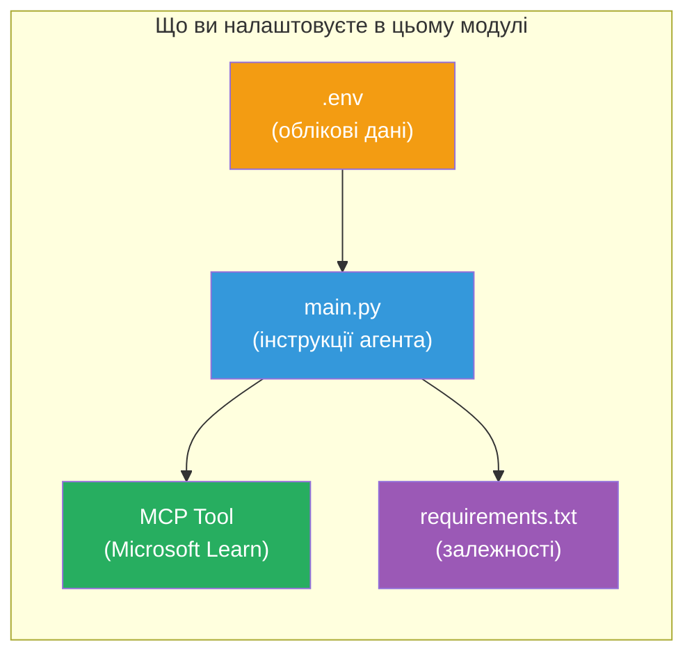

# Модуль 3 - Налаштування агентів, інструмент MCP та оточення

У цьому модулі ви налаштуєте підготовлений мультиагентний проєкт. Ви напишете інструкції для всіх чотирьох агентів, налаштуєте інструмент MCP для Microsoft Learn, сконфігуруєте змінні оточення та встановите залежності.


> **Довідка:** Повний робочий код знаходиться у [`PersonalCareerCopilot/main.py`](../../../../../workshop/lab02-multi-agent/PersonalCareerCopilot/main.py). Використовуйте його як зразок під час створення власного.

---

## Крок 1: Налаштування змінних оточення

1. Відкрийте файл **`.env`** у корені вашого проєкту.
2. Заповніть деталі вашого проєкту Foundry:

   ```env
   PROJECT_ENDPOINT=https://<your-account>.services.ai.azure.com/api/projects/<your-project>
   MODEL_DEPLOYMENT_NAME=gpt-4.1-mini
   ```

3. Збережіть файл.

### Де знайти ці значення

| Значення | Як знайти |
|----------|-----------|
| **Project endpoint** | Бічна панель Microsoft Foundry → оберіть ваш проєкт → URL кінцевої точки у детальному перегляді |
| **Model deployment name** | Бічна панель Foundry → розгорніть проект → **Models + endpoints** → ім’я поруч з розгорнутим моделлю |

> **Безпека:** Ніколи не комітьте `.env` у систему контролю версій. Додайте його у `.gitignore`, якщо його там ще немає.

### Відповідність змінних оточення

Файл `main.py` мультиагентного рішення читає як стандартні, так і специфічні для воркшопу назви змінних оточення:

```python
PROJECT_ENDPOINT = os.getenv("AZURE_AI_PROJECT_ENDPOINT") or os.getenv("PROJECT_ENDPOINT")
MODEL_DEPLOYMENT_NAME = os.getenv(
    "AZURE_AI_MODEL_DEPLOYMENT_NAME",
    os.getenv("MODEL_DEPLOYMENT_NAME", "gpt-4.1-mini"),
)
MICROSOFT_LEARN_MCP_ENDPOINT = os.getenv(
    "MICROSOFT_LEARN_MCP_ENDPOINT", "https://learn.microsoft.com/api/mcp"
)
```

Кінцева точка MCP має розумне значення за замовчуванням – не потрібно встановлювати її у `.env`, хіба що ви хочете його перевизначити.

---

## Крок 2: Написання інструкцій для агентів

Це найважливіший крок. Кожному агенту потрібні чітко сформульовані інструкції, які визначають його роль, формат виводу та правила. Відкрийте `main.py` і створіть (або змініть) константи інструкцій.

### 2.1 Агент для парсингу резюме

```python
RESUME_PARSER_INSTRUCTIONS = """\
You are the Resume Parser.
Extract resume text into a compact, structured profile for downstream matching.

Output exactly these sections:
1) Candidate Profile
2) Technical Skills (grouped categories)
3) Soft Skills
4) Certifications & Awards
5) Domain Experience
6) Notable Achievements

Rules:
- Use only explicit or strongly implied evidence.
- Do not invent skills, titles, or experience.
- Keep concise bullets; no long paragraphs.
- If input is not a resume, return a short warning and request resume text.
"""
```

**Чому саме ці розділи?** MatchingAgent потребує структурованих даних для оцінки. Узгоджені розділи роблять передачу даних між агентами надійною.

### 2.2 Агент опису вакансії

```python
JOB_DESCRIPTION_INSTRUCTIONS = """\
You are the Job Description Analyst.
Extract a structured requirement profile from a JD.

Output exactly these sections:
1) Role Overview
2) Required Skills
3) Preferred Skills
4) Experience Required
5) Certifications Required
6) Education
7) Domain / Industry
8) Key Responsibilities

Rules:
- Keep required vs preferred clearly separated.
- Only use what the JD states; do not invent hidden requirements.
- Flag vague requirements briefly.
- If input is not a JD, return a short warning and request JD text.
"""
```

**Чому розділяємо обов’язкові і переважні навички?** MatchingAgent використовує різну вагу для кожного з них (Required Skills = 40 балів, Preferred Skills = 10 балів).

### 2.3 Агент співставлення

```python
MATCHING_AGENT_INSTRUCTIONS = """\
You are the Matching Agent.
Compare parsed resume output vs JD output and produce an evidence-based fit report.

Scoring (100 total):
- Required Skills 40
- Experience 25
- Certifications 15
- Preferred Skills 10
- Domain Alignment 10

Output exactly these sections:
1) Fit Score (with breakdown math)
2) Matched Skills
3) Missing Skills
4) Partially Matched
5) Experience Alignment
6) Certification Gaps
7) Overall Assessment

Rules:
- Be objective and evidence-only.
- Keep partial vs missing separate.
- Keep Missing Skills precise; it feeds roadmap planning.
"""
```

**Чому явне оцінювання?** Відтворюване оцінювання дає можливість порівнювати запуск і знаходити помилки. Шкала у 100 балів легка для сприйняття кінцевими користувачами.

### 2.4 Агент аналізу пропусків

```python
GAP_ANALYZER_INSTRUCTIONS = """\
You are the Gap Analyzer and Roadmap Planner.
Create a practical upskilling plan from the matching report.

Microsoft Learn MCP usage (required):
- For EVERY High and Medium priority gap, call tool `search_microsoft_learn_for_plan`.
- Use returned Learn links in Suggested Resources.
- Prefer Microsoft Learn for free resources.

CRITICAL: You MUST produce a SEPARATE detailed gap card for EVERY skill listed in
the Missing Skills and Certification Gaps sections of the matching report. Do NOT
skip or combine gaps. Do NOT summarize multiple gaps into one card.

Output format:
1) Personalized Learning Roadmap for [Role Title]
2) One DETAILED card per gap (produce ALL cards, not just the first):
   - Skill
   - Priority (High/Medium/Low)
   - Current Level
   - Target Level
   - Suggested Resources (include Learn URL from tool results)
   - Estimated Time
   - Quick Win Project
3) Recommended Learning Order (numbered list)
4) Timeline Summary (week-by-week)
5) Motivational Note

Rules:
- Produce every gap card before writing the summary sections.
- Keep it specific, realistic, and actionable.
- Tailor to candidate's existing stack.
- If fit >= 80, focus on polish/interview readiness.
- If fit < 40, be honest and provide a staged path.
"""
```

**Чому акцент на "CRITICAL"?** Без чітких інструкцій створювати ВСІ картки пропусків, модель зазвичай генерує лише 1–2 картки і підсумовує решту. Блок "CRITICAL" запобігає цьому обрізанню.

---

## Крок 3: Визначення інструменту MCP

GapAnalyzer використовує інструмент, який викликає сервер [Microsoft Learn MCP](https://learn.microsoft.com/azure/foundry/agents/how-to/tools/model-context-protocol). Додайте це у `main.py`:

```python
import json
from agent_framework import tool
from mcp.client.session import ClientSession
from mcp.client.streamable_http import streamable_http_client

@tool
async def search_microsoft_learn_for_plan(
    skill: str, role: str = "", max_results: int = 5
) -> str:
    """Search Microsoft Learn MCP and return curated official links for roadmap planning."""
    query = " ".join(part for part in [skill, role, "learning path module"] if part).strip()
    query = query or "job skills learning path"

    try:
        async with streamable_http_client(MICROSOFT_LEARN_MCP_ENDPOINT) as (
            read_stream, write_stream, _,
        ):
            async with ClientSession(read_stream, write_stream) as session:
                await session.initialize()
                result = await session.call_tool(
                    "microsoft_docs_search", {"query": query}
                )

        if not result.content:
            return (
                "No results returned from Microsoft Learn MCP. "
                "Fallback: https://learn.microsoft.com/training/support/catalog-api"
            )

        payload_text = getattr(result.content[0], "text", "")
        data = json.loads(payload_text) if payload_text else {}
        items = data.get("results", [])[:max(1, min(max_results, 10))]

        if not items:
            return f"No direct Microsoft Learn results found for '{skill}'."

        lines = [f"Microsoft Learn resources for '{skill}':"]
        for i, item in enumerate(items, start=1):
            title = item.get("title") or item.get("url") or "Microsoft Learn Resource"
            url = item.get("url") or item.get("link") or ""
            lines.append(f"{i}. {title} - {url}".rstrip(" -"))
        return "\n".join(lines)
    except Exception as ex:
        return (
            f"Microsoft Learn MCP lookup unavailable. Reason: {ex}. "
            "Fallbacks: https://learn.microsoft.com/api/mcp"
        )
```

### Як працює інструмент

| Крок | Що відбувається |
|------|-----------------|
| 1 | GapAnalyzer визначає, що йому потрібні ресурси для навички (наприклад, "Kubernetes") |
| 2 | Фреймворк викликає `search_microsoft_learn_for_plan(skill="Kubernetes")` |
| 3 | Функція відкриває підключення [Streamable HTTP](https://learn.microsoft.com/agent-framework/agents/tools/hosted-mcp-tools) до `https://learn.microsoft.com/api/mcp` |
| 4 | Викликає `microsoft_docs_search` на сервері [MCP](https://learn.microsoft.com/azure/foundry/agents/how-to/tools/model-context-protocol) |
| 5 | Сервер MCP повертає результати пошуку (назва + URL) |
| 6 | Функція форматує результати у нумерований список |
| 7 | GapAnalyzer додає URL до картки пропуску |

### Залежності MCP

Клієнтські бібліотеки MCP включаються транзитивно через [`agent-framework-core`](https://learn.microsoft.com/agent-framework/overview/). Вам **не потрібно** додавати їх окремо у `requirements.txt`. Якщо виникають помилки імпорту, перевірте:

```powershell
pip list | Select-String "mcp"
```

Очікується, що встановлено пакет `mcp` (версія 1.x або новіша).

---

## Крок 4: Під’єднання агентів та робочого процесу

### 4.1 Створення агентів з менеджерами контексту

```python
from contextlib import asynccontextmanager

@asynccontextmanager
async def create_agents():
    async with (
        get_credential() as credential,
        AzureAIAgentClient(
            project_endpoint=PROJECT_ENDPOINT,
            model_deployment_name=MODEL_DEPLOYMENT_NAME,
            credential=credential,
        ).as_agent(
            name="ResumeParser",
            instructions=RESUME_PARSER_INSTRUCTIONS,
        ) as resume_parser,
        AzureAIAgentClient(
            project_endpoint=PROJECT_ENDPOINT,
            model_deployment_name=MODEL_DEPLOYMENT_NAME,
            credential=credential,
        ).as_agent(
            name="JobDescriptionAgent",
            instructions=JOB_DESCRIPTION_INSTRUCTIONS,
        ) as jd_agent,
        AzureAIAgentClient(
            project_endpoint=PROJECT_ENDPOINT,
            model_deployment_name=MODEL_DEPLOYMENT_NAME,
            credential=credential,
        ).as_agent(
            name="MatchingAgent",
            instructions=MATCHING_AGENT_INSTRUCTIONS,
        ) as matching_agent,
        AzureAIAgentClient(
            project_endpoint=PROJECT_ENDPOINT,
            model_deployment_name=MODEL_DEPLOYMENT_NAME,
            credential=credential,
        ).as_agent(
            name="GapAnalyzer",
            instructions=GAP_ANALYZER_INSTRUCTIONS,
            tools=[search_microsoft_learn_for_plan],
        ) as gap_analyzer,
    ):
        yield resume_parser, jd_agent, matching_agent, gap_analyzer
```

**Основні моменти:**
- Кожен агент має свій **окремий** екземпляр `AzureAIAgentClient`
- Лише GapAnalyzer отримує `tools=[search_microsoft_learn_for_plan]`
- `get_credential()` повертає [`ManagedIdentityCredential`](https://learn.microsoft.com/python/api/overview/azure/identity-readme#managed-identity-support) в Azure, [`DefaultAzureCredential`](https://learn.microsoft.com/azure/developer/python/sdk/authentication/credential-chains#defaultazurecredential-overview) локально

### 4.2 Побудова графа робочого процесу

```python
def create_workflow(resume_parser, jd_agent, matching_agent, gap_analyzer):
    workflow = (
        WorkflowBuilder(
            name="ResumeJobFitEvaluator",
            start_executor=resume_parser,
            output_executors=[gap_analyzer],
        )
        .add_edge(resume_parser, jd_agent)
        .add_edge(resume_parser, matching_agent)
        .add_edge(jd_agent, matching_agent)
        .add_edge(matching_agent, gap_analyzer)
        .build()
    )
    return workflow.as_agent()
```

> Дивіться [Workflows as Agents](https://learn.microsoft.com/agent-framework/workflows/as-agents), щоб зрозуміти патерн `.as_agent()`.

### 4.3 Запуск сервера

```python
async def main() -> None:
    validate_configuration()
    async with create_agents() as (resume_parser, jd_agent, matching_agent, gap_analyzer):
        agent = create_workflow(resume_parser, jd_agent, matching_agent, gap_analyzer)
        from azure.ai.agentserver.agentframework import from_agent_framework
        await from_agent_framework(agent).run_async()

if __name__ == "__main__":
    asyncio.run(main())
```

---

## Крок 5: Створення та активація віртуального оточення

### 5.1 Створення оточення

```powershell
cd workshop\lab02-multi-agent\PersonalCareerCopilot
python -m venv .venv
```

### 5.2 Активація

**PowerShell (Windows):**
```powershell
.\.venv\Scripts\Activate.ps1
```

**macOS/Linux:**
```bash
source .venv/bin/activate
```

### 5.3 Встановлення залежностей

```powershell
pip install -r requirements.txt
```

> **Примітка:** Рядок `agent-dev-cli --pre` в `requirements.txt` гарантує, що встановиться остання прев’ю-версія. Це потрібно для сумісності з `agent-framework-core==1.0.0rc3`.

### 5.4 Перевірка встановлення

```powershell
pip list | Select-String "agent-framework|agentserver|agent-dev"
```

Очікуваний результат:
```
agent-dev-cli                  0.0.1b260316
agent-framework-azure-ai       1.0.0rc3
agent-framework-core            1.0.0rc3
azure-ai-agentserver-agentframework 1.0.0b16
azure-ai-agentserver-core      1.0.0b16
```

> **Якщо `agent-dev-cli` показує стару версію** (наприклад, `0.0.1b260119`), Agent Inspector буде видавати помилки 403/404. Оновіть так: `pip install agent-dev-cli --pre --upgrade`

---

## Крок 6: Перевірка автентифікації

Запустіть ту саму перевірку автентифікації, що й у Лабораторній 01:

```powershell
az account show --query "{name:name, id:id}" --output table
```

Якщо вона не проходить, виконайте [`az login`](https://learn.microsoft.com/cli/azure/authenticate-azure-cli-interactively).

Для мультиагентних робочих процесів усі чотири агенти використовують одні й ті ж облікові дані. Якщо автентифікація працює для одного – працює для всіх.

---

### Контрольний список

- [ ] `.env` має дійсні значення `PROJECT_ENDPOINT` та `MODEL_DEPLOYMENT_NAME`
- [ ] У `main.py` визначено всі 4 константи інструкцій агентів (ResumeParser, JD Agent, MatchingAgent, GapAnalyzer)
- [ ] Інструмент MCP `search_microsoft_learn_for_plan` визначено і зареєстровано у GapAnalyzer
- [ ] `create_agents()` створює усі 4 агенти з окремими екземплярами `AzureAIAgentClient`
- [ ] `create_workflow()` будує правильний граф за допомогою `WorkflowBuilder`
- [ ] Віртуальне оточення створене і активоване (видно `(.venv)`)
- [ ] `pip install -r requirements.txt` виконується без помилок
- [ ] `pip list` показує всі очікувані пакети потрібних версій (rc3 / b16)
- [ ] `az account show` повертає вашу підписку

---

**Попередній:** [02 - Scaffold Multi-Agent Project](02-scaffold-multi-agent.md) · **Наступний:** [04 - Orchestration Patterns →](04-orchestration-patterns.md)

---

<!-- CO-OP TRANSLATOR DISCLAIMER START -->
**Відмова від відповідальності**:
Цей документ було перекладено за допомогою сервісу автоматичного перекладу [Co-op Translator](https://github.com/Azure/co-op-translator). Хоча ми прагнемо до точності, зверніть увагу, що автоматичні переклади можуть містити помилки або неточності. Оригінальний документ рідною мовою слід вважати авторитетним джерелом. Для критичної інформації рекомендується звертатися до професійного людського перекладу. Ми не несемо відповідальності за будь-які непорозуміння або неправильне тлумачення, що виникли внаслідок використання цього перекладу.
<!-- CO-OP TRANSLATOR DISCLAIMER END -->