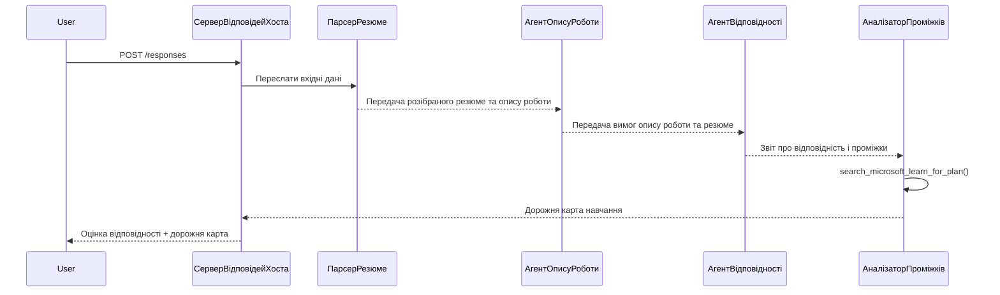

# Модуль 3 - Налаштування інструкцій, середовища та встановлення залежностей

⏱️ ~15 хв

У цьому модулі ви перетворюєте заготовку у **ваш** багатонадрений робочий процес — шляхом налаштування змінних середовища, написання інструкцій агентам, додавання інструменту MCP, підключення графа робочого процесу та встановлення залежностей.

> **Довідка:** Повний робочий код знаходиться у [`PersonalCareerCopilot/main.py`](../../../../../workshop/lab02-multi-agent/PersonalCareerCopilot/main.py). Використовуйте його як довідник під час побудови власного графа робочого процесу та блоків підказок.

---

## Як чотири агенти взаємодіють між собою


```mermaid
sequenceDiagram
    participant User
    participant Server as СерверВідповідейХоста
    participant RP as ПарсерРезюме
    participant JD as АгентОписуРоботи
    participant MA as АгентВідповідності
    participant GA as АналізаторПроміжків

    User->>Server: POST /responses
    Server->>RP: Переслати вхідні дані
    RP-->>JD: Передача розібраного резюме та опису роботи
    JD-->>MA: Передача вимог опису роботи та резюме
    MA-->>GA: Звіт про відповідність і проміжки
    GA->>GA: search_microsoft_learn_for_plan()
    GA-->>Server: Дорожня карта навчання
    Server-->>User: Оцінка відповідності + дорожня карта
```

---

## Крок 1: Налаштуйте змінні оточення

1. Відкрийте файл **`.env`** у корені вашого проєкту (створений майстром скелетування).
2. Замініть заповнювачі на ваші реальні значення з Лабораторної роботи 01.

<details open>
<summary><strong>🅰️ Шлях A — підписка Foundry</strong></summary>

```env
FOUNDRY_PROJECT_ENDPOINT=https://<your-account>.services.ai.azure.com/api/projects/<your-project>
AZURE_AI_MODEL_DEPLOYMENT_NAME=gpt-4.1-mini
```

> **Де знайти значення:** Див. [Лабораторна 01, Модуль 1](../../lab01-single-agent/docs/01-setup.md#deploy-a-model--assign-rbac).

</details>

<details open>
<summary><strong>🅱️ Шлях B — Foundry Local</strong></summary>

```env
FOUNDRY_PROJECT_ENDPOINT=http://localhost:5273/v1
AZURE_AI_MODEL_DEPLOYMENT_NAME=phi-4-mini
```

> Всі обчислення відбуваються на вашому комп’ютері — жодні дані не виходять за межі пристрою. Запустіть `foundry model list` для підтвердження точного псевдоніму моделі. Єдиний вихідний запит — виклик інструменту MCP на `https://learn.microsoft.com/api/mcp`.

> **Де знайти значення:** Див. [Лабораторна 01, Модуль 1 — локальний шлях](../../lab01-single-agent/docs/01-setup.md#step-2-set-up-based-on-your-access).

</details>

> **Безпека:** Ніколи не додавайте `.env` у систему контролю версій. Він вже має бути у `.gitignore`.

---

## Крок 2: Напишіть інструкції для агентів

Інструкції визначають роль кожного агента, формат виводу та правила. Відкрийте `main.py` і визначте (або замініть) чотири константи інструкцій — повні рядки знаходяться у [`PersonalCareerCopilot/main.py`](../../../../../workshop/lab02-multi-agent/PersonalCareerCopilot/main.py).

### 2.1 `RESUME_PARSER_INSTRUCTIONS`
Аналізує резюме у структурований профіль кандидата **та** копіює опис вакансії дослівно у `[JOB DESCRIPTION PASS-THROUGH]`. Обидва позначені розділи повинні бути у виводі.

> **Навіщо потрібен пропуск?** При `context_mode="last_agent"` ResumeParser — це **єдиний** агент, що бачить оригінальне повідомлення користувача. Якщо він не передасть опис вакансії далі, інші агенти цього не побачать.

### 2.2 `JOB_DESCRIPTION_INSTRUCTIONS`
Читає `[PARSED RESUME]` і `[JOB DESCRIPTION PASS-THROUGH]` з виводу ResumeParser. Виводить `[JD REQUIREMENTS]` (структуровані вимоги) і `[PARSED RESUME PASS-THROUGH]` (копію резюме для MatchingAgent).

### 2.3 `MATCHING_AGENT_INSTRUCTIONS`
Читає `[JD REQUIREMENTS]` і `[PARSED RESUME PASS-THROUGH]`. Створює звіт про відповідність з оцінкою (0–100), деталями розрахунку, співпаданими навичками, відсутніми навичками та співвідношенням досвіду.

### 2.4 `GAP_ANALYZER_INSTRUCTIONS`
Читає звіт відповідності. Для **кожної** відсутньої навички викликає `search_microsoft_learn_for_plan` для отримання ресурсів Microsoft Learn. Створює докладну карту прогалин по кожній навичці та покрокову дорожню карту навчання.

---

## Крок 3: Додайте інструмент MCP

GapAnalyzer викликає сервер [Microsoft Learn MCP](https://learn.microsoft.com/azure/foundry/agents/how-to/tools/model-context-protocol) для отримання реальних ресурсів навчання для кожної прогалини в навичках. Повна функція `search_microsoft_learn_for_plan` у [`PersonalCareerCopilot/main.py`](../../../../../workshop/lab02-multi-agent/PersonalCareerCopilot/main.py).

Зареєструйте інструмент для GapAnalyzer під час створення агента:

```python
gap_analyzer = Agent(
    client=client,
    instructions=GAP_ANALYZER_INSTRUCTIONS,
    name="GapAnalyzer",
    tools=[search_microsoft_learn_for_plan],
)
```

> Див. [`PersonalCareerCopilot/main.py`](../../../../../workshop/lab02-multi-agent/PersonalCareerCopilot/main.py) для повного графа `WorkflowBuilder` з `FoundryChatClient`, `AgentExecutor` та всіма викликами `add_edge()`.

---

## Крок 4: Створіть віртуальне середовище та встановіть залежності

> ⚠️ **Не пропускайте цей крок.** Без встановлених залежностей запуск відладки F5 не працюватиме.

### 4.1 Створіть віртуальне середовище

```powershell
python -m venv .venv
```

### 4.2 Активуйте його

| ОС | Команда |
|----|---------|
| **Windows (PowerShell)** | `.\.venv\Scripts\Activate.ps1` |
| **Windows (CMD)** | `.venv\Scripts\activate.bat` |
| **macOS / Linux** | `source .venv/bin/activate` |

Ви повинні побачити `(.venv)` у підказці термінала.

### 4.3 Встановіть залежності

```powershell
pip install -r requirements.txt
```

### 4.4 Перевірка

```powershell
pip list | Select-String "agent-framework|mcp|debugpy"
```

Очікувано: `agent-framework-foundry`, `agent-framework-foundry-hosting`, `mcp` та `debugpy` перераховані.

---

## Крок 5: Перевірте автентифікацію

<details open>
<summary><strong>🅰️ Шлях A — Azure облікові дані</strong></summary>

```powershell
az account show --query "{name:name, id:id}" --output table
```

Якщо це не вдалося, виконайте [`az login`](https://learn.microsoft.com/cli/azure/authenticate-azure-cli-interactively).

Усі четверо агентів використовують один `FoundryChatClient` і один `DefaultAzureCredential`. Якщо автентифікація проходить для одного — працює для всіх.

</details>

<details open>
<summary><strong>🅱️ Шлях B — Foundry Local</strong></summary>

Для локального тестування автентифікація не потрібна.

</details>

---

### ✅ Контрольна точка

> Не переходьте до Модуля 04, доки: **(1)** у підказці не з’явиться `(.venv)` ТА **(2)** команда `pip install -r requirements.txt` успішно не завершиться.

- [ ] `.env` містить дійсний кінцевий пункт і ім’я розгортання моделі (не заповнювачі)
- [ ] Всі 4 константи інструкцій агентів визначені у `main.py` (ResumeParser, JD Agent, MatchingAgent, GapAnalyzer)
- [ ] Інструмент MCP `search_microsoft_learn_for_plan` визначений і зареєстрований на GapAnalyzer
- [ ] Об’єкти `FoundryChatClient` + 4 `Agent` + 4 `AgentExecutor` створені у `main()`
- [ ] `WorkflowBuilder` формує правильний послідовний граф з усіма 3 викликами `add_edge()`
- [ ] Віртуальне середовище створене та активоване (`(.venv)` видно у підказці)
- [ ] Команда `pip install -r requirements.txt` виконалася без помилок
- [ ] **Шлях A:** `az account show` проходить успішно АБО в іконці облікових записів VS Code видно увійдений обліковий запис

---

**Попередній:** [02 - Створення багатонадрного проєкту](02-scaffold-multi-agent.md) · **Наступний:** [04 - Шаблони оркестровки →](04-orchestration-patterns.md)

---

<!-- CO-OP TRANSLATOR DISCLAIMER START -->
**Відмова від відповідальності**:
Цей документ було перекладено за допомогою сервісу штучного інтелекту для перекладу [Co-op Translator](https://github.com/Azure/co-op-translator). Хоча ми прагнемо до точності, будь ласка, майте на увазі, що автоматичні переклади можуть містити помилки або неточності. Оригінальний документ рідною мовою слід вважати авторитетним джерелом. Для критично важливої інформації рекомендується професійний людський переклад. Ми не несемо відповідальності за будь-які непорозуміння або неправильні тлумачення, що виникли внаслідок використання цього перекладу.
<!-- CO-OP TRANSLATOR DISCLAIMER END -->