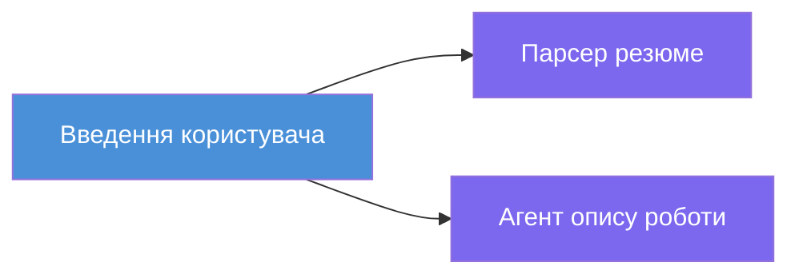
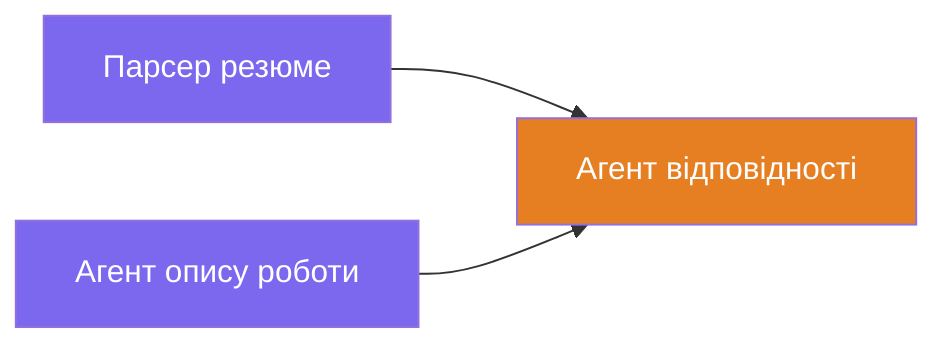
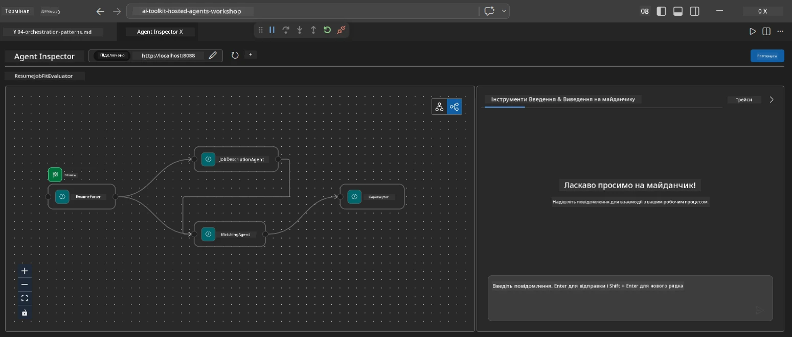
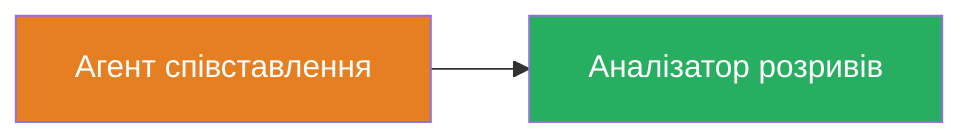
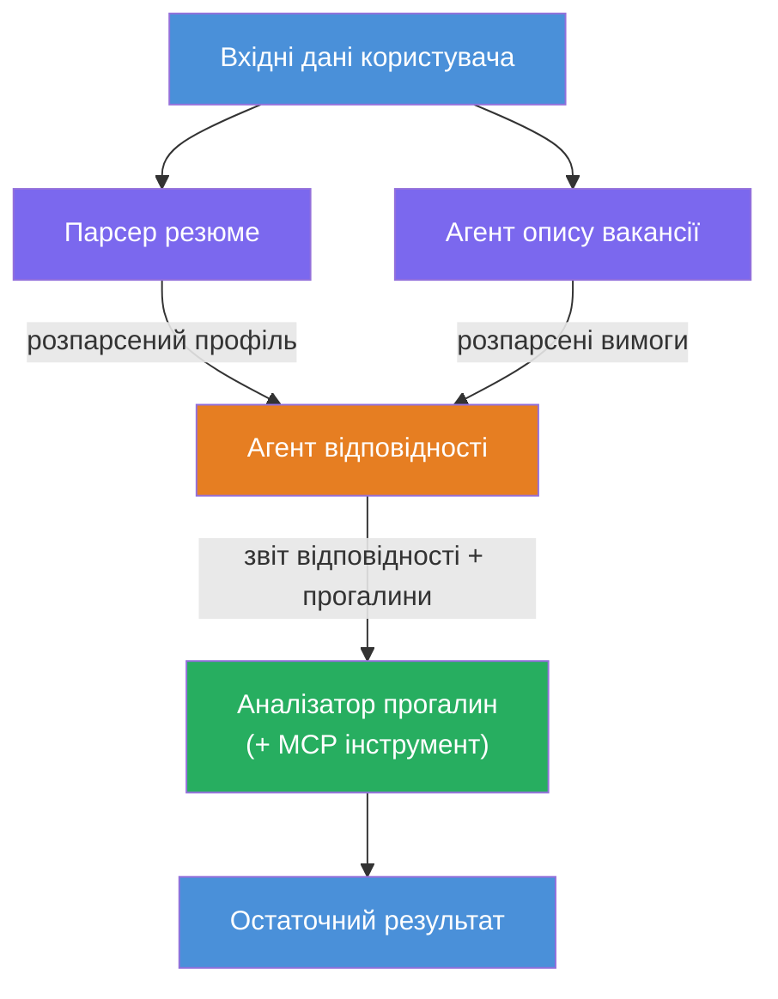
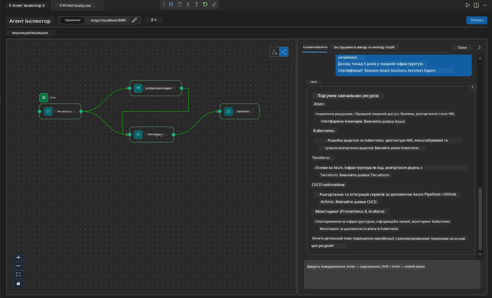

# Модуль 4 - Шаблони оркестрації

У цьому модулі ви досліджуєте шаблони оркестрації, які використовуються в Resume Job Fit Evaluator, і вчитеся читати, модифікувати та розширювати граф робочого процесу. Розуміння цих шаблонів є необхідним для налагодження проблем з потоком даних і створення власних [багатое агентних робочих процесів](https://learn.microsoft.com/agent-framework/workflows/).

---

## Шаблон 1: Fan-out (паралельний розподіл)

Перший шаблон у робочому процесі — це **fan-out** — один вхід одночасно надсилається кільком агентам.


У коді це відбувається тому, що `resume_parser` є `start_executor` — він отримує повідомлення користувача першим. Потім, оскільки обидва агенти `jd_agent` і `matching_agent` мають ребра від `resume_parser`, фреймворк направляє вихід `resume_parser` до обох агентів:

```python
.add_edge(resume_parser, jd_agent)         # Вивід ResumeParser → JD Agent
.add_edge(resume_parser, matching_agent)   # Вивід ResumeParser → MatchingAgent
```

**Чому це працює:** ResumeParser і JD Agent обробляють різні аспекти одного і того ж вхідного сигналу. Запуск їх паралельно зменшує загальну затримку у порівнянні з послідовним виконанням.

### Коли використовувати fan-out

| Використання | Приклад |
|--------------|---------|
| Незалежні підзадачі | Парсинг резюме проти парсингу JD |
| Надлишковість / голосування | Два агенти аналізують ті ж дані, третій вибирає найкращу відповідь |
| Вивід у кількох форматах | Один агент генерує текст, інший створює структурований JSON |

---

## Шаблон 2: Fan-in (агрегація)

Другий шаблон — це **fan-in** — виходи кількох агентів збираються і надсилаються одному наступному агенту.


У коді:

```python
.add_edge(resume_parser, matching_agent)   # Вивід ResumeParser → MatchingAgent
.add_edge(jd_agent, matching_agent)        # Вивід JD Agent → MatchingAgent
```

**Ключова поведінка:** Коли агент має **два або більше вхідних ребер**, фреймворк автоматично чекає, поки **усі** попередні агенти завершать виконання, перед запуском наступного агента. MatchingAgent не запускається, доки не завершать ResumeParser і JD Agent.

### Що отримує MatchingAgent

Фреймворк конкатенує виходи від усіх попередніх агентів. Вхідні дані MatchingAgent виглядають так:

```
[ResumeParser output]
---
Candidate Profile:
  Name: Jane Doe
  Technical Skills: Python, Azure, Kubernetes, ...
  ...

[JobDescriptionAgent output]
---
Role Overview: Senior Cloud Engineer
Required Skills: Python, Azure, Terraform, ...
...
```

> **Примітка:** Точний формат конкатенації залежить від версії фреймворку. Інструкції для агента мають бути написані таким чином, щоб обробляти як структурований, так і неструктурований вихід попередніх агентів.



---

## Шаблон 3: Послідовний ланцюжок

Третій шаблон — це **послідовне з'єднання** — вихід одного агента безпосередньо передається наступному.


У коді:

```python
.add_edge(matching_agent, gap_analyzer)    # Вивід MatchingAgent → GapAnalyzer
```

Це найпростіший шаблон. GapAnalyzer отримує бал відповідності від MatchingAgent, співставлені/відсутні навички та прогалини. Потім він викликає [інструмент MCP](https://learn.microsoft.com/azure/foundry/agents/how-to/tools/model-context-protocol) для кожної прогалини, щоб отримати ресурси Microsoft Learn.

---

## Повний граф

Поєднання всіх трьох шаблонів дає повний робочий процес:


### Хронологія виконання

```mermaid
gantt
    title Хронологія виконання агента
    dateFormat X
    axisFormat %s

    section Паралельно
    Resume Parser       :rp, 0, 3
    JD Agent            :jd, 0, 2

    section Послідовно
    Matching Agent      :ma, 3, 5
    Gap Analyzer        :ga, 5, 9
```


> Загальний час роботи приблизно дорівнює `max(ResumeParser, JD Agent) + MatchingAgent + GapAnalyzer`. GapAnalyzer зазвичай найповільніший, оскільки робить кілька викликів інструменту MCP (по одному на кожну прогалину).

---

## Читання коду WorkflowBuilder

Ось повна функція `create_workflow()` з `main.py` з коментарями:

```python
def create_workflow(resume_parser, jd_agent, matching_agent, gap_analyzer):
    workflow = (
        WorkflowBuilder(
            name="ResumeJobFitEvaluator",

            # Перший агент, що отримує введення користувача
            start_executor=resume_parser,

            # Агент(и), чиї результати стають кінцевою відповіддю
            output_executors=[gap_analyzer],
        )
        # Розгалуження: Вихід ResumeParser надходить як до JD Agent, так і до MatchingAgent
        .add_edge(resume_parser, jd_agent)
        .add_edge(resume_parser, matching_agent)

        # Об’єднання: MatchingAgent чекає на результати ResumeParser та JD Agent
        .add_edge(jd_agent, matching_agent)

        # Послідовно: Вихід MatchingAgent подається на GapAnalyzer
        .add_edge(matching_agent, gap_analyzer)

        .build()
    )
    return workflow.as_agent()
```

### Підсумкова таблиця ребер

| № | Ребро | Шаблон | Ефект |
|---|-------|---------|-------|
| 1 | `resume_parser → jd_agent` | Fan-out | JD Agent отримує вихід ResumeParser (плюс оригінальний вхід користувача) |
| 2 | `resume_parser → matching_agent` | Fan-out | MatchingAgent отримує вихід ResumeParser |
| 3 | `jd_agent → matching_agent` | Fan-in | MatchingAgent також отримує вихід JD Agent (чекає обох) |
| 4 | `matching_agent → gap_analyzer` | Послідовний | GapAnalyzer отримує звіт про відповідність + список прогалин |

---

## Зміна графа

### Додавання нового агента

Щоб додати п'ятого агента (наприклад, **InterviewPrepAgent**, який генерує запитання для співбесіди на основі аналізу прогалин):

```python
# 1. Визначте інструкції
INTERVIEW_PREP_INSTRUCTIONS = """\
You are the Interview Prep Agent.
Given a gap analysis and fit report, generate 10 targeted interview questions
the candidate should prepare for.
"""

# 2. Створіть агента (всередині блоку async with)
AzureAIAgentClient(
    project_endpoint=PROJECT_ENDPOINT,
    model_deployment_name=MODEL_DEPLOYMENT_NAME,
    credential=credential,
).as_agent(
    name="InterviewPrepAgent",
    instructions=INTERVIEW_PREP_INSTRUCTIONS,
) as interview_prep,

# 3. Додайте ребра в create_workflow()
.add_edge(matching_agent, interview_prep)   # отримує звіт про підгонку
.add_edge(gap_analyzer, interview_prep)     # також отримує картки пропусків

# 4. Оновіть output_executors
output_executors=[interview_prep],  # тепер кінцевий агент
```

### Зміна порядку виконання

Щоб зробити так, щоб JD Agent запускався **після** ResumeParser (послідовно замість паралельно):

```python
# Видалити: .add_edge(resume_parser, jd_agent)  ← вже існує, зберегти
# Прибрати неявний паралелізм, НЕ даючи jd_agent отримувати ввід користувача напряму
# start_executor спочатку надсилає до resume_parser, а jd_agent отримує лише
# вихідні дані resume_parser через ребро. Це робить їх послідовними.
```

> **Важливо:** `start_executor` — єдиний агент, який отримує сирий вхід користувача. Усі інші агенти отримують вихід від своїх вхідних ребер. Якщо ви хочете, щоб агент також отримував сирий вхід користувача, він має мати ребро від `start_executor`.

---

## Типові помилки в графі

| Помилка | Симптом | Виправлення |
|---------|---------|-------------|
| Відсутнє ребро до `output_executors` | Агент запускається, але вихід порожній | Переконайтеся, що є шлях від `start_executor` до кожного агента в `output_executors` |
| Циклічна залежність | Нескінченний цикл або таймаут | Перевірте, щоб жоден агент не повертав вихід назад до попереднього агента |
| Агент у `output_executors` без вхідних ребер | Порожній вихід | Додайте принаймні одне `add_edge(source, that_agent)` |
| Кілька `output_executors` без fan-in | Вихід містить відповідь лише одного агента | Використовуйте одного вихідного агента, який агрегує, або прийміть кілька виходів |
| Відсутній `start_executor` | `ValueError` під час складання | Завжди вказуйте `start_executor` у `WorkflowBuilder()` |

---

## Налагодження графа

### Використання Agent Inspector

1. Запустіть агента локально (F5 або термінал — див. [Модуль 5](05-test-locally.md)).
2. Відкрийте Agent Inspector (`Ctrl+Shift+P` → **Foundry Toolkit: Відкрити Agent Inspector**).
3. Надішліть тестове повідомлення.
4. У панелі відповідей Inspector шукайте **поступовий вивід** — він показує внесок кожного агента за послідовністю.



### Використання логування

Додайте логування в `main.py`, щоб відстежувати потік даних:

```python
import logging
logger = logging.getLogger("resume-job-fit")

# У create_workflow(), після створення:
logger.info("Workflow graph built with edges: RP→JD, RP→MA, JD→MA, MA→GA")
```

Логи сервера показують порядок виконання агентів і виклики інструменту MCP:

```
INFO:resume-job-fit:Starting Resume -> Job Fit Evaluator HTTP server...
INFO:resume-job-fit:Server running on http://localhost:8088
INFO:agent_framework:Executing agent: ResumeParser
INFO:agent_framework:Executing agent: JobDescriptionAgent
INFO:agent_framework:Waiting for upstream agents: ResumeParser, JobDescriptionAgent
INFO:agent_framework:Executing agent: MatchingAgent
INFO:agent_framework:Executing agent: GapAnalyzer
INFO:agent_framework:Tool call: search_microsoft_learn_for_plan(skill="Kubernetes")
POST https://learn.microsoft.com/api/mcp → 200
INFO:agent_framework:Tool call: search_microsoft_learn_for_plan(skill="Terraform")
POST https://learn.microsoft.com/api/mcp → 200
```

---

### Перевірка знань

- [ ] Ви можете ідентифікувати три шаблони оркестрації в робочому процесі: fan-out, fan-in та послідовний ланцюжок
- [ ] Ви розумієте, що агенти з кількома вхідними ребрами чекають на завершення всіх попередніх агентів
- [ ] Ви можете читати код `WorkflowBuilder` та зв’язувати кожен виклик `add_edge()` з візуальним графом
- [ ] Ви розумієте хронологію виконання: спочатку паралельні агенти, потім агрегація, потім послідовне виконання
- [ ] Ви знаєте, як додати нового агента до графа (визначити інструкції, створити агента, додати ребра, оновити вихід)
- [ ] Ви можете виявляти типові помилки графа та їх симптоми

---

**Попередній:** [03 - Налаштування агентів і середовища](03-configure-agents.md) · **Наступний:** [05 - Тестування локально →](05-test-locally.md)

---

<!-- CO-OP TRANSLATOR DISCLAIMER START -->
**Відмова від відповідальності**:  
Цей документ було перекладено з використанням сервісу автоматичного перекладу [Co-op Translator](https://github.com/Azure/co-op-translator). Хоча ми прагнемо до точності, будь ласка, враховуйте, що автоматичні переклади можуть містити помилки або неточності. Оригінальний документ рідною мовою слід вважати авторитетним джерелом. Для критичної інформації рекомендується звертатися до професійного людського перекладу. Ми не несемо відповідальності за будь-які непорозуміння або неправильні тлумачення, що можуть виникнути внаслідок використання цього перекладу.
<!-- CO-OP TRANSLATOR DISCLAIMER END -->