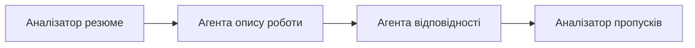
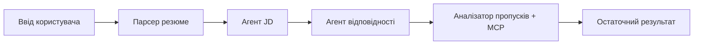

# Модуль 4 - Шаблони оркестрації

⏱️ ~10 хв

У цьому модулі ви досліджуєте шаблони оркестрації, які використовуються у Resume Job Fit Evaluator, і навчаєтесь читати, модифікувати та розширювати граф робочого процесу. Розуміння цих шаблонів є необхідним для налагодження проблем із потоком даних і побудови власних [багатоагентних робочих процесів](https://learn.microsoft.com/agent-framework/workflows/).

---

## Шаблон 1: Послідовний ланцюг

Основний шаблон у робочому процесі — це **послідовний ланцюг** — вихід кожного агента безпосередньо подається на вхід наступного.


```mermaid
flowchart LR
    RP[Аналізатор резюме] --> JD[Агента опису роботи]
    JD --> MA[Агента відповідності]
    MA --> GA[Аналізатор пропусків]
```

В коді кожен виклик `add_edge()` створює один крок у ланцюгу:

```python
.add_edge(resume_executor, jd_executor)       # Результат ResumeParser → JD Agent
.add_edge(jd_executor, matching_executor)     # Результат JD Agent → MatchingAgent
.add_edge(matching_executor, gap_executor)    # Результат MatchingAgent → GapAnalyzer
```

> **Чому послідовний, а не розгалуження/об’єднання?** `WorkflowBuilder` використовує **OR-семантику** для вхідних ребер: виконання наступного кроку запускається, щойно виконавець з будь-яким із попередників завершується. Якби `matching_executor` мав два вхідні ребра (від `resume_executor` і `jd_executor`), він запускався б двічі — один раз, коли завершується ResumeParser, і знову, коли завершується JD Agent — через що GapAnalyzer також запускався б двічі, а результат з’явився б двічі. Послідовний конвеєр повністю уникає цього.

## Шаблон 2: Передача вмісту

Оскільки `context_mode="last_agent"` означає, що кожен виконавець бачить лише **вихід безпосереднього попередника**, агенти у послідовному ланцюгу мають явно передавати далі будь-які дані, необхідні агентам знизу.

У цьому робочому процесі:
- **ResumeParser** копіює JD дослівно у `[JOB DESCRIPTION PASS-THROUGH]` (щоб JD Agent міг знайти його).
- **JD Agent** копіює `[PARSED RESUME]` дослівно у `[PARSED RESUME PASS-THROUGH]` (щоб MatchingAgent міг порівняти обидва профілі).

```
ResumeParser output
└─ [PARSED RESUME]               ← extracted by JD Agent
└─ [JOB DESCRIPTION PASS-THROUGH] ← extracted by JD Agent

JD Agent output
└─ [JD REQUIREMENTS]             ← extracted by MatchingAgent
└─ [PARSED RESUME PASS-THROUGH]  ← extracted by MatchingAgent
```

Кожен розділ передачі потрібно копіювати **дослівно** — узагальнення або перефразування ламає агента, який залежить від цього уривка.

---

## Повний граф

Поєднання шаблонів послідовного ланцюга і передачі вмісту дає повний робочий процес:


```mermaid
flowchart LR
    U[Ввід користувача] --> RP[Парсер резюме]
    RP --> JD[Агент JD]
    JD --> MA[Агент відповідності]
    MA --> GA[Аналізатор пропусків + MCP]
    GA --> O[Остаточний результат]
```

Інспектор агента показує ту ж структуру графа під час локального запуску агента. Докладніше в [Модулі 5 - Тестування локально](05-test-locally.md).

---

## Читання коду WorkflowBuilder

Повна функція `create_workflow()` знаходиться у [`PersonalCareerCopilot/main.py`](../../../../../workshop/lab02-multi-agent/PersonalCareerCopilot/main.py). Три виклики `add_edge()` створюють послідовний конвеєр:

| # | Ребро | Ефект |
|---|--------|---------|
| 1 | `resume_executor → jd_executor` | JD Agent отримує `[PARSED RESUME]` + `[JOB DESCRIPTION PASS-THROUGH]` |
| 2 | `jd_executor → matching_executor` | MatchingAgent отримує `[JD REQUIREMENTS]` + `[PARSED RESUME PASS-THROUGH]` |
| 3 | `matching_executor → gap_executor` | GapAnalyzer отримує звіт про відповідність + список розривів |

---

## Зміна графа

### Додавання нового агента

Щоб додати п’ятого агента (наприклад, **InterviewPrepAgent** після GapAnalyzer):

1. Визначити константу `INTERVIEW_PREP_INSTRUCTIONS`.
2. Створити об’єкти `Agent` + `AgentExecutor` (за зразком уже існуючих чотирьох).
3. Додати `.add_edge(gap_executor, interview_exec)` у `WorkflowBuilder`.
4. Оновити `output_executors=[interview_exec]`.

> **Важливо:** `start_executor` — це єдиний агент, який отримує сирий вхід від користувача. Всі інші агенти отримують вихід із ребра зверху.

---

## Типові помилки в графі

| Помилка | Симптом | Виправлення |
|---------|---------|------------|
| Відсутнє ребро до `output_executors` | Агент запускається, але вихід порожній | Перевірте, що є шлях від `start_executor` до кожного агента у `output_executors` |
| Циклічна залежність | Нескінченний цикл або таймаут | Переконайтеся, що жоден агент не подає дані назад до агента зверху |
| Агент у `output_executors` без вхідного ребра | Порожній вихід | Додайте хоча б одне `add_edge(source, that_agent)` |
| Кілька `output_executors` без об’єднання | Вихід містить відповідь лише одного агента | Використовуйте одного вихідного агента, який агрегує, або прийміть кілька результатів |
| Відсутній `start_executor` | `ValueError` під час побудови | Завжди вказуйте `start_executor` у `WorkflowBuilder()` |

---

## Налагодження графа

### Використання Інспектора агента

1. Запустіть агента локально за допомогою F5.
2. Відкрийте Інспектор агента (`Ctrl+Shift+P` → **Foundry Toolkit: Open Agent Inspector**).
3. Відправте тестове повідомлення.
4. У панелі відповідей Інспектора дивіться на **потоковий вихід** — він показує внесок кожного агента послідовно.


### Використання логування

Додайте логування у `main.py` для відстеження потоку даних:

```python
import logging
logger = logging.getLogger("resume-job-fit")

# У main(), після побудови робочого процесу:
logger.info("Workflow graph built with edges: RP→JD, JD→MA, MA→GA")
```

Журнали сервера показують порядок виконання агентів і виклики інструментів MCP:

```
INFO:agent_framework:Executing agent: ResumeParser
INFO:agent_framework:Executing agent: JobDescriptionAgent
INFO:agent_framework:Executing agent: MatchingAgent
INFO:agent_framework:Executing agent: GapAnalyzer
INFO:agent_framework:Tool call: search_microsoft_learn_for_plan(skill="Kubernetes")
POST https://learn.microsoft.com/api/mcp → 200
INFO:agent_framework:Tool call: search_microsoft_learn_for_plan(skill="Terraform")
POST https://learn.microsoft.com/api/mcp → 200
```

---

### Контрольна точка

- [ ] Ви можете визначити два шаблони оркестрації в робочому процесі: послідовний ланцюг і передачу вмісту
- [ ] Ви розумієте, чому `context_mode="last_agent"` вимагає явної передачі даних між агентами
- [ ] Ви вмієте читати код `WorkflowBuilder` і зіставляти кожен виклик `add_edge()` з візуальним графом
- [ ] Ви знаєте, як додати нового агента в кінець конвеєра
- [ ] Ви можете ідентифікувати типові помилки графа та їхні симптоми

---

**Попередній:** [03 - Налаштування агентів і середовища](03-configure-agents.md) · **Наступний:** [05 - Тестування локально →](05-test-locally.md)

---

<!-- CO-OP TRANSLATOR DISCLAIMER START -->
**Відмова від відповідальності**:
Цей документ було перекладено за допомогою сервісу штучного інтелекту для перекладу [Co-op Translator](https://github.com/Azure/co-op-translator). Хоча ми прагнемо до точності, будь ласка, майте на увазі, що автоматичні переклади можуть містити помилки або неточності. Оригінальний документ рідною мовою слід вважати авторитетним джерелом. Для критично важливої інформації рекомендується професійний людський переклад. Ми не несемо відповідальності за будь-які непорозуміння або неправильні тлумачення, що виникли внаслідок використання цього перекладу.
<!-- CO-OP TRANSLATOR DISCLAIMER END -->