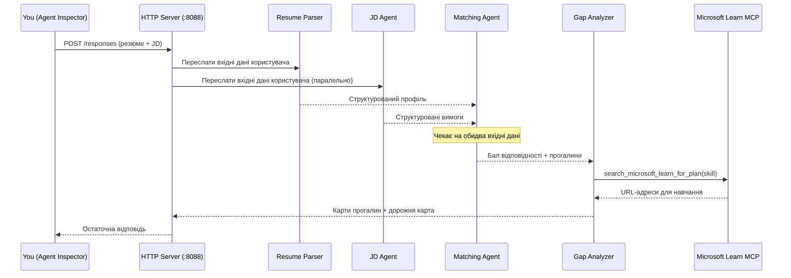
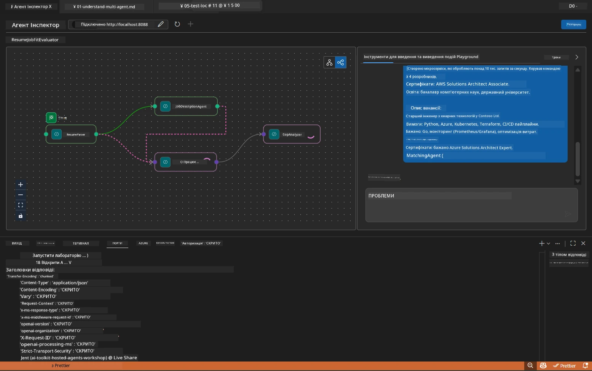

# Модуль 5 - Локальне тестування (Багатоагентна система)

У цьому модулі ви запускаєте багатофункціональний робочий процес локально, тестуєте його за допомогою Agent Inspector і перевіряєте, що всі чотири агенти та MCP Інструмент працюють правильно перед розгортанням у Foundry.

### Що відбувається під час локального тестування


---

## Крок 1: Запуск серверу агента

### Варіант A: Використання задачі VS Code (рекомендовано)

1. Натисніть `Ctrl+Shift+P` → введіть **Tasks: Run Task** → оберіть **Run Lab02 HTTP Server**.
2. Завдання запускає сервер з підключеним debugpy на порті `5679` та агента на порті `8088`.
3. Почекайте, поки у виводі з’явиться:

```
INFO:resume-job-fit:Starting Resume -> Job Fit Evaluator HTTP server...
INFO:resume-job-fit:Server running on http://localhost:8088
```

### Варіант B: Запуск вручну через термінал

```powershell
cd workshop\lab02-multi-agent\PersonalCareerCopilot
```

Активуйте віртуальне оточення:

**PowerShell (Windows):**
```powershell
.\.venv\Scripts\Activate.ps1
```

**macOS/Linux:**
```bash
source .venv/bin/activate
```

Запустіть сервер:

```powershell
python -m debugpy --listen 127.0.0.1:5679 -m agentdev run main.py --verbose --port 8088
```

### Варіант C: Використання F5 (режим налагодження)

1. Натисніть `F5` або перейдіть у **Run and Debug** (`Ctrl+Shift+D`).
2. Виберіть конфігурацію запуску **Lab02 - Multi-Agent** у випадаючому списку.
3. Сервер запуститься з повною підтримкою точок зупинки.

> **Порада:** Режим налагодження дозволяє ставити точки зупинки всередині `search_microsoft_learn_for_plan()` для перевірки відповідей MCP або всередині рядків інструкцій агентів, щоб бачити, що отримує кожен агент.

---

## Крок 2: Відкриття Agent Inspector

1. Натисніть `Ctrl+Shift+P` → введіть **Foundry Toolkit: Open Agent Inspector**.
2. Agent Inspector відкриється у вкладці браузера за адресою `http://localhost:5679`.
3. Ви повинні побачити інтерфейс агента, готовий приймати повідомлення.

> **Якщо Agent Inspector не відкривається:** Переконайтеся, що сервер повністю запущено (ви бачите в логах "Server running"). Якщо порт 5679 зайнятий, див. [Модуль 8 - Вирішення проблем](08-troubleshooting.md).

---

## Крок 3: Запуск базових тестів

Виконайте ці три тести послідовно. Кожен перевіряє поступово більше етапів робочого процесу.

### Тест 1: Основне резюме + опис вакансії

Вставте наступне у Agent Inspector:

```
Resume:
Jane Doe
Senior Software Engineer with 5 years of experience in Python, Django, and AWS.
Built microservices handling 10K+ requests/second. Led a team of 4 developers.
Certifications: AWS Solutions Architect Associate.
Education: B.S. Computer Science, State University.

Job Description:
Senior Cloud Engineer at Contoso Ltd.
Required: Python, Azure, Kubernetes, Terraform, CI/CD pipelines.
Preferred: Go, monitoring (Prometheus/Grafana), cost optimization.
Experience: 5+ years in cloud infrastructure.
Certifications: Azure Solutions Architect Expert preferred.
```

**Очікувана структура відповіді:**

У відповіді має міститися вивід усіх чотирьох агентів послідовно:

1. **Вивід Resume Parser** - Структурований профіль кандидата з навичками, згрупованими за категоріями
2. **Вивід JD Agent** - Структуровані вимоги з розділенням обов’язкових і бажаних навичок
3. **Вивід Matching Agent** - Оцінка відповідності (0-100) з деталізацією, зіставлені навички, відсутні навички, пробіли
4. **Вивід Gap Analyzer** - Індивідуальні картки пробілів для кожної відсутньої навички, кожна з посиланнями на Microsoft Learn



### Що перевірити у Тесті 1

| Перевірка | Очікуване | Пройшов? |
|-----------|-----------|----------|
| У відповіді є оцінка відповідності | Число від 0 до 100 з деталізацією | |
| Перелік зіставлених навичок | Python, CI/CD (частково), тощо | |
| Перелік відсутніх навичок | Azure, Kubernetes, Terraform, тощо | |
| Картки пробілів для кожної навички | По одній картці на навичку | |
| Присутні посилання Microsoft Learn | Реальні посилання на `learn.microsoft.com` | |
| Відповідь без повідомлень про помилки | Чистий структурований вивід | |

### Тест 2: Перевірка виконання MCP інструменту

Під час виконання Тесту 1 перевірте **термінал сервера** на наявність MCP записів журналу:

```
GET https://learn.microsoft.com/api/mcp → 405 (Method Not Allowed)
POST https://learn.microsoft.com/api/mcp → 200
DELETE https://learn.microsoft.com/api/mcp → 405 (Method Not Allowed)
```

| Запис журналу | Значення | Очікувано? |
|--------------|----------|------------|
| `GET ... → 405` | MCP клієнт пробує GET під час ініціалізації | Так - нормальна поведінка |
| `POST ... → 200` | Фактичний виклик інструменту до сервера Microsoft Learn MCP | Так - це реальний виклик |
| `DELETE ... → 405` | MCP клієнт пробує DELETE під час очищення | Так - нормальна поведінка |
| `POST ... → 4xx/5xx` | Виклик інструменту не вдався | Ні - див. [Вирішення проблем](08-troubleshooting.md) |

> **Головне:** Лінії `GET 405` та `DELETE 405` – це **очікувана поведінка**. Турбуйтеся лише якщо `POST` виклики повертають статуси, відмінні від 200.

### Тест 3: Крайній випадок - кандидат з високою відповідністю

Вставте резюме, яке тісно відповідає опису вакансії, щоб перевірити, як GapAnalyzer справляється з високою відповідністю:

```
Resume:
Alex Chen
Senior Cloud Engineer with 7 years of experience.
Skills: Python, Azure (AKS, Functions, DevOps), Kubernetes, Terraform, CI/CD (GitHub Actions, Azure Pipelines), Go, Prometheus, Grafana, cost optimization.
Certifications: Azure Solutions Architect Expert, Azure DevOps Engineer Expert.
Led infrastructure migration to Azure for 3 enterprise clients.
Education: M.S. Computer Science, Tech University.

Job Description:
Senior Cloud Engineer at Contoso Ltd.
Required: Python, Azure, Kubernetes, Terraform, CI/CD pipelines.
Preferred: Go, monitoring (Prometheus/Grafana), cost optimization.
Experience: 5+ years in cloud infrastructure.
Certifications: Azure Solutions Architect Expert preferred.
```

**Очікувана поведінка:**
- Оцінка відповідності має бути **80+** (більшість навичок співпадають)
- Картки пробілів мають фокусуватися на удосконаленні/підготовці до співбесіди, а не на базовому навчанні
- Інструкції GapAnalyzer говорять: "Якщо відповідність >= 80, зосередитись на удосконаленні/підготовці до співбесіди"

---

## Крок 4: Перевірка повноти виводу

Після запуску тестів перевірте, що вивід відповідає цим критеріям:

### Контрольний список структури виводу

| Розділ | Агент | Присутній? |
|--------|--------|------------|
| Профіль кандидата | Resume Parser | |
| Технічні навички (за групами) | Resume Parser | |
| Огляд ролі | JD Agent | |
| Обов’язкові та бажані навички | JD Agent | |
| Оцінка відповідності з деталізацією | Matching Agent | |
| Зіставлені/відсутні/часткові навички | Matching Agent | |
| Картка пробілу для кожної відсутньої навички | Gap Analyzer | |
| Посилання Microsoft Learn у картках | Gap Analyzer (MCP) | |
| Порядок навчання (нумерований) | Gap Analyzer | |
| Резюме хронології | Gap Analyzer | |

### Поширені проблеми на цьому етапі

| Проблема | Причина | Рішення |
|----------|---------|---------|
| Лише 1 картка пробілу (інші обрізані) | В інструкціях GapAnalyzer пропущено блок CRITICAL | Додати абзац `CRITICAL:` до `GAP_ANALYZER_INSTRUCTIONS` - див. [Модуль 3](03-configure-agents.md) |
| Відсутні посилання Microsoft Learn | Неможливо дістатися MCP endpoint | Перевірте інтернет-з’єднання. Перевірте що `MICROSOFT_LEARN_MCP_ENDPOINT` у `.env` встановлено на `https://learn.microsoft.com/api/mcp` |
| Порожня відповідь | Не встановлені `PROJECT_ENDPOINT` або `MODEL_DEPLOYMENT_NAME` | Перевірте значення у файлі `.env`. Виконайте команду `echo $env:PROJECT_ENDPOINT` у терміналі |
| Оцінка відповідності 0 або відсутня | MatchingAgent не отримує вхідних даних | Переконайтеся, що в `create_workflow()` викликаються `add_edge(resume_parser, matching_agent)` і `add_edge(jd_agent, matching_agent)` |
| Агент стартує, але відразу завершується | Помилка імпорту або відсутня залежність | Виконайте `pip install -r requirements.txt` знову. Перевірте лог у терміналі на наявність стек трейсів |
| Помилка `validate_configuration` | Відсутні змінні середовища | Створіть `.env` з `PROJECT_ENDPOINT=<your-endpoint>` та `MODEL_DEPLOYMENT_NAME=<your-model>` |

---

## Крок 5: Тестування на власних даних (необов’язково)

Спробуйте вставити власне резюме та реальний опис вакансії. Це допоможе перевірити:

- Чи агенти працюють з різними форматами резюме (хронологічне, функціональне, гібридне)
- Чи JD Agent обробляє різні стилі опису вакансій (маркіровані списки, абзаци, структуровані)
- Чи MCP інструмент повертає релевантні ресурси для реальних навичок
- Чи картки пробілів персоналізовані для вашого конкретного бекграунду

> **Примітка щодо конфіденційності:** Під час локального тестування ваші дані лишаються на вашій машині і передаються лише до вашого розгортання Azure OpenAI. Вони не записуються і не зберігаються інфраструктурою воркшопу. Для приватності можете використовувати фіктивні імена (наприклад, "Jane Doe" замість реального імені).

---

### Контрольний список

- [ ] Сервер успішно запущено на порті `8088` (у логу видно "Server running")
- [ ] Agent Inspector відкритий і з’єднаний з агентом
- [ ] Тест 1: Повна відповідь з оцінкою відповідності, зіставленими/відсутніми навичками, картками пробілів і посиланнями Microsoft Learn
- [ ] Тест 2: У логах MCP відображено `POST ... → 200` (виклики інструментів пройшли успішно)
- [ ] Тест 3: Кандидат з високою відповідністю отримує оцінку 80+ із рекомендаціями, зосередженими на удосконаленні
- [ ] Всі картки пробілів присутні (по одній на кожну відсутню навичку, без обрізання)
- [ ] В терміналі сервера немає помилок чи стек трейсів

---

**Попередній:** [04 - Операційні патерни](04-orchestration-patterns.md) · **Наступний:** [06 - Розгортання у Foundry →](06-deploy-to-foundry.md)

---

<!-- CO-OP TRANSLATOR DISCLAIMER START -->
**Відмова від відповідальності**:
Цей документ було перекладено за допомогою сервісу автоматичного перекладу [Co-op Translator](https://github.com/Azure/co-op-translator). Хоча ми прагнемо до точності, будь ласка, майте на увазі, що автоматичні переклади можуть містити помилки або неточності. Оригінальний документ рідною мовою слід вважати авторитетним джерелом. Для критично важливої інформації рекомендується звертатись до професійного перекладу людиною. Ми не несемо відповідальності за будь-які непорозуміння або неправильні тлумачення, що виникли внаслідок використання цього перекладу.
<!-- CO-OP TRANSLATOR DISCLAIMER END -->