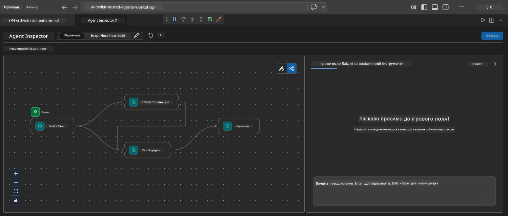
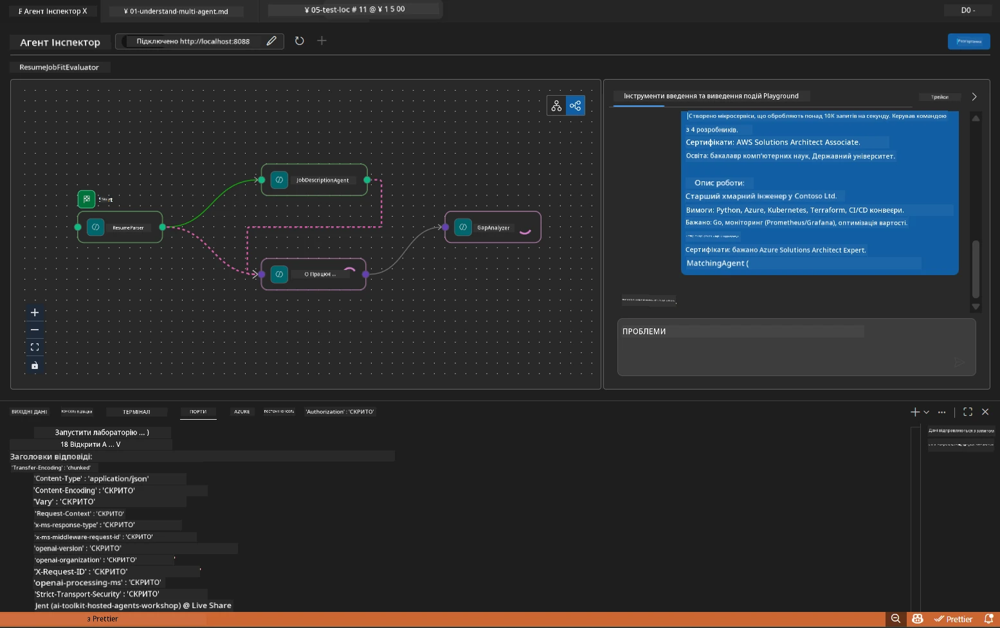
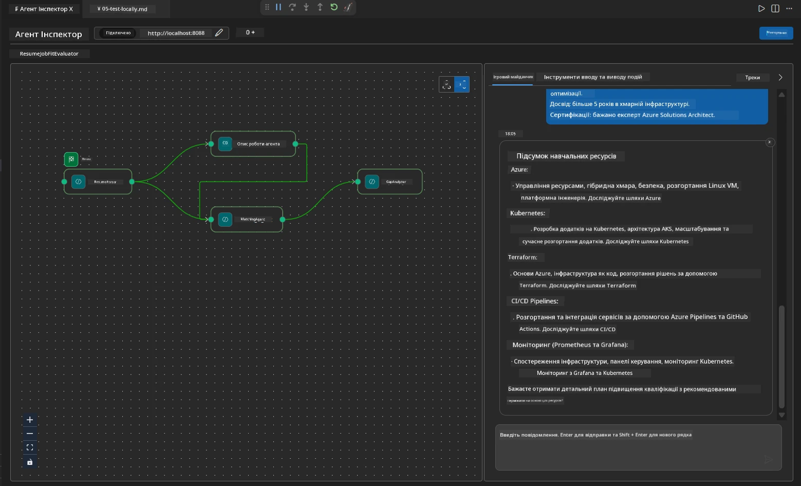

# Модуль 5 - Локальне тестування

⏱️ ~15 хв

У цьому модулі ви запускаєте багатофункціональний робочий процес локально, тестуєте його з Agent Inspector та перевіряєте, чи коректно працюють усі чотири агенти і інструмент MCP перед розгортанням.

---

## Крок 1: Запустіть сервер агента

### Варіант A: Використання завдання VS Code (рекомендується)

1. Відкрийте `workshop/lab02-multi-agent/PersonalCareerCopilot/` як папку у VS Code.
2. Натисніть `Ctrl+Shift+P` → введіть **Tasks: Run Task** → оберіть **Run Agent HTTP Server**.
3. Завдання запускає сервер з приєднаним debugpy на порті `5679` і агента на порті `8088`.
4. Чекайте, поки вивід не покаже:

```
INFO:resume-job-fit:Starting Resume -> Job Fit Evaluator HTTP server...
INFO:resume-job-fit:Server running on http://localhost:8088
```

### Варіант B: Використання F5 (режим відлагодження)

1. Натисніть `F5` → оберіть **Debug Local Agent HTTP Server**.
2. Сервер запускається з повною підтримкою breakpoint-ів – корисно для перевірки відповідей MCP або виводу агента.

---

## Крок 2: Відкрийте Agent Inspector

1. Натисніть `Ctrl+Shift+P` → введіть **Foundry Toolkit: Open Agent Inspector**.
2. Agent Inspector відкривається як панель VS Code, підключена до `http://localhost:8088`.
3. Ви маєте побачити інтерфейс агента, готовий приймати повідомлення.



> **Якщо Agent Inspector не відкривається:** Переконайтесь, що сервер повністю запущений (бачите у логах "Server running"). Якщо порт 5679 зайнятий, дивіться [Модуль 8 - Вирішення проблем](08-troubleshooting.md).

---

## Крок 2b: (Опціонально) Відкрийте Workflow Visualizer

Foundry Toolkit включає реальний час **Workflow Visualizer**, який показує, як агенти взаємодіють під час виконання графу. Це особливо корисно для відлагодження багатофункціональних агентів.

1. Натисніть `Ctrl+Shift+P` → введіть **Foundry Toolkit: Open Visualizer for Hosted Agents**.
2. Відкривається нова вкладка VS Code з графіком виконання в реальному часі.
3. Під час надсилання повідомлень в Agent Inspector візуалізатор оновлюється автоматично – зелені вузли позначають завершених агентів, а анімовані ребра показують потік даних між ними.

> **Конфлікт портів:** Якщо порт візуалізатора вже зайнятий, змініть його у налаштуваннях VS Code → **Extensions** → **Microsoft Foundry Configuration** → **Hosted Agents: Visualizer Port**.

---

## Крок 3: Запустіть швидкі тести

Запускайте ці три тести послідовно. Кожен перевіряє дедалі більше робочого процесу.

### Тест 1: Основне резюме + опис вакансії

Вставте наступне в Agent Inspector:

```
Resume:
Jane Doe
Senior Software Engineer with 5 years of experience in Python, Django, and AWS.
Built microservices handling 10K+ requests/second. Led a team of 4 developers.
Certifications: AWS Solutions Architect Associate.
Education: B.S. Computer Science, State University.

Job Description:
Senior Cloud Engineer at Contoso Ltd.
Required: Python, Azure, Kubernetes, Terraform, CI/CD pipelines.
Preferred: Go, monitoring (Prometheus/Grafana), cost optimization.
Experience: 5+ years in cloud infrastructure.
Certifications: Azure Solutions Architect Expert preferred.
```

**Очікувана структура виводу:**

Відповідь має містити результати роботи усіх чотирьох агентів послідовно:

1. **Вивід Resume Parser** — два позначені блоки: `[PARSED RESUME]` (профіль кандидата зі згрупованими навичками) і `[JOB DESCRIPTION PASS-THROUGH]` (дослівний текст JD для агента JD)
2. **Вивід агента JD** — структуровані вимоги з розділенням на обов’язкові та бажані навички
3. **Вивід агента Matching** — показник відповідності (0-100) з деталізацією, сумісні навички, відсутні навички, прогалини
4. **Вивід Gap Analyzer** — індивідуальні картки прогалин для кожної відсутньої навички з URL Microsoft Learn





### Що перевірити в Тесті 1

| Перевірка | Очікувано | Пройшло? |
|-------|----------|-------|
| Відповідь містить показник відповідності | Число від 0 до 100 з деталізацією | |
| Вказані сумісні навички | Python, CI/CD (частково) тощо | |
| Вказані відсутні навички | Azure, Kubernetes, Terraform тощо | |
| Існують картки прогалин для кожної відсутньої навички | Одна картка на навичку | |
| Присутні URL Microsoft Learn | Реальні посилання `learn.microsoft.com` | |
| Відсутні повідомлення про помилки у відповіді | Чистий структурований вивід | |

### Тест 2: Крайній випадок — кандидат з високою відповідністю

Вставте резюме, що максимально відповідає JD, щоб перевірити, як GapAnalyzer обробляє сценарії з високою відповідністю:

```
Resume:
Alex Chen
Senior Cloud Engineer with 7 years of experience.
Skills: Python, Azure (AKS, Functions, DevOps), Kubernetes, Terraform, CI/CD (GitHub Actions, Azure Pipelines), Go, Prometheus, Grafana, cost optimization.
Certifications: Azure Solutions Architect Expert, Azure DevOps Engineer Expert.
Led infrastructure migration to Azure for 3 enterprise clients.
Education: M.S. Computer Science, Tech University.

Job Description:
Senior Cloud Engineer at Contoso Ltd.
Required: Python, Azure, Kubernetes, Terraform, CI/CD pipelines.
Preferred: Go, monitoring (Prometheus/Grafana), cost optimization.
Experience: 5+ years in cloud infrastructure.
Certifications: Azure Solutions Architect Expert preferred.
```

**Очікувана поведінка:**
- Показник відповідності повинен бути **80+** (більшість навичок співпадають)
- Картки прогалин більше фокусуються на шліфуванні/готовності до співбесіди, а не на базовому навчанні
- Вказівки GapAnalyzer говорять: "Якщо відповідність >= 80, зосередитись на шліфуванні/готовності до співбесіди"

---

## Крок 4: Тестування з власними даними (опціонально)

Спробуйте вставити своє резюме та реальний опис вакансії. Це допоможе перевірити:

- Агенти підтримують різні формати резюме (хронологічний, функціональний, гібридний)
- Агент JD підтримує різні стилі опису вакансій (маркерні списки, абзаци, структуровані)
- Інструмент MCP повертає релевантні ресурси для реальних навичок
- Картки прогалин персоналізовані за вашим конкретним бекграундом

> **Конфіденційність - Шлях A (Foundry cloud):** текст резюме та JD надсилається до вашого розгортання Azure OpenAI для обробки. Він не зберігається і не логиться інфраструктурою воркшопу. Використовуйте замінні імена (наприклад, «Jane Doe»), якщо бажаєте.
>
> **Конфіденційність - Шлях B (Foundry Local):** Всі чотири інференси агентів запускаються повністю на вашому пристрої. Ваше резюме та опис вакансії **ніколи не залишають ваш комп’ютер**. Єдиний зовнішній виклик – інструмент MCP для отримання ресурсів за адресою `https://learn.microsoft.com/api/mcp`; у запиті передається лише назва навички, а не ваші персональні дані.

---

### Контрольна точка

- [ ] Сервер успішно запущено на порті `8088` (у логах показано "Server running")
- [ ] Відкритий Agent Inspector та підключено до агента
- [ ] Тест 1: Повна відповідь із показником відповідності, сумісними/відсутніми навичками, картками прогалин і URL Microsoft Learn
- [ ] Тест 2: Кандидат з високою відповідністю отримує оцінку 80+ з рекомендаціями, орієнтованими на шліфування
- [ ] Всі картки прогалин присутні (по одній на кожну відсутню навичку, без обрізання)
- [ ] В терміналі сервера немає помилок або трасувань стеків

---

**Попередній:** [04 - Orchestration Patterns](04-orchestration-patterns.md) · **Наступний:** [06 - Deploy to Foundry →](06-deploy-to-foundry.md)

---

<!-- CO-OP TRANSLATOR DISCLAIMER START -->
**Відмова від відповідальності**:
Цей документ було перекладено за допомогою сервісу штучного інтелекту для перекладу [Co-op Translator](https://github.com/Azure/co-op-translator). Хоча ми прагнемо до точності, будь ласка, майте на увазі, що автоматичні переклади можуть містити помилки або неточності. Оригінальний документ рідною мовою слід вважати авторитетним джерелом. Для критично важливої інформації рекомендується професійний людський переклад. Ми не несемо відповідальності за будь-які непорозуміння або неправильні тлумачення, що виникли внаслідок використання цього перекладу.
<!-- CO-OP TRANSLATOR DISCLAIMER END -->