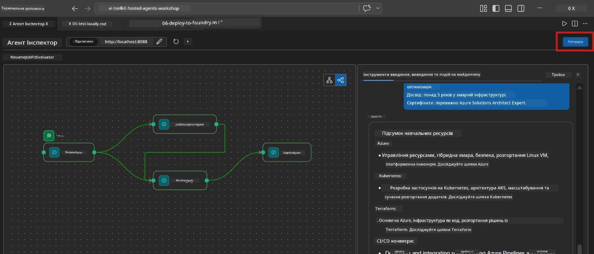
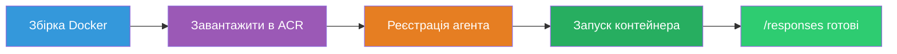
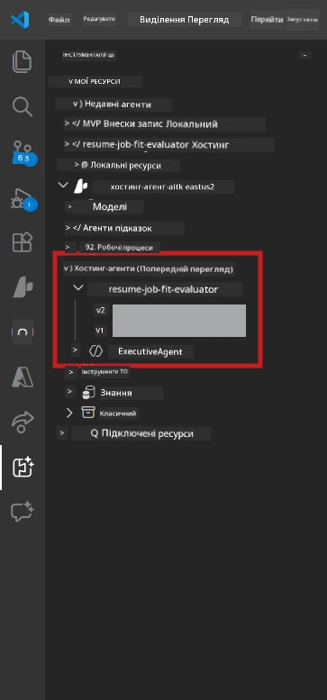

# Модуль 6 - Розгортання у Foundry Agent Service

У цьому модулі ви розгортаєте свій локально протестований багатоагентний робочий процес у [Microsoft Foundry](https://learn.microsoft.com/azure/foundry/agents/concepts/hosted-agents) як **Hosted Agent**. Процес розгортання створює образ Docker-контейнера, відправляє його до [Azure Container Registry (ACR)](https://learn.microsoft.com/azure/container-registry/container-registry-intro) та створює версію хостингованого агента у [Foundry Agent Service](https://learn.microsoft.com/azure/foundry/agents/how-to/publish-agent).

> **Ключова відмінність від Лабораторії 01:** Процес розгортання ідентичний. Foundry розглядає ваш багатоагентний робочий процес як одного хостингованого агента - складність знаходиться всередині контейнера, але точка розгортання залишається такою ж на `/responses`.

---

## Перевірка передумов

Перед розгортанням перевірте кожен пункт нижче:

1. **Агент пройшов локальні базові тести:**
   - Ви виконали всі 3 тести у [Модулі 5](05-test-locally.md) і робочий процес створив повний вихідний результат з картками прогалин та URL Microsoft Learn.

2. **У вас є роль [Azure AI User](https://learn.microsoft.com/azure/foundry/concepts/rbac-foundry):**
   - Призначена у [Лабораторії 01, Модулі 2](../../lab01-single-agent/docs/02-create-foundry-project.md). Перевірте:
   - [Azure Portal](https://portal.azure.com) → ресурс вашого Foundry **проекту** → **Access control (IAM)** → **Role assignments** → підтвердіть, що **[Azure AI User](https://aka.ms/foundry-ext-project-role)** є у списку для вашого облікового запису.

3. **Ви увійшли в Azure у VS Code:**
   - Перевірте іконку облікових записів у нижньому лівому куті VS Code. Має бути видно ваше ім’я облікового запису.

4. **`agent.yaml` має правильні значення:**
   - Відкрийте `PersonalCareerCopilot/agent.yaml` та підтвердіть:
     ```yaml
     environment_variables:
       - name: PROJECT_ENDPOINT
         value: ${PROJECT_ENDPOINT}
       - name: MODEL_DEPLOYMENT_NAME
         value: ${MODEL_DEPLOYMENT_NAME}
     ```
   - Вони мають збігатися з змінними середовища, які зчитує ваш `main.py`.

5. **`requirements.txt` має правильні версії:**
   ```
   agent-framework-azure-ai==1.0.0rc3
   agent-framework-core==1.0.0rc3
   azure-ai-agentserver-agentframework==1.0.0b16
   azure-ai-agentserver-core==1.0.0b16
   debugpy
   agent-dev-cli --pre
   ```

---

## Крок 1: Почати розгортання

### Варіант А: Розгорнути з Agent Inspector (рекомендовано)

Якщо агент запущений через F5 з відкритим Agent Inspector:

1. Подивіться у **верхній правий кут** панелі Agent Inspector.
2. Натисніть кнопку **Deploy** (іконка хмари зі стрілкою вгору ↑).
3. Відкриється майстер розгортання.



### Варіант Б: Розгорнути через Command Palette

1. Натисніть `Ctrl+Shift+P`, щоб відкрити **Command Palette**.
2. Введіть: **Microsoft Foundry: Deploy Hosted Agent** та виберіть її.
3. Відкриється майстер розгортання.

---

## Крок 2: Налаштувати розгортання

### 2.1 Вибрати цільовий проєкт

1. З’явиться випадаючий список ваших проєктів Foundry.
2. Виберіть проєкт, який використовували протягом воркшопу (наприклад, `workshop-agents`).

### 2.2 Вибрати файл агента-контейнера

1. Вас попросять вибрати точку входу агента.
2. Перейдіть до `workshop/lab02-multi-agent/PersonalCareerCopilot/` та оберіть **`main.py`**.

### 2.3 Налаштувати ресурси

| Налаштування | Рекомендоване значення | Примітки |
|--------------|------------------------|----------|
| **CPU** | `0.25` | За замовчуванням. Багатоагентний робочий процес не потребує більше CPU, бо виклики моделі є I/O-залежними |
| **Пам’ять** | `0.5Gi` | За замовчуванням. Збільшіть до `1Gi`, якщо додаєте інструменти обробки великих даних |

---

## Крок 3: Підтвердити та розгорнути

1. Майстер покаже підсумок розгортання.
2. Перегляньте та натисніть **Confirm and Deploy**.
3. Слідкуйте за процесом у VS Code.

### Що відбувається під час розгортання

Слідкуйте за панеллю **Output** у VS Code (виберіть меню "Microsoft Foundry"):


1. **Docker build** - Створення контейнера з вашого `Dockerfile`:
   ```
   Step 1/6 : FROM python:3.14-slim
   Step 2/6 : WORKDIR /app
   ...
   Successfully built abc123def456
   ```

2. **Docker push** - Завантаження образу у ACR (1-3 хвилини при першому розгортанні).

3. **Реєстрація агента** - Foundry створює хостингованого агента за метаданими з `agent.yaml`. Ім’я агента - `resume-job-fit-evaluator`.

4. **Запуск контейнера** - Контейнер запускається в керованій інфраструктурі Foundry з системною керованою ідентичністю.

> **Перше розгортання повільніше** (Docker надсилає всі шари). Наступні розгортання використовують кешовані шари і проходять швидше.

### Особливості багатоагентного режиму

- **Всі чотири агенти розміщені в одному контейнері.** Foundry бачить одного хостингованого агента. Граф WorkflowBuilder запускається всередині.
- **Виклики MCP здійснюються назовні.** Контейнер потребує доступу в інтернет до `https://learn.microsoft.com/api/mcp`. Керована інфраструктура Foundry це забезпечує за замовчуванням.
- **[Керована ідентичність](https://learn.microsoft.com/python/api/overview/azure/identity-readme#managed-identity-support).** У хостингованому середовищі `get_credential()` у `main.py` повертає `ManagedIdentityCredential()` (оскільки встановлено `MSI_ENDPOINT`). Це відбувається автоматично.

---

## Крок 4: Перевірити статус розгортання

1. Відкрийте бічну панель **Microsoft Foundry** (клікніть на іконку Foundry в Activity Bar).
2. Розгорніть **Hosted Agents (Preview)** під вашим проєктом.
3. Знайдіть **resume-job-fit-evaluator** (або ім’я вашого агента).
4. Клікніть на назву агента → розгорніть версії (наприклад, `v1`).
5. Клікніть на версію → перевірте **Container Details** → **Status**:



| Статус | Значення |
|--------|----------|
| **Started** / **Running** | Контейнер запущено, агент готовий |
| **Pending** | Контейнер запускається (почекайте 30-60 секунд) |
| **Failed** | Контейнер не запустився (перевірте логи - див. нижче) |

> **Старт багатоагентного режиму триває довше**, ніж для одного агента, бо контейнер створює 4 агентські екземпляри при запуску. Статус "Pending" до 2 хвилин є нормальним.

---

## Поширені помилки розгортання та їх виправлення

### Помилка 1: Відмова в доступі - `agents/write`

```
Error: lacks the required data action 
Microsoft.CognitiveServices/accounts/AIServices/agents/write
```

**Виправлення:** Призначте роль **[Azure AI User](https://learn.microsoft.com/azure/foundry/concepts/rbac-foundry)** на рівні **проєкту**. Див. покрокову інструкцію у [Модулі 8 - Усунення несправностей](08-troubleshooting.md).

### Помилка 2: Docker не запущено

```
Error: Docker build failed / Cannot connect to Docker daemon
```

**Виправлення:**
1. Запустіть Docker Desktop.
2. Почекайте, поки з'явиться "Docker Desktop is running".
3. Перевірте: `docker info`
4. **Windows:** Переконайтеся, що в налаштуваннях Docker Desktop увімкнено бекенд WSL 2.
5. Повторіть спробу.

### Помилка 3:Не вдається виконати pip install під час збірки Docker

```
Error: Could not find a version that satisfies the requirement agent-dev-cli
```

**Виправлення:** Прапорець `--pre` в `requirements.txt` обробляється інакше в Docker. Переконайтеся, що ваш `requirements.txt` має:
```
agent-dev-cli --pre
```

Якщо Docker все ще не працює, створіть `pip.conf` або передайте `--pre` як аргумент збірки. Див. [Модуль 8](08-troubleshooting.md).

### Помилка 4: MCP інструмент не працює в хостингованому агента

Якщо Gap Analyzer перестав генерувати URL Microsoft Learn після розгортання:

**Причина:** Можлива мережна політика блокує вихідний HTTPS трафік із контейнера.

**Виправлення:**
1. Зазвичай це не проблема при стандартній конфігурації Foundry.
2. Якщо трапилося, перевірте, чи немає віртуальної мережі проєкту Foundry NSG, який блокує вихідний HTTPS.
3. MCP має вбудовані запасні URL, тож агент все одно створюватиме результат (без живих посилань).

---

### Контрольний список

- [ ] Команда розгортання успішно виконана у VS Code без помилок
- [ ] Агент з’явився у розділі **Hosted Agents (Preview)** у Foundry sidebar
- [ ] Ім’я агента `resume-job-fit-evaluator` (або ваше обране ім’я)
- [ ] Статус контейнера показує **Started** або **Running**
- [ ] (Якщо були помилки) Ви ідентифікували помилку, застосували виправлення і успішно повторно розгорнули

---

**Попередній:** [05 - Тестування локально](05-test-locally.md) · **Наступний:** [07 - Перевірка у playground →](07-verify-in-playground.md)

---

<!-- CO-OP TRANSLATOR DISCLAIMER START -->
**Відмова від відповідальності**:  
Цей документ був перекладений за допомогою сервісу автоматичного перекладу [Co-op Translator](https://github.com/Azure/co-op-translator). Хоч ми і прагнемо до точності, будь ласка, майте на увазі, що автоматичні переклади можуть містити помилки або неточності. Оригінальний документ рідною мовою слід вважати авторитетним джерелом. Для критично важливої інформації рекомендується професійний людський переклад. Ми не несемо відповідальності за будь-які непорозуміння або неправильне тлумачення, що виникли внаслідок використання цього перекладу.
<!-- CO-OP TRANSLATOR DISCLAIMER END -->