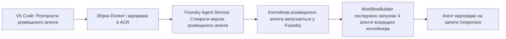
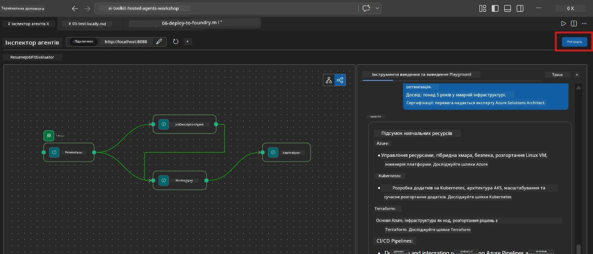

# Модуль 6 - Розгортання в Foundry Agent Service

⏱️ ~10 хв

У цьому модулі ви розгортаєте свій локально протестований багатофункціональний робочий процес до [Microsoft Foundry](https://learn.microsoft.com/azure/foundry/agents/concepts/hosted-agents) як **Hosted Agent**. Процес розгортання створює образ контейнера Docker, відправляє його в [Azure Container Registry (ACR)](https://learn.microsoft.com/azure/container-registry/container-registry-intro) і створює версію розгорнутого агента в [Foundry Agent Service](https://learn.microsoft.com/azure/foundry/agents/how-to/publish-agent).

> **Ключова різниця від Лабораторії 01:** Процес розгортання ідентичний. Foundry розглядає ваш багатофункціональний робочий процес як одного розгорнутого агента – складність знаходиться всередині контейнера, але точка розгортання залишається та сама `/responses`.

### Конвеєр розгортання


```mermaid
flowchart LR
    A[VS Code: Розгорнути розміщеного агента] --> B[Збірка Docker і відправка в ACR]
    B --> C[Foundry Agent Service: Створити версію розміщеного агента]
    C --> D[Контейнер розміщеного агента запускається у Foundry]
    D --> E[WorkflowBuilder послідовно запускає 4 агенти всередині контейнера]
    E --> F[Агент відповідає на запити /responses]
```

---

## Перевірка передумов

Перед розгортанням перевірте кожен пункт нижче:

1. **Агент проходить локальні перевірки (smoke tests):**
   - Ви успішно завершили всі 3 тести в [Модулі 5](05-test-locally.md), і робочий процес виробив повний вихідний результат із пропущеними картками та URL-адресами Microsoft Learn.

2. **Ви маєте роль [Foundry User](https://learn.microsoft.com/azure/foundry/concepts/rbac-foundry)** (для розгортання потрібна принаймні роль **Foundry Project Manager** у масштабі проєкту):

   > **Примітка:** Ролі Foundry RBAC нещодавно були перейменовані - **Foundry User**, **Foundry Owner** і **Foundry Project Manager** раніше називалися Azure AI User, Azure AI Owner і Azure AI Project Manager. Ідентифікатори ролей і дозволи залишилися без змін.

   - Перевірте в [Azure Portal](https://portal.azure.com) → ваш ресурс проєкту Foundry → **Контроль доступу (IAM)** → **Призначення ролей** → переконайтеся, що для вашого облікового запису присутній **Foundry User** (або вища роль).

3. **Ви увійшли в Azure у VS Code:**
   - Перевірте іконку Облікових записів у лівому нижньому куті VS Code. Ваше ім’я облікового запису має бути видимим.

4. **`agent.yaml` містить правильні значення:**
   - Відкрийте `PersonalCareerCopilot/agent.yaml` і перевірте:
     ```yaml
     environment_variables:
       - name: AZURE_AI_MODEL_DEPLOYMENT_NAME
         value: ${AZURE_AI_MODEL_DEPLOYMENT_NAME}
     ```
   - `FOUNDRY_PROJECT_ENDPOINT` тут **не** вказаний – Foundry вводить його під час виконання. Потрібно лише оголосити `AZURE_AI_MODEL_DEPLOYMENT_NAME`.

5. **`requirements.txt` містить правильні версії:**
   ```
   agent-framework-foundry
   agent-framework-foundry-hosting
   mcp<2,>=1.24.0
   debugpy
   ```

---

## Крок 1: Почати розгортання

### Варіант A: Розгорнути через Agent Inspector (рекомендується)

Якщо агент працює через F5 з відкритим Agent Inspector:

1. Подивіться у **верхній правий кут** панелі Agent Inspector.
2. Натисніть кнопку **Deploy** (іконка хмари зі стрілкою вгору ↑).
3. Відкриється майстер розгортання.



### Варіант B: Розгорнути через Command Palette

1. Натисніть `Ctrl+Shift+P`, щоб відкрити **Command Palette**.
2. Введіть: **Foundry Toolkit: Deploy Hosted Agent** і виберіть цю команду.
3. Відкриється майстер розгортання.

---

## Крок 2: Налаштування розгортання

### 2.1 Виберіть цільовий проєкт

1. Розкривається список ваших проєктів Foundry.
2. Виберіть проєкт, який використовували під час майстер-класу (наприклад, `workshop-agents`).

### 2.2 Виберіть файл агента контейнера

1. Вас попросять вибрати точку входу агента.
2. Перейдіть до `workshop/lab02-multi-agent/PersonalCareerCopilot/` і виберіть **`main.py`**.

### 2.3 Налаштуйте ресурси

| Налаштування | Рекомендоване значення | Примітки |
|---------|------------------|-------|
| **Метод розгортання** | **Container** (рекомендується) або **Code** | Container створює образ Docker; Code завантажує вихідний код як ZIP (попередній перегляд) |
| **Реєстр контейнерів** | **Default ACR** | Foundry створює і керує ним для вас |
| **CPU** | `0.25` | За замовчуванням. Багатоагентні робочі процеси не потребують додаткових ресурсів CPU, оскільки виклики моделей орієнтовані на введення/виведення |
| **Пам’ять** | `0.5Gi` | За замовчуванням. Збільшіть до `1Gi`, якщо додаєте інструменти обробки великих даних |

---

## Крок 3: Підтвердження і розгортання

1. Майстер показує підсумок розгортання.
2. Перевірте і натисніть **Confirm and Deploy**.
3. Спостерігайте за процесом у VS Code.

### Що відбувається під час розгортання

Дивіться панель **Output** у VS Code (виберіть випадаючий список "Microsoft Foundry"):

1. **Docker build** – Створює контейнер з вашого `Dockerfile`
   ```
   Step 1/6 : FROM python:3.12-slim
   Step 2/6 : WORKDIR /app
   ...
   Successfully built abc123def456
   ```

2. **Docker push** – Відправляє образ в ACR (1-3 хв на перше розгортання).

3. **Реєстрація агента** – Foundry створює розгорнутого агента з метаданих `agent.yaml`. Ім’я агента – `resume-job-fit-evaluator`.

4. **Запуск контейнера** – Контейнер запускається в керованій інфраструктурі Foundry із системною керованою ідентичністю.

> **Перше розгортання повільніше** (Docker відправляє всі шари). Наступні розгортання використовують кешовані шари і відбуваються швидше.

### Особливі зауваження для мультиагентів

- **Всі чотири агенти знаходяться в одному контейнері.** Foundry бачить одного розгорнутого агента. Граф WorkflowBuilder виконується внутрішньо.
- **Виклики MCP йдуть назовні.** Контейнер потребує доступу до інтернету для зв’язку з `https://learn.microsoft.com/api/mcp`. Керована інфраструктура Foundry це забезпечує за замовчуванням.
- **[Керована ідентичність](https://learn.microsoft.com/azure/foundry/agents/concepts/agent-identity).** Foundry автоматично створює **виділену ідентичність Entra для кожного агента** під час розгортання. В середовищі хості `DefaultAzureCredential` автоматично резольвить цю ідентичність агента – ручна конфігурація керованої ідентичності не потрібна.

---

## Крок 4: Перевірка статусу розгортання

1. Відкрийте бічну панель **Microsoft Foundry** (клікніть на іконку Foundry в Activity Bar).
2. Розкрийте **Hosted Agents (Preview)** у вашому проєкті.
3. Знайдіть **resume-job-fit-evaluator** (або ім’я вашого агента).
4. Клікніть на ім’я агента → розкрийте версії (наприклад, `v1`).
5. Клікніть на версію → перевірте **Container Details** → **Status**:


| Статус | Значення |
|--------|---------|
| **active** | Агент працює і готовий приймати запити |
| **creating** | Контейнер запускається (почекайте 30–60 секунд) |
| **failed** | Контейнер не вдалося запустити (перевірте логи - див. нижче) |

> **Примітка:** Бічна панель VS Code може показувати мітки як "Running" або "Started", тоді як API використовує статуси `active`/`creating`. Обидва відображення означають один і той же стан.

> **Запуск мультиагента триває довше**, ніж у разі одного агента, оскільки контейнер створює 4 екземпляри агента при запуску. Статус `creating` протягом 2 хвилин є нормальним.

---

## Поширені помилки розгортання та їх усунення

### Помилка 1: Відмовлено у доступі - `agents/write`

```
Error: lacks the required data action 
Microsoft.CognitiveServices/accounts/AIServices/agents/write
```

**Виправлення:** Призначте роль **[Foundry User](https://learn.microsoft.com/azure/foundry/concepts/rbac-foundry)** (раніше **Azure AI User**) на рівні **проєкту**. Детальні інструкції див. у [Модулі 8 - Вирішення проблем](08-troubleshooting.md).

### Помилка 2: Docker не запущений

```
Error: Docker build failed / Cannot connect to Docker daemon
```

**Виправлення:**
1. Запустіть Docker Desktop.
2. Дочекайтеся повідомлення "Docker Desktop is running".
3. Перевірте: `docker info`
4. **Windows:** Переконайтесь, що в налаштуваннях Docker Desktop увімкнено бэкенд WSL 2.
5. Спробуйте ще раз.

### Помилка 3: pip install не вдається під час збірки Docker

```
Error: Could not find a version that satisfies the requirement agent-framework-foundry
```

**Виправлення:** Переконайтеся, що `requirements.txt` відповідає:
```
agent-framework-foundry
agent-framework-foundry-hosting
mcp<2,>=1.24.0
debugpy
```

Якщо збірка все ще не вдається, можливо, ваша мережа Docker блокує PyPI. Перевірте проксі у `docker info`.

### Помилка 4: MCP tool не працює в хостованому агенті

Якщо Gap Analyzer перестає генерувати URL-адреси Microsoft Learn після розгортання:

**Причина:** Мережева політика може блокувати вихідний HTTPS-трафік із контейнера.

**Виправлення:**
1. Зазвичай це не проблема у конфігурації Foundry за замовчуванням.
2. Якщо проблема виникає, перевірте, чи немає віртуальної мережі Foundry NSG, що блокує вихідний HTTPS.
3. MCP tool має вбудовані резервні URL, тому агент продовжить генерувати вихідні дані (без живих URL).

---

### Контрольний список

- [ ] Команда розгортання завершилася без помилок у VS Code
- [ ] Агент відображається у **Hosted Agents (Preview)** у бічній панелі Foundry
- [ ] Ім’я агента – `resume-job-fit-evaluator` (або обране вами)
- [ ] Статус контейнера показує **Started** або **Running**
- [ ] (Якщо були помилки) Ви ідентифікували помилку, застосували виправлення та успішно повторно розгорнули

---

**Попередній:** [05 - Test Locally](05-test-locally.md) · **Наступний:** [07 - Verify in Playground →](07-verify-in-playground.md)

---

<!-- CO-OP TRANSLATOR DISCLAIMER START -->
**Відмова від відповідальності**:
Цей документ було перекладено за допомогою сервісу штучного інтелекту для перекладу [Co-op Translator](https://github.com/Azure/co-op-translator). Хоча ми прагнемо до точності, будь ласка, майте на увазі, що автоматичні переклади можуть містити помилки або неточності. Оригінальний документ рідною мовою слід вважати авторитетним джерелом. Для критично важливої інформації рекомендується професійний людський переклад. Ми не несемо відповідальності за будь-які непорозуміння або неправильні тлумачення, що виникли внаслідок використання цього перекладу.
<!-- CO-OP TRANSLATOR DISCLAIMER END -->