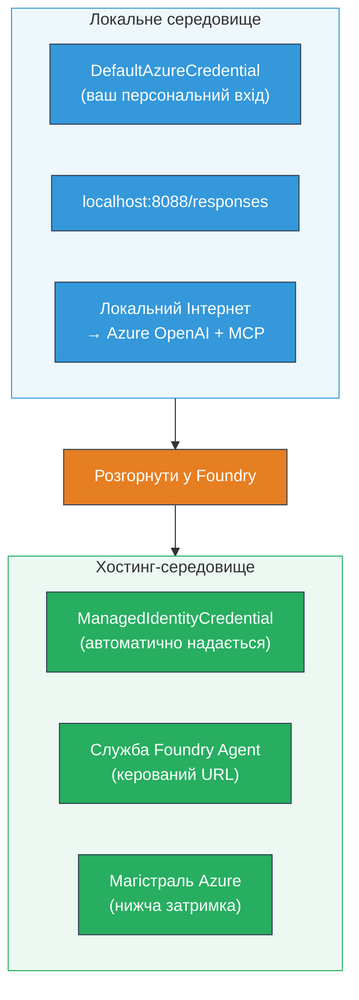

# Module 7 - Перевірка в Плейграунді

У цьому модулі ви тестуєте розгорнутий багатоягентний робочий процес як у **VS Code**, так і в **[Foundry Portal](https://ai.azure.com)**, підтверджуючи, що агент поводиться однаково, як і при локальному тестуванні.

---

## Чому перевіряти після розгортання?

Ваш багатоягентний робочий процес ідеально працював локально, тож навіщо тестувати знову? Хостинг-середовище відрізняється кількома аспектами:


| Відмінність | Локально | У хості |
|-----------|-------|--------|
| **Ідентичність** | [`DefaultAzureCredential`](https://learn.microsoft.com/azure/developer/python/sdk/authentication/credential-chains#defaultazurecredential-overview) (ваш особистий вхід) | [`ManagedIdentityCredential`](https://learn.microsoft.com/python/api/overview/azure/identity-readme#managed-identity-support) (автоматично налаштований) |
| **Кінцева точка** | `http://localhost:8088/responses` | кінцева точка [Foundry Agent Service](https://learn.microsoft.com/azure/foundry/agents/concepts/hosted-agents) (керований URL) |
| **Мережа** | Локальний комп’ютер → Azure OpenAI + MCP зовнішній доступ | Azure backbone (нижча затримка між сервісами) |
| **Підключення MCP** | Локальний інтернет → `learn.microsoft.com/api/mcp` | Вихід з контейнера → `learn.microsoft.com/api/mcp` |

Якщо будь-яка змінна середовища налаштована неправильно, RBAC відрізняється або вихід MCP заблокований, ви виявите це тут.

---

## Варіант A: Тест у VS Code Playground (рекомендовано спочатку)

[Foundry розширення](https://marketplace.visualstudio.com/items?itemName=TeamsDevApp.vscode-ai-foundry) включає інтегрований Плейграунд, який дозволяє спілкуватися з вашим розгорнутим агентом, не виходячи з VS Code.

### Крок 1: Перейдіть до свого хостованого агента

1. Натисніть на іконку **Microsoft Foundry** у панелі активності VS Code (ліва бічна панель), щоб відкрити панель Foundry.
2. Розгорніть ваш підключений проект (наприклад, `workshop-agents`).
3. Розгорніть **Hosted Agents (Preview)**.
4. Ви повинні побачити ім’я свого агента (наприклад, `resume-job-fit-evaluator`).

### Крок 2: Виберіть версію

1. Клікніть на ім’я агента, щоб розгорнути його версії.
2. Виберіть розгорнуту версію (наприклад, `v1`).
3. Відкриється **панель деталей**, що показує відомості про контейнер.
4. Переконайтеся, що статус **Started** або **Running**.

### Крок 3: Відкрийте Плейграунд

1. У панелі деталей натисніть кнопку **Playground** (або клацніть правою кнопкою на версії → **Open in Playground**).
2. Відкриється чат-інтерфейс у вкладці VS Code.

### Крок 4: Запустіть свої тестові сценарії

Використайте ті ж 3 тести з [Module 5](05-test-locally.md). Введіть кожне повідомлення в поле введення Плейграунду та натисніть **Send** (або **Enter**).

#### Тест 1 - Повне резюме + JD (стандартний сценарій)

Вставте повний запит резюме + JD з Module 5, Тест 1 (Jane Doe + Senior Cloud Engineer у Contoso Ltd).

**Очікувано:**
- Оцінка відповідності з розбивкою (шкала на 100 балів)
- Розділ відповідних навичок
- Розділ відсутніх навичок
- **Одна картка прогалини на кожну відсутню навичку** з URL Microsoft Learn
- План навчання з часовою шкалою

#### Тест 2 - Швидкий короткий тест (мінімальний ввід)

```
RESUME: 3 years Python developer, knows Django and PostgreSQL, no cloud experience.

JOB: Cloud DevOps Engineer requiring AWS, Kubernetes, Terraform, CI/CD. 5 years needed.
```

**Очікувано:**
- Нижча оцінка відповідності (< 40)
- Чесна оцінка з поетапним навчальним планом
- Кілька карток прогалин (AWS, Kubernetes, Terraform, CI/CD, прогалина в досвіді)

#### Тест 3 - Кандидат з високою відповідністю

```
RESUME:
10 years Azure Cloud Architect. AZ-305 certified. Expert in AKS, Terraform, Azure DevOps, 
Azure Functions, Helm, Prometheus, Grafana, Python, Go. Led platform team of 8.

JOB:
Senior Cloud Engineer. Required: AKS, Terraform, Azure DevOps, Python. Preferred: Helm, Go.
5+ years experience. AZ-305 preferred.
```

**Очікувано:**
- Висока оцінка відповідності (≥ 80)
- Фокус на готовність до співбесіди та вдосконалення
- Мало чи немає карток прогалин
- Короткий термін, орієнтований на підготовку

### Крок 5: Порівняйте з локальними результатами

Відкрийте свої нотатки або вкладку браузера з Module 5, де зберегли локальні відповіді. Для кожного тесту:

- Чи має відповідь **тотожну структуру** (оцінка підходящості, картки прогалин, план)?
- Чи відповідає **схема оцінювання** (розбивка на 100 балів)?
- Чи присутні **URL Microsoft Learn** у картках прогалин?
- Чи є **одна картка прогалини на кожну відсутню навичку** (не урізана)?

> **Незначні відмінності у формулюванні нормальні** — модель не є детермінованою. Звертайте увагу на структуру, послідовність оцінювання та використання інструментів MCP.

---

## Варіант B: Тест у Foundry Portal

[Foundry Portal](https://ai.azure.com) надає веб-базований плейграунд, корисний для спільного доступу з колегами або зацікавленими сторонами.

### Крок 1: Відкрийте Foundry Portal

1. Відкрийте браузер і перейдіть за адресою [https://ai.azure.com](https://ai.azure.com).
2. Увійдіть з тим самим обліковим записом Azure, який ви використовували протягом всього воркшопу.

### Крок 2: Перейдіть до свого проекту

1. На головній сторінці знайдіть **Recent projects** на лівій бічній панелі.
2. Клікніть назву свого проекту (наприклад, `workshop-agents`).
3. Якщо його немає, натисніть **All projects** і знайдіть його.

### Крок 3: Знайдіть свого розгорнутого агента

1. У лівій навігації проєкту натисніть **Build** → **Agents** (або знайдіть розділ **Agents**).
2. Ви побачите список агентів. Знайдіть свого розгорнутого агента (наприклад, `resume-job-fit-evaluator`).
3. Клікніть на ім’я агента, щоб відкрити сторінку деталей.

### Крок 4: Відкрийте Плейграунд

1. На сторінці деталей агента подивіться на верхню панель інструментів.
2. Клікніть **Open in playground** (або **Try in playground**).
3. Відкриється чат.

### Крок 5: Запустіть ті ж тестові сценарії

Повторіть усі 3 тести зі секції VS Code Playground вище. Порівняйте кожну відповідь з локальними результатами (Module 5) та з результатами VS Code Playground (Варіант A).

---

## Специфічна перевірка багатоягентної системи

Окрім базової правильності, перевірте ці характеристики багатоягентної роботи:

### Виконання інструменту MCP

| Перевірка | Як перевірити | Умова проходження |
|-------|---------------|----------------|
| Виклики MCP успішні | Картки прогалин містять URL `learn.microsoft.com` | Реальні URL, а не запасні повідомлення |
| Кілька викликів MCP | Кожна прогалина з високим/середнім пріоритетом має ресурси | Не лише перша картка прогалини |
| Запасний механізм MCP працює | Якщо URL відсутні, перевірте запасний текст | Агент все одно створює картки прогалин (з URL або без них) |

### Координація агента

| Перевірка | Як перевірити | Умова проходження |
|-------|---------------|----------------|
| Запущено всі 4 агенти | Вивід містить оцінку відповідності ТА картки прогалин | Оцінка від MatchingAgent, картки від GapAnalyzer |
| Паралельне розгалуження | Час відповіді розумний (< 2 хв) | Якщо > 3 хв — паралельне виконання може не працювати |
| Цілісність потоку даних | Картки прогалин посилаються на навички з звіту відповідності | Відсутність вигаданих навичок, яких нема в JD |

---

## Критерії оцінювання

Використовуйте цю таблицю для оцінки поведінки вашого багатоягентного робочого процесу у хості:

| # | Критерій | Умова проходження | Пройдено? |
|---|----------|---------------|-------|
| 1 | **Функціональна коректність** | Агент відповідає на резюме + JD з оцінкою відповідності і аналізом прогалин | |
| 2 | **Послідовність оцінювання** | Оцінка відповідності за 100-бальною шкалою з розбивкою | |
| 3 | **Повнота карток прогалин** | Одна картка на кожну відсутню навичку (не урізана і не об’єднана) | |
| 4 | **Інтеграція інструменту MCP** | Картки містять реальні URL Microsoft Learn | |
| 5 | **Структурна послідовність** | Структура відповіді збігається між локальним і хостинговим виконанням | |
| 6 | **Час відповіді** | Хостований агент відповідає за 2 хвилини для повного аналізу | |
| 7 | **Відсутність помилок** | Немає помилок HTTP 500, тайм-аутів або порожніх відповідей | |

> "Прохід" означає, що всі 7 критеріїв виконані для всіх 3 тестів хоча б в одному плейграунді (VS Code або Portal).

---

## Вирішення проблем з плейграундом

| Симптом | Можлива причина | Виправлення |
|---------|-------------|-----|
| Плейграунд не завантажується | Статус контейнера не "Started" | Поверніться до [Module 6](06-deploy-to-foundry.md), перевірте статус розгортання. Зачекайте, якщо "Pending" |
| Агент повертає порожню відповідь | Невідповідність імені розгортання моделі | Перевірте `agent.yaml` → `environment_variables` → `MODEL_DEPLOYMENT_NAME` на збіг з розгорнутою моделлю |
| Агент повертає повідомлення про помилку | Відсутні права [RBAC](https://learn.microsoft.com/azure/foundry/concepts/rbac-foundry) | Призначте **[Azure AI User](https://aka.ms/foundry-ext-project-role)** у межах проекту |
| Відсутні URL Microsoft Learn у картках прогалин | Вихід MCP заблокований або сервер MCP недоступний | Перевірте, чи може контейнер дістатися `learn.microsoft.com`. Дивіться [Module 8](08-troubleshooting.md) |
| Лише 1 картка прогалини (урізана) | Вказівки GapAnalyzer не включають блок "CRITICAL" | Перегляньте [Module 3, Крок 2.4](03-configure-agents.md) |
| Оцінка відповідності сильно різниться з локальною | Розгорнуто іншу модель або інструкції | Порівняйте змінні оточення `agent.yaml` з локальним `.env`. За потреби розгорніть заново |
| "Agent not found" у Portal | Розгортання ще не завершено або не вдалося | Зачекайте 2 хвилини, оновіть сторінку. Якщо досі відсутній, розгорніть заново з [Module 6](06-deploy-to-foundry.md) |

---

### Контрольний список

- [ ] Протестовано агента у VS Code Playground — всі 3 тести пройдені
- [ ] Протестовано агента у [Foundry Portal](https://ai.azure.com) Playground — всі 3 тести пройдені
- [ ] Відповіді структурно узгоджені з локальним тестуванням (оцінка відповідності, картки прогалин, план)
- [ ] URL Microsoft Learn присутні в картках прогалин (інструмент MCP працює в середовищі хостингу)
- [ ] Одна картка прогалини на кожну відсутню навичку (без урізання)
- [ ] Відсутність помилок чи тайм-аутів під час тестування
- [ ] Заповнена таблиця критеріїв оцінювання (всі 7 критеріїв виконано)

---

**Попередній:** [06 - Deploy to Foundry](06-deploy-to-foundry.md) · **Наступний:** [08 - Troubleshooting →](08-troubleshooting.md)

---

<!-- CO-OP TRANSLATOR DISCLAIMER START -->
**Відмова від відповідальності**:  
Цей документ було перекладено за допомогою сервісу автоматичного перекладу [Co-op Translator](https://github.com/Azure/co-op-translator). Хоча ми прагнемо до точності, будь ласка, майте на увазі, що автоматичні переклади можуть містити помилки або неточності. Оригінальний документ мовою оригіналу слід вважати авторитетним джерелом. Для критично важливої інформації рекомендується звертатися до професійного людського перекладу. Ми не несемо відповідальності за будь-які непорозуміння або неправильні тлумачення, що виникли внаслідок використання цього перекладу.
<!-- CO-OP TRANSLATOR DISCLAIMER END -->