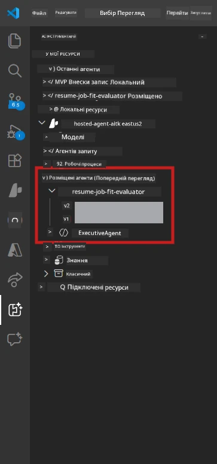

# Модуль 7 - Перевірка в Пісочниці

⏱️ ~10 хв

У цьому модулі ви перевіряєте свій розгорнутий мультиагентський робочий процес у VS Code та Порталі Foundry, підтверджуючи, що агент поводиться так само, як при локальному тестуванні.

---

## Чому перевіряти знову після розгортання?

Хостингова середовище відрізняється від локальної в кількох важливих моментах:

| | Локально | Хостинг |
|--|-------|--------|
| **Ідентичність** | Ваш особистий вхід (`DefaultAzureCredential`) | Присвячена ідентичність Entra для кожного агента (автоматично створюється під час розгортання) |
| **Точка доступу** | `http://localhost:8088/responses` | Керована URL служба агента Foundry |
| **Мережа** | Ваш комп’ютер → Azure OpenAI + MCP | Магістраль Azure (нижча затримка) |

Неправильно налаштована змінна середовища, проблема RBAC або заблокований вихідний виклик MCP будуть помічені тут насамперед.

---

## Варіант A: Перевірка в VS Code Playground (рекомендується спочатку)

### Крок 1: Перейдіть до вашого розгорнутого агента

1. Клікніть на іконку **Foundry Toolkit** на панелі активності.
2. Розгорніть ваш проєкт → **Hosted Agents (Preview)** → знайдіть вашого агента.



### Крок 2: Виберіть версію

1. Натисніть на агента, щоб розгорнути його версії.
2. Клікніть `v1` → переконайтеся, що статус **активний** (бічна панель може показувати "Running" або "Started" — обидва означають готовність).

### Крок 3: Відкрийте Пісочницю

1. Натисніть **Playground** (або правою кнопкою на версію → **Open in Playground**).
2. Відкриється вікно чату у вкладці VS Code.

### Крок 4: Запустіть тестування

Використовуйте ті ж 3 тести з [Модуля 5](05-test-locally.md). Введіть кожне повідомлення в поле введення Пісочниці і натисніть **Send** (або **Enter**).

#### Тест 1 - Повне резюме + JD (стандартний потік)

Вставте запит повного резюме + JD з Модуля 5, Тест 1 (Jane Doe + Senior Cloud Engineer у Contoso Ltd).

**Очікувано:**
- Оцінка відповідності з розбиттям (100-бальна шкала)
- Розділ Відповідних Навичок
- Розділ Відсутніх Навичок
- **Одна картка пропуску на кожну відсутню навичку** з URL Microsoft Learn
- Дорожня карта навчання з часовою лінією

#### Тест 2 - Швидкий короткий тест (мінімальний ввід)

```
RESUME: 3 years Python developer, knows Django and PostgreSQL, no cloud experience.

JOB: Cloud DevOps Engineer requiring AWS, Kubernetes, Terraform, CI/CD. 5 years needed.
```

**Очікувано:**
- Нижча оцінка відповідності (< 40)
- Чесна оцінка зі стадійним планом навчання
- Кілька карт пропусків (AWS, Kubernetes, Terraform, CI/CD, прогалини в досвіді)

#### Тест 3 - Кандидат з високою відповідністю

```
RESUME:
10 years Azure Cloud Architect. AZ-305 certified. Expert in AKS, Terraform, Azure DevOps, 
Azure Functions, Helm, Prometheus, Grafana, Python, Go. Led platform team of 8.

JOB:
Senior Cloud Engineer. Required: AKS, Terraform, Azure DevOps, Python. Preferred: Helm, Go.
5+ years experience. AZ-305 preferred.
```

**Очікувано:**
- Висока оцінка відповідності (≥ 80)
- Акцент на готовності до співбесіди та вдосконаленні
- Мало або немає карт пропусків
- Короткий термін, орієнтований на підготовку

### Крок 5: Порівняйте з локальними результатами

Відкрийте ваші нотатки або вкладку браузера з Модуля 5, де ви зберігали локальні відповіді. Для кожного тесту:

- Чи має відповідь **таку ж структуру** (оцінка відповідності, картки пропусків, дорожня карта)?
- Чи відповідає **та сама оцінювальна схема** (100-бальна шкала)?
- Чи присутні **URL Microsoft Learn** у картках пропусків?
- Чи є **одна картка пропуску на кожну відсутню навичку** (не обрізана)?

> **Незначні відмінності у формулюванні нормальні** — модель недетермінована. Зосередьтесь на структурі, послідовності оцінювання та використанні інструментів MCP.

---

## Варіант B: Перевірка у Порталі Foundry

[Foundry Portal](https://ai.azure.com) надає веб-версію пісочниці, корисну для спільного користування з колегами або зацікавленими сторонами.

### Крок 1: Відкрийте Foundry Portal

1. Відкрийте браузер і перейдіть на [https://ai.azure.com](https://ai.azure.com).
2. Увійдіть під тим самим обліковим записом Azure, який використовували протягом усього майстер-класу.

### Крок 2: Перейдіть до вашого проєкту

1. На головній сторінці шукайте **Recent projects** в лівій бічній панелі.
2. Натисніть назву вашого проєкту (наприклад, `workshop-agents`).
3. Якщо не бачите, натисніть **All projects** і знайдіть його.

### Крок 3: Знайдіть ваш розгорнутий агент

1. У лівій навігації проєкту клікніть **Build** → **Agents** (або шукайте секцію **Agents**).
2. Ви маєте побачити список агентів. Знайдіть ваш розгорнутий агент (наприклад, `resume-job-fit-evaluator`).
3. Клікніть на назві агента, щоб відкрити сторінку деталей.

### Крок 4: Відкрийте Пісочницю

1. На сторінці деталей агента подивіться на верхню панель інструментів.
2. Натисніть **Open in playground** (або **Try in playground**).
3. Відкриється інтерфейс чату.

### Крок 5: Запустіть ті самі тести

Повторіть усі 3 тести з розділу VS Code Playground вище. Порівняйте кожну відповідь з локальними результатами (Модуль 5) та результатами з VS Code Playground (Варіант A вище).

---

## Перевірка, специфічна для мультиагентів

Окрім базової коректності, перевірте ці специфічні для мультиагентів поведінки:

### Виконання інструментів MCP

| Перевірка | Як перевірити | Умова проходження |
|-------|---------------|----------------|
| Виклики MCP успішні | Картки пропусків містять `learn.microsoft.com` URL | Реальні URL, а не повідомлення заміни |
| Багато викликів MCP | Кожен пропуск високого/середнього пріоритету має ресурси | Не лише перша картка пропуску |
| Робота відновлення MCP | Якщо URL відсутні, перевірте текст заміни | Агент все одно генерує картки пропусків (з URL чи без них) |

### Координація агента

| Перевірка | Як перевірити | Умова проходження |
|-------|---------------|----------------|
| Всі 4 агенти запустились | Вивід містить оцінку відповідності І картки пропусків | Оцінка з MatchingAgent, картки з GapAnalyzer |
| Послідовне виконання | Час відповіді розумний (< 2 хв) | Якщо > 3 хв, перевірте помилки в термінальному журналі |
| Цілісність потоків даних | Картки пропусків посилаються на навички з звіту відповідності | Немає вигаданих навичок, відсутніх у JD |

---

## Критерії валідації

Використовуйте цю рубрику для оцінки поведінки мультиагентського робочого процесу в хості:

| № | Критерій | Умова проходження | Пройдено? |
|---|----------|---------------|-------|
| 1 | **Функціональна коректність** | Агент відповідає на резюме + JD з оцінкою відповідності та аналізом пропусків | |
| 2 | **Послідовність оцінювання** | Оцінка відповідності за 100-бальною шкалою з розбивкою | |
| 3 | **Повнота карток пропусків** | Одна картка на кожну відсутню навичку (без обрізок або об’єднань) | |
| 4 | **Інтеграція інструменту MCP** | Картки пропусків містять реальні URL Microsoft Learn | |
| 5 | **Структурна послідовність** | Структура виводу збігається між локальними і хостинговими запусками | |
| 6 | **Час відповіді** | Хостинг-агент відповідає за 2 хвилини для повної оцінки | |
| 7 | **Відсутність помилок** | Немає помилок HTTP 500, таймаутів чи порожніх відповідей | |

> "Проходження" означає, що всі 7 критеріїв виконані для всіх 3 тестів у принаймні одній пісочниці (VS Code або Портал).

---

## Вирішення проблем із пісочницею

| Симптом | Ймовірна причина | Виправлення |
|---------|-------------|-----|
| Пісочниця не завантажується | Контейнер не у стані `active` | Поверніться до [Модуля 6](06-deploy-to-foundry.md), перевірте статус розгортання. Почекайте, якщо `creating` |
| Агент повертає порожню відповідь | Невідповідність у назві розгортання моделі | Перевірте `agent.yaml` → `environment_variables` → `AZURE_AI_MODEL_DEPLOYMENT_NAME`, щоб збігалося з розгорнутою моделлю |
| Агент повертає повідомлення про помилку | Відсутній дозвіл [RBAC](https://learn.microsoft.com/azure/foundry/concepts/rbac-foundry) | Призначте **[Foundry User](https://aka.ms/foundry-ext-project-role)** (раніше Azure AI User) масштабно для проєкту |
| У картках пропусків немає URL Microsoft Learn | Вихідні виклики MCP заблоковані або сервер MCP недоступний | Перевірте, чи контейнер може дістатися до `learn.microsoft.com`. Деталі у [Модулі 8](08-troubleshooting.md) |
| Лише 1 картка пропуску (обрізана) | Указівки GapAnalyzer не містять блоку "CRITICAL" | Перегляньте [Модуль 3, Крок 2.4](03-configure-agents.md) |
| Оцінка відповідності сильно відрізняється від локальної | Розгорнута інша модель або вказівки | Порівняйте змінні `agent.yaml` з локальним `.env`. За потреби розгорніть повторно |
| "Агент не знайдений" у Порталі | Розгортання ще поширюється або не вдалося | Почекайте 2 хвилини, оновіть. Якщо досі відсутній — повторно розгорніть з [Модуля 6](06-deploy-to-foundry.md) |

---

### Контрольна точка

- [ ] Тестування агента у VS Code Playground - усі 3 тести пройдені
- [ ] Тестування агента у Пісочниці [Foundry Portal](https://ai.azure.com) - усі 3 тести пройдені
- [ ] Відповіді структурно узгоджені з локальним тестуванням (оцінка відповідності, картки пропусків, дорожня карта)
- [ ] URL Microsoft Learn присутні у картках пропусків (інструмент MCP працює в хостинг-середовищі)
- [ ] Одна картка пропуску на кожну відсутню навичку (немає обрізок)
- [ ] Під час тестування немає помилок чи таймаутів
- [ ] Заповнена рубрика валідації (всі 7 критеріїв пройдені)

---

**Попередній:** [06 - Розгортання до Foundry](06-deploy-to-foundry.md) · **Наступний:** [08 - Вирішення проблем →](08-troubleshooting.md)

---

<!-- CO-OP TRANSLATOR DISCLAIMER START -->
**Відмова від відповідальності**:
Цей документ було перекладено за допомогою сервісу штучного інтелекту для перекладу [Co-op Translator](https://github.com/Azure/co-op-translator). Хоча ми прагнемо до точності, будь ласка, майте на увазі, що автоматичні переклади можуть містити помилки або неточності. Оригінальний документ рідною мовою слід вважати авторитетним джерелом. Для критично важливої інформації рекомендується професійний людський переклад. Ми не несемо відповідальності за будь-які непорозуміння або неправильні тлумачення, що виникли внаслідок використання цього перекладу.
<!-- CO-OP TRANSLATOR DISCLAIMER END -->