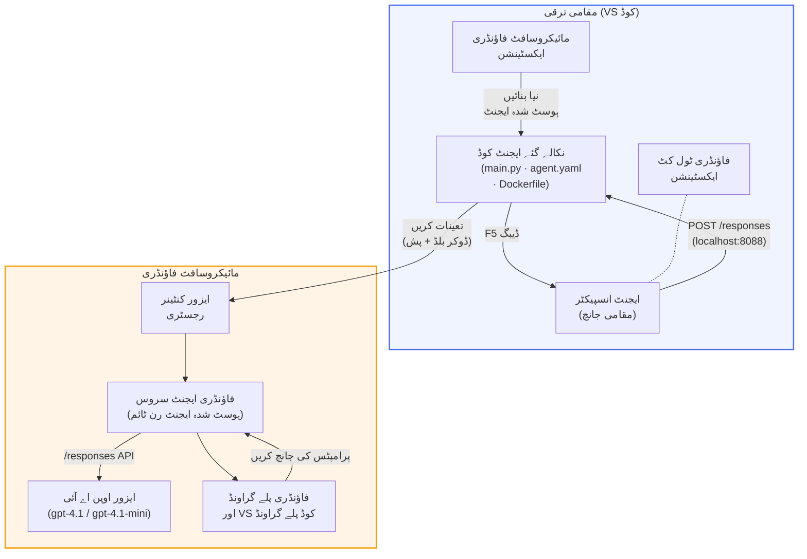

# Foundry Toolkit + Foundry Hosted Agents ورکشاپ

[](https://www.python.org/)
[](https://github.com/microsoft/agents)
[](https://learn.microsoft.com/azure/ai-foundry/agents/concepts/hosted-agents/)
[](https://ai.azure.com/)
[](https://learn.microsoft.com/azure/ai-services/openai/)
[](https://learn.microsoft.com/cli/azure/install-azure-cli)
[](https://learn.microsoft.com/azure/developer/azure-developer-cli/install-azd)
[](https://www.docker.com/)
[](https://marketplace.visualstudio.com/items?itemName=ms-windows-ai-studio.windows-ai-studio)
[](LICENSE)

AI ایجنٹس کو **Microsoft Foundry Agent Service** پر **Hosted Agents** کے طور پر بنائیں، ٹیسٹ کریں، اور ڈیپلائے کریں - مکمل طور پر VS Code سے **Microsoft Foundry extension** اور **Foundry Toolkit** کے ذریعے۔

> **Hosted Agents اس وقت پریویو میں ہیں۔** تعاون یافتہ ریجنز محدود ہیں - ملاحظہ کریں [ریجن دستیابی](https://learn.microsoft.com/azure/foundry/agents/concepts/hosted-agents#region-availability).

> ہر لیب کے اندر `agent/` فولڈر **Foundry extension** کے ذریعہ خودکار طریقے سے اسکافولڈ کیا جاتا ہے - پھر آپ کوڈ کو اپنی مرضی کے مطابق بناتے ہیں، مقامی طور پر ٹیسٹ کرتے ہیں، اور ڈیپلائے کرتے ہیں۔

<!-- CO-OP TRANSLATOR LANGUAGES TABLE START -->
[Arabic](../ar/README.md) | [Bengali](../bn/README.md) | [Bulgarian](../bg/README.md) | [Burmese (Myanmar)](../my/README.md) | [Chinese (Simplified)](../zh-CN/README.md) | [Chinese (Traditional, Hong Kong)](../zh-HK/README.md) | [Chinese (Traditional, Macau)](../zh-MO/README.md) | [Chinese (Traditional, Taiwan)](../zh-TW/README.md) | [Croatian](../hr/README.md) | [Czech](../cs/README.md) | [Danish](../da/README.md) | [Dutch](../nl/README.md) | [Estonian](../et/README.md) | [Finnish](../fi/README.md) | [French](../fr/README.md) | [German](../de/README.md) | [Greek](../el/README.md) | [Hebrew](../he/README.md) | [Hindi](../hi/README.md) | [Hungarian](../hu/README.md) | [Indonesian](../id/README.md) | [Italian](../it/README.md) | [Japanese](../ja/README.md) | [Kannada](../kn/README.md) | [Khmer](../km/README.md) | [Korean](../ko/README.md) | [Lithuanian](../lt/README.md) | [Malay](../ms/README.md) | [Malayalam](../ml/README.md) | [Marathi](../mr/README.md) | [Nepali](../ne/README.md) | [Nigerian Pidgin](../pcm/README.md) | [Norwegian](../no/README.md) | [Persian (Farsi)](../fa/README.md) | [Polish](../pl/README.md) | [Portuguese (Brazil)](../pt-BR/README.md) | [Portuguese (Portugal)](../pt-PT/README.md) | [Punjabi (Gurmukhi)](../pa/README.md) | [Romanian](../ro/README.md) | [Russian](../ru/README.md) | [Serbian (Cyrillic)](../sr/README.md) | [Slovak](../sk/README.md) | [Slovenian](../sl/README.md) | [Spanish](../es/README.md) | [Swahili](../sw/README.md) | [Swedish](../sv/README.md) | [Tagalog (Filipino)](../tl/README.md) | [Tamil](../ta/README.md) | [Telugu](../te/README.md) | [Thai](../th/README.md) | [Turkish](../tr/README.md) | [Ukrainian](../uk/README.md) | [Urdu](./README.md) | [Vietnamese](../vi/README.md)

> **کیا آپ مقامی طور پر کلون کرنا پسند کریں گے؟**
>
> اس ریپوزٹری میں 50+ زبانوں کے ترجمے شامل ہیں جو ڈاؤن لوڈ کے سائز کو نمایاں طور پر بڑھاتے ہیں۔ بغیر ترجموں کے کلون کرنے کے لیے sparse checkout استعمال کریں:
>
> **Bash / macOS / Linux:**
> ```bash
> git clone --filter=blob:none --sparse https://github.com/microsoft-foundry/Foundry_Toolkit_for_VSCode_Lab.git
> cd Foundry_Toolkit_for_VSCode_Lab
> git sparse-checkout set --no-cone '/*' '!translations' '!translated_images'
> ```
>
> **CMD (Windows):**
> ```cmd
> git clone --filter=blob:none --sparse https://github.com/microsoft-foundry/Foundry_Toolkit_for_VSCode_Lab.git
> cd Foundry_Toolkit_for_VSCode_Lab
> git sparse-checkout set --no-cone "/*" "!translations" "!translated_images"
> ```
>
> یہ آپ کو کورس مکمل کرنے کے لیے سب کچھ مہیا کرتا ہے، اور ڈاؤن لوڈ بہت تیز ہو جاتا ہے۔
<!-- CO-OP TRANSLATOR LANGUAGES TABLE END -->

---

## آرکیٹیکچر


**فلو:** Foundry extension ایجنٹ اسکافولڈ کرتا ہے → آپ کوڈ اور ہدایات کسٹمائز کرتے ہیں → Agent Inspector سے مقامی طور پر ٹیسٹ کرتے ہیں → Foundry پر ڈیپلائے کرتے ہیں (ڈوکر امیج ACR پر بھیجی جاتی ہے) → Playground میں تصدیق کرتے ہیں۔

---

## آپ کیا بنائیں گے

| لیب | وضاحت | حیثیت |
|-----|--------|-------|
| **لیب 01 - سنگل ایجنٹ** | **"Explain Like I'm an Executive" ایجنٹ** بنائیں، اسے مقامی طور پر ٹیسٹ کریں، اور Foundry پر ڈیپلائے کریں | ✅ دستیاب |
| **لیب 02 - ملٹی ایجنٹ ورک فلو** | **"Resume → Job Fit Evaluator"** تیار کریں - 4 ایجنٹس مل کر ریزیومے کی فٹنس کو اسکور کرتے ہیں اور سیکھنے کا روڈ میپ بناتے ہیں | ✅ دستیاب |

---

## Executive Agent سے ملاقات کریں

اس ورکشاپ میں آپ **"Explain Like I'm an Executive" ایجنٹ** بنائیں گے - ایک AI ایجنٹ جو پیچیدہ تکنیکی اصطلاحات کو لے کر انہیں پرسکون، بورڈ روم کے قابل سمریوں میں تبدیل کرتا ہے۔ کیونکہ ایمانداری سے، C-suite میں کوئی بھی یہ سننا نہیں چاہتا کہ "thread pool exhaustion کی وجہ سے سِنکرونس کالز جو v3.2 میں متعارف ہوئیں۔"

میں نے یہ ایجنٹ اس وقت بنایا جب میرے مکمل طور پر تیار کردہ پوسٹ-مارٹم پر جواب ملا: *"تو... کیا ویب سائٹ بند ہے یا نہیں؟"*

### یہ کیسے کام کرتا ہے

آپ اسے تکنیکی اپ ڈیٹ دیتے ہیں۔ یہ ایک executive summary واپس دیتا ہے - تین بلٹ پوائنٹس، کوئی جارجن نہیں، کوئی اسٹیک ٹریس نہیں، کوئی خوف نہیں۔ صرف **کیا ہوا،** **کاروباری اثر،** اور **اگلا قدم۔**

### اسے عمل میں دیکھیں

**آپ کہتے ہیں:**
> "API latency میں اضافہ ہوا ہے کیونکہ thread pool exhaustion synchronus کالز کی وجہ سے ہوا جو v3.2 میں متعارف کروائی گئیں۔"

**ایجنٹ جواب دیتا ہے:**

> **Executive Summary:**
> - **کیا ہوا:** تازہ ترین ریلیز کے بعد سسٹم سست ہوگیا۔
> - **کاروباری اثر:** کچھ صارفین کو سروس استعمال کرتے وقت تاخیر کا سامنا ہوا۔
> - **اگلا قدم:** تبدیلی واپس لی گئی ہے اور ایک فکس تیار کیا جا رہا ہے جسے دوبارہ تعینات کیا جائے گا۔

### یہ ایجنٹ کیوں؟

یہ ایک انتہائی سادہ، واحد مقصد والا ایجنٹ ہے - جو hosted agent ورک فلو کو ابتدا سے انتہا تک سیکھنے کے لیے بہترین ہے بغیر پیچیدہ ٹول چینز میں الجھے۔ اور ایمانداری سے؟ ہر انجینئرنگ ٹیم کو ایک ایسا ایجنٹ چاہیے۔

---

## ورکشاپ کا ڈھانچہ

```
📂 Foundry_Toolkit_for_VSCode_Lab/
├── 📄 README.md                      ← You are here
├── 📂 ExecutiveAgent/                ← Standalone hosted agent project
│   ├── agent.yaml
│   ├── Dockerfile
│   ├── main.py
│   └── requirements.txt
└── 📂 workshop/
    ├── 📂 lab01-single-agent/        ← Full lab: docs + agent code
    │   ├── README.md                 ← Hands-on lab instructions
    │   ├── 📂 docs/                  ← Step-by-step tutorial modules
    │   │   ├── 00-prerequisites.md
    │   │   ├── 01-install-foundry-toolkit.md
    │   │   ├── 02-create-foundry-project.md
    │   │   ├── 03-create-hosted-agent.md
    │   │   ├── 04-configure-and-code.md
    │   │   ├── 05-test-locally.md
    │   │   ├── 06-deploy-to-foundry.md
    │   │   ├── 07-verify-in-playground.md
    │   │   └── 08-troubleshooting.md
    │   └── 📂 agent/                 ← Reference solution (auto-scaffolded by Foundry extension)
    │       ├── agent.yaml
    │       ├── Dockerfile
    │       ├── main.py
    │       └── requirements.txt
    └── 📂 lab02-multi-agent/         ← Resume → Job Fit Evaluator
        ├── README.md                 ← Hands-on lab instructions (end-to-end)
        ├── 📂 docs/                  ← Step-by-step tutorial modules
        │   ├── 00-prerequisites.md
        │   ├── 01-understand-multi-agent.md
        │   ├── 02-scaffold-multi-agent.md
        │   ├── 03-configure-agents.md
        │   ├── 04-orchestration-patterns.md
        │   ├── 05-test-locally.md
        │   ├── 06-deploy-to-foundry.md
        │   ├── 07-verify-in-playground.md
        │   └── 08-troubleshooting.md
        └── 📂 PersonalCareerCopilot/ ← Reference solution (multi-agent workflow)
            ├── agent.yaml
            ├── Dockerfile
            ├── main.py
            └── requirements.txt
```

> **نوٹ:** ہر لیب کے اندر `agent/` فولڈر وہی ہے جو **Microsoft Foundry extension** کمانڈ پیلیٹ سے `Microsoft Foundry: Create a New Hosted Agent` چلانے پر بناتا ہے۔ پھر فائلوں کو آپ کے ایجنٹ کی ہدایات، ٹولز، اور کنفیگریشن کے مطابق بدلا جاتا ہے۔ لیب 01 آپ کو صفر سے یہ بنانے کا طریقہ دکھاتی ہے۔

---

## شروع کریں

### 1. ریپوزٹری کلون کریں

```bash
git clone https://github.com/microsoft-foundry/Foundry_Toolkit_for_VSCode_Lab.git
cd Foundry_Toolkit_for_VSCode_Lab
```

### 2. Python virtual environment سیٹ کریں

```bash
python -m venv venv
```

فعال کریں:

- **Windows (PowerShell):**
  ```powershell
  .\venv\Scripts\Activate.ps1
  ```
- **macOS / Linux:**
  ```bash
  source venv/bin/activate
  ```

### 3. Dependencies انسٹال کریں

```bash
pip install -r workshop/lab01-single-agent/agent/requirements.txt
```

### 4. Environment variables کنفیگر کریں

agent فولڈر کے اندر موجود example `.env` فائل کو کاپی کریں اور اپنی معلومات بھریں:

```bash
cp workshop/lab01-single-agent/agent/.env.example workshop/lab01-single-agent/agent/.env
```

`workshop/lab01-single-agent/agent/.env` کو ایڈیٹ کریں:

```env
AZURE_AI_PROJECT_ENDPOINT=https://<your-account>.services.ai.azure.com/api/projects/<your-project>
MODEL_DEPLOYMENT_NAME=<your-model-deployment-name>
```

### 5. ورکشاپ لیبز کی پیروی کریں

ہر لیب اپنے اندر خودمختار modules کے ساتھ ہوتا ہے۔ بنیادی باتیں سیکھنے کے لیے **Lab 01** سے شروع کریں، پھر ملٹی ایجنٹ ورک فلو کے لیے **Lab 02** پر جائیں۔

#### Lab 01 - سنگل ایجنٹ ([مکمل ہدایات](workshop/lab01-single-agent/README.md))

| # | ماڈیول | لنک |
|---|--------|------|
| 1 | پری ریکوائرمنٹس پڑھیں | [00-prerequisites.md](workshop/lab01-single-agent/docs/00-prerequisites.md) |
| 2 | Foundry Toolkit اور Foundry extension انسٹال کریں | [01-install-foundry-toolkit.md](workshop/lab01-single-agent/docs/01-install-foundry-toolkit.md) |
| 3 | Foundry پروجیکٹ بنائیں | [02-create-foundry-project.md](workshop/lab01-single-agent/docs/02-create-foundry-project.md) |
| 4 | ایک hosted agent بنائیں | [03-create-hosted-agent.md](workshop/lab01-single-agent/docs/03-create-hosted-agent.md) |
| 5 | ہدایات اور ماحول کو کنفیگر کریں | [04-configure-and-code.md](workshop/lab01-single-agent/docs/04-configure-and-code.md) |
| 6 | مقامی طور پر ٹیسٹ کریں | [05-test-locally.md](workshop/lab01-single-agent/docs/05-test-locally.md) |
| 7 | Foundry پر ڈیپلائے کریں | [06-deploy-to-foundry.md](workshop/lab01-single-agent/docs/06-deploy-to-foundry.md) |
| 8 | Playground میں تصدیق کریں | [07-verify-in-playground.md](workshop/lab01-single-agent/docs/07-verify-in-playground.md) |
| 9 | مسئلہ حل کرنا | [08-troubleshooting.md](workshop/lab01-single-agent/docs/08-troubleshooting.md) |

#### Lab 02 - ملٹی ایجنٹ ورک فلو ([مکمل ہدایات](workshop/lab02-multi-agent/README.md))

| # | ماڈیول | لنک |
|---|--------|------|
| 1 | پری ریکوائرمنٹس (Lab 02) | [00-prerequisites.md](workshop/lab02-multi-agent/docs/00-prerequisites.md) |
| 2 | ملٹی ایجنٹ آرکیٹیکچر سمجھیں | [01-understand-multi-agent.md](workshop/lab02-multi-agent/docs/01-understand-multi-agent.md) |
| 3 | ملٹی ایجنٹ پروجیکٹ اسکافولڈ کریں | [02-scaffold-multi-agent.md](workshop/lab02-multi-agent/docs/02-scaffold-multi-agent.md) |
| 4 | ایجنٹس اور ماحول کنفیگر کریں | [03-configure-agents.md](workshop/lab02-multi-agent/docs/03-configure-agents.md) |
| 5 | اورکیسٹریشن پیٹرنز | [04-orchestration-patterns.md](workshop/lab02-multi-agent/docs/04-orchestration-patterns.md) |
| 6 | مقامی طور پر ٹیسٹ کریں (ملٹی ایجنٹ) | [05-test-locally.md](workshop/lab02-multi-agent/docs/05-test-locally.md) |
| 7 | فاؤنڈری پر تعینات کریں | [06-deploy-to-foundry.md](workshop/lab02-multi-agent/docs/06-deploy-to-foundry.md) |
| 8 | پلے گراؤنڈ میں تصدیق کریں | [07-verify-in-playground.md](workshop/lab02-multi-agent/docs/07-verify-in-playground.md) |
| 9 | مسائل کا حل (ملٹی ایجنٹ) | [08-troubleshooting.md](workshop/lab02-multi-agent/docs/08-troubleshooting.md) |

---

## دیکھ بھال کرنے والا

<table>
<tr>
    <td align="center"><a href="https://github.com/ShivamGoyal03">
        <br />
        <sub><b>شِوام گویل</b></sub>
    </a><br />
    </td>
</tr>
</table>

---

## درکار اجازتیں (جلد حوالہ)

| منظر نامہ | درکار کردار |
|----------|---------------|
| نیا فاؤنڈری پروجیکٹ بنائیں | فاؤنڈری وسائل پر **Azure AI مالک** |
| موجودہ پروجیکٹ میں تعینات کریں (نئے وسائل) | سبسکرپشن پر **Azure AI مالک** + **کنٹریبیوٹر** |
| مکمل ترتیب شدہ پروجیکٹ میں تعینات کریں | اکاؤنٹ پر **ریڈر** + پروجیکٹ پر **Azure AI صارف** |

> **اہم:** Azure `مالک` اور `کنٹریبیوٹر` کردار صرف *انتظامی* اجازتیں شامل کرتے ہیں، *ترقی* (ڈیٹا ایکشن) کی اجازتیں نہیں۔ آپ کو ایجنٹس بنانے اور تعینات کرنے کے لیے **Azure AI صارف** یا **Azure AI مالک** درکار ہے۔

---

## حوالے

- [فوری آغاز: اپنا پہلا ہوسٹ کیا ہوا ایجنٹ تعینات کریں (VS کوڈ)](https://learn.microsoft.com/azure/foundry/agents/quickstarts/quickstart-hosted-agent)
- [ہوسٹ کیے گئے ایجنٹس کیا ہیں؟](https://learn.microsoft.com/azure/foundry/agents/concepts/hosted-agents)
- [VS کوڈ میں ہوسٹ ایجنٹ کے کام کے بہاؤ بنائیں](https://learn.microsoft.com/azure/foundry/agents/how-to/vs-code-agents-workflow-pro-code)
- [ہوسٹ کیا ہوا ایجنٹ تعینات کریں](https://learn.microsoft.com/azure/foundry/agents/how-to/deploy-hosted-agent)
- [مائیکروسافٹ فاؤنڈری کے لیے RBAC](https://learn.microsoft.com/azure/foundry/concepts/rbac-foundry)
- [آرکیٹیکچر ریویو ایجنٹ نمونہ](https://github.com/Azure-Samples/agent-architecture-review-sample) - MCP ٹولز، Excalidraw خاکے، اور دوہری تعیناتی کے ساتھ حقیقی دنیا کا ہوسٹ کیا ہوا ایجنٹ

---

## لائسنس

[MIT](../../LICENSE)

---

<!-- CO-OP TRANSLATOR DISCLAIMER START -->
**دستخطی اعلان**:  
یہ دستاویز AI ترجمہ سروس [Co-op Translator](https://github.com/Azure/co-op-translator) کے ذریعے ترجمہ کی گئی ہے۔ اگرچہ ہم درستگی کی کوشش کرتے ہیں، براہ کرم نوٹ کریں کہ خودکار تراجم میں غلطیاں یا غیر یقینی معلومات ہو سکتی ہیں۔ اصل دستاویز اپنی مادری زبان میں ہی معتبر ماخذ سمجھی جائے۔ اہم معلومات کے لیے، پیشہ ورانہ انسانی ترجمہ تجویز کیا جاتا ہے۔ اس ترجمے کے استعمال سے پیدا ہونے والی کسی بھی غلط فہمی یا غلط تشریح کی ذمہ داری ہم قبول نہیں کرتے۔
<!-- CO-OP TRANSLATOR DISCLAIMER END -->