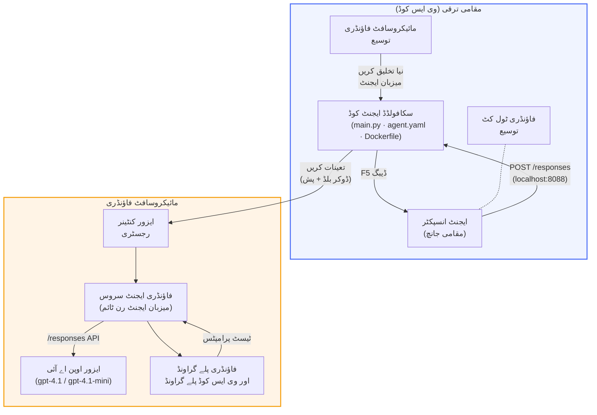

# فاؤنڈری ٹول کٹ + فاؤنڈری ہوسٹڈ ایجنٹس ورکشاپ

[](https://www.python.org/)
[](https://github.com/microsoft/agents)
[](https://learn.microsoft.com/azure/ai-foundry/agents/concepts/hosted-agents/)
[](https://ai.azure.com/)
[](https://learn.microsoft.com/azure/ai-services/openai/)
[](https://learn.microsoft.com/cli/azure/install-azure-cli)
[](https://learn.microsoft.com/azure/developer/azure-developer-cli/install-azd)
[](https://www.docker.com/)
[](https://marketplace.visualstudio.com/items?itemName=ms-windows-ai-studio.windows-ai-studio)
[](LICENSE)

ایجنٹس کو **Microsoft Foundry Agent Service** پر بطور **Hosted Agents** تیار کریں، ٹیسٹ کریں، اور تعینات کریں - مکمل طور پر VS Code سے **Microsoft Foundry توسیع** اور **Foundry Toolkit** کا استعمال کرتے ہوئے۔

> **Hosted Agents فی الحال پری ویو میں ہیں۔** حمایتی ریجن محدود ہیں - دیکھیں [ریجن دستیابی](https://learn.microsoft.com/azure/foundry/agents/concepts/hosted-agents#region-availability)۔

> `agent/` فولڈر ہر لیب کے اندر **Foundry توسیع** کی طرف سے **خودکار طور پر تعین کیا جاتا ہے** - آپ پھر کوڈ کو حسب ضرورت بناتے ہیں، لوکل ٹیسٹ کرتے ہیں، اور تعینات کرتے ہیں۔

### 🌐 متعدد زبانوں کی حمایت

#### GitHub Action کے ذریعے حمایت یافتہ (خودکار اور ہمیشہ تازہ ترین)

<!-- CO-OP TRANSLATOR LANGUAGES TABLE START -->
[Arabic](../ar/README.md) | [Bengali](../bn/README.md) | [Bulgarian](../bg/README.md) | [Burmese (Myanmar)](../my/README.md) | [Chinese (Simplified)](../zh-CN/README.md) | [Chinese (Traditional, Hong Kong)](../zh-HK/README.md) | [Chinese (Traditional, Macau)](../zh-MO/README.md) | [Chinese (Traditional, Taiwan)](../zh-TW/README.md) | [Croatian](../hr/README.md) | [Czech](../cs/README.md) | [Danish](../da/README.md) | [Dutch](../nl/README.md) | [Estonian](../et/README.md) | [Finnish](../fi/README.md) | [French](../fr/README.md) | [German](../de/README.md) | [Greek](../el/README.md) | [Hebrew](../he/README.md) | [Hindi](../hi/README.md) | [Hungarian](../hu/README.md) | [Indonesian](../id/README.md) | [Italian](../it/README.md) | [Japanese](../ja/README.md) | [Kannada](../kn/README.md) | [Khmer](../km/README.md) | [Korean](../ko/README.md) | [Lithuanian](../lt/README.md) | [Malay](../ms/README.md) | [Malayalam](../ml/README.md) | [Marathi](../mr/README.md) | [Nepali](../ne/README.md) | [Nigerian Pidgin](../pcm/README.md) | [Norwegian](../no/README.md) | [Persian (Farsi)](../fa/README.md) | [Polish](../pl/README.md) | [Portuguese (Brazil)](../pt-BR/README.md) | [Portuguese (Portugal)](../pt-PT/README.md) | [Punjabi (Gurmukhi)](../pa/README.md) | [Romanian](../ro/README.md) | [Russian](../ru/README.md) | [Serbian (Cyrillic)](../sr/README.md) | [Slovak](../sk/README.md) | [Slovenian](../sl/README.md) | [Spanish](../es/README.md) | [Swahili](../sw/README.md) | [Swedish](../sv/README.md) | [Tagalog (Filipino)](../tl/README.md) | [Tamil](../ta/README.md) | [Telugu](../te/README.md) | [Thai](../th/README.md) | [Turkish](../tr/README.md) | [Ukrainian](../uk/README.md) | [Urdu](./README.md) | [Vietnamese](../vi/README.md)

> **کیا آپ مقامی طور پر کلون کرنا پسند کریں گے؟**
>
> یہ مخزن 50+ زبانوں کے تراجم شامل کرتا ہے جو ڈاؤن لوڈ سائز کو نمایاں طور پر بڑھاتا ہے۔ بغیر تراجم کے کلون کرنے کے لیے sparse checkout استعمال کریں:
>
> **Bash / macOS / Linux:**
> ```bash
> git clone --filter=blob:none --sparse https://github.com/microsoft-foundry/Foundry_Toolkit_for_VSCode_Lab.git
> cd Foundry_Toolkit_for_VSCode_Lab
> git sparse-checkout set --no-cone '/*' '!translations' '!translated_images'
> ```
>
> **CMD (Windows):**
> ```cmd
> git clone --filter=blob:none --sparse https://github.com/microsoft-foundry/Foundry_Toolkit_for_VSCode_Lab.git
> cd Foundry_Toolkit_for_VSCode_Lab
> git sparse-checkout set --no-cone "/*" "!translations" "!translated_images"
> ```
>
> اس سے آپ کو کورس مکمل کرنے کے لیے ہر چیز تیز ترین ڈاؤن لوڈ کے ساتھ مل جاتی ہے۔
<!-- CO-OP TRANSLATOR LANGUAGES TABLE END -->

---

## فن تعمیر


**فلو:** Foundry توسیع ایجنٹ تیار کرتا ہے → آپ کوڈ اور ہدایات حسب خواہش بناتے ہیں → Agent Inspector کے ساتھ لوکل ٹیسٹ کرتے ہیں → Foundry پر تعینات کرتے ہیں (Docker امیج ACR میں دھکیلا جاتا ہے) → Playground میں تصدیق کرتے ہیں۔

---

## آپ کیا بنائیں گے

| لیب | وضاحت | حیثیت |
|-----|-------------|--------|
| **لیب 01 - سنگل ایجنٹ** | **"میری طرح ایک ایگزیکٹو کی وضاحت کریں" ایجنٹ** تیار کریں، لوکل ٹیسٹ کریں، اور فاؤنڈری پر تعینات کریں | ✅ دستیاب |
| **لیب 02 - ملٹی ایجنٹ ورک فلو** | **"ریزومے → ملازمت کے لیے فٹنس کا جائزہ لینے والا"** تیار کریں - 4 ایجنٹس مل کر ریزیومے فٹ کو اسکور کرتے ہیں اور سیکھنے کا روڈ میپ تیار کرتے ہیں | ✅ دستیاب |

---

## ایگزیکٹو ایجنٹ سے ملیں

اس ورکشاپ میں آپ **"میری طرح ایک ایگزیکٹو کی وضاحت کریں" ایجنٹ** بنائیں گے - ایک AI ایجنٹ جو مشکل تکنیکی اصطلاحات لے کر انہیں پر سکون، بورڈ روم کے لیے تیار خلاصوں میں ترجمہ کرتا ہے۔ کیونکہ دیانتداری سے کہیں تو، C-suite میں کوئی بھی "v3.2 میں متعارف کرائے گئے ہم وقت ساز کالز کی وجہ سے تھریڈ پول کا ختم ہونا" سننا نہیں چاہتا۔

میں نے یہ ایجنٹ اس کے بعد بنایا جب میرے بے عیب پوسٹ مارٹم کو یہ جواب ملا: *"تو... کیا ویب سائٹ بند ہے یا نہیں؟"*

### یہ کیسے کام کرتا ہے

آپ اسے تکنیکی اپ ڈیٹ دیتے ہیں۔ یہ ایک ایگزیکٹو خلاصہ دیتا ہے - تین نقطے، کوئی اصطلاحات نہیں، کوئی اسٹیک ٹریس نہیں، کوئی اضطرابی کیفیت نہیں۔ صرف **کیا ہوا،** **کاروباری اثر،** اور **اگلا قدم**۔

### اسے عمل میں دیکھیں

**آپ کہتے ہیں:**
> "API کی تاخیر میں اضافہ ہوا کیونکہ v3.2 میں متعارف کرائی گئی ہم وقت ساز کالز کی وجہ سے تھریڈ پول ختم ہوگیا۔"

**ایجنٹ جواب دیتا ہے:**

> **ایگزیکٹو خلاصہ:**
> - **کیا ہوا:** تازہ ترین ریلیز کے بعد، سسٹم سست ہو گیا۔
> - **کاروباری اثر:** کچھ صارفین کو سروس استعمال کرتے ہوئے تاخیر کا سامنا کرنا پڑا۔
> - **اگلا قدم:** تبدیلی واپس لی گئی ہے اور دوبارہ تعیناتی سے پہلے اس کی اصلاح کی جا رہی ہے۔

### یہ ایجنٹ کیوں؟

یہ ایک سادہ اور مخصوص مقصد کا حامل ایجنٹ ہے - میزبان ایجنٹ کے ورک فلو کو ابتدا سے انتہا تک سیکھنے کے لیے بہترین، بغیر پیچیدہ ٹول چینز میں الجھنے کے۔ اور ایمانداری سے؟ ہر انجینئرنگ ٹیم کو ایسا ایک ایجنٹ چاہیے۔

---

## ورکشاپ کا ڈھانچہ

```
📂 Foundry_Toolkit_for_VSCode_Lab/
├── 📄 README.md                      ← You are here
├── 📂 ExecutiveAgent/                ← Standalone hosted agent project
│   ├── agent.yaml
│   ├── Dockerfile
│   ├── main.py
│   └── requirements.txt
└── 📂 workshop/
    ├── 📂 lab01-single-agent/        ← Full lab: docs + agent code
    │   ├── README.md                 ← Hands-on lab instructions
    │   ├── 📂 docs/                  ← Step-by-step tutorial modules
    │   │   ├── 00-prerequisites.md
    │   │   ├── 01-install-foundry-toolkit.md
    │   │   ├── 02-create-foundry-project.md
    │   │   ├── 03-create-hosted-agent.md
    │   │   ├── 04-configure-and-code.md
    │   │   ├── 05-test-locally.md
    │   │   ├── 06-deploy-to-foundry.md
    │   │   ├── 07-verify-in-playground.md
    │   │   └── 08-troubleshooting.md
    │   └── 📂 agent/                 ← Reference solution (auto-scaffolded by Foundry extension)
    │       ├── agent.yaml
    │       ├── Dockerfile
    │       ├── main.py
    │       └── requirements.txt
    └── 📂 lab02-multi-agent/         ← Resume → Job Fit Evaluator
        ├── README.md                 ← Hands-on lab instructions (end-to-end)
        ├── 📂 docs/                  ← Step-by-step tutorial modules
        │   ├── 00-prerequisites.md
        │   ├── 01-understand-multi-agent.md
        │   ├── 02-scaffold-multi-agent.md
        │   ├── 03-configure-agents.md
        │   ├── 04-orchestration-patterns.md
        │   ├── 05-test-locally.md
        │   ├── 06-deploy-to-foundry.md
        │   ├── 07-verify-in-playground.md
        │   └── 08-troubleshooting.md
        └── 📂 PersonalCareerCopilot/ ← Reference solution (multi-agent workflow)
            ├── agent.yaml
            ├── Dockerfile
            ├── main.py
            └── requirements.txt
```

> **نوٹ:** `agent/` فولڈر ہر لیب کے اندر وہ ہے جو **Microsoft Foundry extension** تخلیق کرتا ہے جب آپ Command Palette سے `Microsoft Foundry: Create a New Hosted Agent` چلاتے ہیں۔ پھر فائلیں آپ کے ایجنٹ کی ہدایات، ٹولز، اور کنفیگریشن کے ساتھ حسب ضرورت بنائی جاتی ہیں۔ لیب 01 آپ کو ابتدائی سے یہ دوبارہ تخلیق کرنا سکھاتی ہے۔

---

## شروع کرنے کا طریقہ

### 1. رپوزیٹری کلون کریں

```bash
git clone https://github.com/microsoft-foundry/Foundry_Toolkit_for_VSCode_Lab.git
cd Foundry_Toolkit_for_VSCode_Lab
```

### 2. پائتھن کا ورچوئل ماحول ترتیب دیں

```bash
python -m venv venv
```

ایکٹو کریں:

- **Windows (PowerShell):**
  ```powershell
  .\venv\Scripts\Activate.ps1
  ```

- **macOS / Linux:**
  ```bash
  source venv/bin/activate
  ```

### 3. انحصار انسٹال کریں

```bash
pip install -r workshop/lab01-single-agent/agent/requirements.txt
```

### 4. ماحولیاتی متغیرات ترتیب دیں

ایجنٹ فولڈر کے اندر موجود مثال `.env` فائل کو کاپی کریں اور اپنی قدریں درج کریں:

```bash
cp workshop/lab01-single-agent/agent/.env.example workshop/lab01-single-agent/agent/.env
```

`workshop/lab01-single-agent/agent/.env` کو ایڈٹ کریں:

```env
AZURE_AI_PROJECT_ENDPOINT=https://<your-account>.services.ai.azure.com/api/projects/<your-project>
MODEL_DEPLOYMENT_NAME=<your-model-deployment-name>
```

### 5. ورکشاپ لیبز پر عمل کریں

ہر لیب اپنے ماڈیولز کے ساتھ خود مختار ہے۔ بنیادی باتیں سیکھنے کے لیے **لیب 01** سے شروع کریں، پھر ملٹی ایجنٹ ورک فلو کے لیے **لیب 02** پر جائیں۔

#### لیب 01 - سنگل ایجنٹ ([مکمل ہدایات](workshop/lab01-single-agent/README.md))

| # | ماڈیول | لنک |
|---|--------|------|
| 1 | ضروریات پڑھیں | [00-prerequisites.md](workshop/lab01-single-agent/docs/00-prerequisites.md) |
| 2 | Foundry Toolkit اور Foundry توسیع انسٹال کریں | [01-install-foundry-toolkit.md](workshop/lab01-single-agent/docs/01-install-foundry-toolkit.md) |
| 3 | ایک Foundry پروجیکٹ بنائیں | [02-create-foundry-project.md](workshop/lab01-single-agent/docs/02-create-foundry-project.md) |
| 4 | ایک ہوسٹڈ ایجنٹ بنائیں | [03-create-hosted-agent.md](workshop/lab01-single-agent/docs/03-create-hosted-agent.md) |
| 5 | ہدایات اور ماحول ترتیب دیں | [04-configure-and-code.md](workshop/lab01-single-agent/docs/04-configure-and-code.md) |
| 6 | لوکل ٹیسٹ کریں | [05-test-locally.md](workshop/lab01-single-agent/docs/05-test-locally.md) |
| 7 | Foundry پر تعینات کریں | [06-deploy-to-foundry.md](workshop/lab01-single-agent/docs/06-deploy-to-foundry.md) |
| 8 | پلے گراؤنڈ میں تصدیق کریں | [07-verify-in-playground.md](workshop/lab01-single-agent/docs/07-verify-in-playground.md) |
| 9 | مسئلہ حل کریں | [08-troubleshooting.md](workshop/lab01-single-agent/docs/08-troubleshooting.md) |

#### لیب 02 - ملٹی ایجنٹ ورک فلو ([مکمل ہدایات](workshop/lab02-multi-agent/README.md))

| # | ماڈیول | لنک |
|---|--------|------|
| 1 | ضروریات (لیب 02) | [00-prerequisites.md](workshop/lab02-multi-agent/docs/00-prerequisites.md) |
| 2 | ملٹی ایجنٹ فن تعمیر کو سمجھیں | [01-understand-multi-agent.md](workshop/lab02-multi-agent/docs/01-understand-multi-agent.md) |
| 3 | ملٹی ایجنٹ پروجیکٹ تیار کریں | [02-scaffold-multi-agent.md](workshop/lab02-multi-agent/docs/02-scaffold-multi-agent.md) |
| 4 | ایجنٹس اور ماحول ترتیب دیں | [03-configure-agents.md](workshop/lab02-multi-agent/docs/03-configure-agents.md) |
| 5 | آرکسٹراشن پیٹرنز | [04-orchestration-patterns.md](workshop/lab02-multi-agent/docs/04-orchestration-patterns.md) |
| 6 | لوکل ٹیسٹ کریں (ملٹی ایجنٹ) | [05-test-locally.md](workshop/lab02-multi-agent/docs/05-test-locally.md) |
| 7 | Foundry پر تعینات کریں | [06-deploy-to-foundry.md](workshop/lab02-multi-agent/docs/06-deploy-to-foundry.md) |
| 8 | Playground میں تصدیق کریں | [07-verify-in-playground.md](workshop/lab02-multi-agent/docs/07-verify-in-playground.md) |
| 9 | مسئلہ حل کرنا (کثیر ایجنٹ) | [08-troubleshooting.md](workshop/lab02-multi-agent/docs/08-troubleshooting.md) |

---

## مینٹینر

<table>
<tr>
    <td align="center"><a href="https://github.com/ShivamGoyal03">
        <br />
        <sub><b>شوام گوئل</b></sub>
    </a><br />
    </td>
</tr>
</table>

---

## درکار اجازتیں (جلدی حوالہ)

| منظر نامہ | درکار کردار |
|----------|---------------|
| نیا Foundry پروجیکٹ بنائیں | Foundry وسیلہ پر **Azure AI مالک** |
| موجودہ پروجیکٹ پر تعینات کریں (نئے وسائل) | سبسکرپشن پر **Azure AI مالک** + **کنٹری بیوٹر** |
| مکمل ترتیب دیا ہوا پروجیکٹ تعینات کریں | اکاؤنٹ پر **ریڈر** + پروجیکٹ پر **Azure AI صارف** |

> **اہم:** Azure کے `مالک` اور `کنٹری بیوٹر` رولز میں صرف *انتظامی* اجازتیں شامل ہیں، *ترقیاتی* (ڈیٹا ایکشن) اجازتیں نہیں۔ آپ کو ایجنٹس بنانے اور تعینات کرنے کے لیے **Azure AI صارف** یا **Azure AI مالک** ہونا ضروری ہے۔

---

## حوالہ جات

- [فوری آغاز: اپنا پہلا ہوسٹ کیا ہوا ایجنٹ تعینات کریں (VS کوڈ)](https://learn.microsoft.com/azure/foundry/agents/quickstarts/quickstart-hosted-agent)
- [میزبان ایجنٹس کیا ہیں؟](https://learn.microsoft.com/azure/foundry/agents/concepts/hosted-agents)
- [VS کوڈ میں ہوسٹ کیا ہوا ایجنٹ ورک فلو بنائیں](https://learn.microsoft.com/azure/foundry/agents/how-to/vs-code-agents-workflow-pro-code)
- [ہوسٹ کیا ہوا ایجنٹ تعینات کریں](https://learn.microsoft.com/azure/foundry/agents/how-to/deploy-hosted-agent)
- [Microsoft Foundry کے لیے RBAC](https://learn.microsoft.com/azure/foundry/concepts/rbac-foundry)
- [آرکیٹیکچر ریویو ایجنٹ نمونہ](https://github.com/Azure-Samples/agent-architecture-review-sample) - MCP ٹولز، Excalidraw خاکے، اور دوہری تعیناتی کے ساتھ حقیقی دنیا کا ہوسٹ کیا ہوا ایجنٹ

---

## لائسنس

[MIT](../../LICENSE)

---

<!-- CO-OP TRANSLATOR DISCLAIMER START -->
**ڈس کلیمر**:  
یہ دستاویز AI ترجمہ سروس [Co-op Translator](https://github.com/Azure/co-op-translator) استعمال کرتے ہوئے ترجمہ کی گئی ہے۔ اگرچہ ہم درستگی کے لیے کوشاں ہیں، براہ کرم آگاہ رہیں کہ خودکار تراجم میں غلطیاں یا ناقصیاں ہو سکتی ہیں۔ اصل دستاویز اپنی مادری زبان میں مستند ماخذ سمجھی جانی چاہیے۔ اہم معلومات کے لیے، پیشہ ورانہ انسانی ترجمہ تجویز کیا جاتا ہے۔ ہم اس ترجمے کے استعمال سے پیدا ہونے والی کسی بھی غلط فہمی یا غلط تشریح کے لیے ذمہ دار نہیں ہیں۔
<!-- CO-OP TRANSLATOR DISCLAIMER END -->