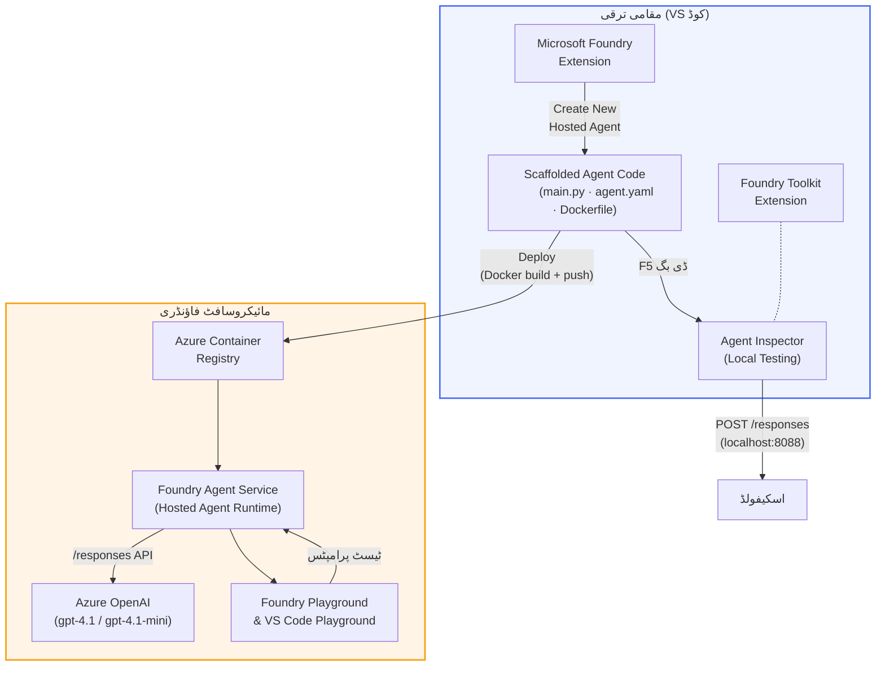

# فاؤنڈری ٹول کٹ + فاؤنڈری ہوسٹڈ ایجنٹس ورکشاپ

[](https://www.python.org/)
[](https://github.com/microsoft/agents)
[](https://learn.microsoft.com/azure/foundry/agents/concepts/hosted-agents)
[](https://ai.azure.com/)
[](https://learn.microsoft.com/azure/ai-services/openai/)
[](https://learn.microsoft.com/cli/azure/install-azure-cli)
[](https://learn.microsoft.com/azure/developer/azure-developer-cli/install-azd)
[](https://www.docker.com/)
[](https://marketplace.visualstudio.com/items?itemName=ms-windows-ai-studio.windows-ai-studio)
[](LICENSE)

اے آئی ایجنٹس کو **Microsoft Foundry Agent Service** میں **Hosted Agents** کے طور پر بنائیں، ٹیسٹ کریں، اور تعینات کریں - مکمل طور پر VS Code استعمال کرتے ہوئے **Microsoft Foundry extension** اور **Foundry Toolkit** کے ذریعے۔

> **Hosted Agents اس وقت پیش نظارہ میں ہیں۔** سپورٹ شدہ خطے محدود ہیں - دیکھیں [region availability](https://learn.microsoft.com/azure/foundry/agents/concepts/hosted-agents#region-availability).

> ہر لیب کے اندر `agent/` فولڈر **Foundry extension** کی طرف سے خودکار طور پر بنایا جاتا ہے - آپ پھر کوڈ کو حسب ضرورت بناتے ہیں، مقامی طور پر ٹیسٹ کرتے ہیں، اور تعینات کرتے ہیں۔

### 🌐 کثیر لسانی حمایت

#### GitHub ایکشن کے ذریعے سپورٹ (خودکار اور ہمیشہ تازہ ترین)

<!-- CO-OP TRANSLATOR LANGUAGES TABLE START -->
[Arabic](../ar/README.md) | [Bengali](../bn/README.md) | [Bulgarian](../bg/README.md) | [Burmese (Myanmar)](../my/README.md) | [Chinese (Simplified)](../zh-CN/README.md) | [Chinese (Traditional, Hong Kong)](../zh-HK/README.md) | [Chinese (Traditional, Macau)](../zh-MO/README.md) | [Chinese (Traditional, Taiwan)](../zh-TW/README.md) | [Croatian](../hr/README.md) | [Czech](../cs/README.md) | [Danish](../da/README.md) | [Dutch](../nl/README.md) | [Estonian](../et/README.md) | [Finnish](../fi/README.md) | [French](../fr/README.md) | [German](../de/README.md) | [Greek](../el/README.md) | [Hebrew](../he/README.md) | [Hindi](../hi/README.md) | [Hungarian](../hu/README.md) | [Indonesian](../id/README.md) | [Italian](../it/README.md) | [Japanese](../ja/README.md) | [Kannada](../kn/README.md) | [Khmer](../km/README.md) | [Korean](../ko/README.md) | [Lithuanian](../lt/README.md) | [Malay](../ms/README.md) | [Malayalam](../ml/README.md) | [Marathi](../mr/README.md) | [Nepali](../ne/README.md) | [Nigerian Pidgin](../pcm/README.md) | [Norwegian](../no/README.md) | [Persian (Farsi)](../fa/README.md) | [Polish](../pl/README.md) | [Portuguese (Brazil)](../pt-BR/README.md) | [Portuguese (Portugal)](../pt-PT/README.md) | [Punjabi (Gurmukhi)](../pa/README.md) | [Romanian](../ro/README.md) | [Russian](../ru/README.md) | [Serbian (Cyrillic)](../sr/README.md) | [Slovak](../sk/README.md) | [Slovenian](../sl/README.md) | [Spanish](../es/README.md) | [Swahili](../sw/README.md) | [Swedish](../sv/README.md) | [Tagalog (Filipino)](../tl/README.md) | [Tamil](../ta/README.md) | [Telugu](../te/README.md) | [Thai](../th/README.md) | [Turkish](../tr/README.md) | [Ukrainian](../uk/README.md) | [Urdu](./README.md) | [Vietnamese](../vi/README.md)

> **مقامی طور پر کلون کرنا پسند کریں؟**
>
> اس ذخیرہ میں 50+ زبانوں کے تراجم شامل ہیں جو ڈاؤن لوڈ سائز کو نمایاں طور پر بڑھاتے ہیں۔ بغیر تراجم کے کلون کرنے کے لیے sparse checkout استعمال کریں:
>
> **Bash / macOS / Linux:**
> ```bash
> git clone --filter=blob:none --sparse https://github.com/microsoft-foundry/Foundry_Toolkit_for_VSCode_Lab.git
> cd Foundry_Toolkit_for_VSCode_Lab
> git sparse-checkout set --no-cone '/*' '!translations' '!translated_images'
> ```
>
> **CMD (ونڈوز):**
> ```cmd
> git clone --filter=blob:none --sparse https://github.com/microsoft-foundry/Foundry_Toolkit_for_VSCode_Lab.git
> cd Foundry_Toolkit_for_VSCode_Lab
> git sparse-checkout set --no-cone "/*" "!translations" "!translated_images"
> ```
>
> یہ آپ کو کورس مکمل کرنے کے لیے تمام ضروری چیزیں فراہم کرتا ہے جس سے ڈاؤن لوڈ بہت تیز ہو جاتی ہے۔
<!-- CO-OP TRANSLATOR LANGUAGES TABLE END -->

---

## فن تعمیر


```mermaid
flowchart TB
    subgraph Local["مقامی ترقی (VS کوڈ)"]
        direction TB
        FE["Microsoft Foundry
        Extension"]
        FoundryToolkit["Foundry Toolkit
        Extension"]
        Scaffold["Scaffolded Agent Code
        (main.py · agent.yaml · Dockerfile)"]
        Inspector["Agent Inspector
        (Local Testing)"]
        FE -- "Create New
        Hosted Agent" --> Scaffold
        Scaffold -- "F5 ڈی بگ" --> Inspector
        FoundryToolkit -.- Inspector
    end

    subgraph Cloud["مائیکروسافٹ فاؤنڈری"]
        direction TB
        ACR["Azure Container
        Registry"]
        AgentService["Foundry Agent Service
        (Hosted Agent Runtime)"]
        Model["Azure OpenAI
        (gpt-4.1 / gpt-4.1-mini)"]
        Playground["Foundry Playground
        & VS Code Playground"]
        ACR --> AgentService
        AgentService -- "/responses API" --> Model
        AgentService --> Playground
    end

    Scaffold -- "Deploy
    (Docker build + push)" --> ACR
    Inspector -- "POST /responses
    (localhost:8088)" --> اسکیفولڈ
    Playground -- "ٹیسٹ پرامپٹس" --> AgentService

    style Local fill:#f0f4ff,stroke:#4a6cf7,stroke-width:2px
    style Cloud fill:#fff4e6,stroke:#f59e0b,stroke-width:2px
```

**فلو:** فاؤنڈری ایکسٹینشن ایجنٹ کو اسکافولڈ کرتا ہے → آپ کوڈ اور ہدایات حسب ضرورت بناتے ہیں → ایجنٹ انسپیکٹر کے ساتھ مقامی طور پر ٹیسٹ کرتے ہیں → فاؤنڈری پر تعینات کرتے ہیں (ڈوکر امیج ACR کو بھیجا جاتا ہے) → پلیگاؤنڈ میں تصدیق کرتے ہیں۔

---

## آپ کیا بنائیں گے

| لیب | تفصیل | حالت |
|-----|---------|---------|
| **لیب 01 - سنگل ایجنٹ** | **"Explain Like I'm an Executive" ایجنٹ** بنائیں، مقامی طور پر ٹیسٹ کریں، اور فاؤنڈری پر تعینات کریں | ✅ دستیاب |
| **لیب 02 - ملٹی ایجنٹ ورک فلو** | **"Resume → Job Fit Evaluator"** بنائیں - 4 ایجنٹس مل کر ریزیومے کی موزونیت جانچتے ہیں اور لرننگ روڈ میپ تیار کرتے ہیں | ✅ دستیاب |

---

## ایگزیکٹو ایجنٹ سے ملاقات

اس ورکشاپ میں آپ **"Explain Like I'm an Executive" ایجنٹ** بنائیں گے - ایک AI ایجنٹ جو مشکل تکنیکی زبان کو لے کر اسے پرسکون، بورڈ روم کے لیے تیار خلاصوں میں تبدیل کرتا ہے۔ کیونکہ دیانتداری سے کہیں تو، سی-سوئٹ میں سے کوئی بھی "v3.2 میں متعارف کرائے گئے ہم آہنگ کالز کی وجہ سے تھریڈ پول کی کمی" کے بارے میں سننا نہیں چاہتا۔

میں نے یہ ایجنٹ اس وقت بنایا جب کئی بار میرے مکمل تحریر کردہ پوسٹ مارٹم کا جواب ملا: *"تو... ویب سائٹ ڈاؤن ہے یا نہیں؟"*

### یہ کیسے کام کرتا ہے

آپ اسے تکنیکی اپڈیٹ دیتے ہیں۔ یہ ایک ایگزیکٹو سمری واپس دیتا ہے - تین بلٹ پوائنٹس، کوئی فنی اصطلاحات نہیں، کوئی اسٹیک ٹریس نہیں، کوئی پریشانی نہیں۔ صرف **کیا ہوا،** **کاروباری اثر،** اور **اگلا قدم**۔

### اسے عمل میں دیکھیں

**آپ کہتے ہیں:**
> "API کی تاخیر میں اضافہ ہوا کیونکہ v3.2 میں متعارف کردہ ہم آہنگ کالز کی وجہ سے تھریڈ پول ختم ہوگیا۔"

**ایجنٹ جواب دیتا ہے:**

> **ایگزیکٹو خلاصہ:**
> - **کیا ہوا:** تازہ ترین ریلیز کے بعد، سسٹم سست ہو گیا۔
> - **کاروباری اثر:** کچھ صارفین نے سروس استعمال کرنے میں تاخیر دیکھی۔
> - **اگلا قدم:** تبدیلی واپس لے لی گئی ہے اور دوبارہ تعیناتی سے پہلے اصلاح تیار کی جا رہی ہے۔

### یہ ایجنٹ کیوں؟

یہ ایک سادہ، واحد مقصد والا ایجنٹ ہے - ہوسٹڈ ایجنٹ ورک فلو کو ابتدا سے آخر تک سیکھنے کے لیے بہترین جو پیچیدہ ٹول چینز میں الجھائے بغیر ہو۔ اور ایمانداری سے؟ ہر انجینئرنگ ٹیم کو اس قسم کا ایک چاہیے۔

---

## ورکشاپ کا ڈھانچہ

```
📂 Foundry_Toolkit_for_VSCode_Lab/
├── 📄 README.md                      ← You are here
└── 📂 workshop/
    ├── 📂 lab01-single-agent/        ← Full lab: docs + agent code
    │   ├── README.md                 ← Hands-on lab instructions
    │   ├── 📂 docs/                  ← Step-by-step tutorial modules
    │   │   ├── 00-prerequisites.md
    │   │   ├── 01-setup.md
    │   │   ├── 02-create-hosted-agent.md
    │   │   ├── 03-configure-and-code.md
    │   │   ├── 04-test-locally.md
    │   │   ├── 05-deploy-to-foundry.md
    │   │   ├── 06-verify-in-playground.md
    │   │   ├── 07-summary.md
    │   │   └── 08-troubleshooting.md
    │   └── 📂 agent/                 ← Reference solution (auto-scaffolded by Foundry extension)
    │       ├── agent.yaml
    │       ├── Dockerfile
    │       ├── main.py
    │       └── requirements.txt
    └── 📂 lab02-multi-agent/         ← Resume → Job Fit Evaluator
        ├── README.md                 ← Hands-on lab instructions (end-to-end)
        ├── 📂 docs/                  ← Step-by-step tutorial modules
        │   ├── 00-prerequisites.md
        │   ├── 01-understand-multi-agent.md
        │   ├── 02-scaffold-multi-agent.md
        │   ├── 03-configure-agents.md
        │   ├── 04-orchestration-patterns.md
        │   ├── 05-test-locally.md
        │   ├── 06-deploy-to-foundry.md
        │   ├── 07-verify-in-playground.md
        │   └── 08-troubleshooting.md
        └── 📂 PersonalCareerCopilot/ ← Reference solution (multi-agent workflow)
            ├── agent.yaml
            ├── Dockerfile
            ├── main.py
            └── requirements.txt
```

> **نوٹ:** ہر لیب کے اندر موجود `agent/` فولڈر وہی ہے جو آپ `Microsoft Foundry: Create a New Hosted Agent` کمانڈ پیلٹ سے چلانے پر **Microsoft Foundry extension** تیار کرتا ہے۔ اس کے بعد فائلیں آپ کے ایجنٹ کی ہدایات، ٹولز، اور کنفیگریشن کے ساتھ حسب ضرورت بنائی جاتی ہیں۔ لیب 01 آپ کو اس کو شروع سے بنانے کا طریقہ بتاتی ہے۔

---

## شروع کریں

### 1. ریپوزیٹری کلون کریں

```bash
git clone https://github.com/microsoft-foundry/Foundry_Toolkit_for_VSCode_Lab.git
cd Foundry_Toolkit_for_VSCode_Lab
```

### 2. پائتھن ورچوئل ماحول سیٹ اپ کریں

```bash
python -m venv venv
```

اسے فعال کریں:

- **ونڈوز (پاور شیل):**
  ```powershell
  .\venv\Scripts\Activate.ps1
  ```
- **macOS / Linux:**
  ```bash
  source venv/bin/activate
  ```

### 3. انحصارات انسٹال کریں

```bash
pip install -r workshop/lab01-single-agent/agent/requirements.txt
```

### 4. ماحول کی متغیرات کو ترتیب دیں

ایجنٹ فولڈر میں موجود نمونہ `.env` فائل کو کاپی کریں اور اپنی معلومات شامل کریں:

```bash
cp workshop/lab01-single-agent/agent/.env.example workshop/lab01-single-agent/agent/.env
```

`workshop/lab01-single-agent/agent/.env` کو ترمیم کریں:

```env
AZURE_AI_PROJECT_ENDPOINT=https://<your-account>.services.ai.azure.com/api/projects/<your-project>
AZURE_AI_MODEL_DEPLOYMENT_NAME=<your-model-deployment-name>
```

### 5. ورکشاپ لیبز کی پیروی کریں

ہر لیب اپنی ماڈیولز کے ساتھ خود مختار ہے۔ بنیادیات سیکھنے کے لیے **لیب 01** سے شروع کریں، پھر کثیر ایجنٹ ورک فلو کے لیے **لیب 02** پر جائیں۔

#### لیب 01 - سنگل ایجنٹ ([مکمل ہدایات](workshop/lab01-single-agent/README.md))

| # | ماڈیول | لنک |
|---|--------|------|
| 1 | ضروریات پڑھیں | [00-prerequisites.md](workshop/lab01-single-agent/docs/00-prerequisites.md) |
| 2 | Foundry Toolkit اور Foundry extension انسٹال کریں | [01-setup.md](workshop/lab01-single-agent/docs/01-setup.md) |
| 3 | Foundry پروجیکٹ بنائیں | [01-setup.md](workshop/lab01-single-agent/docs/01-setup.md) |
| 4 | ایک ہوسٹڈ ایجنٹ بنائیں | [02-create-hosted-agent.md](workshop/lab01-single-agent/docs/02-create-hosted-agent.md) |
| 5 | ہدایات اور ماحول کو ترتیب دیں | [03-configure-and-code.md](workshop/lab01-single-agent/docs/03-configure-and-code.md) |
| 6 | مقامی طور پر ٹیسٹ کریں | [04-test-locally.md](workshop/lab01-single-agent/docs/04-test-locally.md) |
| 7 | فاؤنڈری پر تعینات کریں | [05-deploy-to-foundry.md](workshop/lab01-single-agent/docs/05-deploy-to-foundry.md) |
| 8 | پلیگاؤنڈ میں تصدیق کریں | [06-verify-in-playground.md](workshop/lab01-single-agent/docs/06-verify-in-playground.md) |
| 9 | مسائل کا حل کریں | [08-troubleshooting.md](workshop/lab01-single-agent/docs/08-troubleshooting.md) |

#### لیب 02 - ملٹی ایجنٹ ورک فلو ([مکمل ہدایات](workshop/lab02-multi-agent/README.md))

| # | ماڈیول | لنک |
|---|--------|------|
| 1 | ضروریات (لیب 02) | [00-prerequisites.md](workshop/lab02-multi-agent/docs/00-prerequisites.md) |
| 2 | ملٹی ایجنٹ فن تعمیر کو سمجھیں | [01-understand-multi-agent.md](workshop/lab02-multi-agent/docs/01-understand-multi-agent.md) |
| 3 | ملٹی ایجنٹ پروجیکٹ کو اسکافولڈ کریں | [02-scaffold-multi-agent.md](workshop/lab02-multi-agent/docs/02-scaffold-multi-agent.md) |
| 4 | ایجنٹس اور ماحول کو ترتیب دیں | [03-configure-agents.md](workshop/lab02-multi-agent/docs/03-configure-agents.md) |
| 5 | آرکسٹریکچر پیٹرنز | [04-orchestration-patterns.md](workshop/lab02-multi-agent/docs/04-orchestration-patterns.md) |
| 6 | مقامی طور پر ٹیسٹ کریں (ملٹی ایجنٹ) | [05-test-locally.md](workshop/lab02-multi-agent/docs/05-test-locally.md) |

| 7 | فاؤنڈری پر تعینات کریں | [06-deploy-to-foundry.md](workshop/lab02-multi-agent/docs/06-deploy-to-foundry.md) |
| 8 | پلے گراؤنڈ میں تصدیق کریں | [07-verify-in-playground.md](workshop/lab02-multi-agent/docs/07-verify-in-playground.md) |
| 9 | مسئلہ حل کرنا (کئی ایجنٹ) | [08-troubleshooting.md](workshop/lab02-multi-agent/docs/08-troubleshooting.md) |

---

## منتظم

<table>
<tr>
    <td align="center"><a href="https://github.com/ShivamGoyal03">
        <br />
        <sub><b>شوام گویال</b></sub>
    </a><br />
    </td>
</tr>
</table>

---

## مطلوب اجازتیں (جلدی حوالہ)

| منظرنامہ | مطلوبہ کردار |
|----------|---------------|
| نیا فاؤنڈری پروجیکٹ بنائیں | فاؤنڈری ریسورس پر **Azure AI Owner** |
| موجودہ پروجیکٹ پر تعینات کریں (نئی ریسورسز) | سبسکرپشن پر **Azure AI Owner** + **Contributor** |
| مکمل کنفیگر شدہ پروجیکٹ پر تعینات کریں | اکاؤنٹ پر **Reader** + پروجیکٹ پر **Azure AI User** |

> **اہم:** Azure کے `Owner` اور `Contributor` کرداروں میں صرف *انتظامی* اجازتیں شامل ہیں، *ترقیاتی* (ڈیٹا ایکشن) اجازتیں نہیں۔ آپ کو ایجنٹس کو تعمیر کرنے اور تعینات کرنے کے لیے **Azure AI User** یا **Azure AI Owner** کی ضرورت ہے۔

---

## حوالہ جات

- [جلد آغاز: اپنا پہلا ہوسٹڈ ایجنٹ تعینات کریں (VS Code)](https://learn.microsoft.com/azure/foundry/agents/quickstarts/quickstart-hosted-agent)
- [ہوسٹڈ ایجنٹس کیا ہیں؟](https://learn.microsoft.com/azure/foundry/agents/concepts/hosted-agents)
- [VS Code میں ہوسٹڈ ایجنٹ ورک فلو بنائیں](https://learn.microsoft.com/azure/foundry/agents/how-to/vs-code-agents-workflow-pro-code)
- [ہوسٹڈ ایجنٹ تعینات کریں](https://learn.microsoft.com/azure/foundry/agents/how-to/deploy-hosted-agent)
- [مائیکروسافٹ فاؤنڈری کے لیے RBAC](https://learn.microsoft.com/azure/foundry/concepts/rbac-foundry)
- [آرکیٹیکچر ریویو ایجنٹ نمونہ](https://github.com/Azure-Samples/agent-architecture-review-sample) - مائیکروسافٹ کلاؤڈ پلیٹ فارم کے ٹولز کے ساتھ حقیقی دنیا کا ہوسٹڈ ایجنٹ، Excalidraw خاکے، اور دوہری تعیناتی

---


## لائسنس

[MIT](../../LICENSE)

---

<!-- CO-OP TRANSLATOR DISCLAIMER START -->
**ڈس کلیمر**:
یہ دستاویز AI ترجمہ سروس [Co-op Translator](https://github.com/Azure/co-op-translator) کے ذریعے ترجمہ کی گئی ہے۔ جبکہ ہم درستگی کے لیے کوشاں ہیں، براہ کرم اس بات سے آگاہ رہیں کہ خودکار ترجمے میں غلطیاں یا عدم درستیاں ہو سکتی ہیں۔ اصل دستاویز اپنے مادری زبان میں مستند ماخذ سمجھی جائے گی۔ حساس معلومات کے لیے پیشہ ور انسانی ترجمہ کی سفارش کی جاتی ہے۔ اس ترجمے کے استعمال سے پیدا ہونے والی کسی بھی غلط فہمی یا غلط تشریح کی ذمہ داری ہم قبول نہیں کرتے۔
<!-- CO-OP TRANSLATOR DISCLAIMER END -->