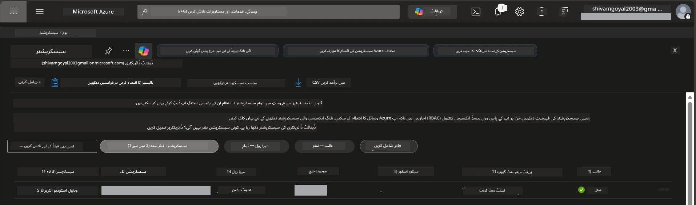

# ماڈیول 0 - ضروریات

ورکشاپ شروع کرنے سے پہلے، تصدیق کریں کہ آپ کے پاس درج ذیل ٹولز، رسائی، اور ماحول تیار ہیں۔ نیچے دیے گئے ہر قدم پر عمل کریں - آگے مت بڑھیں۔

---

## 1. آزور اکاؤنٹ اور سبسکرپشن

### 1.1 اپنا آزور سبسکرپشن بنائیں یا تصدیق کریں

1. براؤزر کھولیں اور اس پر جائیں [https://azure.microsoft.com/free/](https://azure.microsoft.com/free/)۔
2. اگر آپ کے پاس آزور اکاؤنٹ نہیں ہے، تو **Start free** پر کلک کریں اور سائن اپ کا عمل مکمل کریں۔ آپ کو Microsoft اکاؤنٹ کی ضرورت ہوگی (یا ایک نیا بنائیں) اور شناخت کی تصدیق کے لئے کریڈٹ کارڈ درکار ہوگا۔
3. اگر آپ کے پاس پہلے ہی اکاؤنٹ ہے، تو [https://portal.azure.com](https://portal.azure.com) پر سائن ان کریں۔
4. پورٹل میں، بائیں نیویگیشن میں **Subscriptions** بلیڈ پر کلک کریں (یا اوپر سرچ بار میں "Subscriptions" تلاش کریں)۔
5. تصدیق کریں کہ آپ کو کم از کم ایک **Active** سبسکرپشن نظر آتی ہے۔ **Subscription ID** نوٹ کر لیں - آپ کو بعد میں اس کی ضرورت ہوگی۔



### 1.2 مطلوبہ RBAC کردار سمجھیں

[Hosted Agent](https://learn.microsoft.com/azure/foundry/agents/concepts/hosted-agents) کی تعیناتی کے لیے وہ **data action** اجازت نامے درکار ہوتے ہیں جو عمومی Azure `Owner` اور `Contributor` کرداروں میں شامل نہیں ہوتے۔ آپ کو ان [کردار کے امتزاج](https://learn.microsoft.com/azure/foundry/concepts/rbac-foundry#built-in-roles) میں سے ایک کی ضرورت ہوگی:

| منظر نامہ | درکار کردار | کہاں تفویض کرنا ہے |
|----------|---------------|----------------------|
| نیا Foundry پروجیکٹ بنانا | Foundry وسائل پر **Azure AI Owner** | Azure پورٹل میں Foundry وسائل |
| موجودہ پروجیکٹ میں تعیناتی (نئے وسائل) | سبسکرپشن پر **Azure AI Owner** + **Contributor** | سبسکرپشن + Foundry وسائل |
| مکمل ترتیب یافتہ پروجیکٹ میں تعیناتی | اکاؤنٹ پر **Reader** + پروجیکٹ پر **Azure AI User** | Azure پورٹل میں اکاؤنٹ + پروجیکٹ |

> **اہم نکتہ:** Azure کے `Owner` اور `Contributor` کردار صرف *مینجمنٹ* اجازت نامے دیتے ہیں (ARM آپریشنز)۔ آپ کو *data actions* جیسے `agents/write` کے لیے [**Azure AI User**](https://learn.microsoft.com/azure/foundry/concepts/rbac-foundry#built-in-roles) (یا اس سے زیادہ) چاہیے، جو ایجنٹس بنانے اور تعینات کرنے کے لیے ضروری ہے۔ آپ یہ کردار [ماڈیول 2](02-create-foundry-project.md) میں تفویض کریں گے۔

---

## 2. مقامی ٹولز انسٹال کریں

نیچے دیے گئے ہر ٹول کو انسٹال کریں۔ انسٹال کرنے کے بعد، چیک کمانڈ چلائیں تاکہ تصدیق ہو جائے کہ وہ کام کر رہا ہے۔

### 2.1 Visual Studio Code

1. اس پر جائیں [https://code.visualstudio.com/](https://code.visualstudio.com/)۔
2. اپنے OS (Windows/macOS/Linux) کے لیے انسٹالر ڈاؤن لوڈ کریں۔
3. انسٹالر کو ڈیفالٹ سیٹنگز کے ساتھ چلائیں۔
4. VS Code کھولیں اور تصدیق کریں کہ یہ لانچ ہو رہا ہے۔

### 2.2 Python 3.10+

1. اس پر جائیں [https://www.python.org/downloads/](https://www.python.org/downloads/)۔
2. Python 3.10 یا اس کے بعد کا ورژن ڈاؤن لوڈ کریں (3.12+ تجویز شدہ ہے)۔
3. **Windows:** انسٹالیشن کے دوران پہلے اسکرین پر **"Add Python to PATH"** کو منتخب کریں۔
4. ٹرمینل کھولیں اور تصدیق کریں:

   ```powershell
   python --version
   ```

   متوقع نتیجہ: `Python 3.10.x` یا اس سے زیادہ۔

### 2.3 Azure CLI

1. اس پر جائیں [https://learn.microsoft.com/cli/azure/install-azure-cli](https://learn.microsoft.com/cli/azure/install-azure-cli)۔
2. اپنے OS کے لیے انسٹال ہدایات پر عمل کریں۔
3. تصدیق کریں:

   ```powershell
   az --version
   ```

   متوقع: `azure-cli 2.80.0` یا اس سے زیادہ۔

4. سائن ان کریں:

   ```powershell
   az login
   ```

### 2.4 Azure Developer CLI (azd)

1. اس پر جائیں [https://learn.microsoft.com/azure/developer/azure-developer-cli/install-azd](https://learn.microsoft.com/azure/developer/azure-developer-cli/install-azd)۔
2. اپنے OS کے لیے انسٹال ہدایات پر عمل کریں۔ Windows پر:

   ```powershell
   winget install microsoft.azd
   ```

3. تصدیق کریں:

   ```powershell
   azd version
   ```

   متوقع: `azd version 1.x.x` یا اس سے زیادہ۔

4. سائن ان کریں:

   ```powershell
   azd auth login
   ```

### 2.5 Docker Desktop (اختیاری)

اگر آپ کنٹینر امیج تعیناتی سے پہلے مقامی طور پر بنانا اور ٹیسٹ کرنا چاہتے ہیں تو Docker کی ضرورت ہے۔ Foundry ایکسٹینشن تعیناتی کے دوران کنٹینر بلڈز خودکار طریقے سے سنبھالتی ہے۔

1. اس پر جائیں [https://docs.docker.com/get-docker/](https://docs.docker.com/get-docker/)۔
2. اپنے OS کے لیے Docker Desktop ڈاؤن لوڈ اور انسٹال کریں۔
3. **Windows:** انسٹالیشن کے دوران WSL 2 بیک اینڈ منتخب کریں۔
4. Docker Desktop شروع کریں اور سسٹم ٹرے میں آئیکن کے ساتھ انتظار کریں کہ **"Docker Desktop is running"** ظاہر ہو۔
5. ٹرمینل کھولیں اور تصدیق کریں:

   ```powershell
   docker info
   ```

   یہ کمانڈ Docker کا نظامی معلومات بغیر کسی غلطی کے پرنٹ کرے گا۔ اگر آپ کو `Cannot connect to the Docker daemon` دکھے، تو Docker کے مکمل شروع ہونے کے لیے تھوڑا انتظار کریں۔

---

## 3. VS Code ایکسٹینشنز انسٹال کریں

آپ کو تین ایکسٹینشنز کی ضرورت ہے۔ ورکشاپ شروع ہونے سے **پہلے** انہیں انسٹال کریں۔

### 3.1 Microsoft Foundry for VS Code

1. VS Code کھولیں۔
2. `Ctrl+Shift+X` دبائیں تاکہ Extensions پینل کھلے۔
3. سرچ باکس میں **"Microsoft Foundry"** لکھیں۔
4. **Microsoft Foundry for Visual Studio Code** تلاش کریں (پبلشر: Microsoft، ID: `TeamsDevApp.vscode-ai-foundry`)۔
5. **Install** پر کلک کریں۔
6. انسٹالیشن کے بعد، آپ کو Activity Bar (بائیں سائڈبار) میں **Microsoft Foundry** کا آئیکن نظر آئے گا۔

### 3.2 Foundry Toolkit

1. Extensions پینل میں (`Ctrl+Shift+X`) **"Foundry Toolkit"** تلاش کریں۔
2. **Foundry Toolkit** تلاش کریں (پبلشر: Microsoft، ID: `ms-windows-ai-studio.windows-ai-studio`)۔
3. **Install** پر کلک کریں۔
4. Activity Bar میں **Foundry Toolkit** آئیکن ظاہر ہو جائے گا۔

### 3.3 Python

1. Extensions پینل میں **"Python"** تلاش کریں۔
2. **Python** تلاش کریں (پبلشر: Microsoft، ID: `ms-python.python`)۔
3. **Install** پر کلک کریں۔

---

## 4. VS Code سے Azure میں سائن ان کریں

[Microsoft Agent Framework](https://learn.microsoft.com/agent-framework/overview/) توثیق کے لیے [`DefaultAzureCredential`](https://learn.microsoft.com/azure/developer/python/sdk/authentication/credential-chains#defaultazurecredential-overview) استعمال کرتا ہے۔ آپ کو VS Code میں Azure میں سائن ان ہونا ضروری ہے۔

### 4.1 VS Code کے ذریعے سائن ان

1. VS Code کے نیچے بائیں کونے میں **Accounts** آئیکن (شخص کی تصویر) پر کلک کریں۔
2. **Sign in to use Microsoft Foundry** (یا **Sign in with Azure**) پر کلک کریں۔
3. براؤزر کھلے گا - اپنے Azure اکاؤنٹ سے سائن ان کریں جسے آپ کی سبسکرپشن تک رسائی حاصل ہے۔
4. VS Code پر واپس آئیں۔ آپ کو نیچے بائیں کونے میں اپنا اکاؤنٹ نام نظر آئے گا۔

### 4.2 (اختیاری) Azure CLI کے ذریعے سائن ان

اگر آپ نے Azure CLI انسٹال کیا ہے اور CLI کے ذریعے توثیق کرنا چاہتے ہیں:

```powershell
az login
```

یہ براؤزر کھولے گا تاکہ آپ سائن ان کر سکیں۔ سائن ان ہونے کے بعد، درست سبسکرپشن سیٹ کریں:

```powershell
az account set --subscription "<your-subscription-id>"
```

تصدیق کریں:

```powershell
az account show --query "{name:name, id:id, state:state}" --output table
```

آپ کو اپنی سبسکرپشن کا نام، ID، اور حالت = `Enabled` نظر آئے گا۔

### 4.3 (متبادل) سروس پرنسپل توثیق

CI/CD یا مشترکہ ماحول کے لیے، اس کی جگہ ان ماحول کے متغیرات سیٹ کریں:

```powershell
$env:AZURE_TENANT_ID = "<your-tenant-id>"
$env:AZURE_CLIENT_ID = "<your-client-id>"
$env:AZURE_CLIENT_SECRET = "<your-client-secret>"
```

---

## 5. پریوِیو کی حدود

آگے بڑھنے سے پہلے، موجودہ حدود سے آگاہ رہیں:

- [**Hosted Agents**](https://learn.microsoft.com/azure/foundry/agents/concepts/hosted-agents) ابھی **public preview** میں ہیں - پیداوار کے کاموں کے لیے تجویز نہیں کیے جاتے۔
- **حمایت یافتہ علاقے محدود ہیں** - وسائل بنانے سے پہلے [علاقہ کی دستیابی](https://learn.microsoft.com/azure/foundry/agents/concepts/hosted-agents#region-availability) چیک کریں۔ اگر آپ کوئی غیر حمایتی علاقہ منتخب کریں گے، تعیناتی ناکام ہو جائے گی۔
- `azure-ai-agentserver-agentframework` پیکیج پری ریلیز (`1.0.0b16`) ہے - APIs میں تبدیلی آ سکتی ہے۔
- اسکیل کی حدیں: hosted agents 0-5 نقول (بشمول صفر تک اسکیل) کی حمایت کرتے ہیں۔

---

## 6. پری فلائٹ چیک لسٹ

نیچے دیے گئے ہر آیٹم کو چیک کریں۔ اگر کوئی بھی قدم ناکام ہو، تو واپس جائیں اور اسے درست کریں پھر آگے بڑھیں۔

- [ ] VS Code بغیر کسی غلطی کے کھلتا ہے
- [ ] Python 3.10+ آپ کے PATH میں ہے (`python --version` `3.10.x` یا اس سے زیادہ پرنٹ کرتا ہے)
- [ ] Azure CLI انسٹال ہے (`az --version` `2.80.0` یا اس سے زیادہ پرنٹ کرتا ہے)
- [ ] Azure Developer CLI انسٹال ہے (`azd version` ورژن کی معلومات پرنٹ کرتا ہے)
- [ ] Microsoft Foundry ایکسٹینشن انسٹال ہے (Activity Bar میں آئیکن واضح ہے)
- [ ] Foundry Toolkit ایکسٹینشن انسٹال ہے (Activity Bar میں آئیکن واضح ہے)
- [ ] Python ایکسٹینشن انسٹال ہے
- [ ] آپ VS Code میں Azure میں سائن ان ہیں (Accounts آئیکن، نیچے بائیں دیکھیں)
- [ ] `az account show` آپ کی سبسکرپشن لوٹاتا ہے
- [ ] (اختیاری) Docker Desktop چل رہا ہے (`docker info` بغیر غلطی کے سسٹم معلومات لوٹاتا ہے)

### چیک پوائنٹ

VS Code کے Activity Bar کو کھولیں اور تصدیق کریں کہ آپ دونوں **Foundry Toolkit** اور **Microsoft Foundry** کے سائڈبار مناظر دیکھ سکتے ہیں۔ ہر ایک پر کلک کریں تاکہ تصدیق ہو کہ وہ بغیر غلطی کے لوڈ ہو رہے ہیں۔

---

**اگلا:** [01 - Install Foundry Toolkit & Foundry Extension →](01-install-foundry-toolkit.md)

---

<!-- CO-OP TRANSLATOR DISCLAIMER START -->
**ڈس کلیمر**:  
یہ دستاویز AI ترجمہ سروس [Co-op Translator](https://github.com/Azure/co-op-translator) کے ذریعے ترجمہ کی گئی ہے۔ جبکہ ہم درستگی کے لیے کوشاں ہیں، براہ کرم یاد رکھیں کہ خودکار ترجموں میں غلطیاں یا عدم درستیاں ہو سکتی ہیں۔ اصل دستاویز اپنی مادری زبان میں مستند ماخذ سمجھی جانی چاہیے۔ اہم معلومات کے لیے پیشہ ور انسانی ترجمہ کی سفارش کی جاتی ہے۔ اس ترجمے کے استعمال سے ہونے والی کسی بھی غلط فہمی یا غلط تشریح کی ذمہ داری ہم پر عائد نہیں ہوتی۔
<!-- CO-OP TRANSLATOR DISCLAIMER END -->