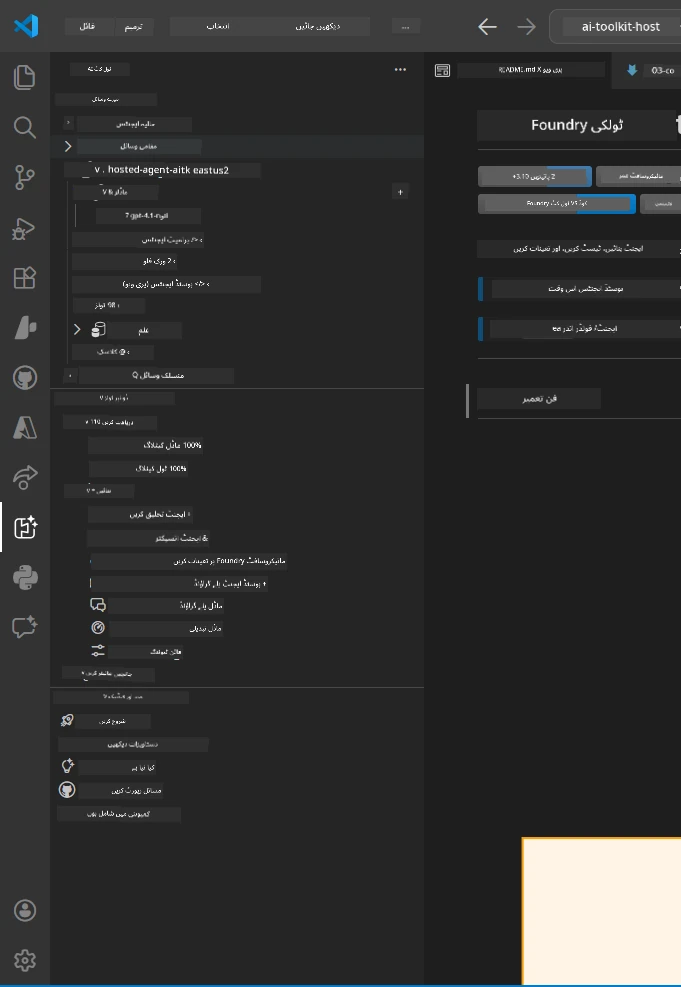
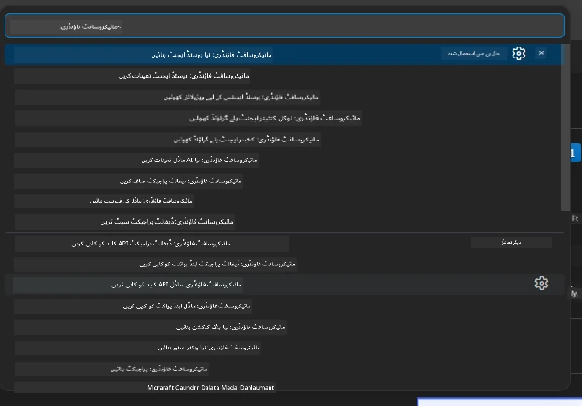

# ماڈیول 1 - فاؤنڈری ٹول کٹ اور فاؤنڈری ایکسٹینشن انسٹال کریں

یہ ماڈیول آپ کو اس ورکشاپ کے دو بنیادی VS کوڈ ایکسٹینشنز انسٹال کرنے اور ان کی تصدیق کرنے کے عمل سے گزارتا ہے۔ اگر آپ نے انہیں پہلے ہی [ماڈیول 0](00-prerequisites.md) کے دوران انسٹال کرلیا ہے، تو اس ماڈیول کا استعمال یہ یقینی بنانے کے لیے کریں کہ وہ صحیح طریقے سے کام کر رہے ہیں۔

---

## مرحلہ 1: مائیکروسافٹ فاؤنڈری ایکسٹینشن انسٹال کریں

**Microsoft Foundry for VS Code** ایکسٹینشن آپ کا مرکزی آلہ ہے فاؤنڈری پراجیکٹس بنانے، ماڈلز تعینات کرنے، ہوسٹڈ ایجنٹس کی اسکافولڈنگ کرنے، اور VS کوڈ سے براہ راست تعینات کرنے کے لیے۔

1. VS کوڈ کھولیں۔
2. `Ctrl+Shift+X` دبائیں تاکہ **Extensions** پینل کھلے۔
3. اوپر تلاش کے باکس میں ٹائپ کریں: **Microsoft Foundry**
4. نتیجہ تلاش کریں جس کا عنوان ہو **Microsoft Foundry for Visual Studio Code**۔
   - پبلشر: **Microsoft**
   - ایکسٹینشن ID: `TeamsDevApp.vscode-ai-foundry`
5. **Install** بٹن پر کلک کریں۔
6. انسٹالیشن مکمل ہونے کا انتظار کریں (آپ کو ایک چھوٹا ترقیاتی اشارہ نظر آئے گا)۔
7. انسٹالیشن کے بعد، **Activity Bar** (VS کوڈ کے بائیں جانب عمودی آئیکن بار) کو دیکھیں۔ آپ کو ایک نیا **Microsoft Foundry** آئیکن نظر آئے گا (ہیرا/AI آئیکن کی طرح)۔
8. **Microsoft Foundry** آئیکن پر کلک کریں تاکہ اس کا سائڈبار ویو کھلے۔ آپ کو مندرجہ ذیل سیکشنز نظر آئیں گے:
   - **Resources** (یا Projects)
   - **Agents**
   - **Models**

> **اگر آئیکن نظر نہ آئے:** VS کوڈ کو دوبارہ لوڈ کرنے کی کوشش کریں (`Ctrl+Shift+P` → `Developer: Reload Window`).

---

## مرحلہ 2: فاؤنڈری ٹول کٹ ایکسٹینشن انسٹال کریں

**Foundry Toolkit** ایکسٹینشن فراہم کرتا ہے [**Agent Inspector**](https://learn.microsoft.com/azure/foundry/agents/how-to/vs-code-agents-workflow-pro-code) - ایک بصری انٹرفیس جو ایجنٹس کو مقامی طور پر ٹیسٹ اور ڈیبگ کرنے کے لیے ہے - اس کے علاوہ کھیل کا میدان، ماڈل مینجمنٹ، اور تشخیصی اوزار بھی۔

1. ایکسٹینشنز پینل میں (`Ctrl+Shift+X`) تلاش کے باکس کو صاف کریں اور ٹائپ کریں: **Foundry Toolkit**
2. نتائج میں سے **Foundry Toolkit** تلاش کریں۔
   - پبلشر: **Microsoft**
   - ایکسٹینشن ID: `ms-windows-ai-studio.windows-ai-studio`
3. **Install** پر کلک کریں۔
4. انسٹالیشن کے بعد، **Foundry Toolkit** کا آئیکن Activity Bar میں دکھائی دے گا (روبوٹ/چمکدار آئیکن کی طرح)۔
5. **Foundry Toolkit** آئیکن پر کلک کریں تاکہ اس کا سائڈبار ویو کھلے۔ آپ کو فاؤنڈری ٹول کٹ خوش آمدید اسکرین نظر آئے گی جس میں اختیارات ہوں گے:
   - **Models**
   - **Playground**
   - **Agents**

---

## مرحلہ 3: دونوں ایکسٹینشنز کے کام کرنے کی تصدیق کریں

### 3.1 مائیکروسافٹ فاؤنڈری ایکسٹینشن کی تصدیق کریں

1. Activity Bar میں **Microsoft Foundry** آئیکن پر کلک کریں۔
2. اگر آپ Azure میں سائن ان ہیں (ماڈیول 0 سے)، تو آپ کو اپنے پراجیکٹس **Resources** کے تحت دیکھنے کو ملیں گے۔
3. اگر سائن ان کرنے کا کہا جائے، تو **Sign in** پر کلک کریں اور تصدیقی عمل کو مکمل کریں۔
4. تصدیق کریں کہ آپ سائڈبار کو بغیر کسی غلطی کے دیکھ سکتے ہیں۔

### 3.2 فاؤنڈری ٹول کٹ ایکسٹینشن کی تصدیق کریں

1. Activity Bar میں **Foundry Toolkit** آئیکن پر کلک کریں۔
2. تصدیق کریں کہ خوش آمدید یا مرکزی پینل بغیر کسی غلطی کے لوڈ ہوتا ہے۔
3. آپ کو ابھی کچھ ترتیب دینے کی ضرورت نہیں — ہم ایجنٹ انسپکٹر کو [ماڈیول 5](05-test-locally.md) میں استعمال کریں گے۔

### 3.3 کمانڈ پیلیٹ کے ذریعے تصدیق کریں

1. `Ctrl+Shift+P` دبائیں تاکہ Command Palette کھلے۔
2. ٹائپ کریں **"Microsoft Foundry"** - آپ کو درج ذیل کمانڈز نظر آنی چاہئیں:
   - `Microsoft Foundry: Create a New Hosted Agent`
   - `Microsoft Foundry: Deploy Hosted Agent`
   - `Microsoft Foundry: Open Model Catalog`
3. Command Palette بند کرنے کے لیے `Escape` دبائیں۔
4. دوبارہ Command Palette کھولیں اور ٹائپ کریں **"Foundry Toolkit"** - آپ کو درج ذیل کمانڈز نظر آئیں گی:
   - `Foundry Toolkit: Open Agent Inspector`

> اگر آپ کو یہ کمانڈز نظر نہیں آ رہیں، تو ممکن ہے کہ ایکسٹینشنز صحیح طریقے سے انسٹال نہ ہوئی ہوں۔ انہیں ان انسٹال کرکے دوبارہ انسٹال کرنے کی کوشش کریں۔

---

## اس ورکشاپ میں یہ ایکسٹینشنز کیا کرتی ہیں

| ایکسٹینشن | کیا کرتی ہے | کب استعمال کریں گے |
|-----------|-------------|-------------------|
| **Microsoft Foundry for VS Code** | فاؤنڈری پراجیکٹس بنانا، ماڈلز تعینات کرنا، **[ہوسٹڈ ایجنٹس](https://learn.microsoft.com/azure/foundry/agents/concepts/hosted-agents) کی اسکافولڈنگ** (خودکار طور پر `agent.yaml`, `main.py`, `Dockerfile`, `requirements.txt` بنانا)، [Foundry Agent Service](https://learn.microsoft.com/azure/foundry/agents/overview) پر تعینات کرنا | ماڈیول 2، 3، 6، 7 |
| **Foundry Toolkit** | مقامی ٹیسٹنگ/ڈیبگنگ کے لیے ایجنٹ انسپکٹر، playground UI، ماڈل مینجمنٹ | ماڈیول 5، 7 |

> **فاؤنڈری ایکسٹینشن اس ورکشاپ میں سب سے اہم آلہ ہے۔** یہ مکمل زندگی کے چکر کو سنبھالتا ہے: اسکافولڈ → ترتیب دیں → تعینات کریں → تصدیق کریں۔ فاؤنڈری ٹول کٹ اسے مقامی ٹیسٹنگ کے لیے بصری ایجنٹ انسپکٹر مہیا کرکے معاونت فراہم کرتا ہے۔

---

### چیک پوائنٹ

- [ ] مائیکروسافٹ فاؤنڈری آئیکن Activity Bar میں نظر آ رہا ہے
- [ ] اس پر کلک کرنے سے سائڈبار بغیر کسی غلطی کے کھلتا ہے
- [ ] فاؤنڈری ٹول کٹ آئیکن Activity Bar میں نظر آ رہا ہے
- [ ] اس پر کلک کرنے سے سائڈبار بغیر کسی غلطی کے کھلتا ہے
- [ ] `Ctrl+Shift+P` → "Microsoft Foundry" ٹائپ کرنے پر دستیاب کمانڈز نظر آتی ہیں
- [ ] `Ctrl+Shift+P` → "Foundry Toolkit" ٹائپ کرنے پر دستیاب کمانڈز نظر آتی ہیں

---

**پچھلا:** [00 - ضروریات](00-prerequisites.md) · **اگلا:** [02 - فاؤنڈری پراجیکٹ بنائیں →](02-create-foundry-project.md)

---

<!-- CO-OP TRANSLATOR DISCLAIMER START -->
**یہ دستاویز AI ترجمہ کی خدمت [Co-op Translator](https://github.com/Azure/co-op-translator) کا استعمال کرتے ہوئے ترجمہ کی گئی ہے۔ اگرچہ ہم درستگی کے لیے کوشش کرتے ہیں، براہ کرم آگاہ رہیں کہ خودکار تراجم میں غلطیاں یا غیر مہارت ہو سکتی ہیں۔ اصل دستاویز اپنی مادری زبان میں معتبر ذریعہ سمجھی جانی چاہیے۔ اہم معلومات کے لیے پیشہ ور انسانی ترجمہ کی سفارش کی جاتی ہے۔ اس ترجمے کے استعمال سے پیدا ہونے والی کسی بھی غلط فہمی یا غلط تشریح کی ذمہ داری ہم پر عائد نہیں ہوتی۔**
<!-- CO-OP TRANSLATOR DISCLAIMER END -->