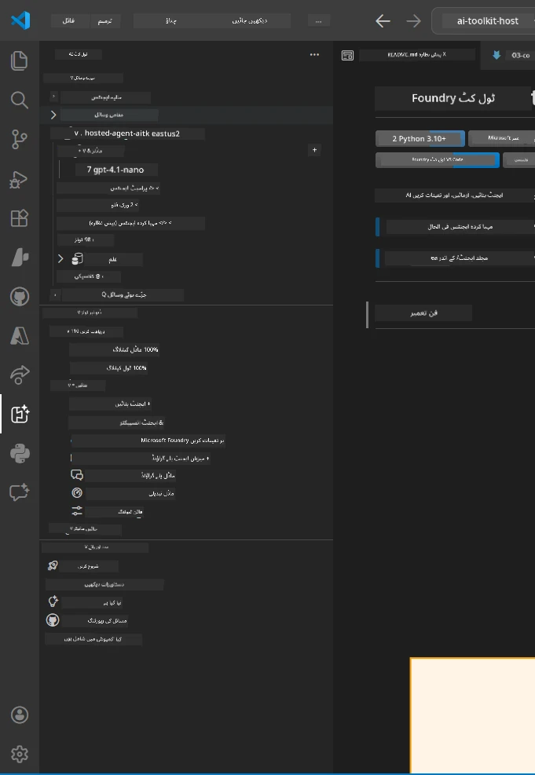
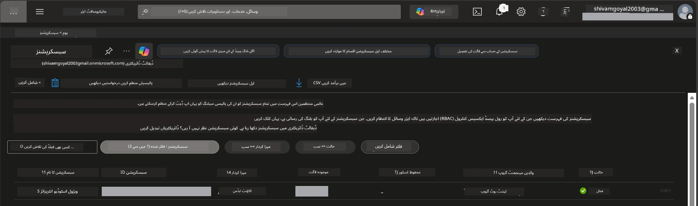
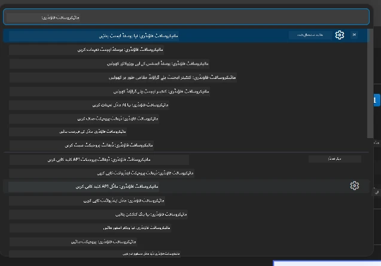
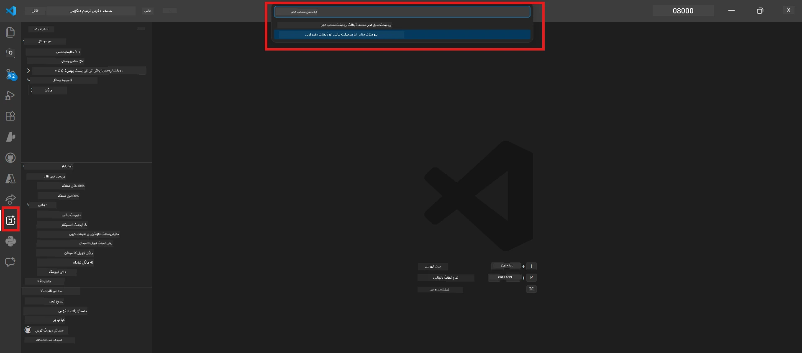
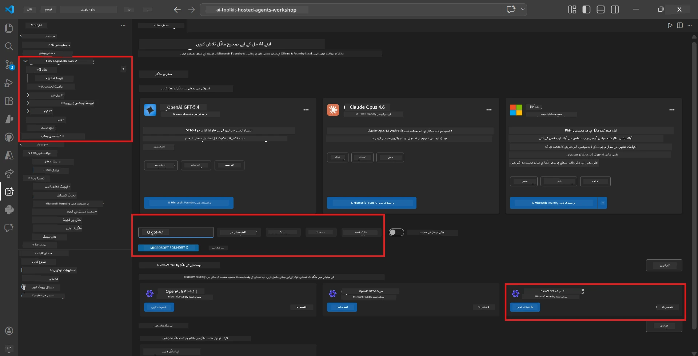
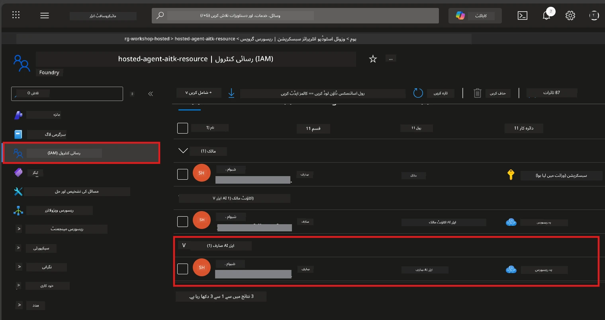

# سیٹ اپ: ایکسٹینشن، پروجیکٹ اور ماڈل

⏱️ تقریباً 15 منٹ

اس ماڈیول میں، آپ Foundry Toolkit ایکسٹینشن انسٹال اور تصدیق کرتے ہیں، ایک Foundry پروجیکٹ بناتے ہیں (یا اس سے رابطہ کرتے ہیں)، اور ایک ماڈل تعینات کرتے ہیں جسے آپ کا ایجنٹ استعمال کرے گا۔

## مرحلہ 1: Foundry Toolkit انسٹال کریں

**Foundry Toolkit برائے VS Code** اس ورکشاپ کے لیے بنیادی ایکسٹینشن ہے۔ یہ پروجیکٹ تخلیق، ماڈل تعیناتی، ایجنٹ اسکیفولڈنگ، مقامی جانچ (Agent Inspector)، اور کلاؤڈ تعیناتی فراہم کرتا ہے – تمام کچھ VS Code سے۔

1. VS Code کھولیں پھر `Ctrl+Shift+X` دبائیں تاکہ **Extensions** پینل کھلے۔
2. **Foundry Toolkit** تلاش کریں۔
3. **Foundry Toolkit for VS Code** انسٹال کریں (پبلشر: Microsoft, ID: `ms-windows-ai-studio.windows-ai-studio`)۔
4. انسٹالیشن کے بعد، **Foundry Toolkit** کا آئیکن ایکٹیویٹی بار (بائیں سائڈبار) میں ظاہر ہوگا۔

> *نوٹ: ایکٹیویٹی بار میں پرانے ایکسٹینشن ورژنز میں "AI TOOLKIT" بھی دکھایا جا سکتا ہے۔ فنکشنالٹی ایک جیسی ہے۔*



## مرحلہ 2: اپنی رسائی کی بنیاد پر سیٹ اپ کریں

> **اپنا راستہ منتخب کریں:** نیچے دی گئی سیکشن کو پھیلائیں جو آپ کے سیٹ اپ سے میل کھاتی ہو۔ آپ کو صرف **ایک** راستہ مکمل کرنا ہوگا۔

<details>
<summary><strong>🅰️ راستہ اے - Azure کلاؤڈ (Azure سبسکرپشن درکار ہے)</strong></summary>

### Azure CLI

1. انسٹال کریں: [learn.microsoft.com/cli/azure/install-azure-cli](https://learn.microsoft.com/cli/azure/install-azure-cli) سے۔
2. تصدیق کریں: `az --version` (متوقع ورژن 2.80.0+)۔
3. سائن ان کریں: `az login`

### توثیق کے اختیارات

[Microsoft Agent Framework](https://learn.microsoft.com/agent-framework/overview/) [`DefaultAzureCredential`](https://learn.microsoft.com/azure/developer/python/sdk/authentication/credential-chains#defaultazurecredential-overview) استعمال کرتا ہے جو مختلف توثیقی طریقے ترتیب وار آزما کر دیکھتا ہے۔ اپنے ماحول کے حساب سے ایک منتخب کریں:

#### آپشن 1: VS Code اکاؤنٹس (ورکشاپس کے لیے تجویز کردہ)
1. VS Code کے نیچے-بائیں کونے میں **Accounts** آئیکن (شخص کا خاکہ) پر کلک کریں۔
2. منتخب کریں **Sign in to use Microsoft Foundry** (یا **Sign in with Azure**)۔
3. ایک براؤزر کھلے گا - اپنے Azure اکاؤنٹ سے سائن ان کریں جس کے پاس آپ کی سبسکرپشن تک رسائی ہو۔
4. VS Code پر واپس آئیں۔ آپ کو نیچے-بائیں میں اپنا اکاؤنٹ نام نظر آنا چاہیے۔

#### آپشن 2: Azure CLI
```bash
az login
az account set --subscription "<your-subscription-id>"
```

#### آپشن 3: سروس پرنسپل (انٹرپرائز/CI)
لاکڈ ڈاؤن ماحول یا CI/CD پائپ لائنز کے لیے، اپنی `.env` فائل میں یہ ماحول متغیرات مقرر کریں:
```env
AZURE_TENANT_ID=<your-tenant-id>
AZURE_CLIENT_ID=<your-client-id>
AZURE_CLIENT_SECRET=<your-client-secret>
```

> **`DefaultAzureCredential` کیسے کام کرتا ہے:** یہ پہلے ماحول متغیرات کو آزماتا ہے، پھر Managed Identity، پھر VS Code کے سائن ان کو، پھر Azure CLI کو - اور جو پہلے کامیاب ہو اسے استعمال کرتا ہے۔ مزید دیکھیں [credential chain docs](https://learn.microsoft.com/azure/developer/python/sdk/authentication/credential-chains#defaultazurecredential-overview)۔

### Azure Developer CLI (azd)

1. انسٹال کریں: `winget install microsoft.azd` (ونڈوز) یا [انسٹال ڈاکیومنٹیشن](https://learn.microsoft.com/azure/developer/azure-developer-cli/install-azd) دیکھیں۔
2. تصدیق کریں: `azd version`
3. سائن ان کریں: `azd auth login`

### Docker Desktop (اختیاری)

Docker صرف اس صورت میں درکار ہے جب آپ اپنے کمپیوٹر پر مقامی طور پر کنٹینرز بنانا چاہیں۔ Foundry ایکسٹینشن تعیناتی کے دوران بلڈ خود بخود سنبھالتا ہے۔

1. انسٹال کریں: [docs.docker.com/get-docker](https://docs.docker.com/get-docker/) سے۔
2. تصدیق کریں: `docker info`

### Azure سبسکرپشن اور RBAC

1. سائن ان کریں: [portal.azure.com](https://portal.azure.com) پر۔
2. **Subscriptions** پر جائیں اور تصدیق کریں کہ کم از کم ایک **Active** ہے۔
3. اپنی **Subscription ID** نوٹ کریں - آپ کو ماڈیول 01 میں اس کی ضرورت ہوگی۔



#### RBAC منظر نامہ جدول

[Hosted Agent](https://learn.microsoft.com/azure/foundry/agents/concepts/hosted-agents) تعیناتی کے لیے **data action** کی اجازت درکار ہوتی ہے جو Azure کے معمول کے `Owner` اور `Contributor` کرداروں میں شامل نہیں ہے۔ نیچے دیے گئے جدول سے معلوم کریں کہ آپ کو کون سے کردار درکار ہیں:

| منظر نامہ | مطلوبہ کردار | کہاں تفویض کریں |
|----------|-------------|-----------------|
| نیا Foundry پروجیکٹ بنائیں | **Azure AI Owner** on Foundry resource | Azure Portal میں Foundry resource |
| موجودہ پروجیکٹ میں تعینات کریں (نئی وسائل) | **Azure AI Owner** + **Contributor** on subscription | Subscription + Foundry resource |
| مکمل ترتیب شدہ پروجیکٹ میں تعینات کریں | **Reader** on account + **Azure AI User** on project | اکاؤنٹ + پروجیکٹ Azure Portal میں |
| صرف مقامی جانچ (کوئی تعیناتی نہیں) | **Azure AI User** on project | پروجیکٹ Azure Portal میں |

> **اہم بات:** Azure کے `Owner` اور `Contributor` کردار صرف *انتظامی* اجازتیں (ARM آپریشنز) فراہم کرتے ہیں۔ آپ کو [**Azure AI User**](https://learn.microsoft.com/azure/foundry/concepts/rbac-foundry#built-in-roles) (یا اس سے اعلیٰ) درکار ہے تاکہ *data actions* جیسے `agents/write` جو ایجنٹس کی تخلیق اور تعیناتی کے لیے ضروری ہیں انجام دیے جا سکیں۔

## Foundry پروجیکٹ میں کنیکٹ کریں یا نیا بنائیں



1. `Ctrl+Shift+P` دبائیں → ٹائپ کریں **Foundry Toolkit: Create Project** → اسے منتخب کریں۔
2. اپنی **Azure سبسکرپشن** ڈراپ ڈاؤن سے منتخب کریں۔
3. ایک **resource group** منتخب کریں یا بنائیں (مثلاً، `rg-hosted-agents-workshop`)۔
4. ایک **region** منتخب کریں جو hosted agents کو سپورٹ کرتی ہو: `East US`, `West US 2`, یا `Sweden Central`۔ مزید دیکھیں [region availability](https://learn.microsoft.com/azure/foundry/agents/concepts/hosted-agents#region-availability)۔
5. پروجیکٹ کا نام درج کریں (مثلاً، `workshop-agents`)۔
6. پروویژننگ کے لیے 2–5 منٹ انتظار کریں۔ VS Code میں ایک پروگریس نوٹیفیکیشن ظاہر ہوگا۔
7. مکمل ہونے پر، آپ کا پروجیکٹ **Foundry Toolkit** سائڈبار میں **MY RESOURCES** کے تحت ظاہر ہوگا۔



## ماڈل تعینات کریں اور RBAC تفویض کریں

آپ کے hosted agent کو جوابات تیار کرنے کے لیے ایک AI ماڈل چاہیے۔

#### ماڈل انتخاب کا میٹرکس
آپ کی ضروریات کے مطابق، آپ مختلف ماڈل درجوں میں سے انتخاب کر سکتے ہیں:

| ماڈل | بہترین استعمال | قیمت | نوٹ |
|-------|------------|-------|-------|
| `gpt-4.1` | اعلیٰ معیار، مفصل جوابات | زیادہ | بہترین نتائج، فائنل ٹیسٹنگ کے لیے تجویز شدہ |
| `gpt-4.1-mini/gpt-5-mini` | تیز ترقی، کم قیمت | کم | ورکشاپ کی ترقی اور جلدی جانچ کے لیے اچھا |
| `gpt-4.1-nano` | ہلکے پھلکے کام | سب سے کم | سب سے کिफایتی، مگر سادہ جوابات |

1. `Ctrl+Shift+P` دبائیں → **Foundry Toolkit: Open Model Catalog** (یا سائڈبار میں DEVELOPER TOOLS کے تحت **Model Catalog** پر کلک کریں → Discover)۔
2. کیٹلاگ میں **gpt-4.1** تلاش کریں۔
3. **OpenAI GPT-4.1-mini** تلاش کریں (یا بہتر معیار کے لیے `gpt-5-mini`) اور **Deploy** پر کلک کریں۔



4. تعیناتی کنفیگریشن میں:
   - **Deployment name:** ڈیفالٹ چھوڑیں یا اپنی مرضی کا نام درج کریں۔ **اس نام کو یاد رکھیں۔**
   - **Target:** منتخب کریں **Deploy to Foundry Toolkit** → اپنا پروجیکٹ منتخب کریں۔
5. **Deploy** پر کلک کریں اور 1–3 منٹ انتظار کریں۔

> **سفارش:** ورکشاپ کے لیے `gpt-4.1-mini/gpt-5-mini` استعمال کریں - تیز، معقول قیمت پر، اور اچھے نتائج دیتا ہے۔

### اپنی قدریں نوٹ کریں

تعیناتی کے بعد، یہ دو قدریں نوٹ کریں (آپ کو ماڈیول 03 میں ان کی ضرورت ہوگی):

| قدر | کہاں ملے گی |
|-------|-------------|
| **پروجیکٹ اینڈپوائنٹ** | سائڈبار میں اپنے پروجیکٹ پر کلک کریں → تفصیلی نظر میں URL دکھائی دیتا ہے (مثلاً، `https://<account>.services.ai.azure.com/api/projects/<project>`) |
| **ماڈل تعیناتی نام** | پروجیکٹ کو پھیلائیں → **Models** → اپنے تعینات کردہ ماڈل کے ساتھ نام (مثلاً، `gpt-4.1-mini/gpt-5-mini`) |

### RBAC رول تفویض کریں

> ⚠️ **یہ سب سے عام غفلت والا مرحلہ ہے۔** صحیح رول کے بغیر، ماڈیول 05 میں تعیناتی ناکام ہو جائے گی۔

#### مجھے کون سا رول چاہیے؟
آپ کے منظر نامے کے مطابق، درج ذیل رول امتزاج کی ضرورت ہے:

| منظر نامہ | مطلوبہ کردار | کہاں تفویض کریں |
|----------|-------------|-----------------|
| نیا Foundry پروجیکٹ بنائیں | **Azure AI Owner** on Foundry resource | Azure Portal میں Foundry resource |
| موجودہ پروجیکٹ میں تعینات کریں (نئی وسائل) | **Azure AI Owner** + **Contributor** on subscription | Subscription + Foundry resource |
| مکمل ترتیب شدہ پروجیکٹ میں تعینات کریں | **Reader** on account + **Azure AI User** on project | اکاؤنٹ + پروجیکٹ Azure Portal میں |

**اہم بات:** Azure کے `Owner` اور `Contributor` کردار صرف *انتظامی* اجازتیں دیتے ہیں۔ آپ کو **Azure AI User** (یا اس سے اعلیٰ) درکار ہے تاکہ *data actions* جیسے `agents/write` جو ایجنٹس کی تخلیق اور تعیناتی کے لیے ضروری ہیں انجام دیے جا سکیں۔

1. کھولیں [portal.azure.com](https://portal.azure.com)۔
2. اپنے **Foundry پروجیکٹ** کا نام تلاش کریں → **"Foundry Toolkit project"** قسم کے نتیجے پر کلک کریں (والد اکاؤنٹ پر نہیں)۔
3. بائیں نیویگیشن میں **Access control (IAM)** پر کلک کریں۔
4. کلک کریں **+ Add** → **Add role assignment**۔
5. **Role ٹیب:** تلاش کریں **Azure AI User**، منتخب کریں، پھر **Next** پر کلک کریں۔
6. **Members ٹیب:** منتخب کریں **User, group, or service principal** → **+ Select members** پر کلک کریں → اپنا نام تلاش کرکے منتخب کریں → کلک کریں **Select**۔
7. کلک کریں **Review + assign** → پھر دوبارہ **Review + assign**۔
8. **1–2 منٹ انتظار کریں** تاکہ تبدیلیاں موثر ہو جائیں۔

> **کیوں یہ رول؟** Azure `Owner`/`Contributor` صرف انتظامی اجازتیں دیتے ہیں۔ **Azure AI User** رول `agents/write` کی اجازت دیتا ہے جو ایجنٹس بنانے اور تعینات کرنے کے لیے ضروری ہے۔ مزید دیکھیں [Foundry RBAC docs](https://learn.microsoft.com/azure/foundry/concepts/rbac-foundry#built-in-roles)۔



</details>

<details>
<summary><strong>🅱️ راستہ بی - مقامی / مفت درجے (Azure سبسکرپشن کی ضرورت نہیں)</strong></summary>

### Foundry Local

Foundry Local آپ کو اپنے کمپیوٹر پر AI ماڈل چلانے دیتا ہے - کوئی کلاؤڈ اکاؤنٹ درکار نہیں۔ آپ Foundry Toolkit کے ذریعے ماڈل کیٹلاگ سے Foundry Local ماڈلز تک رسائی حاصل کر سکتے ہیں جیسا کہ درج ذیل ہے:

1. Foundry Toolkit ایکسٹینشن پر جائیں۔
2. Foundry Toolkit نیویگیشن میں جائیں **Developer Tools** > اور **Model Catalog** منتخب کریں۔
3. نئی ونڈو میں، نیویگیشن بار سے **local** منتخب کریں۔
4. نیچے سکرول کریں **Phi 4 Mini،** اور **add button** پر کلک کریں، ایک پاپ اپ ظاہر ہوگا جو ماڈل کے ڈاؤن لوڈ کو ظاہر کرے گا۔
5. ماڈل کے ڈاؤن لوڈ ہونے کے بعد، اگلے مرحلے پر جا سکتے ہیں۔

</details>

### ✅ چیک پوائنٹ


- [ ] `Ctrl+Shift+P` → "Foundry Toolkit" دستیاب کمانڈز دکھاتا ہے
- [ ] Foundry Toolkit ایکسٹینشن انسٹال شدہ ہے اور سائڈبار بغیر غلطیوں کے لوڈ ہوتا ہے
- [ ] VS Code کھلتا ہے اور صحیح چلتا ہے
- [ ] `python --version` 3.10+ دکھاتا ہے
- [ ] Foundry Toolkit آئیکن VS Code ایکٹیویٹی بار میں دکھائی دیتا ہے
- [ ] **راستہ اے:** `az login` کامیاب ہے، سبسکرپشن Active ہے
- [ ] **راستہ بی:** Foundry Local چل رہا ہے (`foundry local status`)
- [ ] **راستہ اے:** Foundry پروجیکٹ سائڈبار میں دکھائی دیتا ہے، ماڈل تعینات ہے، Azure AI User رول تفویض کیا گیا ہے
- [ ] **راستہ بی:** Foundry Local ایک ماڈل کے ساتھ چل رہا ہے
- [ ] آپ نے اپنا **endpoint** اور **model deployment name** نوٹ کیا ہے


**پچھلا:** [00 - پری ریکوئزٹس](00-prerequisites.md) · **اگلا:** [02 - Hosted Agent بنائیں →](02-create-hosted-agent.md)

---

<!-- CO-OP TRANSLATOR DISCLAIMER START -->
**ڈس کلیمر**:
یہ دستاویز AI ترجمہ سروس [Co-op Translator](https://github.com/Azure/co-op-translator) کے ذریعے ترجمہ کی گئی ہے۔ جبکہ ہم درستگی کے لیے کوشاں ہیں، براہ کرم اس بات سے آگاہ رہیں کہ خودکار ترجمے میں غلطیاں یا عدم درستیاں ہو سکتی ہیں۔ اصل دستاویز اپنے مادری زبان میں مستند ماخذ سمجھی جائے گی۔ حساس معلومات کے لیے پیشہ ور انسانی ترجمہ کی سفارش کی جاتی ہے۔ اس ترجمے کے استعمال سے پیدا ہونے والی کسی بھی غلط فہمی یا غلط تشریح کی ذمہ داری ہم قبول نہیں کرتے۔
<!-- CO-OP TRANSLATOR DISCLAIMER END -->