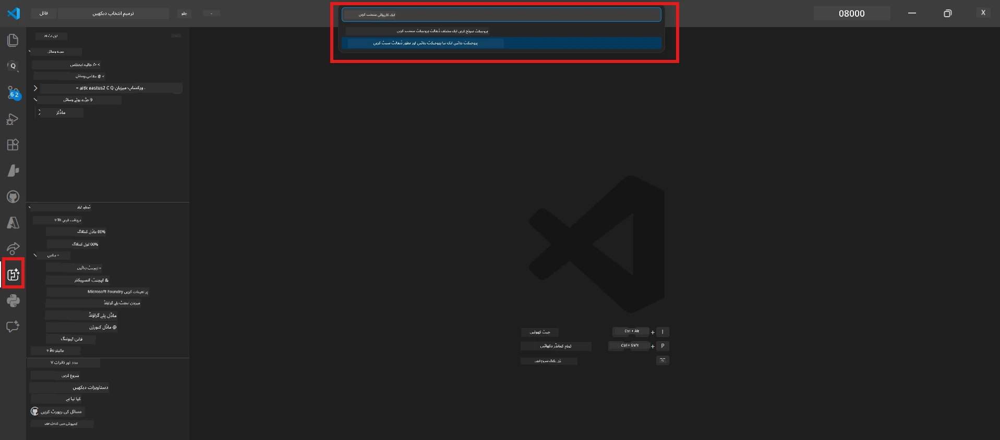
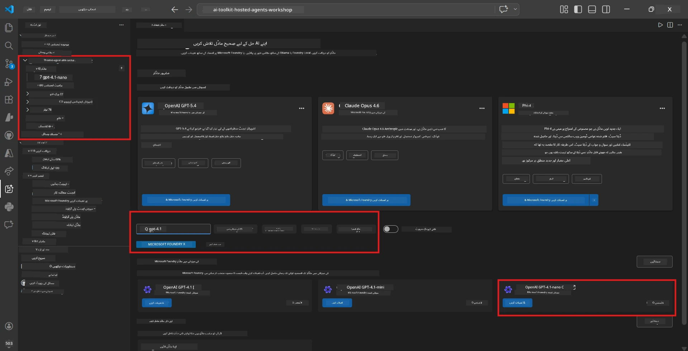
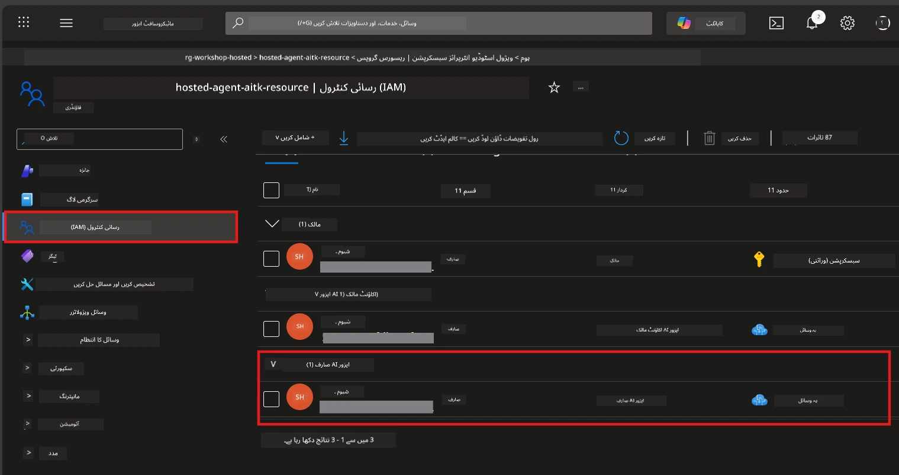

# ماڈیول 2 - فاؤنڈری پروجیکٹ بنائیں اور ماڈل کو تعینات کریں

اس ماڈیول میں، آپ مائیکروسافٹ فاؤنڈری پروجیکٹ بنائیں گے (یا منتخب کریں گے) اور ایک ماڈل تعینات کریں گے جسے آپ کا ایجنٹ استعمال کرے گا۔ ہر مرحلہ واضح طور پر لکھا گیا ہے - انہیں ترتیب سے فالو کریں۔

> اگر آپ کے پاس پہلے سے ایک فاؤنڈری پروجیکٹ ہے جس میں ماڈل تعینات ہے، تو [ماڈیول 3](03-create-hosted-agent.md) پر جائیں۔

---

## مرحلہ 1: VS کوڈ سے فاؤنڈری پروجیکٹ بنائیں

آپ مائیکروسافٹ فاؤنڈری ایکسٹینشن استعمال کریں گے تاکہ VS کوڈ کو چھوڑے بغیر پروجیکٹ بنایا جا سکے۔

1. `Ctrl+Shift+P` دبائیں تاکہ **کمانڈ پیلیٹ** کھلے۔
2. ٹائپ کریں: **Microsoft Foundry: Create Project** اور اسے منتخب کریں۔
3. ایک ڈراپ ڈاؤن ظاہر ہوگا - اپنی **Azure سبسکرپشن** فہرست سے منتخب کریں۔
4. آپ سے کہا جائے گا کہ ایک **resource group** منتخب کریں یا بنائیں:
   - نیا بنانے کے لیے: نام ٹائپ کریں (مثلاً `rg-hosted-agents-workshop`) اور انٹر دبائیں۔
   - پہلے سے موجود کو استعمال کرنے کے لیے: ڈراپ ڈاؤن سے منتخب کریں۔
5. ایک **علاقہ** منتخب کریں۔ **اہم:** ایسا علاقہ منتخب کریں جو ہوسٹڈ ایجنٹس کو سپورٹ کرتا ہو۔ چیک کریں [علاقائی دستیابی](https://learn.microsoft.com/azure/foundry/agents/concepts/hosted-agents#region-availability) - عام انتخاب `East US`، `West US 2`، یا `Sweden Central` ہیں۔
6. فاؤنڈری پروجیکٹ کے لیے ایک **نام** داخل کریں (مثلاً `workshop-agents`)۔
7. انٹر دبائیں اور پروویژننگ مکمل ہونے تک انتظار کریں۔

> **پروویژننگ میں 2-5 منٹ لگتے ہیں۔** آپ VS کوڈ کے نیچے دائیں کونے میں پروگریس نوٹیفیکیشن دیکھیں گے۔ پروویژننگ کے دوران VS کوڈ بند نہ کریں۔

8. مکمل ہونے پر، **Microsoft Foundry** سائیڈبار آپ کا نیا پروجیکٹ **Resources** کے تحت دکھائے گا۔
9. پروجیکٹ نام پر کلک کریں تاکہ اسے بڑھایا جا سکے اور تصدیق کریں کہ اس میں **Models + endpoints** اور **Agents** جیسے سیکشنز موجود ہیں۔



### متبادل: فاؤنڈری پورٹل کے ذریعے بنائیں

اگر آپ براؤزر استعمال کرنا چاہتے ہیں:

1. کھولیں [https://ai.azure.com](https://ai.azure.com) اور سائن ان کریں۔
2. ہوم پیج پر **Create project** پر کلک کریں۔
3. پروجیکٹ کا نام، اپنی سبسکرپشن، ریسورس گروپ، اور علاقہ منتخب کریں۔
4. **Create** پر کلک کریں اور پروویژننگ کا انتظار کریں۔
5. بننے کے بعد، VS کوڈ پر واپس جائیں - پروجیکٹ فاؤنڈری سائیڈبار میں ریفریش کے بعد ظاہر ہونا چاہیے (ریفریش آئیکن پر کلک کریں)۔

---

## مرحلہ 2: ماڈل تعینات کریں

آپ کے [ہوسٹڈ ایجنٹ](https://learn.microsoft.com/azure/foundry/agents/concepts/hosted-agents) کو جوابات بنانے کے لیے Azure OpenAI ماڈل کی ضرورت ہے۔ آپ اب [ایک ماڈل تعینات کریں گے](https://learn.microsoft.com/azure/ai-foundry/openai/how-to/create-resource#deploy-a-model)۔

1. `Ctrl+Shift+P` دبائیں تاکہ **کمانڈ پیلیٹ** کھلے۔
2. ٹائپ کریں: **Microsoft Foundry: Open [Model Catalog](https://learn.microsoft.com/azure/ai-foundry/openai/concepts/models)** اور اسے منتخب کریں۔
3. ماڈل کیٹلاگ ویو VS کوڈ میں کھل جائے گی۔ براؤز کریں یا سرچ بار استعمال کریں اور **gpt-4.1** تلاش کریں۔
4. **gpt-4.1** ماڈل کارڈ پر کلک کریں (یا اگر آپ کم لاگت چاہیں تو `gpt-4.1-mini`)۔
5. **Deploy** پر کلک کریں۔



6. تعیناتی کی کنفیگریشن میں:
   - **Deployment name**: ڈیفالٹ نام چھوڑیں (مثلاً `gpt-4.1`) یا اپنی مرضی کا نام درج کریں۔ **اس نام کو یاد رکھیں** - آپ کو ماڈیول 4 میں اس کی ضرورت ہوگی۔
   - **Target**: منتخب کریں **Deploy to Microsoft Foundry** اور ابھی بنایا گیا پروجیکٹ منتخب کریں۔
7. **Deploy** پر کلک کریں اور تعیناتی مکمل ہونے کا انتظار کریں (1-3 منٹ)۔

### ماڈل منتخب کرنا

| ماڈل | بہترین ہے | قیمت | نوٹس |
|-------|----------|------|-------|
| `gpt-4.1` | اعلی معیار، مفصل جوابات | زیادہ | بہترین نتائج، حتمی ٹیسٹنگ کے لیے تجویز شدہ |
| `gpt-4.1-mini` | تیز تر فعالیت، کم قیمت | کم | ورکشاپ کی ترقی اور تیز تر ٹیسٹنگ کے لیے اچھی |
| `gpt-4.1-nano` | ہلکے کام | سب سے کم | سب سے زیادہ معیشتی، مگر سادہ جوابات |

> **اس ورکشاپ کے لیے سفارش:** `gpt-4.1-mini` ترقی اور ٹیسٹنگ کے لیے استعمال کریں۔ یہ تیز، سستا ہے، اور مشقوں کے لیے اچھے نتائج دیتا ہے۔

### ماڈل تعیناتی کی تصدیق کریں

1. **Microsoft Foundry** سائیڈبار میں اپنے پروجیکٹ کو بڑھائیں۔
2. دیکھیں **Models + endpoints** کے تحت (یا ملتے جلتے سیکشن میں)۔
3. آپ کو اپنا تعینات شدہ ماڈل (مثلاً `gpt-4.1-mini`) نظر آنا چاہیے جس کا اسٹیٹس **Succeeded** یا **Active** ہو۔
4. ماڈل تعیناتی پر کلک کریں تاکہ اس کی تفصیلات دیکھ سکیں۔
5. **یہ دو قدریں نوٹ کریں** - آپ کو ماڈیول 4 میں ان کی ضرورت ہوگی:

   | سیٹنگ | کہاں ملے گی | مثال کی قیمت |
   |---------|-----------------|---------------|
   | **پروجیکٹ اینڈپوائنٹ** | فاؤنڈری سائیڈبار میں پروجیکٹ نام پر کلک کریں۔ اینڈپوائنٹ URL تفصیلات میں دکھائی دیتا ہے۔ | `https://<account>.services.ai.azure.com/api/projects/<project>` |
   | **ماڈل تعیناتی کا نام** | تعینات شدہ ماڈل کے ساتھ دکھایا گیا نام۔ | `gpt-4.1-mini` |

---

## مرحلہ 3: درکار RBAC کردار تفویض کریں

یہ **سب سے عام مسکر جانے والا قدم** ہے۔ صحیح کرداروں کے بغیر، ماڈیول 6 میں تعیناتی پر اجازت کی خرابی ہوگی۔

### 3.1 اپنے آپ کو Azure AI User کا کردار تفویض کریں

1. براؤزر کھولیں اور جائيں [https://portal.azure.com](https://portal.azure.com)۔
2. اوپر سرچ بار میں اپنے **Foundry پروجیکٹ** کا نام ٹائپ کریں اور نتیجہ میں اس پر کلک کریں۔
   - **اہم:** یقینی بنائیں کہ آپ **پروجیکٹ** ریسورس پر ہیں (قسم: "Microsoft Foundry project")، نہ کہ پیرنٹ اکاؤنٹ/ہب ریسورس پر۔
3. پروجیکٹ کی بائیں نیویگیشن میں **Access control (IAM)** پر کلک کریں۔
4. اوپر **+ Add** بٹن پر کلک کریں → **Add role assignment** منتخب کریں۔
5. **Role** ٹیب میں، تلاش کریں [**Azure AI User**](https://learn.microsoft.com/azure/foundry/concepts/rbac-foundry#built-in-roles) اور اسے منتخب کریں۔ **Next** پر کلک کریں۔
6. **Members** ٹیب میں:
   - منتخب کریں **User, group, or service principal**۔
   - **+ Select members** پر کلک کریں۔
   - اپنا نام یا ای میل تلاش کریں، اپنے آپ کو منتخب کریں، اور **Select** کریں۔
7. **Review + assign** پر کلک کریں → پھر تصدیق کے لیے دوبارہ **Review + assign**۔



### 3.2 (اختیاری) Azure AI Developer کردار تفویض کریں

اگر آپ کو پروجیکٹ میں اضافی ریسورسز بنانے یا پروگرام کے ذریعے deployments منظم کرنے کی ضرورت ہو:

1. اوپر کے مراحل کو دہرائیں، لیکن مرحلہ 5 میں **Azure AI Developer** منتخب کریں۔
2. اسے صرف پروجیکٹ کی سطح پر نہیں، بلکہ **Foundry resource (account)** سطح پر تفویض کریں۔

### 3.3 اپنے کردار کی تفویض کی تصدیق کریں

1. پروجیکٹ کے **Access control (IAM)** صفحے پر، **Role assignments** ٹیب پر کلک کریں۔
2. اپنا نام تلاش کریں۔
3. آپ کو پروجیکٹ کے دائرہ کار میں کم از کم **Azure AI User** نظر آنا چاہیے۔

> **یہ کیوں اہم ہے:** [`Azure AI User`](https://learn.microsoft.com/azure/foundry/concepts/rbac-foundry#built-in-roles) کردار `Microsoft.CognitiveServices/accounts/AIServices/agents/write` ڈیٹا ایکشن دیتا ہے۔ اس کے بغیر، آپ کو تعیناتی کے دوران یہ غلطی دکھائی دے گی:
>
> ```
> Error: lacks the required data action 
> Microsoft.CognitiveServices/accounts/AIServices/agents/write 
> to perform POST /api/projects/{projectName}/assistants operation.
> ```
>
> مزید تفصیلات کے لیے دیکھیں [ماڈیول 8 - مسئلہ حل کرنا](08-troubleshooting.md)۔

---

### چیک پوائنٹ

- [ ] فاؤنڈری پروجیکٹ موجود ہے اور VS کوڈ میں Microsoft Foundry سائیڈبار میں دکھائی دے رہا ہے
- [ ] کم از کم ایک ماڈل تعینات ہے (مثلاً `gpt-4.1-mini`) اسٹیٹس **Succeeded** کے ساتھ
- [ ] آپ نے **پروجیکٹ اینڈپوائنٹ** URL اور **ماڈل ڈیپلائمنٹ کا نام** نوٹ کر لیا ہے
- [ ] آپ کو **Azure AI User** کردار پروجیکٹ کی سطح پر تفویض کیا گیا ہے (Azure پورٹل → IAM → Role assignments میں تصدیق کریں)
- [ ] پروجیکٹ ایک [حمایت شدہ علاقے](https://learn.microsoft.com/azure/foundry/agents/concepts/hosted-agents#region-availability) میں ہے جہاں ہوسٹڈ ایجنٹس کو سپورٹ ملے

---

**پچھلا:** [01 - Install Foundry Toolkit](01-install-foundry-toolkit.md) · **اگلا:** [03 - Create a Hosted Agent →](03-create-hosted-agent.md)

---

<!-- CO-OP TRANSLATOR DISCLAIMER START -->
**انتباہ**:
یہ دستاویز AI ترجمہ سروس [Co-op Translator](https://github.com/Azure/co-op-translator) کا استعمال کرتے ہوئے ترجمہ کی گئی ہے۔ اگرچہ ہم درستگی کے لئے کوشاں ہیں، براہ کرم یاد رکھیں کہ خودکار تراجم میں غلطیاں یا نقائص ہو سکتے ہیں۔ اصل دستاویز اپنی مادری زبان میں معتبر ماخذ سمجھی جانی چاہئے۔ اہم معلومات کے لئے پیشہ ور انسانی ترجمہ کی سفارش کی جاتی ہے۔ اس ترجمہ کے استعمال سے پیدا ہونے والی کسی بھی غلط فہمیوں یا غلط تشریحات کا ہم ذمہ دار نہیں ہیں۔
<!-- CO-OP TRANSLATOR DISCLAIMER END -->