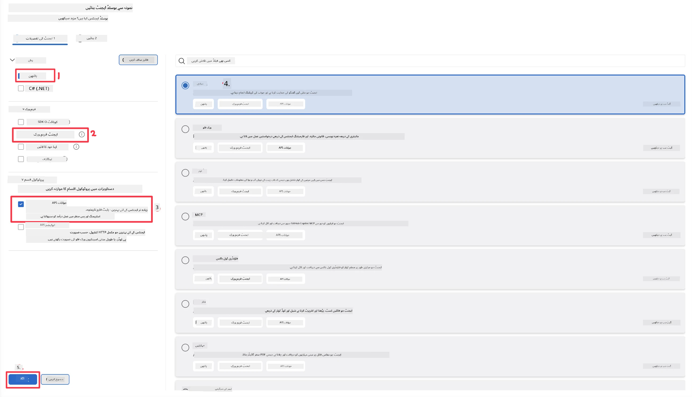
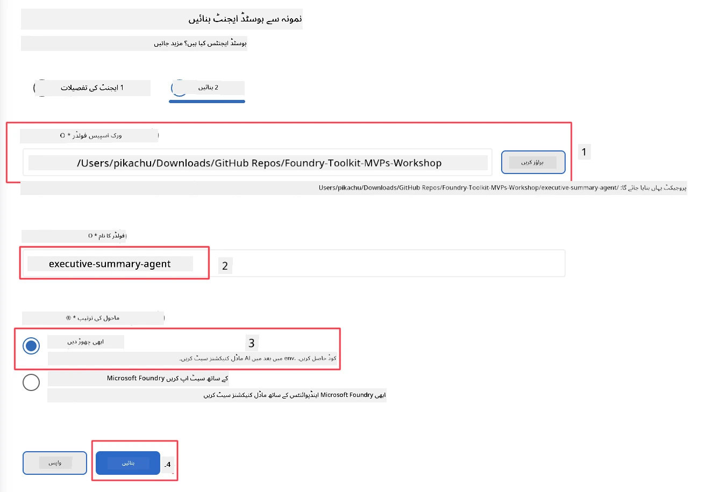

# ماڈیول 2 - نیا ہوسٹڈ ایجنٹ بنائیں

⏱️ ~5 منٹ

اس ماڈیول میں، آپ Foundry Toolkit استعمال کرتے ہوئے **ہوسٹڈ ایجنٹ پروجیکٹ بنانے کا اسکیفولڈ** کرتے ہیں۔ اس اسکیفولڈ سے مکمل پروجیکٹ کا ڈھانچہ تیار ہوتا ہے - `agent.yaml`, `main.py`, `Dockerfile`, `requirements.txt`, اور VS Code ڈیبگ کنفیگریشن - تاکہ آپ ایجنٹ کے رویے کو حسبِ ضرورت بنانے پر توجہ دے سکیں۔

> **اہم تصور:** اس لیب میں `agent/` فولڈر Foundry Toolkit کے تیار کردہ نمونے کی مثال ہے۔ آپ یہ فائلیں شروع سے خود نہیں لکھتے۔

### اسکیفولڈ وزرڈ کا عمل


---

## مرحلہ 1: Create Hosted Agent وزرڈ کھولیں

1. **کمانڈ پیلیٹ** کھولنے کے لیے `Ctrl+Shift+P` دبائیں۔
2. ٹائپ کریں: **Foundry Toolkit: Create new Hosted Agent** اور اسے منتخب کریں۔

> **متبادل: Foundry پورٹل کے ذریعے بنائیں**
> اگر آپ براؤزر استعمال کرنا پسند کرتے ہیں تو آپ اپنا پروجیکٹ [https://ai.azure.com](https://ai.azure.com) پر بنا سکتے ہیں۔ پروجیکٹ تیار ہونے کے بعد VS Code میں واپس آ کر **Foundry Toolkit** سائیڈبار سے اس سے جڑیں۔

> **متبادل:** Foundry Toolkit سائیڈبار میں **Hosted Agents (Preview)** کے ساتھ موجود **+** آئیکن پر کلک کریں۔

## مرحلہ 2: سیٹنگز منتخب کریں



1. بائیں نیویگیشن/اختیارات سیکشن میں درج ذیل انتخاب کریں:

| مینو | انتخاب | نوٹس |
|--------|-----------|-------|
| **زبان** | Python | C# بھی سپورٹ شدہ ہے |
| **فریم ورک** | Agent Framework | Agent Framework SDK کا سادہ آغاز نقطہ |
| **API قسم** | Response API | `POST /responses` - مکالماتی، پلیٹ فارم کے زیر انتظام ہسٹری کے ساتھ |
| **ٹیمپلیٹ** | Basic | Agent Framework SDK کا سادہ آغاز نقطہ |

2. انتخاب مکمل ہونے پر، **Next** پر کلک کریں



3. اگلی ونڈو میں درج ذیل چنیں:

| مینو | انتخاب | نوٹس |
|--------|-----------|-------|
| **ورک اسپیس فولڈر** | ہدف فولڈر منتخب کریں | مثلاً `/workspace/Foundry_Toolkit_for_VSCode_Lab/` یا اس ریپو کا کوئی سب فولڈر |
| **ایجنٹ کا نام** | نام درج کریں | مثلاً `executive-summary-agent` |
| **ماحولیاتی سیٹ اپ** | ابھی سیٹ اپ چھوڑ دیں |  |

اپنا ایجنٹ بنانے کے لیے **create** پر کلک کریں۔ ایک نیا فولڈر ہوسٹڈ ایجنٹ کے نام سے بن جائے گا۔

## مرحلہ 3: تیار شدہ پروجیکٹ کا جائزہ لیں

اسکیفولڈنگ مکمل ہونے کے بعد، ایڈجسٹ کریں کہ ایکسپلورر (`Ctrl+Shift+E`) میں یہ فائلیں نظر آ رہی ہوں:

```
📂 my-agent/
├── .env                ← Environment variables (placeholders)
├── .vscode/
│   ├── launch.json     ← Debug config (F5 → run + Agent Inspector)
│   └── tasks.json      ← VS Code task definitions
├── agent.yaml          ← Agent definition (kind: hosted)
├── Dockerfile          ← Container config for deployment
├── main.py             ← Agent entry point (your main code)
└── requirements.txt    ← Python dependencies
```

### اہم فائلوں کی وضاحت

| فائل | مقصد |
|------|---------|
| `agent.yaml` | ایجنٹ کو `kind: hosted` کے طور پر ظاہر کرتا ہے، ماحولیاتی متغیرات کو میپ کرتا ہے، اور `/responses` پروٹوکول کی تعریف کرتا ہے |
| `main.py` | `FoundryChatClient` بناتا ہے → اسے `Agent` میں ہدایات کے ساتھ لپیٹتا ہے → `ResponsesHostServer` کے ذریعہ پورٹ 8088 پر سروس دیتا ہے |
| `Dockerfile` | `python:3.12-slim` استعمال کرتا ہے، انحصاریات انسٹال کرتا ہے، پورٹ 8088 کو کھولتا ہے، `main.py` چلاتا ہے |
| `requirements.txt` | `agent-framework-foundry`, `agent-framework-foundry-hosting`, `mcp`, `debugpy` |

> **اہم:** اسکیفولڈ کیا گیا ایجنٹ فولڈر براہ راست VS Code میں کھولیں (صرف `agent/` فولڈر خود) تاکہ `.vscode/launch.json` اور `tasks.json` ایف5 ڈیبگنگ کے لیے درست کام کریں۔

---

### ✅ چیک پوائنٹ

- [ ] تمام متوقع فائلوں کے ساتھ اسکیفولڈ پروجیکٹ تیار ہو گیا
- [ ] `agent.yaml` میں `kind: hosted` اور `protocol: responses` ظاہر ہو رہا ہے
- [ ] `main.py` میں `Agent`, `FoundryChatClient`, `ResponsesHostServer` درآمد کیے گئے ہیں
- [ ] ایجنٹ فولڈر ورک اسپیس روٹ کے طور پر VS Code میں کھلا ہے

---

**پچھلا:** [01 - Setup](01-setup.md) · **اگلا:** [03 - Configure & Code →](03-configure-and-code.md)

---

<!-- CO-OP TRANSLATOR DISCLAIMER START -->
**ڈس کلیمر**:
یہ دستاویز AI ترجمہ سروس [Co-op Translator](https://github.com/Azure/co-op-translator) کے ذریعے ترجمہ کی گئی ہے۔ جبکہ ہم درستگی کے لیے کوشاں ہیں، براہ کرم اس بات سے آگاہ رہیں کہ خودکار ترجمے میں غلطیاں یا عدم درستیاں ہو سکتی ہیں۔ اصل دستاویز اپنے مادری زبان میں مستند ماخذ سمجھی جائے گی۔ حساس معلومات کے لیے پیشہ ور انسانی ترجمہ کی سفارش کی جاتی ہے۔ اس ترجمے کے استعمال سے پیدا ہونے والی کسی بھی غلط فہمی یا غلط تشریح کی ذمہ داری ہم قبول نہیں کرتے۔
<!-- CO-OP TRANSLATOR DISCLAIMER END -->