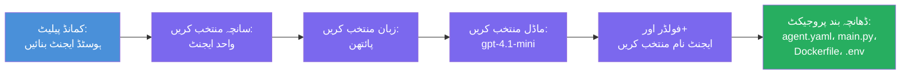

# ماڈیول 3 - ایک نیا ہوسٹڈ ایجنٹ بنائیں (فاؤنڈری ایکسٹینشن کی طرف سے آٹوسکافولڈ کیا گیا)

اس ماڈیول میں، آپ مائیکروسافٹ فاؤنڈری ایکسٹینشن استعمال کرتے ہوئے **ایک نیا [ہوسٹڈ ایجنٹ](https://learn.microsoft.com/azure/foundry/agents/concepts/hosted-agents) پروجیکٹ سکافولڈ کرتے ہیں**۔ ایکسٹینشن پورے پروجیکٹ کا ڈھانچہ خود بخود تیار کرتا ہے - جس میں `agent.yaml`، `main.py`، `Dockerfile`, `requirements.txt`, ایک `.env` فائل، اور VS کوڈ کی ڈیبگ کنفیگریشن شامل ہے۔ سکافولڈنگ کے بعد، آپ ان فائلوں کو اپنے ایجنٹ کی ہدایات، آلات، اور کنفیگریشن کے ساتھ اپنی مرضی کے مطابق بناتے ہیں۔

> **اہم تصور:** اس لیب میں `agent/` فولڈر اس بات کی مثال ہے جو فاؤنڈری ایکسٹینشن اس سکافولڈ کمانڈ کے چلانے پر تیار کرتا ہے۔ آپ یہ فائلیں خود سے نہیں لکھتے - ایکسٹینشن انہیں بناتا ہے، اور پھر آپ ان میں ترمیم کرتے ہیں۔

### سکافولڈ وزارڈ کا عمل


---

## مرحلہ 1: Create Hosted Agent وزارڈ کھولیں

1. `Ctrl+Shift+P` دبائیں تاکہ **کمانڈ پیلیٹ** کھل جائے۔
2. لکھیں: **Microsoft Foundry: Create a New Hosted Agent** اور اسے منتخب کریں۔
3. ہوسٹڈ ایجنٹ بنانے کا وزارڈ کھل جائے گا۔

> **متبادل راستہ:** آپ مائیکروسافٹ فاؤنڈری سائڈبار سے بھی اس وزارڈ تک پہنچ سکتے ہیں → **Agents** کے ساتھ موجود **+** آئیکن پر کلک کریں یا رائٹ کلک کرکے **Create New Hosted Agent** منتخب کریں۔

---

## مرحلہ 2: اپنا ٹیمپلیٹ منتخب کریں

وزارڈ آپ سے ٹیمپلیٹ منتخب کرنے کو کہتا ہے۔ آپ کو درج ذیل اختیارات نظر آئیں گے:

| ٹیمپلیٹ | وضاحت | کب استعمال کریں |
|----------|-------------|-------------|
| **Single Agent** | ایک ایجنٹ جس کا اپنا ماڈل، ہدایات، اور اختیاری آلات ہوں | یہ ورکشاپ (لیب 01) |
| **Multi-Agent Workflow** | متعدد ایجنٹس جو ایک دوسرے کے ساتھ متسلسل تعاون کرتے ہوں | لیب 02 |

1. **Single Agent** منتخب کریں۔
2. **Next** پر کلک کریں (یا خودکار طور پر انتخاب آگے بڑھ جائے گا)۔

---

## مرحلہ 3: پروگرامنگ زبان منتخب کریں

1. **Python** منتخب کریں (اس ورکشاپ کے لیے تجویز کردہ)۔
2. **Next** پر کلک کریں۔

> **C# بھی سپورٹڈ ہے** اگر آپ .NET پسند کرتے ہیں۔ سکافولڈ ڈھانچہ ملتا جلتا ہے (یہ `main.py` کے بجائے `Program.cs` استعمال کرتا ہے)۔

---

## مرحلہ 4: اپنا ماڈل منتخب کریں

1. وزارڈ آپ کے فاؤنڈری پروجیکٹ میں تعینات کردہ ماڈلز دکھاتا ہے (ماڈیول 2 سے)۔
2. اپنا تعینات کردہ ماڈل منتخب کریں - مثلاً **gpt-4.1-mini**۔
3. **Next** پر کلک کریں۔

> اگر آپ کو کوئی ماڈل نہیں دکھائی دیتا، تو واپس [ماڈیول 2](02-create-foundry-project.md) پر جائیں اور پہلے ایک ماڈل تعینات کریں۔

---

## مرحلہ 5: فولڈر کی جگہ اور ایجنٹ کا نام منتخب کریں

1. ایک فائل ڈائیلاگ کھلتا ہے - منتخب کریں ایک **ہدف فولڈر** جہاں پروجیکٹ بنایا جائے گا۔ اس ورکشاپ کے لیے:
   - اگر نیا شروع کر رہے ہیں: کوئی بھی فولڈر منتخب کریں (مثلاً `C:\Projects\my-agent`)
   - اگر ورکشاپ ریپو کے اندر کام کر رہے ہیں: `workshop/lab01-single-agent/agent/` کے تحت ایک نیا سب فولڈر بنائیں
2. ہوسٹڈ ایجنٹ کے لیے ایک **نام** درج کریں (مثلاً `executive-summary-agent` یا `my-first-agent`)۔
3. **Create** پر کلک کریں (یا انٹر دبائیں)۔

---

## مرحلہ 6: سکافولڈنگ مکمل ہونے کا انتظار کریں

1. VS کوڈ ایک **نیا ونڈو** کھولتا ہے جس میں سکافولڈڈ پروجیکٹ ہوتا ہے۔
2. پروجیکٹ کے مکمل لوڈ ہونے کے لیے چند سیکنڈ انتظار کریں۔
3. آپ کو ایکسپلورر پینل (`Ctrl+Shift+E`) میں درج ذیل فائلیں نظر آنی چاہئیں:

```
📂 my-first-agent/
├── .env                ← Environment variables (auto-generated with placeholders)
├── .vscode/
│   └── launch.json     ← Debug configuration (F5 to run + Agent Inspector)
├── agent.yaml          ← Agent definition (kind: hosted)
├── Dockerfile          ← Container configuration for deployment
├── main.py             ← Agent entry point (your main code file)
└── requirements.txt    ← Python dependencies
```

> **یہی وہ ڈھانچہ ہے جیسے اس لیب میں `agent/` فولڈر ہے۔** فاؤنڈری ایکسٹینشن یہ فائلیں خودکار طریقے سے بناتا ہے - آپ کو دستی طور پر بنانا نہیں پڑتا۔

> **ورکشاپ نوٹ:** اس ورکشاپ ریپوزیٹری میں `.vscode/` فولڈر **ورک اسپیس روٹ** پر ہے (ہر پروجیکٹ کے اندر نہیں)۔ اس میں ایک مشترکہ `launch.json` اور `tasks.json` ہے جس میں دو ڈیبگ کنفیگریشنز ہیں - **"Lab01 - Single Agent"** اور **"Lab02 - Multi-Agent"** - ہر ایک صحیح لیب کے `cwd` کی طرف اشارہ کرتا ہے۔ جب آپ F5 دباتے ہیں، تو ڈراپ ڈاؤن سے اس لیب کی کنفیگریشن منتخب کریں جس پر آپ کام کر رہے ہیں۔

---

## مرحلہ 7: ہر پیدا ہونے والی فائل کو سمجھیں

ہر فائل کا جائزہ لیں جو وزارڈ نے بنائی ہے۔ انہیں سمجھنا ماڈیول 4 (حسب ضرورت) کے لیے اہم ہے۔

### 7.1 `agent.yaml` - ایجنٹ کی تعریف

`agent.yaml` کھولیں۔ یہ کچھ اس طرح دکھتا ہے:

```yaml
# yaml-language-server: $schema=https://raw.githubusercontent.com/microsoft/AgentSchema/refs/heads/main/schemas/v1.0/ContainerAgent.yaml

kind: hosted
name: my-first-agent
description: >
  A hosted agent deployed to Microsoft Foundry Agent Service.
metadata:
  authors:
    - Microsoft
  tags:
    - Azure AI AgentServer
    - Microsoft Agent Framework
    - Hosted Agent
protocols:
  - protocol: responses
    version: v1
environment_variables:
  - name: AZURE_AI_PROJECT_ENDPOINT
    value: ${PROJECT_ENDPOINT}
  - name: AZURE_AI_MODEL_DEPLOYMENT_NAME
    value: ${MODEL_DEPLOYMENT_NAME}
dockerfile_path: Dockerfile
resources:
  cpu: '0.25'
  memory: 0.5Gi
```

**اہم فیلڈز:**

| فیلڈ | مقصد |
|-------|---------|
| `kind: hosted` | اعلان کرتا ہے کہ یہ ایک ہوسٹڈ ایجنٹ ہے (کنٹینر پر مبنی، [Foundry Agent Service](https://learn.microsoft.com/azure/foundry/agents/overview) پر تعینات) |
| `protocols: responses v1` | ایجنٹ OpenAI-مطابق `/responses` HTTP اینڈپوائنٹ کو ظاہر کرتا ہے |
| `environment_variables` | `.env` کی قدروں کو تعیناتی کے وقت کنٹینر کے env vars سے منسلک کرتا ہے |
| `dockerfile_path` | کنٹینر امیج بنانے کے لیے Dockerfile کی جگہ بتاتا ہے |
| `resources` | کنٹینر کے لیے CPU اور میموری کی تخصیص (0.25 CPU، 0.5Gi میموری) |

### 7.2 `main.py` - ایجنٹ انٹری پوائنٹ

`main.py` کھولیں۔ یہ مرکزی پائتھن فائل ہے جہاں آپ کا ایجنٹ لاجک ہوتا ہے۔ سکافولڈ درج ذیل شامل کرتا ہے:

```python
from agent_framework.azure import AzureAIAgentClient
from azure.ai.agentserver.agentframework import from_agent_framework
from azure.identity.aio import DefaultAzureCredential
```

**اہم درآمدات:**

| امپورٹ | مقصد |
|--------|--------|
| `AzureAIAgentClient` | آپ کے فاؤنڈری پروجیکٹ سے جڑتا ہے اور `.as_agent()` کے ذریعے ایجنٹ بناتا ہے |
| [`DefaultAzureCredential`](https://learn.microsoft.com/azure/developer/python/sdk/authentication/credential-chains#defaultazurecredential-overview) | توثیق (Azure CLI، VS کوڈ سائن ان، مینیجڈ شناخت، یا سروس پرنسپل) کی ذمہ داری سنبھالتا ہے |
| `from_agent_framework` | ایجنٹ کو HTTP سرور کی صورت دیتا ہے جو `/responses` اینڈپوائنٹ کو ظاہر کرتا ہے |

مین فلو یہ ہے:
1. ایک اسناد بنائیں → کلائنٹ بنائیں → `.as_agent()` کال کریں تاکہ ایجنٹ حاصل کریں (async کانٹیکسٹ منیجر) → اسے سرور کے طور پر لپیٹیں → چلائیں

### 7.3 `Dockerfile` - کنٹینر امیج

```dockerfile
FROM python:3.14-slim

WORKDIR /app

COPY ./ .

RUN pip install --upgrade pip && \
    if [ -f requirements.txt ]; then \
        pip install -r requirements.txt; \
    else \
        echo "No requirements.txt found" >&2; exit 1; \
    fi

EXPOSE 8088

CMD ["python", "main.py"]
```

**اہم تفصیلات:**
- `python:3.14-slim` کو بنیادی امیج کے طور پر استعمال کرتا ہے۔
- تمام پروجیکٹ فائلیں `/app` میں کاپی کرتا ہے۔
- `pip` کو اپگریڈ کرتا ہے، `requirements.txt` سے انحصار انسٹال کرتا ہے، اور اگر یہ فائل موجود نہ ہو تو فوری ناکام ہو جاتا ہے۔
- **پورٹ 8088 کو ظاہر کرتا ہے** - یہ ہوسٹڈ ایجنٹ کے لیے ضروری پورٹ ہے۔ اسے تبدیل نہ کریں۔
- ایجنٹ کو `python main.py` سے شروع کرتا ہے۔

### 7.4 `requirements.txt` - انحصار

```
agent-framework-azure-ai==1.0.0rc3
agent-framework-core==1.0.0rc3
azure-ai-agentserver-agentframework==1.0.0b16
azure-ai-agentserver-core==1.0.0b16
debugpy
agent-dev-cli
```

| پیکج | مقصد |
|---------|---------|
| `agent-framework-azure-ai` | مائیکروسافٹ ایجنٹ فریم ورک کے لیے Azure AI انٹیگریشن |
| `agent-framework-core` | ایجنٹ بنانے کے لیے بنیادی رن ٹائم (جس میں `python-dotenv` بھی شامل ہے) |
| `azure-ai-agentserver-agentframework` | Foundry Agent Service کے لیے ہوسٹڈ ایجنٹ سرور رن ٹائم |
| `azure-ai-agentserver-core` | بنیادی ایجنٹ سرور انتزاعیات |
| `debugpy` | پائتھن ڈیبگنگ سپورٹ (جو VS کوڈ میں F5 ڈیبگنگ کی اجازت دیتا ہے) |
| `agent-dev-cli` | ایجنٹس کی مقامی ترقی کے لیے CLI (ڈیبگ/رن کنفیگریشن کے لیے استعمال ہوتا ہے) |

---

## ایجنٹ پروٹوکول کو سمجھنا

ہوسٹڈ ایجنٹس **OpenAI Responses API** پروٹوکول کے ذریعے بات چیت کرتے ہیں۔ چلتے ہوئے (مقامی یا کلاؤڈ میں)، ایجنٹ ایک واحد HTTP اینڈپوائنٹ دکھاتا ہے:

```
POST http://localhost:8088/responses
Content-Type: application/json

{
  "input": "Your prompt here",
  "stream": false
}
```

فاؤنڈری ایجنٹ سروس اس اینڈپوائنٹ کو صارف کے پرامپٹس بھیجنے اور ایجنٹ کے جوابات حاصل کرنے کے لیے کال کرتی ہے۔ یہ وہی پروٹوکول ہے جو OpenAI API استعمال کرتا ہے، اس لیے آپ کا ایجنٹ کسی بھی کلائنٹ کے ساتھ مطابقت رکھتا ہے جو OpenAI Responses فارمیٹ بولتا ہے۔

---

### چیک پوائنٹ

- [ ] سکافولڈ وزارڈ کامیابی سے مکمل ہوا اور ایک **نیا VS کوڈ ونڈو** کھلا
- [ ] آپ تمام 5 فائلیں دیکھ سکتے ہیں: `agent.yaml`, `main.py`, `Dockerfile`, `requirements.txt`, `.env`
- [ ] `.vscode/launch.json` فائل موجود ہے (F5 ڈیبگنگ کو فعال کرتا ہے - اس ورکشاپ میں یہ ورک اسپیس روٹ پر لیب مخصوص کنفیگریشنز کے ساتھ ہے)
- [ ] آپ نے ہر فائل کو پڑھا اور اس کا مقصد سمجھ لیا
- [ ] آپ سمجھتے ہیں کہ پورٹ `8088` ضروری ہے اور `/responses` اینڈپوائنٹ پروٹوکول ہے

---

**پچھلا:** [02 - Create Foundry Project](02-create-foundry-project.md) · **اگلا:** [04 - Configure & Code →](04-configure-and-code.md)

---

<!-- CO-OP TRANSLATOR DISCLAIMER START -->
**اخطار**:  
یہ دستاویز AI ترجمہ سروس [Co-op Translator](https://github.com/Azure/co-op-translator) کے ذریعے ترجمہ کی گئی ہے۔ اگرچہ ہم درستگی کے لیے کوشاں ہیں، براہ کرم اس بات سے آگاہ رہیں کہ خودکار تراجم میں غلطیاں یا عدم درستیاں ہو سکتی ہیں۔ اصل دستاویز اپنی مادری زبان میں مستند ماخذ سمجھی جانی چاہیے۔ اہم معلومات کے لیے پیشہ ور انسانی ترجمہ تجویز کیا جاتا ہے۔ اس ترجمے کے استعمال سے پیدا ہونے والے کسی بھی غلط فہم یا غلط تشریحات کے لیے ہم ذمہ دار نہیں ہیں۔
<!-- CO-OP TRANSLATOR DISCLAIMER END -->