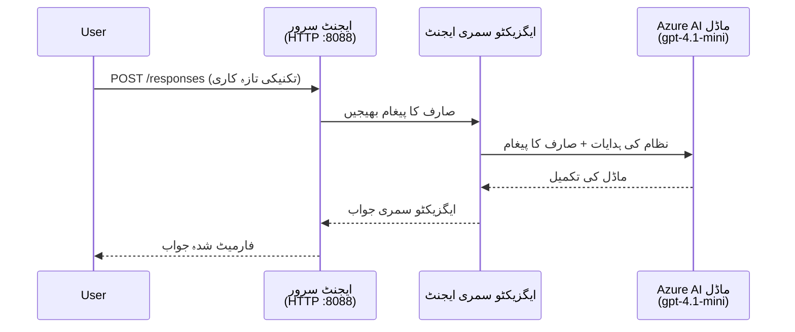
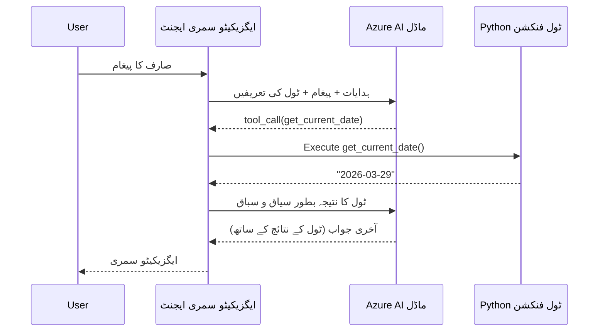

# ماڈیول 4 - ہدایات ترتیب دینا، ماحول اور انحصار انسٹال کرنا

اس ماڈیول میں، آپ ماڈیول 3 سے خودکار اسکافولڈ کیے گئے ایجنٹ فائلوں کو حسبِ منشا ڈھالتے ہیں۔ یہ وہ جگہ ہے جہاں آپ عمومی اسکافولڈ کو **اپنے** ایجنٹ میں تبدیل کرتے ہیں — ہدایات لکھ کر، ماحول کے متغیرات ترتیب دے کر، اختیاری طور پر ٹولز شامل کر کے، اور انحصارات انسٹال کر کے۔

> **یاد دہانی:** فاؤنڈری ایکسٹینشن نے آپ کے پروجیکٹ کی فائلیں خود بخود تیار کی تھیں۔ اب آپ انہیں تبدیل کرتے ہیں۔ مکمل کام کرنے والے حسبِ منشا ایجنٹ کی مثال کے لیے [`agent/`](../../../../../workshop/lab01-single-agent/agent) فولڈر دیکھیں۔

---

## اجزاء کس طرح ایک دوسرے سے جڑے ہیں

### درخواست کا لائف سائیکل (واحد ایجنٹ)


> **ٹولز کے ساتھ:** اگر ایجنٹ کے پاس رجسٹرڈ ٹولز ہیں، تو ماڈل براہِ راست جواب کی بجائے ٹول کال واپس کر سکتا ہے۔ فریم ورک ٹول کو مقامی طور پر چلائے گا، نتیجہ ماڈل کو واپس دے گا، اور ماڈل پھر حتمی جواب تیار کرے گا۔


---

## مرحلہ 1: ماحول کے متغیرات ترتیب دیں

اسکافولڈ نے ایک `.env` فائل placeholder ویلیوز کے ساتھ بنائی ہے۔ آپ کو ماڈیول 2 سے حقیقی ویلیوز بھرنی ہوں گی۔

1. اپنے اسکافولڈ پروجیکٹ میں، **`.env`** فائل کھولیں (یہ پروجیکٹ کے روٹ میں ہے)۔
2. placeholder ویلیوز کو اپنے اصلی فاؤنڈری پروجیکٹ کے تفصیلات سے بدلیں:

   ```env
   PROJECT_ENDPOINT=https://<your-account>.services.ai.azure.com/api/projects/<your-project>
   MODEL_DEPLOYMENT_NAME=gpt-4.1-mini
   ```

3. فائل محفوظ کر لیں۔

### یہ ویلیوز کہاں ملیں گی

| ویلیو | کہاں تلاش کریں |
|-------|----------------|
| **پروجیکٹ کا اینڈ پوائنٹ** | VS Code میں **Microsoft Foundry** سائیڈبار کھولیں → اپنے پروجیکٹ پر کلک کریں → اینڈ پوائنٹ URL تفصیل میں دکھائی دے گا۔ یہ کچھ ایسا نظر آتا ہے `https://<account-name>.services.ai.azure.com/api/projects/<project-name>` |
| **ماڈل ڈیپلوئےمنٹ کا نام** | فاؤنڈری سائیڈبار میں اپنے پروجیکٹ کو بڑھائیں → **Models + endpoints** کے نیچے دیکھیں → نام ڈیپلوئے کردہ ماڈل کے ساتھ لکھا ہوگا (مثلاً `gpt-4.1-mini`) |

> **سیکورٹی:** `.env` فائل کو کبھی ورژن کنٹرول میں شامل نہ کریں۔ یہ ڈیفالٹ کے طور پر `.gitignore` میں شامل ہے۔ اگر نہیں ہے، تو اسے شامل کریں:
> ```
> .env
> ```

### ماحول کے متغیرات کیسے بہتے ہیں

میپنگ چین یہ ہے: `.env` → `main.py` (جو `os.getenv` کے ذریعے پڑھتا ہے) → `agent.yaml` (جو ڈیپلائےمنٹ کے وقت کنٹینر ماحول کے متغیرات سے میپ ہوتا ہے)۔

`main.py` میں اسکافولڈ اس طرح ویلیوز پڑھتا ہے:

```python
PROJECT_ENDPOINT = os.getenv("AZURE_AI_PROJECT_ENDPOINT") or os.getenv("PROJECT_ENDPOINT")
MODEL_DEPLOYMENT_NAME = os.getenv("AZURE_AI_MODEL_DEPLOYMENT_NAME", os.getenv("MODEL_DEPLOYMENT_NAME", "gpt-4.1-mini"))
```

دونوں `AZURE_AI_PROJECT_ENDPOINT` اور `PROJECT_ENDPOINT` قبول کیے جاتے ہیں (agent.yaml میں `AZURE_AI_*` پیش لفظ استعمال ہوتا ہے)۔

---

## مرحلہ 2: ایجنٹ کی ہدایات لکھیں

یہ سب سے اہم تخصیص کا مرحلہ ہے۔ ہدایات آپ کے ایجنٹ کی شخصیت، رویہ، آؤٹ پٹ فارمیٹ، اور حفاظتی پابندیاں متعین کرتی ہیں۔

1. اپنے پروجیکٹ میں `main.py` کھولیں۔
2. ہدایات کی سٹرنگ تلاش کریں (اسکافولڈ میں ایک ڈیفالٹ/جنیرک شامل ہوتی ہے)۔
3. اسے تفصیلی، منظم ہدایات سے بدل دیں۔

### اچھی ہدایات میں کیا شامل ہوتا ہے

| جزو | مقصد | مثال |
|-------|--------|-------|
| **کردار (Role)** | ایجنٹ کیا ہے اور کیا کرتا ہے | "آپ ایک ایکزیکٹو سمری ایجنٹ ہیں" |
| **ناظرین (Audience)** | جوابات کس کے لیے ہیں | "سینئر لیڈرز جن کا تکنیکی پس منظر محدود ہے" |
| **ان پٹ کی تعریف** | کون سے قسم کے پرامپٹس وہ ہینڈل کرتا ہے | "تکنیکی واقعہ رپورٹس، آپریشنل اپڈیٹس" |
| **آؤٹ پٹ فارمیٹ** | جوابات کی درست ساخت | "ایگزیکٹو سمری: - کیا ہوا: ... - کاروباری اثر: ... - اگلا قدم: ..." |
| **قواعد (Rules)** | پابندیاں اور انکار کی شرائط | "فراہم کردہ معلومات سے زیادہ معلومات شامل نہ کریں" |
| **حفاظت (Safety)** | غلط استعمال اور وہمی جواب سے بچاؤ | "اگر ان پٹ غیر واضح ہو تو وضاحت طلب کریں" |
| **مثالیں (Examples)** | رویے کو ہموار کرنے کے لیے ان پٹ/آؤٹ پٹ جوڑے | 2-3 مختلف ان پٹ کے ساتھ مثالیں شامل کریں |

### مثال: ایکزیکٹو سمری ایجنٹ کی ہدایات

یہ وہ ہدایات ہیں جو ورکشاپ کے [`agent/main.py`](../../../../../workshop/lab01-single-agent/agent/main.py) میں استعمال ہوئی ہیں:

```python
AGENT_INSTRUCTIONS = """You are an "Explain Like I'm an Executive" agent.

Purpose:
Your job is to translate complex technical or operational information into
clear, concise, and outcome-focused summaries that can be easily understood
by non-technical executives.

Audience:
Senior leaders with limited technical background who care about impact,
risk, and what happens next.

What you must do:
- Rephrase the input so it is understandable to a non-technical audience
- Prioritize clarity, brevity, and outcomes over technical accuracy
- Remove technical jargon, logs, metrics, stack traces, and deep root-cause details
- Translate technical causes into simple cause-and-effect statements
- Explicitly call out business impact
- Always include a clear next step or action
- Maintain a neutral, factual, and calm executive tone
- Do NOT add new facts or speculate beyond the input

Standard Output Structure (always use this wording):

Executive Summary:
- What happened: <plain-language description>
- Business impact: <clear, non-technical impact>
- Next step: <clear action or mitigation>

Rules:
- Keep responses under 100 words
- Do NOT add facts beyond the input
- If input is unclear, ask for clarification
"""
```

4. `main.py` میں موجود ہدایات کی موجودہ سٹرنگ کو اپنی حسبِ منشا ہدایات سے بدل دیں۔
5. فائل محفوظ کریں۔

---

## مرحلہ 3: (اختیاری) حسبِ منشا ٹولز شامل کریں

ہوسٹڈ ایجنٹ لوکل پائیتھون فنکشنز کو [ٹولز](https://learn.microsoft.com/azure/foundry/agents/concepts/tool-catalog) کے طور پر چلا سکتے ہیں۔ یہ کوڈ پر مبنی ہوسٹڈ ایجنٹس کی ایک اہم برتری ہے جو صرف پرامپٹ پر مبنی ایجنٹس کے مقابلے میں ہے — آپ کا ایجنٹ کسی بھی سرور سائیڈ منطق کو چلا سکتا ہے۔

### 3.1 ٹول فنکشن کی تعریف کریں

`main.py` میں ایک ٹول فنکشن شامل کریں:

```python
from agent_framework import tool

@tool
def get_current_date() -> str:
    """Returns the current date in YYYY-MM-DD format."""
    from datetime import date
    return str(date.today())
```

`@tool` ڈیکوریٹر ایک عام پائیتھون فنکشن کو ایجنٹ ٹول میں بدل دیتا ہے۔ ڈاک اسٹرنگ ماڈل کے نظر آنے والا ٹول کا تفصیل ہوتی ہے۔

### 3.2 ٹول کو ایجنٹ کے ساتھ رجسٹر کریں

جب آپ ایجنٹ `.as_agent()` کانٹیکسٹ مینیجر کے ذریعے بناتے ہیں، تو `tools` پیرا میٹر میں ٹول پاس کریں:

```python
async with AzureAIAgentClient(
    project_endpoint=PROJECT_ENDPOINT,
    model_deployment_name=MODEL_DEPLOYMENT_NAME,
    credential=credential,
).as_agent(
    name="my-agent",
    instructions=AGENT_INSTRUCTIONS,
    tools=[get_current_date],
) as agent:
    server = from_agent_framework(agent)
    await server.run_async()
```

### 3.3 ٹول کالز کیسے کام کرتی ہیں

1. صارف پرامپٹ بھیجتا ہے۔
2. ماڈل فیصلہ کرتا ہے کہ ٹول کی ضرورت ہے یا نہیں (پرامپٹ، ہدایات، اور ٹول کے تفصیل کی بنیاد پر)۔
3. اگر ٹول کی ضرورت ہو، تو فریم ورک آپ کے پائیتھون فنکشن کو مقامی طور پر (کنٹینر کے اندر) کال کرتا ہے۔
4. ٹول کی واپسی کی قیمت ماڈل کو سیاق و سباق کے طور پر بھیجی جاتی ہے۔
5. ماڈل حتمی جواب تیار کرتا ہے۔

> **ٹولز سرور سائیڈ پر چلتے ہیں** — یہ آپ کے کنٹینر کے اندر چلتے ہیں، صارف کے براؤزر یا ماڈل میں نہیں۔ اس کا مطلب ہے کہ آپ ڈیٹا بیس، APIs، فائل سسٹمز، یا کسی بھی پائیتھون لائبریری تک رسائی حاصل کر سکتے ہیں۔

---

## مرحلہ 4: ورچوئل ماحول بنائیں اور فعال کریں

انحصارات انسٹال کرنے سے پہلے ایک الگ تھلگ پائیتھون ماحول بنائیں۔

### 4.1 ورچوئل ماحول بنائیں

VS Code میں ٹرمینل کھولیں (`` Ctrl+` ``) اور چلائیں:

```powershell
python -m venv .venv
```

یہ آپ کے پروجیکٹ ڈائریکٹری میں `.venv` فولڈر بنائے گا۔

### 4.2 ورچوئل ماحول کو فعال کریں

**PowerShell (Windows):**

```powershell
.\.venv\Scripts\Activate.ps1
```

**کمانڈ پرامپٹ (Windows):**

```cmd
.venv\Scripts\activate.bat
```

**macOS/Linux (Bash):**

```bash
source .venv/bin/activate
```

آپ کو ٹرمینل کے پرامپٹ کے شروع میں `(.venv)` ظاہر ہونا چاہیے، جو ظاہر کرتا ہے کہ ورچوئل ماحول فعال ہے۔

### 4.3 انحصارات انسٹال کریں

ورچوئل ماحول فعال ہونے کے ساتھ، مطلوبہ پیکجز انسٹال کریں:

```powershell
pip install -r requirements.txt
```

یہ انسٹال کرتا ہے:

| پیکج | مقصد |
|-------|---------|
| `agent-framework-azure-ai==1.0.0rc3` | [Microsoft Agent Framework](https://learn.microsoft.com/agent-framework/overview/) کے لیے Azure AI انٹیگریشن |
| `agent-framework-core==1.0.0rc3` | ایجنٹس بنانے کے لیے کور رن ٹائم (جس میں `python-dotenv` شامل ہے) |
| `azure-ai-agentserver-agentframework==1.0.0b16` | [Foundry Agent Service](https://learn.microsoft.com/azure/foundry/agents/overview) کے لیے ہوسٹڈ ایجنٹ سرور رن ٹائم |
| `azure-ai-agentserver-core==1.0.0b16` | کور ایجنٹ سرور ابسٹریکشنز |
| `debugpy` | پائیتھون ڈی بگنگ (VS Code میں F5 ڈی بگنگ ممکن بناتا ہے) |
| `agent-dev-cli` | ایجنٹس کی مقامی ترقی کے لیے CLI ٹول |

### 4.4 انسٹالیشن کی تصدیق کریں

```powershell
pip list | Select-String "agent-framework|agentserver"
```

متوقع آؤٹ پٹ:
```
agent-framework-azure-ai   1.0.0rc3
agent-framework-core       1.0.0rc3
azure-ai-agentserver-agentframework 1.0.0b16
azure-ai-agentserver-core  1.0.0b16
```

---

## مرحلہ 5: تصدیق کریں کہ آپ کی شناخت درست ہے

ایجنٹ [`DefaultAzureCredential`](https://learn.microsoft.com/azure/developer/python/sdk/authentication/credential-chains#defaultazurecredential-overview) استعمال کرتا ہے جو کئی تصدیقی طریقے ترتیب وار آزما لیتا ہے:

1. **ماحول کے متغیرات** - `AZURE_CLIENT_ID`, `AZURE_TENANT_ID`, `AZURE_CLIENT_SECRET` (سروس پرنسپل)
2. **Azure CLI** - آپ کا `az login` سیشن استعمال کرتا ہے
3. **VS Code** - آپ کے VS Code میں سائن ان کیے گئے اکاؤنٹ کو استعمال کرتا ہے
4. **Managed Identity** - جب Azure میں چل رہا ہو (ڈپلائےمنٹ کے وقت)

### 5.1 مقامی ترقی کے لیے تصدیق کریں

کم از کم ان میں سے ایک کام کرنا چاہیے:

**آپشن A: Azure CLI (تجویز کردہ)**

```powershell
az account show --query "{name:name, id:id}" --output table
```

متوقع: آپ کی سبسکرپشن کا نام اور ID دکھائے گا۔

**آپشن B: VS Code سائن ان**

1. VS Code کے نیچے بائیں جانب **Accounts** آئیکن دیکھیں۔
2. اگر آپ اپنا اکاؤنٹ نام دیکھتے ہیں، تو آپ تصدیق شدہ ہیں۔
3. اگر نہیں، تو آئیکن پر کلک کریں → **Microsoft Foundry کو استعمال کرنے کے لیے سائن ان کریں**۔

**آپشن C: سروس پرنسپل (CI/CD کے لیے)**

```powershell
$env:AZURE_TENANT_ID = "<your-tenant-id>"
$env:AZURE_CLIENT_ID = "<your-client-id>"
$env:AZURE_CLIENT_SECRET = "<your-client-secret>"
```

### 5.2 عام تصدیقی مسئلہ

اگر آپ مختلف Azure اکاؤنٹس میں سائن ان ہیں، تو یقینی بنائیں کہ صحیح سبسکرپشن منتخب ہے:

```powershell
az account set --subscription "<your-subscription-id>"
```

---

### چیک پوائنٹ

- [ ] `.env` فائل میں درست `PROJECT_ENDPOINT` اور `MODEL_DEPLOYMENT_NAME` ہیں (placeholder نہیں)
- [ ] `main.py` میں ایجنٹ ہدایات حسبِ منشا ہیں — یہ کردار، ناظرین، آؤٹ پٹ فارمیٹ، قواعد، اور حفاظت کی پابندیاں متعین کرتی ہیں
- [ ] (اختیاری) حسبِ منشا ٹولز کی تعریف اور رجسٹریشن ہو چکی ہے
- [ ] ورچوئل ماحول بنایا اور فعال کر دیا گیا ہے (`(.venv)` ٹرمینل پرامپٹ میں دکھائی دے رہا ہے)
- [ ] `pip install -r requirements.txt` بغیر غلطی کے مکمل ہوا
- [ ] `pip list | Select-String "azure-ai-agentserver"` پیکج کی موجودگی ظاہر کرتا ہے
- [ ] تصدیق درست ہے — `az account show` آپ کی سبسکرپشن دکھاتا ہے یا آپ VS Code میں سائن ان ہیں

---

**پچھلا:** [03 - ہوسٹڈ ایجنٹ بنائیں](03-create-hosted-agent.md) · **اگلا:** [05 - مقامی طور پر جانچ کریں →](05-test-locally.md)

---

<!-- CO-OP TRANSLATOR DISCLAIMER START -->
**ڈسکلیمر**:  
یہ دستاویز AI ترجمہ سروس [Co-op Translator](https://github.com/Azure/co-op-translator) استعمال کرتے ہوئے ترجمہ کی گئی ہے۔ اگرچہ ہم درستگی کے لیے کوشاں ہیں، براہ کرم آگاہ رہیں کہ خودکار تراجم میں غلطیاں یا بے ضابطگیاں ہو سکتی ہیں۔ اصل دستاویز اپنی مادری زبان میں ہی ایک مستند ذریعہ سمجھی جانی چاہیے۔ اہم معلومات کے لیے پیشہ ور انسانی ترجمہ کی سفارش کی جاتی ہے۔ ہم اس ترجمے کے استعمال سے پیدا ہونے والی کسی بھی غلط فہمی یا غلط تشریح کے ذمہ دار نہیں ہیں۔
<!-- CO-OP TRANSLATOR DISCLAIMER END -->