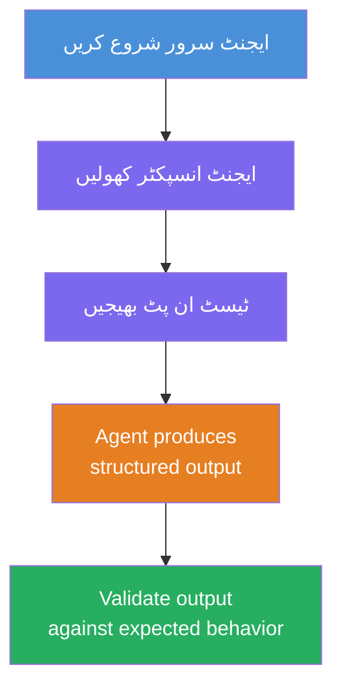
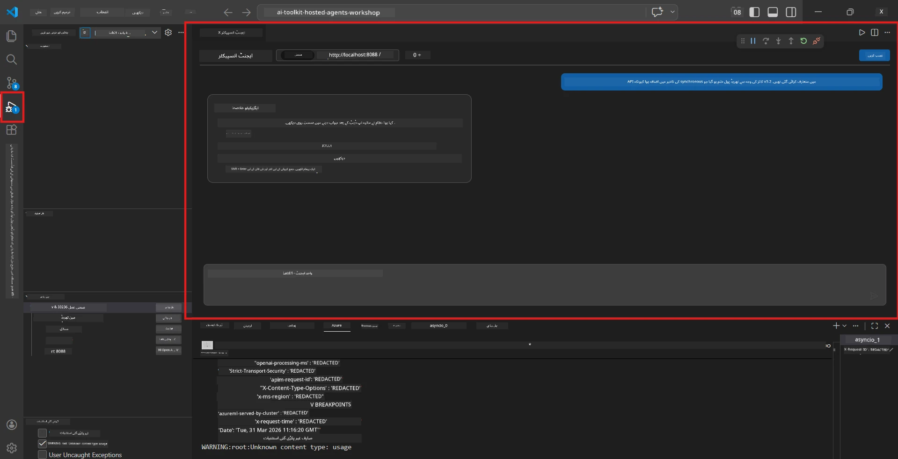
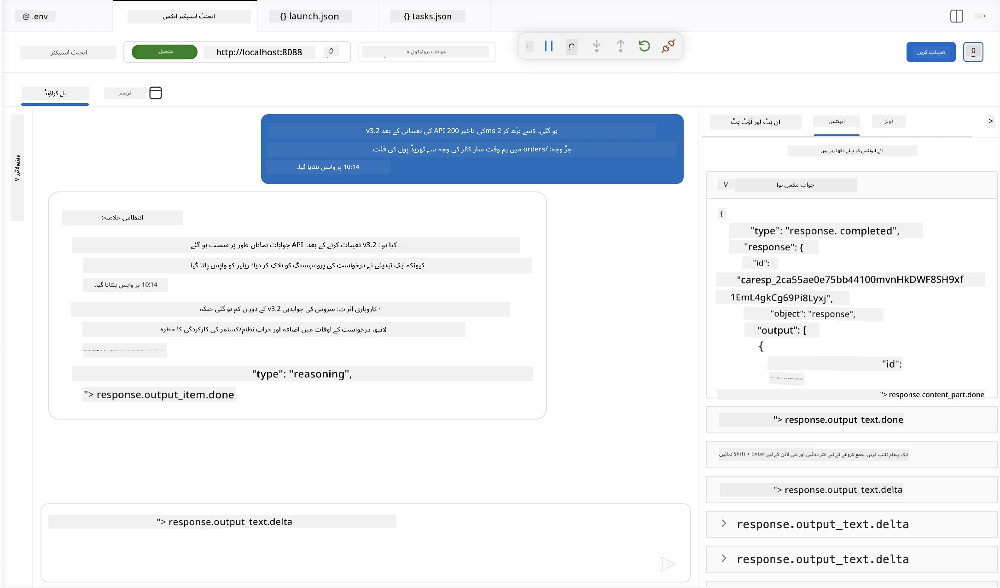

# ماڈیول 4 - مقامی طور پر ٹیسٹ کریں

⏱️ ~10 منٹ

اس ماڈیول میں، آپ اپنا ایجنٹ مقامی طور پر چلاتے ہیں اور توثیق کرتے ہیں کہ یہ صحیح طریقے سے کام کر رہا ہے **ہپی-پاتھ فنکشنل ٹیسٹس** کے ذریعے۔ آپ ایجنٹ انسپیکٹر (بصری UI) یا براہ راست HTTP کالز کا استعمال کر کے تصدیق کریں گے کہ ایجنٹ ساختہ اور درست جوابات دیتا ہے۔

### مقامی ٹیسٹنگ کا طریقہ کار



---

## آپشن 1: F5 دبائیں - ایجنٹ انسپیکٹر کے ساتھ ڈیبگ کریں (تجویز کردہ)

### ڈیبگر شروع کریں

1. **executive-summary-agent/** فولڈر کو VS Code میں براہ راست کھولیں (`File → Open Folder`)۔
2. **Run and Debug** پینل کھولیں (`Ctrl+Shift+D`)۔
3. ڈراپ ڈاؤن سے **Debug Local Agent Server** منتخب کریں۔
4. **F5** دبائیں (یا ▶ Start Debugging پر کلک کریں)۔

> ⚠️ **اہم: اپنا Python Interpreter منتخب کریں**
> اگر آپ کو "ModuleNotFoundError" ملے یا ڈیبگر شروع نہ ہو، تو آپ کو VS Code کو بتانا ہوگا کہ وہ آپ کے ورچوئل ماحول کا استعمال کرے:
  > 1. `Ctrl+Shift+P` دبائیں → **Python: Select Interpreter** ٹائپ کریں۔
  > 2. اپنے پروجیکٹ کے `.venv` فولڈر میں موجود interpreter منتخب کریں (مثلاً، Windows پر `.\.venv\Scripts\python.exe`)۔
  > 3. ڈیبگ سیشن کو دوبارہ شروع کریں۔
> اگر پھر بھی ایرر آ رہے ہیں تو، دستی طور پر اپنی فائل `tasks.json` کو درج ذیل طور پر اپڈیٹ کریں:
  > 1. `.vscode/tasks.json` فائل پر جائیں
  > 2. اس کمانڈ پر جائیں جس کا لیبل ہے: `Run Agent/Workflow HTTP Server`
  > 3. کمانڈ کی ویلیو کو اس طرح اپڈیٹ کریں: `"value": "${workspaceFolder}/.venv/bin/python",`

### کیا ہوتا ہے

1. HTTP سرور `http://localhost:8088/responses` پر شروع ہوتا ہے۔
2. **ایجنٹ انسپیکٹر** پینل خود بخود کھلتا ہے - ٹیسٹنگ کے لیے ایک بصری چیٹ انٹرفیس۔
3. `main.py` میں بریک پوائنٹس فعال کیے جاتے ہیں۔

ٹرمینل پر دیکھیں:
```
Starting executive summary hosted agent
Executive agent server running on http://localhost:8088
```

> **اگر ایجنٹ انسپیکٹر نہیں کھل رہا:** `Ctrl+Shift+P` دبائیں → **Foundry Toolkit: Open Agent Inspector** منتخب کریں۔



> *اسکرین شاٹ میں پرانے 'AI TOOLKIT' برانڈنگ کا مظاہرہ ہو سکتا ہے جو پہلے کے ایکسٹینشن ورژن کی ہے۔*

---

## آپشن 2: ٹرمینل کے ذریعے ٹیسٹ کریں (متبادل)

ایک ٹرمینل میں ایجنٹ شروع کریں، دوسروں سے درخواستیں بھیجیں:

```bash
# ٹرمینل 1: ایجنٹ شروع کریں
cd executive-summary-agent/
source .venv/bin/activate
python main.py
```

```bash
# ٹرمینل 2: ٹیسٹ بھیجیں (کرل)
curl -sS -X POST http://localhost:8088/responses \
  -H "Content-Type: application/json" \
  -d '{"input": "The API latency increased due to thread pool exhaustion caused by sync calls in v3.2.", "stream": false}'
```

---

## منظرنامہ ٹیسٹس: ہپی-پاتھ فنکشنل توثیق

نیچے دیے گئے **تمام تین** منظرنامے چلائیں۔ یہ تصدیق کرتے ہیں کہ آپ کا ایجنٹ حقیقت پسندانہ ان پٹس کے لیے درست، ساختہ آؤٹ پٹ دیتا ہے۔



### منظرنامہ 1: IT واقعہ - API تاخیر میں اضافہ

**ان پٹ:**
```
The API latency increased from 200ms to 2s after deploying v3.2.
Root cause: thread pool starvation from synchronous calls in /orders.
Rolled back at 10:14.
```

**متوقع رویہ:**
- ✅ "Executive Summary" ساخت کی پیروی کرتا ہے (کیا ہوا / کاروباری اثر / اگلا قدم)
- ✅ کوئی تکنیکی اصطلاحات نہیں (کوئی "thread pool"، کوئی "/orders"، کوئی "v3.2" نہیں)
- ✅ کاروباری اثر واضح طور پر بیان کرتا ہے (مثلاً صارفین کو تاخیر کا سامنا ہوا)
- ✅ اگلا قدم شامل ہے (مثلاً مسئلہ حل کیا گیا، نگرانی جاری ہے)

---

### منظرنامہ 2: ڈیٹا پائپ لائن - ETL ناکامی

**ان پٹ:**
```
The nightly ETL job failed because the upstream schema changed. APAC dashboards show missing data.
```

**متوقع رویہ:**
- ✅ سادہ زبان میں ڈیٹا ریفریش ناکامی کا خلاصہ دیتا ہے
- ✅ APAC ڈیش بورڈ کے اثر کا ذکر کرتا ہے
- ✅ مرمت کے اگلے قدم کو شامل کرتا ہے
- ✅ "ETL"، "schema"، یا دیگر تکنیکی اصطلاحات کا ذکر نہیں کرتا

---

### منظرنامہ 3: سیکیورٹی - افشاء شدہ اسناد

**ان پٹ:**
```
Static analysis flagged a hardcoded secret in the repository.
The secret may have been exposed in commit history.
```

**متوقع رویہ:**
- ✅ اسناد/سیکیورٹی مسئلے کی ایگزیکٹو فرینڈلی زبان میں وضاحت کرتا ہے
- ✅ ممکنہ خطرہ کی نشاندہی کرتا ہے (غیر مجاز رسائی)
- ✅ مرمت کے اقدام کو بیان کرتا ہے (اسناد کی گردش، جائزہ)
- ✅ "static analysis"، "commit history"، یا "hardcoded" جیسے اصطلاحات شامل نہیں کرتا

---

## توثیق کے معیار

ہر منظرنامے کے لیے، چیک کریں:

| # | معیار | کامیابی کی شرط |
|---|----------|---------------|
| 1 | **ساخت** | جواب "Executive Summary" فارمیٹ استعمال کرتا ہے جس میں تمام تین نکات شامل ہیں |
| 2 | **سادہ زبان** | کوئی ایسی تکنیکی اصطلاح نہیں جو ایک ایگزیکٹو نہ سمجھے |
| 3 | **درستگی** | خلاصہ ان پٹ کی عکاسی کرتا ہے - کوئی بناوٹی تفصیلات نہیں |
| 4 | **مختصری** | جواب 100 الفاظ سے کم ہے |
| 5 | **اگلا قدم** | واضح کارروائی یا کم کرنے کا ذکر ہوتا ہے |

---

## ڈیبگ کرنے کے مشورے

| مسئلہ | حل |
|-------|-----|
| ایجنٹ شروع نہیں ہوتا | `.env` کی قدروں کو چیک کریں، یقینی بنائیں کہ venv فعال ہے، `pip install -r requirements.txt` چلائیں |
| خالی یا عمومی جواب | `main.py` میں ہدایات کا جائزہ لیں - آؤٹ پٹ فارمیٹ کی وضاحت کریں |
| جواب میں اصطلاحات شامل ہیں | ہدایات میں "تکنیکی اصطلاحات ہٹانے" کے قواعد کو مضبوط کریں |
| ایجنٹ انسپیکٹر نہیں کھلتا | `Ctrl+Shift+P` → **Foundry Toolkit: Open Agent Inspector** |
| ماڈل ایررز ٹرمینل میں | `AZURE_AI_MODEL_DEPLOYMENT_NAME` بالکل مطابق ہے (کیس حساس) کی تصدیق کریں |

---

### ✅ چیک پوائنٹ

- [ ] ایجنٹ مقامی طور پر بغیر ایرر کے شروع ہوتا ہے
- [ ] ایجنٹ انسپیکٹر کھلتا ہے اور چیٹ انٹرفیس دکھاتا ہے (اگر F5 استعمال کر رہے ہیں)
- [ ] **منظرنامہ 1** (IT واقعہ) - ساختہ Executive Summary، بغیر اصطلاحات کے
- [ ] **منظرنامہ 2** (ڈیٹا پائپ لائن) - متعلقہ خلاصہ جس میں کاروباری اثر شامل ہے
- [ ] **منظرنامہ 3** (سیکیورٹی الرٹ) - مناسب خطرے کی اطلاع
- [ ] تمام جوابات مقررہ آؤٹ پٹ ساخت کی پیروی کرتے ہیں

> **اپنے جوابات محفوظ کریں** (کاپی یا اسکرین شاٹ لیں) - آپ انہیں ماڈیول 06 میں کلاؤڈ نتائج کے ساتھ موازنہ کریں گے۔

---

**پچھلا:** [03 - Configure & Code](03-configure-and-code.md) · **اگلا:** [05 - Deploy to Foundry →](05-deploy-to-foundry.md)

---

<!-- CO-OP TRANSLATOR DISCLAIMER START -->
**ڈس کلیمر**:
یہ دستاویز AI ترجمہ سروس [Co-op Translator](https://github.com/Azure/co-op-translator) کے ذریعے ترجمہ کی گئی ہے۔ جبکہ ہم درستگی کے لیے کوشاں ہیں، براہ کرم اس بات سے آگاہ رہیں کہ خودکار ترجمے میں غلطیاں یا عدم درستیاں ہو سکتی ہیں۔ اصل دستاویز اپنے مادری زبان میں مستند ماخذ سمجھی جائے گی۔ حساس معلومات کے لیے پیشہ ور انسانی ترجمہ کی سفارش کی جاتی ہے۔ اس ترجمے کے استعمال سے پیدا ہونے والی کسی بھی غلط فہمی یا غلط تشریح کی ذمہ داری ہم قبول نہیں کرتے۔
<!-- CO-OP TRANSLATOR DISCLAIMER END -->