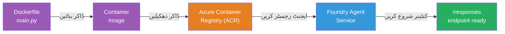
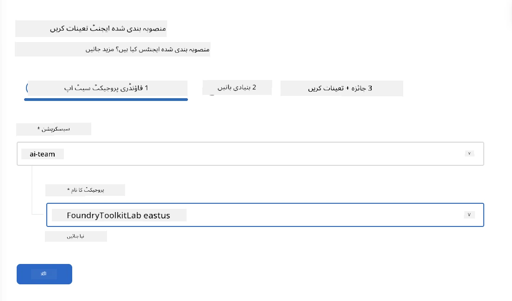
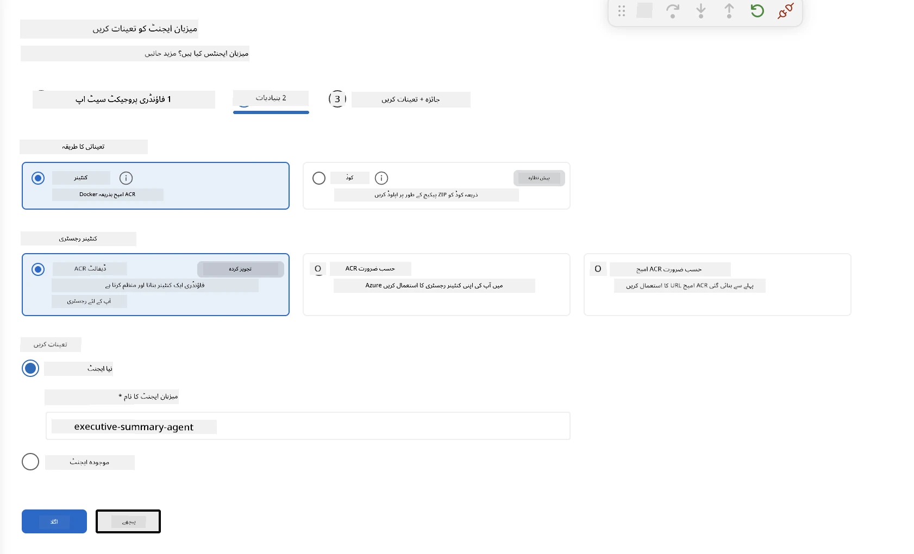
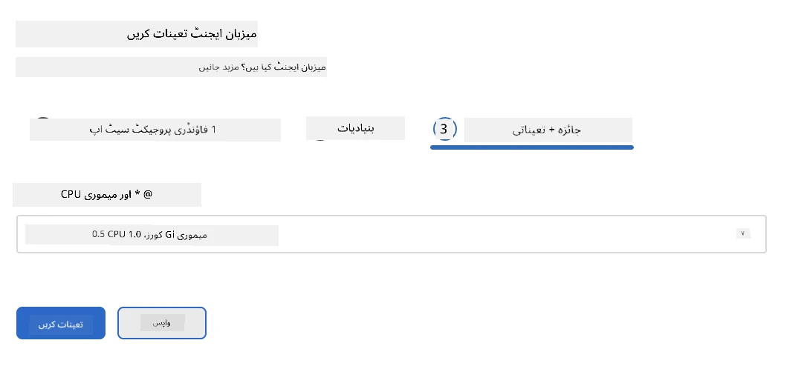
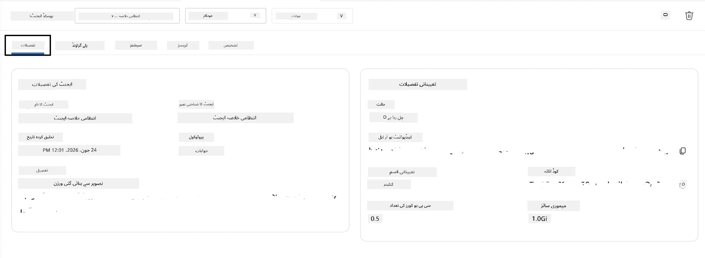

# ماڈیول 5 - فاؤنڈری ایجنٹ سروس پر تعیناتی

⏱️ تقریباً 10 منٹ

> ⚠️ **راستہ بی صارفین:** یہ ماڈیول فاؤنڈری سبسکرپشن کا مطالبہ کرتا ہے۔ اگر آپ فاؤنڈری لوکل استعمال کر رہے ہیں تو براہ کرم [ماڈیول 07 - خلاصہ](07-summary.md) پر جائیں۔ آپ نے مقامی ترقی کا ورک فلو کامیابی سے مکمل کر لیا ہے!

اس ماڈیول میں، آپ اپنے مقامی طور پر آزمایا ہوا ایجنٹ مائیکروسافٹ فاؤنڈری میں **میزبان ایجنٹ** کے طور پر تعینات کرتے ہیں۔ تعیناتی ایک کنٹینر امیج بناتی ہے، اسے Azure کنٹینر رجسٹری پر دھکیلتی ہے، اور فاؤنڈری کے منظم انفراسٹرکچر میں ایجنٹ شروع کرتی ہے۔

### تعیناتی پائپ لائن

---

## ضروریات کی جانچ

تعیناتی سے پہلے، تصدیق کریں:

- [ ] ایجنٹ تمام 3 مقامی حالات سے گزرتا ہے جو [ماڈیول 04](04-test-locally.md) میں ہیں
- [ ] آپ کے پاس پروجیکٹ سطح پر **Azure AI User** کا کردار موجود ہے ([ماڈیول 01, RBAC تفویض](01-setup.md#deploy-a-model--assign-rbac))
- [ ] آپ VS Code میں Azure میں سائن ان ہیں (اکاؤنٹس آئیکن آپ کا نام دکھاتا ہے)

---

## مرحلہ 1: تعیناتی شروع کریں

### انتخاب A: ایجنٹ انسپیکٹر سے تعینات کریں (تجویز کردہ)

اگر ایجنٹ انسپیکٹر کھلا ہے (ٹیسٹنگ سے):
1. اوپر دائیں کونے میں **Deploy** بٹن (بادل کا آئیکن ↑) پر کلک کریں۔

### انتخاب B: کمانڈ پیلیٹ سے تعینات کریں

1. `Ctrl+Shift+P` دبائیں → **Foundry Toolkit: Deploy Hosted Agent** منتخب کریں۔

---

## مرحلہ 2: تعیناتی کی ترتیب دیں

وزرڈ آپ سے پوچھے گا:

| اشارہ | انتخاب |
|--------|-----------|
| **سبسکرپشن** | آپ کا Azure سبسکرپشن |
| **ہدف پروجیکٹ** | آپ کا فاؤنڈری پروجیکٹ (جیسے، `workshop-agents`) |

اپنی ایجنٹ کو ترتیب دینے کے لیے **next** پر کلک کریں۔

| اشارہ | انتخاب |
|--------|-----------|
| **تعیناتی طریقہ** | کنٹینر |
| **کنٹینر رجسٹری** | **ڈیفالٹ ACR** (مائیکروسافٹ فاؤنڈری آپ کے لیے ایک تشکیل دیتا اور منظم کرتا ہے) |
| **تعینات کریں** | نیا ایجنٹ (نام، `executive-summary-agent`) |

اپنی ایجنٹ کا جائزہ لینے اور تعینات کرنے کے لیے **next** پر کلک کریں۔

| اشارہ | انتخاب |
|--------|-----------|
| **CPU اور میموری** | **0.25 CPU کورز، 0.5 جی بی میموری** (ورکشاپ کے لیے کافی) |

---

## مرحلہ 3: تعینات کریں اور مانیٹر کریں

1. **Deploy** پر کلک کریں۔
2. **Output** پینل دیکھیں (ڈرپ ڈاؤن سے **Microsoft Foundry** منتخب کریں)۔
3. تعیناتی یہ مراحل طے کرتی ہے:
   - **Docker build** - آپ کے Dockerfile سے کنٹینر بنانا
   - **Docker push** - امیج کو ACR پر دھکیلنا (پہلی بار تعیناتی پر 1–3 منٹ)
   - **Agent registration** - فاؤنڈری میں میزبانی شدہ ایجنٹ بنانا
   - **Container start** - سسٹم مینیجڈ شناخت کے ساتھ شروع کرنا

4. مکمل ہونے پر ایک اطلاع ظاہر ہوتی ہے:
   > **my-agent کامیابی کے ساتھ تعینات ہو گیا ہے۔** `View logs` `Run agent`

5. ایجنٹ پلے گراؤنڈ کھولنے کے لیے **Run agent** پر کلک کریں۔

### تعیناتی کی صورتحال کی قیمتیں

| صورتحال | مطلب |
|--------|---------|
| **چل رہا ہے** | کنٹینر تیار، ایجنٹ جواب دے رہا ہے |
| **انتظار کر رہا ہے** | کنٹینر شروع ہو رہا ہے - 30–60 سیکنڈ انتظار کریں |
| **ناکام** | لاگز چیک کریں (نیچے خرابی اصلاح دیکھیں) |

---

## عام تعیناتی کی خرابیوں

| خرابی | بنیادی سبب | حل |
|-------|-----------|-----|
| `agents/write` اجازت نامنظور | پروجیکٹ سطح پر **Azure AI User** کا کردار غائب ہے | [ماڈیول 01, RBAC تفویض](01-setup.md#deploy-a-model--assign-rbac) |
| ڈاکر چل نہیں رہا | Docker Desktop شروع نہیں ہوا | Docker Desktop شروع کریں → `docker info` تصدیق کریں |
| ACR اجازت نامہ | منظم شناخت امیج نہیں کھینچ سکتی | دیکھیں [ماڈیول 08 - خرابی کی اصلاح](08-troubleshooting.md) |

---

### ✅ چیک پوائنٹ

- [ ] تعیناتی بغیر خرابیوں کے مکمل ہوئی
- [ ] ایجنٹ فاؤنڈری سائیڈبار میں **Hosted Agents (Preview)** کے تحت ظاہر ہوتا ہے
- [ ] کنٹینر کی حالت **چل رہی ہے** دکھاتی ہے
- [ ] ایجنٹ پلے گراؤنڈ ٹیب کھلا ہے جو ایجنٹ کی تفصیلات اور اینڈپوائنٹ URL دکھا رہا ہے

---

**پچھلا:** [04 - مقامی طور پر جانچ کریں](04-test-locally.md) · **اگلا:** [06 - پلے گراؤنڈ میں تصدیق کریں →](06-verify-in-playground.md)

---

<!-- CO-OP TRANSLATOR DISCLAIMER START -->
**ڈس کلیمر**:
یہ دستاویز AI ترجمہ سروس [Co-op Translator](https://github.com/Azure/co-op-translator) کے ذریعے ترجمہ کی گئی ہے۔ جبکہ ہم درستگی کے لیے کوشاں ہیں، براہ کرم اس بات سے آگاہ رہیں کہ خودکار ترجمے میں غلطیاں یا عدم درستیاں ہو سکتی ہیں۔ اصل دستاویز اپنے مادری زبان میں مستند ماخذ سمجھی جائے گی۔ حساس معلومات کے لیے پیشہ ور انسانی ترجمہ کی سفارش کی جاتی ہے۔ اس ترجمے کے استعمال سے پیدا ہونے والی کسی بھی غلط فہمی یا غلط تشریح کی ذمہ داری ہم قبول نہیں کرتے۔
<!-- CO-OP TRANSLATOR DISCLAIMER END -->