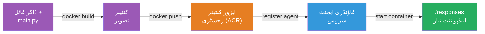
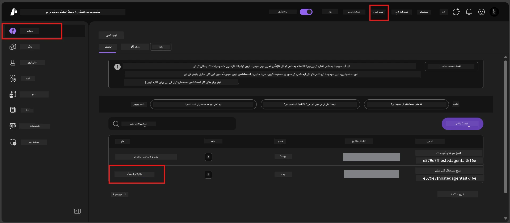

# ماڈیول 6 - فاؤنڈری ایجنٹ سروس پر تعینات کریں

اس ماڈیول میں، آپ اپنے مقامی طور پر ٹیسٹ کیے گئے ایجنٹ کو مائیکروسافٹ فاؤنڈری پر ایک [**میزبان ایجنٹ**](https://learn.microsoft.com/azure/foundry/agents/concepts/hosted-agents) کے طور پر تعینات کرتے ہیں۔ تعیناتی کا عمل آپ کے پروجیکٹ سے ایک Docker کنٹینر امیج بناتا ہے، اسے [Azure Container Registry (ACR)](https://learn.microsoft.com/azure/container-registry/container-registry-intro) پر دھکیلتا ہے، اور [Foundry Agent Service](https://learn.microsoft.com/azure/foundry/agents/overview) میں ایک میزبان ایجنٹ ورژن بناتا ہے۔

### تعیناتی پائپ لائن


---

## ضروریات کی جانچ

تعیناتی سے پہلے، ذیل میں ہر آئٹم کی تصدیق کریں۔ ان کو چھوڑنا تعیناتی ناکامیوں کی سب سے عام وجہ ہے۔

1. **ایجنٹ نے مقامی سموک ٹیسٹ پاس کیے ہیں:**
   - آپ نے [ماڈیول 5](05-test-locally.md) میں تمام 4 ٹیسٹ مکمل کیے اور ایجنٹ نے صحیح جواب دیا۔

2. **آپ کے پاس [Azure AI User](https://learn.microsoft.com/azure/foundry/concepts/rbac-foundry#built-in-roles) کردار ہے:**
   - یہ [ماڈیول 2، مرحلہ 3](02-create-foundry-project.md) میں تفویض کیا گیا تھا۔ اگر آپ کو یقین نہیں، تو ابھی تصدیق کریں:
   - Azure پورٹل → آپ کے فاؤنڈری **پروجیکٹ** ریسورس → **Access control (IAM)** → **Role assignments** ٹیب → اپنا نام تلاش کریں → تصدیق کریں کہ **Azure AI User** فہرست میں ہے۔

3. **آپ VS Code میں Azure میں سائن ان ہیں:**
   - VS Code کے نیچے بائیں کونے میں اکاؤنٹس آئیکون دیکھیں۔ آپ کے اکاؤنٹ کا نام دکھائی دینا چاہیے۔

4. **(اختیاری) Docker Desktop چل رہا ہے:**
   - Docker صرف اس صورت میں ضروری ہے جب فاؤنڈری ایکسٹینشن آپ سے مقامی بلڈ کے لیے کہے۔ زیادہ تر صورتوں میں، ایکسٹینشن خود بخود تعیناتی کے دوران کنٹینر بلڈز کو سنبھالتا ہے۔
   - اگر آپ نے Docker انسٹال کیا ہے، تو دیکھیں کہ یہ چل رہا ہے: `docker info`

---

## مرحلہ 1: تعیناتی شروع کریں

آپ کے پاس تعیناتی کے دو طریقے ہیں - دونوں ایک ہی نتیجے تک پہنچتے ہیں۔

### آپشن A: ایجنٹ انسپیکٹر سے تعینات کریں (تجویز کردہ)

اگر آپ ایجنٹ کو ڈیبگر (F5) کے ساتھ چلا رہے ہیں اور ایجنٹ انسپیکٹر کھلا ہے:

1. ایجنٹ انسپیکٹر پینل کے **اوپر دائیں کونے** کو دیکھیں۔
2. **تعینات کریں** بٹن (بادل کا آئیکون جس میں اوپر تیر ↑ ہے) پر کلک کریں۔
3. تعیناتی وزرڈ کھل جائے گا۔

### آپشن B: کمانڈ پیلیٹ سے تعینات کریں

1. `Ctrl+Shift+P` دبائیں تاکہ **کمانڈ پیلیٹ** کھلے۔
2. ٹائپ کریں: **Microsoft Foundry: Deploy Hosted Agent** اور اسے منتخب کریں۔
3. تعیناتی وزرڈ کھل جائے گا۔

---

## مرحلہ 2: تعیناتی کی تشکیل کریں

تعیناتی وزرڈ آپ کو ترتیب کے ذریعے لے جاتا ہے۔ ہر پرامپٹ بھریں:

### 2.1 ہدف پروجیکٹ منتخب کریں

1. ایک ڈراپ ڈاؤن آپ کے فاؤنڈری پروجیکٹس دکھاتا ہے۔
2. وہ پروجیکٹ منتخب کریں جو آپ نے ماڈیول 2 میں بنایا تھا (جیسے، `workshop-agents`)۔

### 2.2 کنٹینر ایجنٹ فائل منتخب کریں

1. آپ سے ایجنٹ انٹری پوائنٹ منتخب کرنے کو کہا جائے گا۔
2. **`main.py`** (پائیتھون) منتخب کریں - یہ وہ فائل ہے جسے وزرڈ آپ کے ایجنٹ پروجیکٹ کی شناخت کے لیے استعمال کرتا ہے۔

### 2.3 وسائل کی ترتیب

| سیٹنگ | تجویز کردہ قدر | نوٹس |
|---------|------------------|-------|
| **CPU** | `0.25` | ڈیفالٹ، ورکشاپ کے لیے کافی۔ پیداواری کاموں کے لیے بڑھائیں |
| **میموری** | `0.5Gi` | ڈیفالٹ، ورکشاپ کے لیے کافی |

یہ `agent.yaml` میں دی گئی قدروں سے میل کھاتی ہیں۔ آپ ڈیفالٹس قبول کر سکتے ہیں۔

---

## مرحلہ 3: تصدیق کریں اور تعینات کریں

1. وزرڈ تعیناتی کا خلاصہ دکھاتا ہے جس میں شامل ہیں:
   - ہدف پروجیکٹ کا نام
   - ایجنٹ کا نام (`agent.yaml` سے)
   - کنٹینر فائل اور وسائل
2. خلاصے کا جائزہ لیں اور **Confirm and Deploy** (یا **Deploy**) پر کلک کریں۔
3. VS Code میں پیش رفت دیکھیں۔

### تعیناتی کے دوران کیا ہوتا ہے (مرحلہ وار)

تعیناتی ایک کثیر المرحل عمل ہے۔ VS Code کے **Output** پینل کو دیکھیں (ڈراپ ڈاؤن سے "Microsoft Foundry" منتخب کریں) اور عمل کو فالو کریں:

1. **Docker build** - VS Code آپ کے `Dockerfile` سے Docker کنٹینر امیج بناتا ہے۔ آپ کو Docker کی پرتوں کے پیغامات نظر آئیں گے:
   ```
   Step 1/6 : FROM python:<version>-slim
   Step 2/6 : WORKDIR /app
   ...
   Successfully built abc123def456
   ```

2. **Docker push** - امیج کو آپ کے فاؤنڈری پروجیکٹ کے ساتھ منسلک **Azure Container Registry (ACR)** پر دھکیلا جاتا ہے۔ پہلی بار تعیناتی میں 1-3 منٹ لگ سکتے ہیں (بیس امیج >100MB ہے)۔

3. **ایجنٹ کی رجسٹریشن** - Foundry Agent Service ایک نیا میزبان ایجنٹ بناتا ہے (یا اگر ایجنٹ پہلے سے موجود ہے تو نیا ورژن)۔ `agent.yaml` سے ایجنٹ میٹا ڈیٹا استعمال ہوتا ہے۔

4. **کنٹینر کا آغاز** - کنٹینر فاؤنڈری کے منظم انفراسٹرکچر میں شروع ہوتا ہے۔ پلیٹ فارم ایک [سسٹم مینیجڈ شناخت](https://learn.microsoft.com/azure/foundry/agents/concepts/agent-identity) تفویض کرتا ہے اور `/responses` اینڈ پوائنٹ ظاہر کرتا ہے۔

> **پہلی تعیناتی سستی ہوتی ہے** (Docker کو تمام پرتیں دھکیلنی ہوتی ہیں)۔ بعد کی تعیناتیاں تیز ہوتی ہیں کیونکہ Docker غیر تبدیل شدہ پرتوں کو کیش کرتا ہے۔

---

## مرحلہ 4: تعیناتی کی حالت کی تصدیق کریں

تعیناتی کا کمانڈ مکمل ہونے کے بعد:

1. **Microsoft Foundry** سائیڈبار کھولیں، ایکٹیویٹی بار میں فاؤنڈری آئیکون پر کلک کریں۔
2. اپنے پروجیکٹ کے تحت **Hosted Agents (Preview)** سیکشن کو ایکسپینڈ کریں۔
3. آپ کو اپنے ایجنٹ کا نام دکھائی دے گا (مثلاً `ExecutiveAgent` یا `agent.yaml` سے نام)۔
4. **ایجنٹ کے نام پر کلک کریں** تاکہ اسے ایکسپینڈ کریں۔
5. آپ کو ایک یا زیادہ **ورژنز** نظر آئیں گے (مثلاً `v1`)۔
6. ورژن پر کلک کریں تاکہ **Container Details** دیکھ سکیں۔
7. **Status** فیلڈ چیک کریں:

   | حالت | معنی |
   |--------|---------|
   | **Started** یا **Running** | کنٹینر چل رہا ہے اور ایجنٹ تیار ہے |
   | **Pending** | کنٹینر شروع ہو رہا ہے (30-60 سیکنڈ انتظار کریں) |
   | **Failed** | کنٹینر شروع نہیں ہو سکا (لاگز چیک کریں - نیچے مسئلہ حل کرنے کا حصہ دیکھیں) |



> **اگر آپ کو 2 منٹ سے زیادہ "Pending" نظر آ رہا ہے:** کنٹینر ممکنہ طور پر بیس امیج کھینچ رہا ہے۔ تھوڑا انتظار کریں۔ اگر یہ اسی حالت میں رہے، تو کنٹینر لاگز چیک کریں۔

---

## عام تعیناتی کی غلطیاں اور ان کے حل

### غلطی 1: اجازت مسترد - `agents/write`

```
Error: lacks the required data action 
Microsoft.CognitiveServices/accounts/AIServices/agents/write 
to perform POST /api/projects/{projectName}/assistants operation.
```

**اصل وجہ:** آپ کے پاس **پروجیکٹ** کی سطح پر `Azure AI User` کردار نہیں ہے۔

**مرحلہ وار حل:**

1. [https://portal.azure.com](https://portal.azure.com) کھولیں۔
2. تلاش کے بار میں اپنے فاؤنڈری **پروجیکٹ** کا نام ٹائپ کریں اور اس پر کلک کریں۔
   - **اہم:** یقینی بنائیں کہ آپ **پروجیکٹ** ریسورس (قسم: "Microsoft Foundry project") پر جا رہے ہیں، والد اکاؤنٹ یا ہب ریسورس پر نہیں۔
3. بائیں نیویگیشن میں **Access control (IAM)** پر کلک کریں۔
4. **+ Add** → **Add role assignment** پر کلک کریں۔
5. **Role** ٹیب میں [**Azure AI User**](https://learn.microsoft.com/azure/foundry/concepts/rbac-foundry#built-in-roles) تلاش کریں اور منتخب کریں۔ **Next** پر کلک کریں۔
6. **Members** ٹیب میں **User, group, or service principal** کا انتخاب کریں۔
7. **+ Select members** پر کلک کریں، اپنا نام/ایمیل تلاش کریں، خود کو منتخب کریں، پھر **Select** پر کلک کریں۔
8. **Review + assign** → دوبارہ **Review + assign** پر کلک کریں۔
9. 1-2 منٹ انتظار کریں تاکہ کردار تفویض منتقلی ہو جائے۔
10. **مرحلہ 1 سے دوبارہ تعیناتی کریں۔**

> کردار ضروری ہے کہ **پروجیکٹ** دائرہ کار پر ہو، صرف اکاؤنٹ دائرہ کار پر نہیں۔ یہ تعیناتی ناکامیوں کی سب سے عام وجہ ہے۔

### غلطی 2: Docker نہیں چل رہا

```
Error: Docker build failed / Cannot connect to Docker daemon
```

**حل:**
1. Docker Desktop شروع کریں (اسے Start مینو یا سسٹم ٹرے میں تلاش کریں)۔
2. انتظار کریں جب تک کہ "Docker Desktop is running" پیغام ظاہر نہ ہو (30-60 سیکنڈ)۔
3. تصدیق کریں: ٹرمینل میں `docker info` چلائیں۔
4. **ونڈوز مخصوص:** یقینی بنائیں کہ Docker Desktop کی سیٹنگز میں WSL 2 بیک اینڈ فعال ہے → **General** → **Use the WSL 2 based engine**۔
5. تعیناتی دوبارہ کریں۔

### غلطی 3: ACR اجازت - `AcrPullUnauthorized`

```
Error: AcrPullUnauthorized
```

**اصل وجہ:** فاؤنڈری پروجیکٹ کی مینیجڈ شناخت کو کنٹینر رجسٹری کی پول تک رسائی نہیں۔

**حل:**
1. Azure پورٹل میں، اپنے **[Container Registry](https://learn.microsoft.com/azure/container-registry/container-registry-intro)** پر جائیں (یہی ریسورس گروپ میں ہے جہاں آپ کا فاؤنڈری پروجیکٹ ہے)۔
2. **Access control (IAM)** → **Add** → **Add role assignment** جائیں۔
3. **[AcrPull](https://learn.microsoft.com/azure/container-registry/container-registry-roles)** رول منتخب کریں۔
4. **Members** کے تحت، **Managed identity** منتخب کریں → فاؤنڈری پروجیکٹ کی مینیجڈ شناخت تلاش کریں۔
5. **Review + assign** کریں۔

> یہ عام طور پر فاؤنڈری ایکسٹینشن کے ذریعے خودکار طریقے سے سیٹ اپ ہوتا ہے۔ اگر آپ کو یہ غلطی ملے، تو ممکن ہے کہ خودکار سیٹ اپ ناکام ہو گیا ہو۔

### غلطی 4: کنٹینر پلیٹ فارم عدم مطابقت (ایپل سلیکن)

اگر آپ Apple Silicon Mac (M1/M2/M3) سے تعینات کر رہے ہیں، تو کنٹینر کو `linux/amd64` کے لیے بنایا جانا چاہیے:

```bash
docker build --platform linux/amd64 -t myagent:v1 .
```

> فاؤنڈری ایکسٹینشن زیادہ تر صارفین کے لیے خود بخود یہ سنبھالتا ہے۔

---

### چیک پوائنٹ

- [ ] تعیناتی کمانڈ VS Code میں بغیر غلطیوں کے مکمل ہوئی
- [ ] ایجنٹ فاؤنڈری سائیڈبار میں **Hosted Agents (Preview)** کے تحت ظاہر ہوا
- [ ] آپ نے ایجنٹ پر کلک کیا → ورژن منتخب کیا → **Container Details** دیکھی
- [ ] کنٹینر کی حالت **Started** یا **Running** دکھا رہی ہے
- [ ] (اگر غلطیاں ہوئیں) آپ نے غلطی کی نشاندہی کی، حل کیا، اور کامیابی سے دوبارہ تعینات کیا

---

**پچھلا:** [05 - Test Locally](05-test-locally.md) · **اگلا:** [07 - Verify in Playground →](07-verify-in-playground.md)

---

<!-- CO-OP TRANSLATOR DISCLAIMER START -->
**ڈس کلیمر**:  
یہ دستاویز AI ترجمہ سروس [Co-op Translator](https://github.com/Azure/co-op-translator) کے ذریعے ترجمہ کی گئی ہے۔ اگرچہ ہم درستگی کی کوشش کرتے ہیں، براہ کرم اس بات سے آگاہ رہیں کہ خودکار تراجم میں غلطیاں یا عدم صحت ہو سکتی ہے۔ اصل دستاویز اپنی مادری زبان میں معتبر ماخذ سمجھی جانی چاہیے۔ اہم معلومات کے لیے پیشہ ورانہ انسانی ترجمہ کی سفارش کی جاتی ہے۔ اس ترجمے کے استعمال سے پیدا ہونے والی کسی بھی غلط فہمی یا غلط تشریح کے لیے ہم ذمہ دار نہیں ہیں۔
<!-- CO-OP TRANSLATOR DISCLAIMER END -->