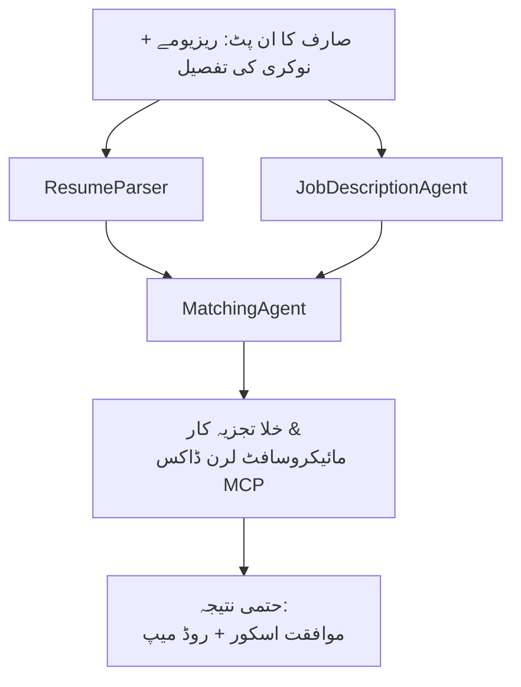

# PersonalCareerCopilot - ریزیومے → ملازمت کے مناسب ہونے کا اندازہ لگانے والا

ایک کثیر ایجنٹ ورک فلو جو اندازہ لگاتا ہے کہ ریزیومے کتنے اچھی طرح ایک ملازمت کی تفصیل سے میل کھاتا ہے، اور پھر فرق کو پورا کرنے کے لیے ایک ذاتی نوعیت کا سیکھنے کا روڈ میپ تیار کرتا ہے۔

---

## ایجنٹس

| ایجنٹ | کردار | آلات |
|-------|------|-------|
| **ResumeParser** | ریزیومے کے متن سے منظم مہارتیں، تجربہ، سرٹیفیکیشنز نکالتا ہے | - |
| **JobDescriptionAgent** | ایک ملازمت کی تفصیل سے درکار/پسندیدہ مہارتیں، تجربہ، سرٹیفیکیشنز نکالتا ہے | - |
| **MatchingAgent** | پروفائل بمقابلہ تقاضے کا موازنہ کرتا ہے → فٹ اسکور (0-100) + میل کھانے والی / غائب مہارتیں | - |
| **GapAnalyzer** | Microsoft Learn کے وسائل کے ساتھ ذاتی نوعیت کا سیکھنے کا روڈ میپ بناتا ہے | `search_microsoft_learn_for_plan` (MCP) |

## ورک فلو


---

## جلد آغاز

### 1. ماحول تیار کریں

```powershell
cd workshop\lab02-multi-agent\PersonalCareerCopilot
python -m venv .venv
.\.venv\Scripts\Activate.ps1          # ونڈوز پاور شیل
# ذریعہ .venv/bin/activate            # میک او ایس / لینکس
pip install -r requirements.txt
```

### 2. اسناد مرتب کریں

نمونہ env فائل کو کاپی کریں اور اپنے Foundry پروجیکٹ کی تفصیلات بھریں:

```powershell
cp .env.example .env
```

`.env` فائل میں ترمیم کریں:

```env
PROJECT_ENDPOINT=https://<your-account>.services.ai.azure.com/api/projects/<your-project>
MODEL_DEPLOYMENT_NAME=gpt-4.1-mini
```

| قدر | کہاں سے ملے گی |
|-------|-----------------|
| `PROJECT_ENDPOINT` | VS Code میں Microsoft Foundry سائیڈ بار → اپنے پروجیکٹ پر رائٹ کلک کریں → **Copy Project Endpoint** |
| `MODEL_DEPLOYMENT_NAME` | Foundry سائیڈ بار → پروجیکٹ کو بڑھائیں → **Models + endpoints** → تعیناتی کا نام |

### 3. مقامی طور پر چلائیں

```powershell
python -m debugpy --listen 127.0.0.1:5679 -m agentdev run main.py --verbose --port 8088
```

یا VS Code ٹاسک استعمال کریں: `Ctrl+Shift+P` → **Tasks: Run Task** → **Run Lab02 HTTP Server**۔

### 4. ایجنٹ انسپکٹر کے ساتھ ٹیسٹ کریں

ایجنٹ انسپکٹر کھولیں: `Ctrl+Shift+P` → **Foundry Toolkit: Open Agent Inspector**۔

یہ ٹیسٹ پرامپٹ پیسٹ کریں:

```
Resume:
Jane Doe
Senior Software Engineer with 5 years of experience in Python, Django, and AWS.
Built microservices handling 10K+ requests/second. Led a team of 4 developers.
Certifications: AWS Solutions Architect Associate.
Education: B.S. Computer Science, State University.

Job Description:
Senior Cloud Engineer at Contoso Ltd.
Required: Python, Azure, Kubernetes, Terraform, CI/CD pipelines.
Preferred: Go, monitoring (Prometheus/Grafana), cost optimization.
Experience: 5+ years in cloud infrastructure.
Certifications: Azure Solutions Architect Expert preferred.
```

**متوقع:** ایک فٹ اسکور (0-100)، میل کھانے والی / غائب مہارتیں، اور Microsoft Learn کے یو آر ایل کے ساتھ ذاتی نوعیت کا سیکھنے کا روڈ میپ۔

### 5. Foundry پر تعینات کریں

`Ctrl+Shift+P` → **Microsoft Foundry: Deploy Hosted Agent** → اپنا پروجیکٹ منتخب کریں → تصدیق کریں۔

---

## پروجیکٹ کا ڈھانچہ

```
PersonalCareerCopilot/
├── .env.example        ← Template for environment variables
├── .env                ← Your credentials (git-ignored)
├── agent.yaml          ← Hosted agent definition (name, resources, env vars)
├── Dockerfile          ← Container image for Foundry deployment
├── main.py             ← 4-agent workflow (instructions, MCP tool, WorkflowBuilder)
└── requirements.txt    ← Python dependencies
```

## اہم فائلیں

### `agent.yaml`

Foundry Agent Service کے لیے میزبان ایجنٹ کی تعریف کرتا ہے:
- `kind: hosted` - ایک منظم کنٹینر کے طور پر چلتا ہے
- `protocols: [responses v1]` - `/responses` HTTP اینڈ پوائنٹ فراہم کرتا ہے
- `environment_variables` - `PROJECT_ENDPOINT` اور `MODEL_DEPLOYMENT_NAME` تعیناتی کے وقت شامل کیے جاتے ہیں

### `main.py`

شامل ہیں:
- **ایجنٹ ہدایات** - چار `*_INSTRUCTIONS` مستقل، ہر ایجنٹ کے لیے ایک
- **MCP ٹول** - `search_microsoft_learn_for_plan()` `https://learn.microsoft.com/api/mcp` کو Streamable HTTP کے ذریعے کال کرتا ہے
- **ایجنٹ کی تخلیق** - `create_agents()` کانٹیکسٹ مینیجر `AzureAIAgentClient.as_agent()` استعمال کرتا ہے
- **ورک فلو گراف** - `create_workflow()` `WorkflowBuilder` استعمال کرکے ایجنٹس کو fan-out/fan-in/sequential پیٹرنز کے ساتھ جوڑتا ہے
- **سرور شروع کرنا** - `from_agent_framework(agent).run_async()` پورٹ 8088 پر چلتا ہے

### `requirements.txt`

| پیکج | ورژن | مقصد |
|---------|---------|---------|
| `agent-framework-azure-ai` | `1.0.0rc3` | Microsoft Agent Framework کے لیے Azure AI انٹیگریشن |
| `agent-framework-core` | `1.0.0rc3` | کور رن ٹائم (WorkflowBuilder شامل ہے) |
| `azure-ai-agentserver-agentframework` | `1.0.0b16` | میزبان ایجنٹ سرور رن ٹائم |
| `azure-ai-agentserver-core` | `1.0.0b16` | کور ایجنٹ سرور کے تجریدات |
| `debugpy` | تازہ ترین | Python ڈی بگنگ (VS Code میں F5) |
| `agent-dev-cli` | `--pre` | مقامی ڈویلپمنٹ CLI + ایجنٹ انسپکٹر بیک اینڈ |

---

## مسائل کا حل

| مسئلہ | حل |
|-------|-----|
| `RuntimeError: Missing required environment variable(s)` | `.env` بنائیں اور `PROJECT_ENDPOINT` اور `MODEL_DEPLOYMENT_NAME` شامل کریں |
| `ModuleNotFoundError: No module named 'agent_framework'` | venv کو فعال کریں اور `pip install -r requirements.txt` چلائیں |
| آؤٹ پٹ میں Microsoft Learn کے یو آر ایل نہیں | `https://learn.microsoft.com/api/mcp` سے انٹرنیٹ کنیکٹوٹی چیک کریں |
| صرف ایک gap card (کٹا ہوا) دکھائی دے رہا ہے | تصدیق کریں کہ `GAP_ANALYZER_INSTRUCTIONS` میں `CRITICAL:` بلاک شامل ہے |
| پورٹ 8088 استعمال میں ہے | دوسرے سرورز بند کریں: `netstat -ano \| findstr :8088` |

مفصل مسائل کے حل کے لیے دیکھیں [Module 8 - Troubleshooting](../docs/08-troubleshooting.md)۔

---

**مکمل چلنے کا عمل:** [Lab 02 Docs](../docs/README.md) · **واپس جائیں:** [Lab 02 README](../README.md) · [ورکشاپ ہوم](../../../README.md)

---

<!-- CO-OP TRANSLATOR DISCLAIMER START -->
**دستخطی دستبرداری**:  
یہ دستاویز AI ترجمہ سروس [Co-op Translator](https://github.com/Azure/co-op-translator) کا استعمال کرتے ہوئے ترجمہ کی گئی ہے۔ اگرچہ ہم درستگی کے لیے کوشاں ہیں، براہ کرم یہ جان لیں کہ خودکار تراجم میں غلطیاں یا عدم صداقت ہو سکتی ہے۔ اصل دستاویز اپنی مادری زبان میں مستند ماخذ سمجھی جانی چاہیے۔ اہم معلومات کے لیے پیشہ ورانہ انسانی ترجمہ کی سفارش کی جاتی ہے۔ اس ترجمے کے استعمال سے پیدا ہونے والی کسی بھی غلط فہمی یا غلط تشریح کے لیے ہم ذمہ دار نہیں ہیں۔
<!-- CO-OP TRANSLATOR DISCLAIMER END -->