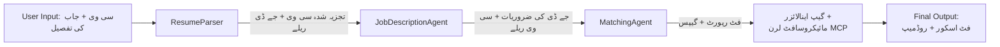

# PersonalCareerCopilot - سی وی → کام کی مطابقت کا جائزہ لینے والا

ایک ورک فلو پر مبنی ملٹی ایجنٹ ایپ جو جانچتی ہے کہ سی وی کسی جاب کی وضاحت کے ساتھ کتنی اچھی طرح میل کھاتی ہے، پھر فرق کو ختم کرنے کے لیے ایک ذاتی نوعیت کا لرننگ روڈ میپ بناتی ہے۔

---

## ایجینٹس

| ایجنٹ | کردار | اوزار |
|-------|------|-------|
| **ResumeParser** | سی وی کے متن سے ساختہ مہارتیں، تجربہ، سرٹیفیکیشنز نکالتا ہے | - |
| **JobDescriptionAgent** | جاب کی وضاحت سے مطلوبہ/ترجیحی مہارتیں، تجربہ، سرٹیفیکیشنز نکالتا ہے | - |
| **MatchingAgent** | پروفائل اور ضروریات کا موازنہ کرتا ہے → فٹ اسکور (0-100) + ملنے والی/غائب مہارتیں | - |
| **GapAnalyzer** | مائیکروسافٹ لرن کے وسائل کے ساتھ ذاتی نوعیت کا لرننگ روڈ میپ بناتا ہے | `search_microsoft_learn_for_plan` (MCP) |

## ورک فلو


```mermaid
flowchart LR
    UserInput["User Input: سی وی + جاب کی تفصیل"] --> ResumeParser
    ResumeParser -- "تجزیہ شدہ سی وی + جے ڈی ریلے" --> JobDescriptionAgent
    JobDescriptionAgent -- "جے ڈی کی ضروریات + سی وی ریلے" --> MatchingAgent
    MatchingAgent -- "فٹ رپورٹ + گیپس" --> GapAnalyzerMCP["گیپ اینالائزر +\nمائیکروسافٹ لرن MCP"]
    GapAnalyzerMCP --> FinalOutput["Final Output:\nفٹ اسکور + روڈمیپ"]
```

---

## جلد شروع کریں

### 1. ماحول سیٹ کریں

یہ فولڈر ورک فلو پر مبنی لیب 02 کے اسکیفولڈ کا حوالہ جاتی نفاذ ہے۔ اس کا `main.py` موجودہ پرامپٹ بلاکس کے ساتھ `WorkflowBuilder` استعمال کرتا ہے تاکہ چاروں ایجنٹس کو جوڑا جا سکے۔

```powershell
cd workshop\lab02-multi-agent\PersonalCareerCopilot
python -m venv .venv
.\.venv\Scripts\Activate.ps1          # ونڈوز پاور شیل
# ماک او ایس / لینکس کے لیے  # source .venv/bin/activate
pip install -r requirements.txt
```

### 2. اسناد ترتیب دیں

اس فولڈر میں `.env` فائل بنائیں:

```powershell
copy .env .env.bak 2>$null; echo $null > .env
```

`.env` کو ایڈٹ کریں:

```env
FOUNDRY_PROJECT_ENDPOINT=https://<your-account>.services.ai.azure.com/api/projects/<your-project>
AZURE_AI_MODEL_DEPLOYMENT_NAME=gpt-4.1-mini
```

| ویلیو | کہاں ملے گی |
|-------|------------------|
| `FOUNDRY_PROJECT_ENDPOINT` | Foundry Toolkit سائڈبار → اپنے پروجیکٹ پر رائٹ کلک کریں → **پروجیکٹ اینڈ پوائنٹ کو کاپی کریں** |
| `AZURE_AI_MODEL_DEPLOYMENT_NAME` | Foundry سائڈبار → پروجیکٹ کو بڑھائیں → **ماڈلز + اینڈ پوائنٹس** → تعیناتی کا نام |

### 3. لوکل سطح پر چلائیں

```powershell
python -m debugpy --listen 127.0.0.1:5679 main.py --port 8088
```

یا VS Code ٹاسک استعمال کریں: `Ctrl+Shift+P` → **Tasks: Run Task** → **Run Agent HTTP Server**۔

F5 ڈیبگنگ کے لیے، **Debug Local Agent HTTP Server** استعمال کریں۔

### 4. ایجنٹ انسپکٹر سے ٹیسٹ کریں

ایجنٹ انسپکٹر کھولیں: `Ctrl+Shift+P` → **Foundry Toolkit: Open Agent Inspector**۔

یہ ٹیسٹ پرامپٹ پیسٹ کریں:

```
Resume:
Jane Doe
Senior Software Engineer with 5 years of experience in Python, Django, and AWS.
Built microservices handling 10K+ requests/second. Led a team of 4 developers.
Certifications: AWS Solutions Architect Associate.
Education: B.S. Computer Science, State University.

Job Description:
Senior Cloud Engineer at Contoso Ltd.
Required: Python, Azure, Kubernetes, Terraform, CI/CD pipelines.
Preferred: Go, monitoring (Prometheus/Grafana), cost optimization.
Experience: 5+ years in cloud infrastructure.
Certifications: Azure Solutions Architect Expert preferred.
```

**متوقع:** ایک فٹ اسکور (0-100)، ملنے والی/غائب مہارتیں، اور مائیکروسافٹ لرن کے URLs کے ساتھ ذاتی نوعیت کا لرننگ روڈ میپ۔

### 5. فاؤنڈری پر تعینات کریں

`Ctrl+Shift+P` → **Foundry Toolkit: Deploy Hosted Agent** → اپنا پروجیکٹ منتخب کریں → تصدیق کریں۔

---

## پروجیکٹ کی ساخت

```
PersonalCareerCopilot/
├── .env                ← Your credentials (git-ignored)
├── agent.yaml          ← Hosted agent definition (name, resources, env vars)
├── Dockerfile          ← Container image for Foundry deployment
├── main.py             ← 4-agent workflow (instructions, MCP tool, WorkflowBuilder)
└── requirements.txt    ← Python dependencies
```

## کلیدی فائلیں

### `agent.yaml`

فاؤنڈری ایجنٹ سروس کے لیے ہوسٹ کیا گیا ایجنٹ تعین کرتا ہے:
- `kind: hosted` - مینیجڈ کنٹینر کے طور پر چلتا ہے
- `protocols` - `/responses` HTTP اینڈ پوائنٹ کے ساتھ `responses` پروٹوکول، ورژن: 1.0.0
- `environment_variables` - `AZURE_AI_MODEL_DEPLOYMENT_NAME` یہاں اعلان کیا گیا ہے؛ `FOUNDRY_PROJECT_ENDPOINT` تعیناتی کے وقت خود بخود شامل کیا جاتا ہے

### `main.py`

اس میں شامل ہے:
- **ایجنٹ ہدایات** - چار `*_INSTRUCTIONS` مستقل، ہر ایجنٹ کے لیے ایک
- **MCP ٹول** - `search_microsoft_learn_for_plan()` `https://learn.microsoft.com/api/mcp` کو اسٹریم ایبل HTTP کے ذریعے کال کرتا ہے
- **ایجنٹ تخلیق** - چار `Agent()` + `AgentExecutor()` انسٹینسز جو ایک `FoundryChatClient` شیئر کرتے ہیں
- **ورک فلو گراف** - `WorkflowBuilder` ایجنٹس کو تسلسل کے ساتھ جوڑتا ہے: ResumeParser → JD Agent → MatchingAgent → GapAnalyzer
- **سرور اسٹارٹ اپ** - `ResponsesHostServer` پورٹ 8088 پر چلتا ہے

### `requirements.txt`

| پیکج | مقصد |
|---------|----------|
| `agent-framework-foundry` | کور رن ٹائم: `Agent`, `AgentExecutor`, `WorkflowBuilder`, `@tool`, `FoundryChatClient` |
| `agent-framework-foundry-hosting` | `ResponsesHostServer` + فاؤنڈری ہوسٹنگ انٹیگریشن |
| `mcp<2,>=1.24.0` | GapAnalyzer کے لیے MCP کلائنٹ (`streamable_http_client`) |
| `debugpy` | پائتھون ڈیبگنگ (VS Code میں F5) |

---

## مسائل کا حل

| مسئلہ | حل |
|-------|-----|
| `KeyError: 'FOUNDRY_PROJECT_ENDPOINT'` یا `KeyError: 'AZURE_AI_MODEL_DEPLOYMENT_NAME'` | `.env` بنائیں اور دونوں `FOUNDRY_PROJECT_ENDPOINT` اور `AZURE_AI_MODEL_DEPLOYMENT_NAME` سیٹ کریں |
| `ModuleNotFoundError: No module named 'agent_framework'` | وینو ایکٹیویٹ کریں اور `pip install -r requirements.txt` چلائیں |
| آؤٹ پٹ میں کوئی Microsoft Learn URLs نہیں | `https://learn.microsoft.com/api/mcp` کی انٹرنیٹ کنیکٹیویٹی چیک کریں |
| صرف 1 gap کارڈ (کٹ گیا) | تصدیق کریں کہ `GAP_ANALYZER_INSTRUCTIONS` میں `CRITICAL:` بلاک شامل ہو |
| پورٹ 8088 پہلے سے استعمال میں ہے | دیگر سرورز روکیں: `netstat -ano \| findstr :8088` |

تفصیلی مسائل کے حل کے لیے دیکھیں [Module 8 - Troubleshooting](../docs/08-troubleshooting.md)۔

---

**مکمل واک تھرو:** [Lab 02 Docs](../docs/README.md) · **واپس جائیں:** [Lab 02 README](../README.md) · [ورکشاپ ہوم](../../../README.md)

---

<!-- CO-OP TRANSLATOR DISCLAIMER START -->
**ڈس کلیمر**:
یہ دستاویز AI ترجمہ سروس [Co-op Translator](https://github.com/Azure/co-op-translator) کے ذریعے ترجمہ کی گئی ہے۔ جبکہ ہم درستگی کے لیے کوشاں ہیں، براہ کرم اس بات سے آگاہ رہیں کہ خودکار ترجمے میں غلطیاں یا عدم درستیاں ہو سکتی ہیں۔ اصل دستاویز اپنے مادری زبان میں مستند ماخذ سمجھی جائے گی۔ حساس معلومات کے لیے پیشہ ور انسانی ترجمہ کی سفارش کی جاتی ہے۔ اس ترجمے کے استعمال سے پیدا ہونے والی کسی بھی غلط فہمی یا غلط تشریح کی ذمہ داری ہم قبول نہیں کرتے۔
<!-- CO-OP TRANSLATOR DISCLAIMER END -->