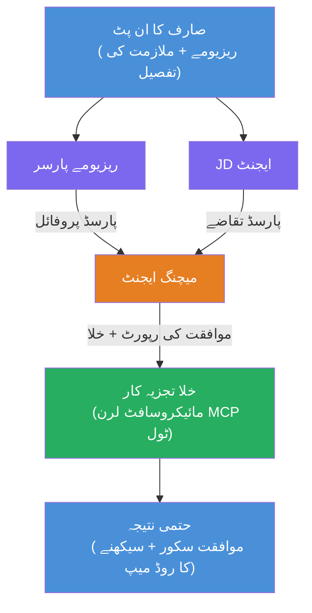

# لیب 02 - کثیرایجنٹ ورک فلو: ریزیومے → ملازمت کی مناسبیت کا جائزہ لینے والا

---

## آپ کیا بنائیں گے

ایک **ریزیومے → ملازمت کی مناسبیت کا جائزہ لینے والا** - ایک کثیرایجنٹ ورک فلو جہاں چار ماہر ایجنٹ مل کر جائزہ لیتے ہیں کہ امیدوار کا ریزیومے ملازمت کی تفصیل سے کس حد تک میل کھاتا ہے، پھر خالی جگہوں کو پر کرنے کے لیے ایک ذاتی نوعیت کا تعلیمی روڈمیپ تیار کرتے ہیں۔

### ایجنٹس

| ایجنٹ | کردار |
|-------|------|
| **ریزیومے پارسر** | ریزیومے کے متن سے ساختہ مہارتیں، تجربہ، سرٹیفیکیشنز نکالتا ہے |
| **جاب ڈسکرپشن ایجنٹ** | ملازمت کی تفصیل سے مطلوبہ/مرغوب مہارتیں، تجربہ، سرٹیفیکیشنز نکالتا ہے |
| **میچنگ ایجنٹ** | پروفائل بمقابلہ ضروریات کا موازنہ کرتا ہے → فٹ اسکور (0-100) + ملنے والی/غائب مہارتیں |
| **گیپ اینالائزر** | وسائل، ٹائم لائنز، اور فوری کامیابی کے منصوبوں کے ساتھ ایک ذاتی نوعیت کا تعلیمی روڈمیپ تیار کرتا ہے |

### ڈیمو فلو

ایک **ریزیومے + جاب ڈسکرپشن** اپ لوڈ کریں → ایک **فٹ اسکور + غائب مہارتیں** حاصل کریں → ایک **ذاتی تعلیمی روڈمیپ** وصول کریں۔

### ورک فلو فن تعمیر

> ارغوانی = متوازی ایجنٹس | اورنج = اجتماع کا مقام | سبز = آخری ایجنٹ ٹولز کے ساتھ۔ تفصیلی خاکے اور ڈیٹا فلو کے لیے دیکھیں [ماڈیول 1 - فن تعمیر کو سمجھیں](docs/01-understand-multi-agent.md) اور [ماڈیول 4 - آرکسٹریشن پیٹرنز](docs/04-orchestration-patterns.md)۔

### شامل موضوعات

- **WorkflowBuilder** کا استعمال کرتے ہوئے کثیرایجنٹ ورک فلو بنانا
- ایجنٹ کے کردار اور آرکسٹریشن فلو کی تعریف (متوازی + تسلسلی)
- ایجنٹس کے مابین رابطے کے پیٹرنز
- ایجنٹ انسکپٹر کے ذریعے مقامی جانچ
- کثیرایجنٹ ورک فلو کو Foundry Agent Service پر تعینات کرنا

---

## ضروری شرائط

پہلی لیب 01 مکمل کریں:

- [لیب 01 - سنگل ایجنٹ](../lab01-single-agent/README.md)

---

## شروعات کریں

مکمل سیٹ اپ ہدایات، کوڈ واک تھرو، اور ٹیسٹ کمانڈز دیکھیں:

- [لیب 2 دستاویزات - ضروریات](docs/00-prerequisites.md)
- [لیب 2 دستاویزات - مکمل تعلیمی راستہ](docs/README.md)
- [PersonalCareerCopilot رہنمائی](PersonalCareerCopilot/README.md)

## آرکسٹریشن پیٹرنز (ایجنٹک متبادلات)

لیب 2 میں ڈیفالٹ **متوازی → اجتماع کنندہ → منصوبہ ساز** فلو شامل ہے، اور دستاویزات میں متبادل پیٹرنز بھی بیان کیے گئے ہیں تاکہ زیادہ ایجنٹک رویہ دکھایا جا سکے:

- **وزنی اتفاق رائے کے ساتھ فین آؤٹ/فین ان**
- **حتمی روڈمیپ سے پہلے نقاد/جائزہ لینے والا کا دور**
- **شرطی روٹر** (فٹ اسکور اور غائب مہارتوں کی بنیاد پر راستہ منتخب کرنا)

دیکھیں [docs/04-orchestration-patterns.md](docs/04-orchestration-patterns.md)۔

---

**پچھلا:** [لیب 01 - سنگل ایجنٹ](../lab01-single-agent/README.md) · **واپس جائیں:** [ورکشاپ ہوم](../../README.md)

---

<!-- CO-OP TRANSLATOR DISCLAIMER START -->
**وضاحت**:
اس دستاویز کا ترجمہ AI ترجمہ سروس [Co-op Translator](https://github.com/Azure/co-op-translator) کے ذریعے کیا گیا ہے۔ اگرچہ ہم درستگی کی کوشش کرتے ہیں، براہ کرم اس بات سے آگاہ رہیں کہ خودکار ترجموں میں غلطیاں یا عدم درستیاں ہو سکتی ہیں۔ اصل دستاویز اپنی مادری زبان میں مستند ماخذ سمجھی جائے گی۔ اہم معلومات کے لئے پیشہ ورانہ انسانی ترجمہ تجویز کیا جاتا ہے۔ اس ترجمے کے استعمال سے پیدا ہونے والی کسی بھی غلط فہمی یا غلط تشریح کی ذمہ داری ہم پر عائد نہیں ہوتی۔
<!-- CO-OP TRANSLATOR DISCLAIMER END -->