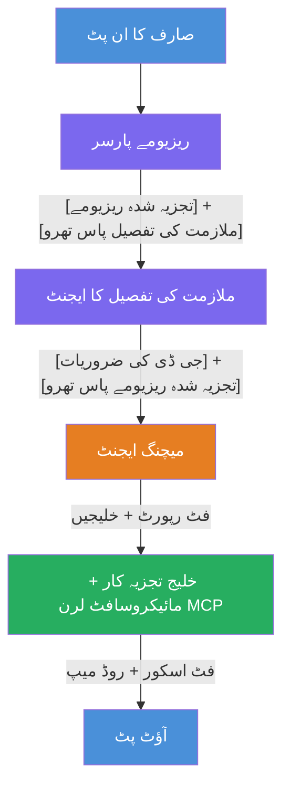

# لیب 02 - ملٹی ایجنٹ ورک فلو: ریزیومے → جاب فٹ ایولیویٹر

## جائزہ

اس عملی لیب میں، آپ VS کوڈ میں Foundry Toolkit استعمال کرتے ہوئے ایک **ورک فلو-اول ملٹی ایجنٹ ایپ** بنائیں گے اور اسے Microsoft Foundry Agent Service پر تعینات کریں گے۔

**جو آپ بنائیں گے:** ریزیومے → جاب فٹ ایولیویٹر جو ریزیومے اور جاب کی تفصیل کو پارس کرتا ہے، میچ کا اسکور دیتا ہے، اور Microsoft Learn وسائل استعمال کرتے ہوئے ایک ذاتی نوعیت کا لرننگ روڈ میپ تیار کرتا ہے۔

---

## فنِ تعمیر

```mermaid
flowchart TD
    A["صارف کا ان پٹ"] --> B["ریزیومے پارسر"]
    B -->|"[تجزیہ شدہ ریزیومے] + [ملازمت کی تفصیل پاس تھرو]"| C["ملازمت کی تفصیل کا ایجنٹ"]
    C -->|"[جی ڈی کی ضروریات] + [تجزیہ شدہ ریزیومے پاس تھرو]"| D["میچنگ ایجنٹ"]
    D -->|فٹ رپورٹ + خلیجیں| E["خلیج تجزیہ کار + مائیکروسافٹ لرن MCP"]
    E -->|فٹ اسکور + روڈ میپ| F["آؤٹ پٹ"]

    style A fill:#4A90D9,color:#fff
    style B fill:#7B68EE,color:#fff
    style C fill:#7B68EE,color:#fff
    style D fill:#E67E22,color:#fff
    style E fill:#27AE60,color:#fff
    style F fill:#4A90D9,color:#fff
```

**یہ کیسے کام کرتا ہے:**
1. صارف ریزیومے اور جاب کی تفصیل پیسٹ کرتا ہے۔
2. **ResumeParser** ریزیومے کو پارس کرتا ہے اور جاب ڈسکرپشن کو بالکل ویسا ہی `[JOB DESCRIPTION PASS-THROUGH]` سیکشن میں کاپی کرتا ہے۔
3. **JD Agent** پاس تھرو سے ساختی تقاضے نکالتا ہے، پھر `[PARSED RESUME]` کو آگے `[PARSED RESUME PASS-THROUGH]` کے طور پر بھیجتا ہے۔
4. **MatchingAgent** `[PARSED RESUME PASS-THROUGH]` اور `[JD REQUIREMENTS]` کا موازنہ کرتا ہے اور فٹ اسکور پیدا کرتا ہے۔
5. **GapAnalyzer** خلا کو ایک عملی روڈ میپ میں بدلتا ہے اور MCP کے ذریعے Microsoft Learn کے حقیقی روابط لاتا ہے۔

---

## مطلوبہ اقدامات

پہلے لیب 01 مکمل کریں:

- [لیب 01 - سنگل ایجنٹ](../lab01-single-agent/README.md)

---

## حصہ 1: ماڈیولز کو ترتیب سے پڑھیں

مکمل لرننگ پاتھ دیکھیں:

- [لیب 2 دستاویزات - مطلوبہ اقدامات](docs/00-prerequisites.md)
- [لیب 2 دستاویزات - مکمل لرننگ پاتھ](docs/README.md)
- [PersonalCareerCopilot رن گائیڈ](PersonalCareerCopilot/README.md)

---

## حصہ 2: ورک فلو بنائیں اور آزمائیں

1. Foundry Toolkit وزرڈ استعمال کریں تاکہ ورک فلو پر مبنی پروجیکٹ کی تشکیل کریں۔
2. `PersonalCareerCopilot/main.py` سے پرامپٹ بلاکس اور ورک فلو گراف کو اپنے ورک اسپیس میں کاپی کریں۔
3. ایجنٹ انسپکٹر کے ساتھ مقامی طور پر چلائیں اور تمام چار ایجنٹس کے ساتھ MCP ٹول کی تصدیق کریں۔
4. جب مقامی ٹیسٹنگ کامیاب ہو جائے تو ہوسٹڈ ایجنٹ کو Foundry پر تعینات کریں۔

---

## ہم آہنگی کے نمونے

لیب 02 میں ڈیفالٹ **fan-out → fan-in → sequential** فلو شامل ہے، اور دستاویزات میں تجربے کے لئے متبادل ہم آہنگی کے نمونوں کی بھی وضاحت ہے۔

- **وزنی اتفاق رائے کے ساتھ Fan-out/Fan-in**
- **حتمی روڈ میپ سے پہلے نظریہ کار/نقاد کا جائزہ**
- **فٹ اسکور اور غائب مہارتوں پر مبنی مشروط راؤٹر**

دیکھیں [docs/04-orchestration-patterns.md](docs/04-orchestration-patterns.md)۔

---

**پچھلا:** [لیب 01 - سنگل ایجنٹ](../lab01-single-agent/README.md) · **واپس جائیں:** [ورکشاپ ہوم](../../README.md)

---

<!-- CO-OP TRANSLATOR DISCLAIMER START -->
**ڈس کلیمر**:
یہ دستاویز AI ترجمہ سروس [Co-op Translator](https://github.com/Azure/co-op-translator) کے ذریعے ترجمہ کی گئی ہے۔ جبکہ ہم درستگی کے لیے کوشاں ہیں، براہ کرم اس بات سے آگاہ رہیں کہ خودکار ترجمے میں غلطیاں یا عدم درستیاں ہو سکتی ہیں۔ اصل دستاویز اپنے مادری زبان میں مستند ماخذ سمجھی جائے گی۔ حساس معلومات کے لیے پیشہ ور انسانی ترجمہ کی سفارش کی جاتی ہے۔ اس ترجمے کے استعمال سے پیدا ہونے والی کسی بھی غلط فہمی یا غلط تشریح کی ذمہ داری ہم قبول نہیں کرتے۔
<!-- CO-OP TRANSLATOR DISCLAIMER END -->