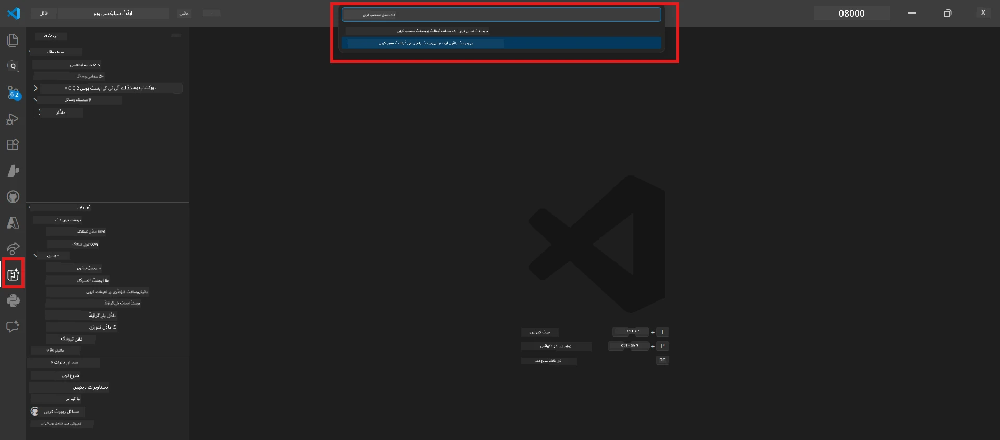

# ماڈیول 0 - پیشگی ضروریات

لیب 02 شروع کرنے سے پہلے، اس بات کی تصدیق کریں کہ آپ نے درج ذیل مکمل کر لیا ہے۔ یہ لیب براہ راست لیب 01 پر مبنی ہے - اسے مت چھوڑیں۔

---

## 1. لیب 01 مکمل کریں

لیب 02 اس فرض پر چلتی ہے کہ آپ پہلے ہی:

- [x] تمام 8 ماڈیولز مکمل کر چکے ہیں [لیب 01 - سنگل ایجنٹ](../../lab01-single-agent/README.md)
- [x] ایک سنگل ایجنٹ کو کامیابی سے Foundry ایجنٹ سروس پر تعینات کیا ہے
- [x] ایجنٹ کی تصدیق کی ہے کہ یہ مقامی ایجنٹ انسپکٹر اور Foundry پلے گراؤنڈ دونوں میں کام کرتا ہے

اگر آپ نے لیب 01 مکمل نہیں کی ہے، تو اب واپس جا کر اسے مکمل کریں: [لیب 01 دستاویزات](../../lab01-single-agent/docs/00-prerequisites.md)

---

## 2. موجودہ سیٹ اپ کی تصدیق کریں

لیب 01 کے تمام ٹولز اب بھی نصب اور کام کر رہے ہونے چاہئیں۔ یہ تیز چیکس چلائیں:

### 2.1 Azure CLI

```powershell
az account show --query "{name:name, id:id}" --output table
```

متوقع: آپ کا سبسکرپشن نام اور آئی ڈی دکھاتا ہے۔ اگر یہ ناکام ہو جاتا ہے، تو [`az login`](https://learn.microsoft.com/cli/azure/authenticate-azure-cli-interactively) چلائیں۔

### 2.2 VS Code ایکسٹینشنز

1. `Ctrl+Shift+P` دبائیں → **"Microsoft Foundry"** ٹائپ کریں → تصدیق کریں کہ آپ کمانڈز دیکھ رہے ہیں (مثلاً، `Microsoft Foundry: Create a New Hosted Agent`)۔
2. `Ctrl+Shift+P` دبائیں → **"Foundry Toolkit"** ٹائپ کریں → تصدیق کریں کہ آپ کمانڈز دیکھ رہے ہیں (مثلاً، `Foundry Toolkit: Open Agent Inspector`)۔

### 2.3 Foundry پروجیکٹ اور ماڈل

1. VS Code کی ایکٹیویٹی بار میں **Microsoft Foundry** آئیکن پر کلک کریں۔
2. تصدیق کریں کہ آپ کا پروجیکٹ فہرست میں موجود ہے (مثلاً، `workshop-agents`)۔
3. پروجیکٹ کو بڑھائیں → یقینی بنائیں کہ ایک تعینات ماڈل موجود ہے (مثلاً، `gpt-4.1-mini`) جس کی حالت **Succeeded** ہے۔

> **اگر آپ کی ماڈل کی تعیناتی ختم ہو گئی ہے:** کچھ مفت سطح کی تعیناتیاں خود بخود ختم ہو جاتی ہیں۔ دوبارہ تعینات کریں [ماڈل کیٹلاگ](https://learn.microsoft.com/azure/foundry/foundry-models/concepts/models-sold-directly-by-azure) سے (`Ctrl+Shift+P` → **Microsoft Foundry: Open Model Catalog**)۔



### 2.4 RBAC کردار

تصدیق کریں کہ آپ کے پاس آپ کے Foundry پروجیکٹ پر **Azure AI User** ہے:

1. [Azure پورٹل](https://portal.azure.com) → آپ کے Foundry **پروجیکٹ** کے وسائل → **Access control (IAM)** → **[Role assignments](https://learn.microsoft.com/azure/foundry/concepts/rbac-foundry)** ٹیب۔
2. اپنے نام کی تلاش کریں → تصدیق کریں کہ **[Azure AI User](https://aka.ms/foundry-ext-project-role)** فہرست میں موجود ہے۔

---

## 3. ملٹی ایجنٹ تصورات کو سمجھیں (لیب 02 کے لیے نیا)

لیب 02 ایسے تصورات متعارف کراتا ہے جو لیب 01 میں شامل نہیں تھے۔ آگے بڑھنے سے پہلے اسے پڑھیں:

### 3.1 ملٹی ایجنٹ ورک فلو کیا ہے؟

ایک ایجنٹ کی بجائے جو سب کچھ ہینڈل کرتا ہے، ایک **ملٹی ایجنٹ ورک فلو** کام کو مختلف ماہر ایجنٹس میں تقسیم کر دیتا ہے۔ ہر ایجنٹ کے پاس ہے:

- اپنی **ہدایتیں** (سسٹم پرومپٹ)
- اپنی **کردار** (جس کا وہ ذمہ دار ہے)
- اختیاری **ٹولز** (فنکشنز جو وہ کال کر سکتا ہے)

ایجنٹس ایک **آرکسٹریشن گراف** کے ذریعے بات چیت کرتے ہیں جو یہ طے کرتا ہے کہ ڈیٹا ان کے درمیان کیسے بہتا ہے۔

### 3.2 WorkflowBuilder

[`WorkflowBuilder`](https://learn.microsoft.com/agent-framework/workflows/agents-in-workflows) کلاس `agent_framework` سے وہ SDK کمپونینٹ ہے جو ایجنٹس کو آپس میں جوڑتا ہے:

```python
from agent_framework import WorkflowBuilder

workflow = (
    WorkflowBuilder(
        name="MyWorkflow",
        start_executor=agent_a,
        output_executors=[agent_d],
    )
    .add_edge(agent_a, agent_b)
    .add_edge(agent_a, agent_c)
    .add_edge(agent_b, agent_d)
    .add_edge(agent_c, agent_d)
    .build()
)
```

- **`start_executor`** - پہلا ایجنٹ جو صارف کا ان پٹ وصول کرتا ہے
- **`output_executors`** - وہ ایجنٹ(ز) جن کا آؤٹ پٹ حتمی جواب بنتا ہے
- **`add_edge(source, target)`** - یہ طے کرتا ہے کہ `target` کو `source` کا آؤٹ پٹ موصول ہوتا ہے

### 3.3 MCP (ماڈل کانٹیکسٹ پروٹوکول) ٹولز

لیب 02 ایک **MCP ٹول** استعمال کرتا ہے جو Microsoft Learn API کو کال کر کے تعلیمی وسائل حاصل کرتا ہے۔ [MCP (ماڈل کانٹیکسٹ پروٹوکول)](https://modelcontextprotocol.io/introduction) ایک معیاری پروٹوکول ہے جو AI ماڈلز کو بیرونی ڈیٹا ذرائع اور ٹولز سے جوڑتا ہے۔

| اصطلاح | تعریف |
|------|-----------|
| **MCP سرور** | ایک سروس جو ٹولز/وسائل کو [MCP پروٹوکول](https://learn.microsoft.com/azure/foundry/agents/how-to/tools/model-context-protocol) کے ذریعے فراہم کرتی ہے |
| **MCP کلائنٹ** | آپ کا ایجنٹ کوڈ جو MCP سرور سے جڑتا ہے اور اس کے ٹولز کو کال کرتا ہے |
| **[Streamable HTTP](https://learn.microsoft.com/agent-framework/agents/tools/hosted-mcp-tools)** | وہ ترسیلی طریقہ جو MCP سرور سے بات چیت کے لیے استعمال ہوتا ہے |

### 3.4 لیب 02 اور لیب 01 میں فرق

| پہلو | لیب 01 (سنگل ایجنٹ) | لیب 02 (ملٹی ایجنٹ) |
|--------|----------------------|---------------------|
| ایجنٹس | 1 | 4 (مہارت والے کردار) |
| آرکسٹریشن | نہیں | WorkflowBuilder (متوازی + تسلسل) |
| ٹولز | اختیاری `@tool` فنکشن | MCP ٹول (بیرونی API کال) |
| پیچیدگی | آسان پرومپٹ → جواب | ریزیومے + جاب ڈسکرپشن → فٹ اسکور → روڈمیپ |
| کانٹیکسٹ فلو | براہ راست | ایجنٹ سے ایجنٹ تک منتقلی |

---

## 4. لیب 02 کے ورکشاپ ریپوزٹری کی ساخت

یقینی بنائیں کہ آپ کو معلوم ہے کہ لیب 02 کی فائلز کہاں ہیں:

```
workshop/
└── lab02-multi-agent/
    ├── README.md                       ← Lab overview
    ├── docs/                           ← You are here
    │   ├── README.md                   ← Learning path index
    │   ├── 00-prerequisites.md         ← This file
    │   ├── 01-understand-multi-agent.md
    │   ├── ...
    │   └── 08-troubleshooting.md
    └── PersonalCareerCopilot/          ← The agent project
        ├── agent.yaml                  ← Agent definition
        ├── main.py                     ← 4-agent workflow code
        ├── Dockerfile                  ← Container configuration
        └── requirements.txt            ← Python dependencies
```

---

### چیک پوائنٹ

- [ ] لیب 01 مکمل ہے (تمام 8 ماڈیول، ایجنٹ تعینات اور تصدیق شدہ)
- [ ] `az account show` آپ کا سبسکرپشن دکھاتا ہے
- [ ] Microsoft Foundry اور Foundry Toolkit ایکسٹینشنز نصب اور رد عمل دے رہے ہیں
- [ ] Foundry پروجیکٹ میں ایک تعینات ماڈل موجود ہے (مثلاً، `gpt-4.1-mini`)
- [ ] آپ کے پاس پروجیکٹ پر **Azure AI User** کا کردار ہے
- [ ] آپ نے اوپر ملٹی ایجنٹ تصورات کا حصہ پڑھا ہے اور WorkflowBuilder، MCP، اور ایجنٹ آرکسٹریشن کو سمجھتے ہیں

---

**اگلا:** [01 - ملٹی ایجنٹ آرکیٹیکچر کو سمجھیں →](01-understand-multi-agent.md)

---

<!-- CO-OP TRANSLATOR DISCLAIMER START -->
**واضح کریں**:  
یہ دستاویز AI ترجمہ سروس [Co-op Translator](https://github.com/Azure/co-op-translator) کے ذریعے ترجمہ کی گئی ہے۔ اگرچہ ہم درستگی کے لیے کوشاں ہیں، براہ کرم آگاہ رہیں کہ خودکار تراجم میں غلطیاں یا غیر درستیاں ہو سکتی ہیں۔ اصل دستاویز اپنی مادری زبان میں ہی مستند ماخذ سمجھی جانی چاہیے۔ اہم معلومات کے لیے پیشہ ورانہ انسانی ترجمہ تجویز کیا جاتا ہے۔ اس ترجمے کے استعمال سے پیدا ہونے والے کسی بھی غلط فہمی یا غلط تشریح کی ذمہ داری ہم پر عائد نہیں ہوتی۔
<!-- CO-OP TRANSLATOR DISCLAIMER END -->