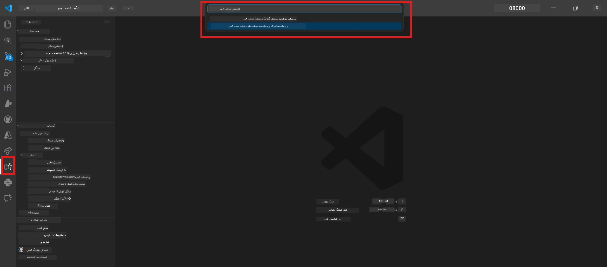

# ماڈیول 0 - تعارف

⏱️ ~10 منٹ

> [!WARNING]
> **پریویو اور حدود:** [میزبان ایجنٹس](https://learn.microsoft.com/azure/foundry/agents/concepts/hosted-agents) فی الحال **پبلک پریویو** میں ہیں - پروڈکشن ورک لوڈز کے لیے سفارش نہیں کی جاتی۔ اس ورکشاپ میں دکھائی گئی کچھ خصوصیات GA کی طرف سروس کے بڑھنے کے ساتھ بدل سکتی ہیں۔

## آپ کیا بنائیں گے

اس لیب میں، آپ لیب 01 سے سنگل ایجنٹ مہارتوں کو بڑھاتے ہوئے ایک **ملٹی ایجنٹ ورک فلو** بنائیں گے - ریزیومے → جاب فٹ ایویلیو ایٹر۔

آپ ایک **ریزیومے** اور ایک **جاب کی تفصیل** چسپاں کرتے ہیں۔ چار ماہر ایجنٹس ان پٹ کو ترتیب وار پروسیس کرتے ہیں، پھر واپس کرتے ہیں:
- ایک فٹ اسکور (0–100 اسکورنگ تفصیل کے ساتھ)
- مہارت اور سرٹیفیکیشن میں خلا کی فہرست
- ہر خلا کے لیے اصلی Microsoft Learn لنکس کے ساتھ ذاتی سیکھنے کا روڈ میپ

**ورک فلو استعمال کرتا ہے:**
- **Microsoft Agent Framework** - `WorkflowBuilder` ترتیب وار پائپ لائن آرکسٹریشن کے لیے
- **Foundry Toolkit for VS Code** - سکیفولڈ، لوکل ٹیسٹنگ، تعیناتی
- **ایک AI ماڈل** (مثلاً `gpt-4.1-mini`) - چاروں ایجنٹس کے ذریعے استعمال کیا جاتا ہے
- **Microsoft Learn MCP سرور** - ہر مہارت کے خلا کے لیے اصلی سیکھنے کے وسائل کے لنکس فراہم کرتا ہے

---

## اپنی راہ منتخب کریں

> ⚠️ **اسی راستے کا استعمال جاری رکھیں جو آپ نے لیب 01 میں کیا تھا۔**

<details open>
<summary><strong>🅰️ راستہ A - Azure کلاؤڈ (Azure سبسکرپشن درکار)</strong></summary>

| | تفصیلات |
|---|---|
| **یہ کس کے لیے ہے؟** | آپ نے لیب 01 Azure سبسکرپشن کے ساتھ مکمل کی |
| **ماڈل** | Azure OpenAI بذریعہ Foundry (مثلاً، `gpt-4.1-mini`) |
| **شامل ماڈیولز** | تمام ماڈیولز (00–09) |
| **کلاؤڈ پر تعینات کرے؟** | ✅ ہاں - مکمل اینڈ ٹو اینڈ تعیناتی |

</details>

<details open>
<summary><strong>🅱️ راستہ B - Foundry لوکل (Azure سبسکرپشن کی ضرورت نہیں)</strong></summary>

| | تفصیلات |
|---|---|
| **یہ کس کے لیے ہے؟** | آپ نے لیب 01 Foundry لوکل کے ساتھ مکمل کی |
| **ماڈل** | Foundry لوکل (مفت، آپ کے کمپیوٹر پر چلتا ہے) |
| **شامل ماڈیولز** | ماڈیولز 00–05 (چھوڑیں 06–07 - تعیناتی اور کلاؤڈ ویریفائی) |
| **کلاؤڈ پر تعینات کرے؟** | ❌ نہیں - صرف لوکل ٹیسٹنگ ایجنٹ انسپیکٹر کے ذریعے |

</details>

---

## لیب 01 کی جانچ

لیب 02 براہ راست لیب 01 پر مبنی ہے۔ پہلے لیب 01 مکمل کریں پھر یہاں شروع کریں۔

کیا آپ نے ابھی تک لیب 01 نہیں کی؟ یہاں سے شروع کریں: [Lab 01 - Introduction](../../lab01-single-agent/docs/00-prerequisites.md)

<details open>
<summary><strong>🅰️ راستہ A - Azure کلاؤڈ</strong></summary>

```powershell
az account show --query "{name:name, id:id}" --output table
```

اگر یہ ناکام ہو تو، `az login` چلائیں۔ پھر VS Code میں تصدیق کریں:

1. `Ctrl+Shift+P` → **Foundry Toolkit** ٹائپ کریں → کمانڈز ظاہر ہونے کی تصدیق کریں۔
2. **Foundry Toolkit** آئیکن پر کلک کریں → آپ کا پروجیکٹ اور تعینات کیا ہوا ماڈل **Succeeded** دکھائیں۔



> **RBAC:** آپ نے لیب 01 میں **Foundry User** تفویض کیا تھا۔ اگر دوبارہ تفویض کرنا ہو تو دیکھیں [Lab 01, Module 1](../../lab01-single-agent/docs/01-setup.md#deploy-a-model--assign-rbac). یہ رول پہلے **Azure AI User** کہلایا کرتا تھا - ایک ہی اجازتیں۔

</details>

<details open>
<summary><strong>🅱️ راستہ B - Foundry لوکل</strong></summary>

```powershell
Invoke-WebRequest -Uri "http://localhost:5273/v1/health" -UseBasicParsing | Select-Object StatusCode
```

متوقع: `StatusCode: 200`۔ اگر نہیں، تو Foundry Toolkit سائڈبار سے Foundry لوکل دوبارہ شروع کریں۔

> تمام انفرنس آپ کے کمپیوٹر پر چلتی ہے۔ واحد آؤٹ باؤنڈ کال MCP ٹول سے `https://learn.microsoft.com/api/mcp` کو جاتی ہے۔

</details>

---

## لیب 02 میں نیا کیا ہے

| | لیب 01 | لیب 02 |
|--|--------|--------|
| ایجنٹس | 1 | 4 (WorkflowBuilder کے ساتھ سلسلہ وار) |
| سکیفولڈ ٹیمپلیٹ | بنیادی - ایجنٹ فریم ورک | ورک فلو - ایجنٹ فریم ورک |
| نیا پیکج | - | `mcp` |
| آرکسٹریشن | سنگل بات چیت کرنے والا ایجنٹ | ترتیب وار پائپ لائن (WorkflowBuilder) |
| نیا ٹول | - | `search_microsoft_learn_for_plan` (MCP) |

---

**اگلا:** [01 - فن تعمیر کو سمجھیں →](01-understand-multi-agent.md)

---

<!-- CO-OP TRANSLATOR DISCLAIMER START -->
**ڈس کلیمر**:
یہ دستاویز AI ترجمہ سروس [Co-op Translator](https://github.com/Azure/co-op-translator) کے ذریعے ترجمہ کی گئی ہے۔ جبکہ ہم درستگی کے لیے کوشاں ہیں، براہ کرم اس بات سے آگاہ رہیں کہ خودکار ترجمے میں غلطیاں یا عدم درستیاں ہو سکتی ہیں۔ اصل دستاویز اپنے مادری زبان میں مستند ماخذ سمجھی جائے گی۔ حساس معلومات کے لیے پیشہ ور انسانی ترجمہ کی سفارش کی جاتی ہے۔ اس ترجمے کے استعمال سے پیدا ہونے والی کسی بھی غلط فہمی یا غلط تشریح کی ذمہ داری ہم قبول نہیں کرتے۔
<!-- CO-OP TRANSLATOR DISCLAIMER END -->