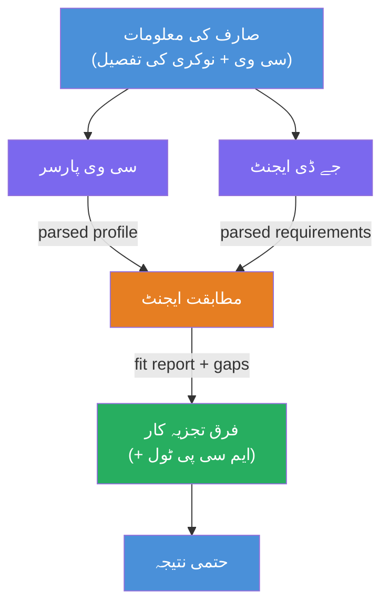
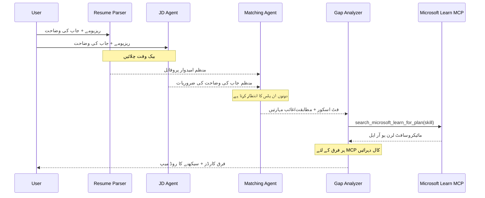
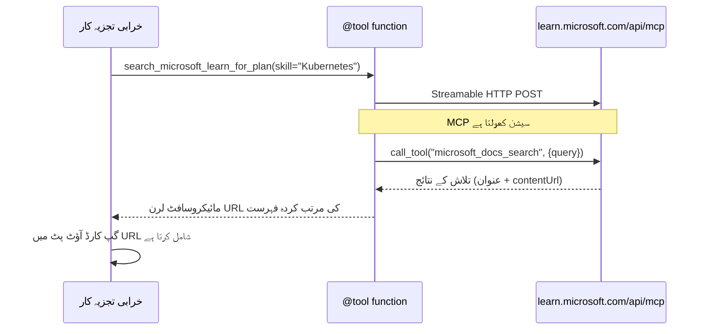

# ماڈیول 1 - کثیر ایجنٹ آرکیٹیکچر کو سمجھنا

اس ماڈیول میں، آپ ریزیومے → ملازمت فٹ ایولیویٹر کی آرکیٹیکچر سیکھیں گے اس سے پہلے کہ آپ کوئی کوڈ لکھیں۔ آرکیسٹریشن گراف، ایجنٹ کے کردار، اور ڈیٹا فلو کو سمجھنا [کثیر ایجنٹ ورک فلو](https://learn.microsoft.com/azure/architecture/ai-ml/idea/multiple-agent-workflow-automation) کی خرابی تلاش کرنے اور توسیع کرنے کے لیے بہت ضروری ہے۔

---

## وہ مسئلہ جسے یہ حل کرتا ہے

ریزیومے کو کسی ملازمت کی تفصیل سے ملانا متعدد مختلف صلاحیتوں پر مشتمل ہوتا ہے:

1. **تجزیہ کاری** - غیر ساختہ متن (ریزیومے) سے مربوط ڈیٹا نکالنا  
2. **تجزیہ** - ملازمت کی تفصیل سے ضروریات نکالنا  
3. **موازنہ** - دونوں کے مابین ہم آہنگی کی جانچ کرنا  
4. **منصوبہ بندی** - کمیوں کو پورا کرنے کے لیے سیکھنے کا نقشہ تیار کرنا  

ایک واحد ایجنٹ جو یہ چار کام ایک ہی پرامپٹ میں کرتا ہے عام طور پر یہ پیدا کرتا ہے:  
- نامکمل استخراج (یہ سکور حاصل کرنے کے لیے تجزیہ کاری کو جلدی میں کرتا ہے)  
- سطحی سکورنگ (ثبوت کی بنیاد پر تجزیہ نہیں ہوتا)  
- عمومی نقشے (مخصوص کمیوں کے مطابق نہیں ہوتے)  

**چار مخصوص ایجنٹس** میں تقسیم کرکے، ہر ایک اپنے کام پر مخصوص ہدایات کے ساتھ توجہ دیتا ہے، اور ہر مرحلے پر اعلی معیار کی پیداوار دیتا ہے۔

---

## وہ چار ایجنٹس

ہر ایجنٹ ایک مکمل [Microsoft Foundry](https://learn.microsoft.com/azure/foundry/agents/concepts/hosted-agents) ایجنٹ ہے جو `AzureAIAgentClient.as_agent()` کے ذریعے بنایا گیا ہے۔ یہ سب ایک ہی ماڈل ڈیپلائمنٹ استعمال کرتے ہیں لیکن ہدایات اور (اختیاری طور پر) اوزار مختلف ہوتے ہیں۔

| # | ایجنٹ کا نام | کردار | ان پٹ | آؤٹ پٹ |
|---|-------------|-------|--------|---------|
| 1 | **ResumeParser** | ریزیومے کے متن سے مربوط پروفائل نکالتا ہے | صارف سے خام ریزیومے کا متن | امیدوار پروفائل، تکنیکی مہارتیں، نرم مہارتیں، سرٹیفکیٹس، ڈومین کا تجربہ، کامیابیاں |
| 2 | **JobDescriptionAgent** | ملازمت کی تفصیل سے مربوط ضروریات نکالتا ہے | صارف سے خام ملازمت کی تفصیل کا متن (ResumeParser سے بھیجا گیا) | کردار کا جائزہ، مطلوبہ مہارتیں، ترجیحی مہارتیں، تجربہ، سرٹیفکیٹس، تعلیم، ذمہ داریاں |
| 3 | **MatchingAgent** | ثبوت کی بنیاد پر فٹ سکور نکالتا ہے | ResumeParser اور JobDescriptionAgent کے نتائج | فٹ سکور (0-100 بریک ڈاؤن کے ساتھ)، ملنے والی مہارتیں، غائب مہارتیں، کمیوں کی نشاندہی |
| 4 | **GapAnalyzer** | ذاتی سیکھنے کا روڈ میپ تیار کرتا ہے | MatchingAgent کے نتائج | کمی کارڈز (ہر مہارت کے لیے)، سیکھنے کا ترتیب، ٹائم لائن، Microsoft Learn سے وسائل |

---

## آرکیسٹریشن گراف

ورک فلو **متوازی تقسیم** کے بعد **تسلسل میں اجتماع** استعمال کرتا ہے:


> **لیجنڈ:** جامنی = متوازی ایجنٹس، نارنجی = اجتماع کا نقطہ، سبز = حتمی ایجنٹ ٹولز کے ساتھ

### ڈیٹا کا بہاؤ کیسے ہوتا ہے


1. **صارف بھیجتا ہے** ایک پیغام جس میں ریزیومے اور ملازمت کی تفصیل ہوتی ہے۔  
2. **ResumeParser** پورا صارف ان پٹ وصول کرتا ہے اور مربوط امیدوار پروفائل نکالتا ہے۔  
3. **JobDescriptionAgent** صارف ان پٹ متوازی طور پر وصول کرتا ہے اور مربوط ضروریات نکالتا ہے۔  
4. **MatchingAgent** دونوں ResumeParser اور JobDescriptionAgent سے آؤٹ پٹ وصول کرتا ہے (فریم ورک دونوں کے مکمل ہونے کا انتظار کرتا ہے)۔  
5. **GapAnalyzer** MatchingAgent کا آؤٹ پٹ وصول کرتا ہے اور **Microsoft Learn MCP ٹول** کال کرکے ہر کمی کے لیے اصلی سیکھنے کے وسائل حاصل کرتا ہے۔  
6. **حتمی آؤٹ پٹ** GapAnalyzer کا جواب ہوتا ہے، جس میں فٹ سکور، کمی کارڈز، اور مکمل سیکھنے کا نقشہ شامل ہے۔

### متوازی تقسیم کیوں اہم ہے

ResumeParser اور JobDescriptionAgent **متوازی** چلتے ہیں کیونکہ دونوں ایک دوسرے پر منحصر نہیں ہیں۔ یہ:  
- کل تاخیر کو کم کرتا ہے (دونوں ایک ساتھ چلتے ہیں بجائے کہ ایک کے بعد ایک)  
- ایک قدرتی تقسیم ہے (ریزیومے کا تجزیہ اور JD کا تجزیہ آزاد کام ہیں)  
- ایک عام کثیر ایجنٹ پیٹرن کو ظاہر کرتا ہے: **تقسیم → اجتماع → عمل**

---

## ورک فلو بیلڈر کوڈ میں

مندرجہ بالا گراف [`WorkflowBuilder`](https://learn.microsoft.com/agent-framework/workflows/agents-in-workflows) API کالز کے ساتھ `main.py` میں یوں تعلق رکھتا ہے:

```python
from agent_framework import WorkflowBuilder

workflow = (
    WorkflowBuilder(
        name="ResumeJobFitEvaluator",
        start_executor=resume_parser,       # صارف کی ان پٹ وصول کرنے والا پہلا ایجنٹ
        output_executors=[gap_analyzer],     # آخری ایجنٹ جس کی آؤٹ پٹ واپس کی جاتی ہے
    )
    .add_edge(resume_parser, jd_agent)      # ریزیومے پارسر → جاب ڈسکرپشن ایجنٹ
    .add_edge(resume_parser, matching_agent) # ریزیومے پارسر → میچنگ ایجنٹ
    .add_edge(jd_agent, matching_agent)      # جاب ڈسکرپشن ایجنٹ → میچنگ ایجنٹ
    .add_edge(matching_agent, gap_analyzer)  # میچنگ ایجنٹ → گیپ انالیزر
    .build()
)
```
  
**کناروں کو سمجھنا:**

| کنارہ | مطلب |
|--------|-------|
| `resume_parser → jd_agent` | JD ایجنٹ کو ResumeParser کا آؤٹ پٹ ملتا ہے |
| `resume_parser → matching_agent` | MatchingAgent کو ResumeParser کا آؤٹ پٹ ملتا ہے |
| `jd_agent → matching_agent` | MatchingAgent کو JD ایجنٹ کا آؤٹ پٹ بھی ملتا ہے (دونوں کا انتظار کرتا ہے) |
| `matching_agent → gap_analyzer` | GapAnalyzer کو MatchingAgent کا آؤٹ پٹ ملتا ہے |

چونکہ `matching_agent` کے پاس **دو آنے والے کنارے** ہیں (`resume_parser` اور `jd_agent`)، فریم ورک خود بخود دونوں کے مکمل ہونے کا انتظار کرتا ہے پھر MatchingAgent چلتا ہے۔

---

## MCP ٹول

GapAnalyzer ایجنٹ کے پاس ایک ٹول ہے: `search_microsoft_learn_for_plan`۔ یہ ایک **[MCP ٹول](https://learn.microsoft.com/agent-framework/agents/tools/hosted-mcp-tools)** ہے جو Microsoft Learn API کو کال کرکے منتخب شدہ سیکھنے کے وسائل حاصل کرتا ہے۔

### یہ کیسے کام کرتا ہے

```python
@tool
async def search_microsoft_learn_for_plan(
    skill: str, role: str = "", max_results: int = 5
) -> str:
    """Search Microsoft Learn MCP and return curated official links."""
    # اسٹریمیبل ایچ ٹی ٹی پی کے ذریعے https://learn.microsoft.com/api/mcp سے منسلک ہوتا ہے
    # MCP سرور پر 'microsoft_docs_search' ٹول کو کال کرتا ہے
    # مائیکروسافٹ لرن یو آر ایلز کی فارمیٹ شدہ فہرست واپس کرتا ہے
```
  
### MCP کال فلو


1. GapAnalyzer فیصلہ کرتا ہے کہ اسے کسی مہارت کے لیے سیکھنے کے وسائل چاہئیں (مثلاً "Kubernetes")  
2. فریم ورک کال کرتا ہے `search_microsoft_learn_for_plan(skill="Kubernetes")`  
3. فنکشن [Streamable HTTP](https://learn.microsoft.com/agent-framework/agents/tools/hosted-mcp-tools) کنکشن کھولتا ہے `https://learn.microsoft.com/api/mcp`  
4. یہ [MCP سرور](https://learn.microsoft.com/azure/foundry/agents/how-to/tools/model-context-protocol) پر `microsoft_docs_search` ٹول کال کرتا ہے  
5. MCP سرور تلاش کے نتائج (عنوان + URL) واپس کرتا ہے  
6. فنکشن نتائج کو فارمیٹ کرتا ہے اور بطور سٹرنگ واپس کرتا ہے  
7. GapAnalyzer واپس کیے گئے URLs کو اپنے کمی کارڈ آؤٹ پٹ میں استعمال کرتا ہے

### متوقع MCP لاگز

جب ٹول چلتا ہے تو آپ لاگ اندراجات دیکھیں گے جیسے:

```
GET https://learn.microsoft.com/api/mcp → 405 (Method Not Allowed)
POST https://learn.microsoft.com/api/mcp → 200
DELETE https://learn.microsoft.com/api/mcp → 405 (Method Not Allowed)
```
  
**یہ معمول کی بات ہے۔** MCP کلائنٹ ابتدائی طور پر GET اور DELETE کے ساتھ پروب کرتا ہے - 405 کی واپسی متوقع ہے۔ اصل ٹول کال POST سے ہوتی ہے اور 200 واپس آتا ہے۔ صرف POST کالز کے ناکام ہونے پر فکر کریں۔

---

## ایجنٹ بنانے کا طریقہ

ہر ایجنٹ **[`AzureAIAgentClient.as_agent()`](https://learn.microsoft.com/python/api/overview/azure/ai-agents-readme) async کنٹیکسٹ مینیجر** کے استعمال سے بنایا جاتا ہے۔ یہ Foundry SDK کا پیٹرن ہے جو ایجنٹس کو خودکار طریقے سے صاف کرتا ہے:

```python
async with (
    get_credential() as credential,
    AzureAIAgentClient(
        project_endpoint=PROJECT_ENDPOINT,
        model_deployment_name=MODEL_DEPLOYMENT_NAME,
        credential=credential,
    ).as_agent(
        name="ResumeParser",
        instructions=RESUME_PARSER_INSTRUCTIONS,
    ) as resume_parser,
    # ... ہر ایجنٹ کے لیے دہرائیں ...
):
    # یہاں تمام 4 ایجنٹس موجود ہیں
    workflow = create_workflow(resume_parser, jd_agent, matching_agent, gap_analyzer)
```
  
**اہم نکات:**  
- ہر ایجنٹ کو اپنا `AzureAIAgentClient` انسٹینس ملتا ہے (SDK کے لیے ایجنٹ کا نام کلائنٹ کے ساتھ خاص ہونا ضروری ہے)  
- تمام ایجنٹس ایک ہی `credential`, `PROJECT_ENDPOINT`, اور `MODEL_DEPLOYMENT_NAME` شیئر کرتے ہیں  
- `async with` بلاک یقینی بناتا ہے کہ سرور کے بند ہوتے ہی تمام ایجنٹس صاف ہوجائیں  
- GapAnalyzer کو اضافی طور پر `tools=[search_microsoft_learn_for_plan]` ملتا ہے  

---

## سرور کا آغاز

ایجنٹس بنانے اور ورک فلو تیار کرنے کے بعد، سرور چلتا ہے:

```python
from azure.ai.agentserver.agentframework import from_agent_framework

agent = create_workflow(resume_parser, jd_agent, matching_agent, gap_analyzer)
await from_agent_framework(agent).run_async()
```
  
`from_agent_framework()` ورک فلو کو HTTP سرور کے طور پر لپیٹتا ہے جو پورٹ 8088 پر `/responses` اینڈپوائنٹ فراہم کرتا ہے۔ یہ لیب 01 کی طرح کا ہی پیٹرن ہے، لیکن "ایجنٹ" اب پوری [ورک فلو گراف](https://learn.microsoft.com/agent-framework/workflows/as-agents) ہے۔

---

### چیک پوائنٹ

- [ ] آپ 4 ایجنٹ آرکیٹیکچر اور ہر ایجنٹ کے کردار کو سمجھتے ہیں  
- [ ] آپ ڈیٹا فلو کو ٹریس کر سکتے ہیں: صارف → ResumeParser → (متوازی) JD ایجنٹ + MatchingAgent → GapAnalyzer → آؤٹ پٹ  
- [ ] آپ سمجھتے ہیں کہ MatchingAgent کیوں دونوں ResumeParser اور JD ایجنٹ کا انتظار کرتا ہے (دو آنے والے کنارے)  
- [ ] آپ MCP ٹول کو سمجھتے ہیں: یہ کیا کرتا ہے، اسے کیسے کال کیا جاتا ہے، اور GET 405 لاگز کی معمولی بات ہے  
- [ ] آپ `AzureAIAgentClient.as_agent()` پیٹرن کو سمجھتے ہیں اور کیوں ہر ایجنٹ کو اپنا کلائنٹ انسٹینس ملتا ہے  
- [ ] آپ `WorkflowBuilder` کوڈ کو پڑھ کر اسے بصری گراف سے ملا سکتے ہیں  

---

**پچھلا:** [00 - شرائط](00-prerequisites.md) · **اگلا:** [02 - کثیر ایجنٹ پروجیکٹ کی اسکافولڈنگ →](02-scaffold-multi-agent.md)

---

<!-- CO-OP TRANSLATOR DISCLAIMER START -->
**دفعِ ذمہ داری**:
اس دستاویز کا ترجمہ AI ترجمہ سروس [Co-op Translator](https://github.com/Azure/co-op-translator) کے ذریعہ کیا گیا ہے۔ اگرچہ ہم درستگی کے لیے کوشاں ہیں، براہ کرم ذہن میں رکھیں کہ خودکار تراجم میں غلطیاں یا غیر یقینی معلومات ہو سکتی ہیں۔ اصل دستاویز اپنی مادری زبان میں ہی معتبر ماخذ سمجھی جانی چاہیے۔ حساس معلومات کے لیے، پیشہ ور انسانی ترجمہ تجویز کیا جاتا ہے۔ ہم اس ترجمہ کے استعمال سے پیدا ہونے والی کسی بھی غلط فہمی یا غلط تشریح کے ذمہ دار نہیں ہیں۔
<!-- CO-OP TRANSLATOR DISCLAIMER END -->