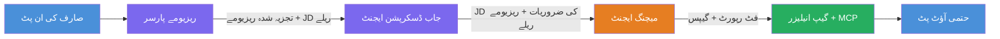

# ماڈیول 1 - آرکیٹیکچر کو سمجھنا

⏱️ ~5 منٹ

کوئی بھی کوڈ لکھنے سے پہلے، یہاں ایک مختصر جائزہ ہے کہ آپ کیا بنا رہے ہیں اور یہ کیسے کام کرتا ہے۔

---

## آپ کیا بنا رہے ہیں

آپ ایک **ریزیومے** اور ایک **جاب کی تفصیل** چسپاں کرتے ہیں۔ ورک فلو واپس دیتا ہے:

- ایک فٹ سکور (0–100 کے ساتھ تفصیل)
- مہارت اور سرٹیفیکیشن کے فرق کی فہرست
- ہر فرق کے لیے Microsoft Learn لنکس کے ساتھ ذاتی نوعیت کا تعلیمی روڈ میپ

---

## چار ایجنٹس

ایک واحد ایجنٹ جو سب کچھ بیک وقت پارس، سکور اور پلان کرنے کی کوشش کرتا ہے، جلد بازی کرتا ہے اور سطحی نتائج پیدا کرتا ہے۔ کام کو چار تخصصی ایجنٹس میں تقسیم کرنے سے بہتر نتائج ملتے ہیں:

| ایجنٹ | یہ کیا کرتا ہے |
|-------|-------------|
| **ResumeParser** | ریزیومے کو پارس کرتا ہے؛ JD کو بالکل ویسا ہی `[JOB DESCRIPTION PASS-THROUGH]` میں کاپی کرتا ہے تاکہ نیچے والے ایجنٹس استعمال کریں |
| **JobDescriptionAgent** | پاس تھرو سے JD کی ضروریات نکالتا ہے؛ `[PARSED RESUME]` کو آگے `[PARSED RESUME PASS-THROUGH]` کے طور پر بھیجتا ہے |
| **MatchingAgent** | دونوں لیبل شدہ حصوں کا موازنہ کرتا ہے؛ 0–100 کا فٹ سکور اور فرق کی فہرست بناتا ہے |
| **GapAnalyzer** | تعلیمی روڈ میپ بناتا ہے؛ ہر فرق کے لیے Microsoft Learn تلاش کرتا ہے |

---

## آرکیسٹریشن گراف

ورک فلو ایک **تسلسل والی پائپ لائن** ہے - ہر ایجنٹ اپنا آؤٹ پٹ اگلے کو دیتا ہے:


```mermaid
flowchart LR
    A["صارف کی ان پٹ"] --> B["ریزیومے پارسر"]
    B -- "تجزیہ شدہ ریزیومے + JD ریلے" --> C["جاب ڈسکرپشن ایجنٹ"]
    C -- "JD کی ضروریات + ریزیومے ریلے" --> D["میچنگ ایجنٹ"]
    D -- "فٹ رپورٹ + گیپس" --> E["گیپ انیلیزر + MCP"]
    E --> F["حتمی آؤٹ پٹ"]

    style A fill:#4A90D9,color:#fff
    style B fill:#7B68EE,color:#fff
    style C fill:#7B68EE,color:#fff
    style D fill:#E67E22,color:#fff
    style E fill:#27AE60,color:#fff
    style F fill:#4A90D9,color:#fff
```

1. **ResumeParser** صارف کا ان پٹ وصول کرتا ہے، ریزیومے کو پارس کرتا ہے، اور JD کو `[JOB DESCRIPTION PASS-THROUGH]` میں کاپی کرتا ہے۔
2. **JD Agent** ساختہ ضروریات نکالتا ہے اور `[PARSED RESUME PASS-THROUGH]` کو آگے بھیجتا ہے۔
3. **MatchingAgent** دونوں حصوں کا موازنہ کرتا ہے اور فٹ سکور اور فرق کی فہرست بناتا ہے۔
4. **GapAnalyzer** روڈ میپ بناتا ہے اور ہر فرق کے لیے Microsoft Learn MCP ٹول کو کال کرتا ہے۔

---

## یہ کوڈ سے کیسے جڑتا ہے

`main.py` میں، آپ اس گراف کو `WorkflowBuilder` کے ساتھ بیان کرتے ہیں:

```python
workflow_agent = (
    WorkflowBuilder(
        start_executor=resume_executor,       # پہلا ایجنٹ جو صارف کا ان پٹ وصول کرتا ہے
        output_executors=[gap_executor],      # آخری ایجنٹ - اس کی آؤٹ پٹ جواب ہے
    )
    .add_edge(resume_executor, jd_executor)       # ResumeParser → JD Agent
    .add_edge(jd_executor, matching_executor)     # JD Agent → MatchingAgent
    .add_edge(matching_executor, gap_executor)    # MatchingAgent → GapAnalyzer
    .build()
    .as_agent()
)
```

ہر `Agent` کو `AgentExecutor` میں لپیٹا جاتا ہے۔ `add_edge()` کالز ایک سخت ترتیب والی پائپ لائن بناتی ہیں - ہر ایجنٹ صرف اپنے براہ راست پچھلے ایجنٹ کا آؤٹ پٹ وصول کرتا ہے۔

> `context_mode="last_agent"` کا مطلب ہے کہ ہر ایگزیکیوٹر صرف اپنے براہ راست پچھلے ایجنٹ کا آؤٹ پٹ دیکھتا ہے۔ ResumeParser اور JD Agent ڈیٹا کو لیبل شدہ حصوں میں آگے بھیجتے ہیں تاکہ ہر نیچے والا ایجنٹ بالکل وہی چیز حاصل کرے جس کی اسے ضرورت ہے۔

---

## MCP ٹول

GapAnalyzer کے پاس ایک ٹول ہے: `search_microsoft_learn_for_plan`۔ یہ `https://learn.microsoft.com/api/mcp` سے جڑتا ہے اور ہر مہارت کے فرق کے لیے حقیقی Microsoft Learn لنکس واپس کرتا ہے۔

جب ٹول چلتا ہے تو آپ یہ لاگز دیکھیں گے - یہ سب متوقع ہیں:

```
GET  https://learn.microsoft.com/api/mcp → 405   ← connection probe, normal
POST https://learn.microsoft.com/api/mcp → 200   ← actual tool call
DELETE https://learn.microsoft.com/api/mcp → 405 ← cleanup probe, normal
```

صرف اس وقت فکر کریں اگر `POST` ایک خرابی واپس کرے۔

---

**پچھلا:** [00 - ضروریات قبل از شروع](00-prerequisites.md) · **اگلا:** [02 - پراجیکٹ کی اسکافولڈنگ →](02-scaffold-multi-agent.md)

---

<!-- CO-OP TRANSLATOR DISCLAIMER START -->
**ڈس کلیمر**:
یہ دستاویز AI ترجمہ سروس [Co-op Translator](https://github.com/Azure/co-op-translator) کے ذریعے ترجمہ کی گئی ہے۔ جبکہ ہم درستگی کے لیے کوشاں ہیں، براہ کرم اس بات سے آگاہ رہیں کہ خودکار ترجمے میں غلطیاں یا عدم درستیاں ہو سکتی ہیں۔ اصل دستاویز اپنے مادری زبان میں مستند ماخذ سمجھی جائے گی۔ حساس معلومات کے لیے پیشہ ور انسانی ترجمہ کی سفارش کی جاتی ہے۔ اس ترجمے کے استعمال سے پیدا ہونے والی کسی بھی غلط فہمی یا غلط تشریح کی ذمہ داری ہم قبول نہیں کرتے۔
<!-- CO-OP TRANSLATOR DISCLAIMER END -->