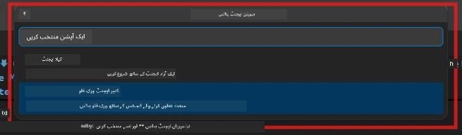

# ماڈیول 2 - ملٹی ایجنٹ پروجیکٹ کا سکیفولڈ بنائیں

اس ماڈیول میں، آپ [Microsoft Foundry ایکسٹینشن](https://marketplace.visualstudio.com/items?itemName=TeamsDevApp.vscode-ai-foundry) کا استعمال کرتے ہوئے **ایک ملٹی ایجنٹ ورک فلو پروجیکٹ کا سکیفولڈ بناتے ہیں**۔ ایکسٹینشن پورے پروجیکٹ کی ساخت تیار کرتی ہے - `agent.yaml`, `main.py`, `Dockerfile`, `requirements.txt`, `.env`، اور ڈیبگ کنفیگریشن۔ پھر آپ ان فائلوں کو ماڈیولز 3 اور 4 میں حسب ضرورت بناتے ہیں۔

> **نوٹ:** اس لیب میں `PersonalCareerCopilot/` فولڈر ایک مکمل، کام کرنے والا مثال ہے جو ملٹی ایجنٹ پروجیکٹ کو حسب ضرورت بناتا ہے۔ آپ یا تو نیا پروجیکٹ سکیفولڈ کر سکتے ہیں (سیکھنے کے لیے تجویز کردہ) یا موجودہ کوڈ کو براہ راست دیکھ سکتے ہیں۔

---

## مرحلہ 1: Create Hosted Agent وزرڈ کھولیں


1. `Ctrl+Shift+P` دبائیں تاکہ **کمانڈ پیلیٹ** کھلے۔
2. ٹائپ کریں: **Microsoft Foundry: Create a New Hosted Agent** اور اسے منتخب کریں۔
3. ہوسٹڈ ایجنٹ بنانے کا وزرڈ کھل جائے گا۔

> **متبادل:** ایکٹیویٹی بار میں **Microsoft Foundry** آئیکن پر کلک کریں → **Agents** کے ساتھ والے **+** آئیکن پر کلک کریں → **Create New Hosted Agent** منتخب کریں۔

---

## مرحلہ 2: ملٹی ایجنٹ ورک فلو ٹیمپلیٹ منتخب کریں

وزرڈ آپ سے ٹیمپلیٹ منتخب کرنے کو کہتا ہے:

| ٹیمپلیٹ | تفصیل | کب استعمال کریں |
|----------|-------------|----------------|
| Single Agent | ایک ایجنٹ ہدایات اور اختیاری ٹولز کے ساتھ | لیب 01 |
| **Multi-Agent Workflow** | متعدد ایجنٹس جو WorkflowBuilder کے ذریعے مل کر کام کرتے ہیں | **یہ لیب (لیب 02)** |

1. **Multi-Agent Workflow** منتخب کریں۔
2. **Next** پر کلک کریں۔



---

## مرحلہ 3: پروگرامنگ زبان منتخب کریں

1. **Python** منتخب کریں۔
2. **Next** پر کلک کریں۔

---

## مرحلہ 4: اپنا ماڈل منتخب کریں

1. وزرڈ آپ کے Foundry پروجیکٹ میں تعینات ماڈلز دکھاتا ہے۔
2. وہی ماڈل منتخب کریں جو آپ نے لیب 01 میں استعمال کیا تھا (مثلاً **gpt-4.1-mini**)۔
3. **Next** پر کلک کریں۔

> **ٹپ:** [`gpt-4.1-mini`](https://learn.microsoft.com/azure/foundry/foundry-models/concepts/models-sold-directly-by-azure#gpt-41-series) ترقی کے لیے تجویز کردہ ہے - یہ تیز، سستا اور ملٹی ایجنٹ ورک فلو کو اچھی طرح ہینڈل کرتا ہے۔ اگر آپ اعلیٰ معیار کے آؤٹ پٹ کے لیے چاہتے ہیں تو فائنل پروڈکشن میں `gpt-4.1` پر سوئچ کریں۔

---

## مرحلہ 5: فولڈر لوکیشن اور ایجنٹ کا نام منتخب کریں

1. ایک فائل ڈائیلاگ کھلتا ہے۔ ہدف فولڈر منتخب کریں:
   - اگر ورکشاپ ریپو کے ساتھ چل رہے ہیں: `workshop/lab02-multi-agent/` میں جائیں اور نیا سب فولڈر بنائیں
   - اگر نیا پروجیکٹ شروع کر رہے ہیں: کوئی بھی فولڈر منتخب کریں
2. ہوسٹڈ ایجنٹ کے لیے **نام** درج کریں (مثلاً `resume-job-fit-evaluator`)۔
3. **Create** پر کلک کریں۔

---

## مرحلہ 6: سکیفولڈ مکمل ہونے کا انتظار کریں

1. وی ایس کوڈ ایک نئی ونڈو کھولتا ہے (یا موجودہ ونڈو اپ ڈیٹ ہوتی ہے) جس میں سکیفولڈ پروجیکٹ ہوتا ہے۔
2. آپ کو یہ فائل ساخت دیکھنی چاہیے:

```
resume-job-fit-evaluator/
├── .env                ← Environment variables (placeholders)
├── .vscode/
│   └── launch.json     ← Debug configuration
├── agent.yaml          ← Agent definition (kind: hosted)
├── Dockerfile          ← Container configuration
├── main.py             ← Multi-agent workflow code (scaffold)
└── requirements.txt    ← Python dependencies
```

> **ورکشاپ نوٹ:** ورکشاپ ریپوزیٹری میں `.vscode/` فولڈر **ورک اسپیس روٹ** میں ہوتا ہے جس میں مشترکہ `launch.json` اور `tasks.json` شامل ہیں۔ لیب 01 اور لیب 02 کی ڈیبگ کنفیگریشن دونوں شامل ہیں۔ F5 دبانے پر، ڈراپ ڈاؤن سے **"Lab02 - Multi-Agent"** منتخب کریں۔

---

## مرحلہ 7: سکیفولڈ فائلوں کو سمجھیں (ملٹی ایجنٹ کی خاص تفصیلات)

ملٹی ایجنٹ سکیفولڈ میں سنگل ایجنٹ سکیفولڈ سے کئی اہم اختلافات ہوتے ہیں:

### 7.1 `agent.yaml` - ایجنٹ تعریف

```yaml
kind: hosted
name: resume-job-fit-evaluator
description: >
  A multi-agent workflow that evaluates resume-to-job fit.
metadata:
  authors:
    - Microsoft
  tags:
    - Multi-Agent Workflow
    - Resume Evaluator
protocols:
  - protocol: responses
    version: v1
environment_variables:
  - name: PROJECT_ENDPOINT
    value: ${PROJECT_ENDPOINT}
  - name: MODEL_DEPLOYMENT_NAME
    value: ${MODEL_DEPLOYMENT_NAME}
```

**لیب 01 سے اہم فرق:** `environment_variables` سیکشن میں MCP اینڈ پوائنٹس یا دیگر ٹول کنفیگریشن کے لیے اضافی ویریبلز شامل ہو سکتی ہیں۔ `name` اور `description` ملٹی ایجنٹ استعمال کی عکاسی کرتے ہیں۔

### 7.2 `main.py` - ملٹی ایجنٹ ورک فلو کوڈ

سکیفولڈ شامل کرتا ہے:
- **متعدد ایجنٹ ہدایاتی سٹرنگز** (ہر ایجنٹ کے لیے ایک کنسٹ)
- **متعدد [`AzureAIAgentClient.as_agent()`](https://learn.microsoft.com/python/api/overview/azure/ai-agents-readme) کانٹیکسٹ منیجرز** (ہر ایجنٹ کے لیے ایک)
- **[`WorkflowBuilder`](https://learn.microsoft.com/agent-framework/workflows/agents-in-workflows)** جو ایجنٹس کو آپس میں جوڑتا ہے
- **`from_agent_framework()`** جو ورک فلو کو HTTP اینڈ پوائنٹ کے طور پر پیش کرتا ہے

```python
from agent_framework import WorkflowBuilder, tool
from agent_framework.azure import AzureAIAgentClient
from azure.ai.agentserver.agentframework import from_agent_framework
```

اضافی امپورٹ [`WorkflowBuilder`](https://learn.microsoft.com/agent-framework/workflows/agents-in-workflows) لیب 01 کے مقابلے میں نیا ہے۔

### 7.3 `requirements.txt` - اضافی انحصار

ملٹی ایجنٹ پروجیکٹ وہی بیس پیکجز استعمال کرتا ہے جو لیب 01 نے، ساتھ ہی MCP متعلقہ پیکجز بھی:

```
agent-framework-azure-ai==1.0.0rc3
agent-framework-core==1.0.0rc3
azure-ai-agentserver-agentframework==1.0.0b16
azure-ai-agentserver-core==1.0.0b16
debugpy
agent-dev-cli --pre
```

> **اہم ورژن نوٹ:** `agent-dev-cli` پیکج کو `requirements.txt` میں تازہ ترین پریویو ورژن انسٹال کرنے کے لیے `--pre` فلیگ کی ضرورت ہوتی ہے۔ یہ `agent-framework-core==1.0.0rc3` کے ساتھ ایجنٹ انسپکٹر کی مطابقت کے لیے ضروری ہے۔ ورژن کی تفصیلات کے لیے [ماڈیول 8 - ٹربل شوٹنگ](08-troubleshooting.md) دیکھیں۔

| پیکج | ورژن | مقصد |
|---------|---------|---------|
| [`agent-framework-azure-ai`](https://learn.microsoft.com/agent-framework/overview/) | `1.0.0rc3` | Azure AI انٹیگریشن برائے [Microsoft Agent Framework](https://github.com/microsoft/agent-framework) |
| [`agent-framework-core`](https://learn.microsoft.com/agent-framework/overview/) | `1.0.0rc3` | کور رن ٹائم (WorkflowBuilder شامل ہے) |
| `azure-ai-agentserver-agentframework` | `1.0.0b16` | ہوسٹڈ ایجنٹ سرور رن ٹائم |
| `azure-ai-agentserver-core` | `1.0.0b16` | کور ایجنٹ سرور کی تجریدات |
| `debugpy` | جدید ترین | Python ڈیبگنگ (VS Code میں F5) |
| `agent-dev-cli` | `--pre` | لوکل ڈویلپمنٹ CLI + ایجنٹ انسپکٹر بیک اینڈ |

### 7.4 `Dockerfile` - لیب 01 جیسا ہی

ڈوکر فائل لیب 01 جیسی ہی ہے - یہ فائلز کاپی کرتی ہے، `requirements.txt` سے انحصارات انسٹال کرتی ہے، پورٹ 8088 کھولتی ہے، اور `python main.py` چلاتی ہے۔

```dockerfile
FROM python:3.14-slim
WORKDIR /app
COPY ./ .
RUN pip install --upgrade pip && \
    if [ -f requirements.txt ]; then \
        pip install -r requirements.txt; \
    else \
      echo "No requirements.txt found" >&2; exit 1; \
    fi
EXPOSE 8088
CMD ["python", "main.py"]
```

---

### چیک پوائنٹ

- [ ] سکیفولڈ وزرڈ مکمل → نیا پروجیکٹ اسٹرکچر نظر آ رہا ہے
- [ ] آپ تمام فائلز دیکھ سکتے ہیں: `agent.yaml`, `main.py`, `Dockerfile`, `requirements.txt`, `.env`
- [ ] `main.py` میں `WorkflowBuilder` کی امپورٹ شامل ہے (یہ تصدیق کرتا ہے کہ ملٹی ایجنٹ ٹیمپلیٹ منتخب کیا گیا تھا)
- [ ] `requirements.txt` میں دونوں `agent-framework-core` اور `agent-framework-azure-ai` شامل ہیں
- [ ] آپ سمجھتے ہیں کہ ملٹی ایجنٹ سکیفولڈ سنگل ایجنٹ سکیفولڈ سے کیسے مختلف ہے (متعدد ایجنٹس، WorkflowBuilder، MCP ٹولز)

---

**پچھلا:** [01 - ملٹی ایجنٹ آرکیٹیکچر کو سمجھیں](01-understand-multi-agent.md) · **اگلا:** [03 - ایجنٹس اور ماحول کی کنفیگریشن →](03-configure-agents.md)

---

<!-- CO-OP TRANSLATOR DISCLAIMER START -->
**免责声明**:
此文档已使用AI翻译服务[Co-op Translator](https://github.com/Azure/co-op-translator)进行翻译。虽然我们努力确保准确性，但请注意，自动翻译可能包含错误或不准确之处。请将原始文档的母语版本视为权威来源。对于关键信息，建议采用专业人工翻译。我们不对因使用此翻译而产生的任何误解或误释负责。
<!-- CO-OP TRANSLATOR DISCLAIMER END -->