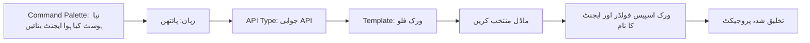
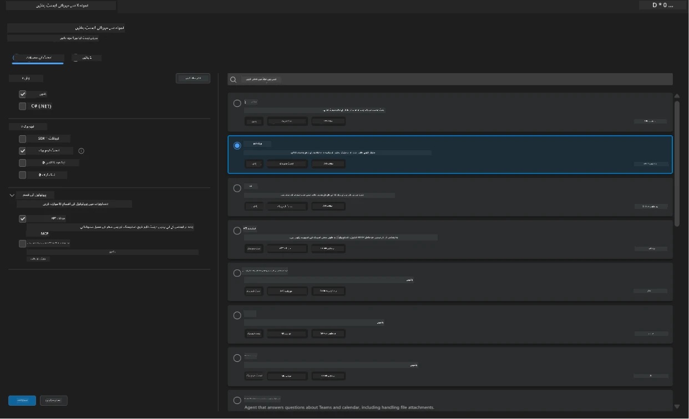
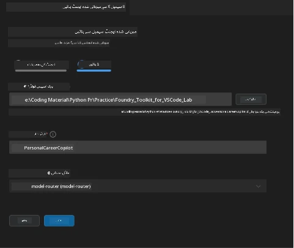

# ماڈیول 2 - ملٹی ایجنٹ پراجیکٹ کا ڈھانچہ بنائیں

⏱️ ~5 منٹ

اس ماڈیول میں، آپ [Foundry Toolkit for VS Code](https://aka.ms/foundrytk) کا استعمال کرتے ہوئے **ملٹی ایجنٹ پراجیکٹ کا ڈھانچہ بناتے ہیں**۔ وزرڈ `agent.yaml`, `main.py`, `Dockerfile`, `requirements.txt`, `.env`, اور VS Code ڈی بگ کنفیگریشن تیار کرتا ہے - تاکہ آپ ماڈیول 3 میں 4 ایجنٹ ورک فلو کی وائرنگ پر توجہ مرکوز کر سکیں۔

> **اہم تصور:** ڈھانچہ ایک کام کرنے والا اسٹب ہے جس میں ایک ایجنٹ ہوتا ہے۔ آپ پلیس ہولڈر منطق کی جگہ ماڈیول 3 میں `WorkflowBuilder` گراف سے بدلتے ہیں۔ آپ بوائلر پلیٹ شروع سے نہیں لکھتے۔

> **حوالہ عملدرآمد:** [`PersonalCareerCopilot/`](../../../../../workshop/lab02-multi-agent/PersonalCareerCopilot) ایک مکمل کام کرنے والا نمونہ ہے۔ اسے اپنے کام کے ساتھ موازنہ کرنے کے لیے استعمال کریں۔

### اسکافولڈ وزرڈ کا بہاؤ


```mermaid
flowchart LR
    A[Command Palette: نیا ہوسٹ کیا ہوا ایجنٹ بنائیں] --> B[زبان: پائتھن]
    B --> C[API Type: جوابی API]
    C --> D[Template: ورک فلو]
    D --> E[ماڈل منتخب کریں]
    E --> F[ورک اسپیس فولڈر اور ایجنٹ کا نام]
    F --> G[تخلیق شدہ پروجیکٹ]
```

---

## مرحلہ 1: ہاسٹڈ ایجنٹ بنانے والا وزرڈ کھولیں

1. `Ctrl+Shift+P` دبائیں تاکہ **کمانڈ پیلیٹ** کھلے۔
2. ٹائپ کریں: **Foundry Toolkit: Create a New Hosted Agent** اور اسے منتخب کریں۔
3. وزرڈ **Agent Details** ٹیب پر کھلتا ہے۔

> **متبادل:** ایکٹیویٹی بار میں **Foundry Toolkit** آئیکن پر کلک کریں → **Hosted Agents** کے ساتھ والے **+** آئیکن پر کلک کریں → **Create New Hosted Agent**۔

---

## مرحلہ 2: ترتیبات منتخب کریں



1. بائیں نیویگیشن/اختیارات سیکشن میں درج ذیل منتخب کریں:

| مینو | انتخاب | نوٹس |
|--------|-----------|-------|
| **زبان** | Python | C# (.NET) بھی سپورٹ شدہ |
| **فریم ورک** | Agent Framework | فراہم کرتا ہے `Agent`, `AgentExecutor`, `WorkflowBuilder` |
| **API قسم** | Response API | `POST /responses` - پلیٹ فارم منیجڈ ہسٹری، سٹریمنگ سپورٹ |
| **ٹیمپلیٹ** | **Workflows** | ایک کے بعد ایک متعدد ایجنٹس کے ذریعے درخواستیں پروسیس کرتا ہے |

2. منتخب کرنے کے بعد، **Next** پر کلک کریں



3. اگلے ونڈو میں، درج ذیل منتخب کریں:

| مینو | انتخاب | نوٹس |
|--------|-----------|-------|
| **ورک اسپیس فولڈر** | ہدف فولڈر براؤز کریں | مثلاً، `workshop/lab02-multi-agent/` اس ریپو میں |
| **ایجنٹ کا نام** | `PersonalCareerCopilot` | یہ پراجیکٹ ڈائریکٹری کا نام بن جائے گا |
| **ماڈل ڈپلائمنٹ** | اپنا ڈپلائے کیا گیا ماڈل منتخب کریں | مثلاً، `gpt-4.1-mini` لیب 01 سے |

4. پروجیکٹ کا ڈھانچہ بنانے کے لیے **Create** پر کلک کریں۔ VS Code فائلیں تیار کرتا ہے اور فولڈر کھولتا ہے۔

> **نصیحت:** [`gpt-4.1-mini`](https://learn.microsoft.com/azure/foundry/foundry-models/concepts/models-sold-directly-by-azure#gpt-41-series) ملٹی ایجنٹ ڈیولپمنٹ کے لیے رفتار اور معیار کا اچھا توازن فراہم کرتا ہے۔

---

## مرحلہ 3: تیار شدہ پراجیکٹ کا معائنہ کریں

اسکافولڈ مکمل ہونے کے بعد، یقینی بنائیں کہ ایکسپلورر (`Ctrl+Shift+E`) میں یہ فائلیں نظر آ رہی ہیں:

```
📂 <your-agent-name>/
├── .azdignore          ← Files excluded from Azure Developer CLI deployments
├── .dockerignore       ← Files excluded from Docker builds
├── .env                ← Environment variables (placeholders - fill in Module 3)
├── .vscode/
│   ├── launch.json     ← Debug config (F5 → run + Agent Inspector)
│   └── tasks.json      ← VS Code task definitions
├── agent.yaml          ← Agent definition (kind: hosted, protocol: responses)
├── Dockerfile          ← Container config for deployment
├── main.py             ← Stub agent entry point (replace with WorkflowBuilder in Module 3)
└── requirements.txt    ← Python dependencies
```

> **اہم:** اس اسکافولڈ فولڈر کو براہ راست VS Code میں کھولیں تاکہ `.vscode/launch.json` اور `tasks.json` صحیح طریقے سے F5 ڈی بگنگ کے لیے لاگو ہوں۔

### کلیدی فائلوں کی وضاحت

| فائل | مقصد |
|------|---------|
| `agent.yaml` | اعلان کرتا ہے `kind: hosted`, env vars کی میپنگ کرتا ہے، `/responses` پروٹوکول کی تعریف کرتا ہے |
| `main.py` | اسٹب: ایک `FoundryChatClient` → `Agent` → `ResponsesHostServer`۔ آپ ماڈیول 3 میں 4 ایجنٹس + `WorkflowBuilder` کے ساتھ اسے بدلتے ہیں |
| `Dockerfile` | `python:3.12-slim`, `requirements.txt` انسٹال کرتا ہے، پورٹ 8088 کو ایکسپوز کرتا ہے، `python main.py` چلاتا ہے |
| `requirements.txt` | `agent-framework-foundry`, `agent-framework-foundry-hosting`, `mcp<2,>=1.24.0`, `debugpy` |

> **حوالہ:** مکمل تیار شدہ مواد کے لیے [`PersonalCareerCopilot/agent.yaml`](../../../../../workshop/lab02-multi-agent/PersonalCareerCopilot/agent.yaml) اور [`PersonalCareerCopilot/requirements.txt`](../../../../../workshop/lab02-multi-agent/PersonalCareerCopilot/requirements.txt) دیکھیں۔

---

### ✅ چیک پوائنٹ

- [ ] اسکافولڈ وزرڈ مکمل ہو چکا ہے - نیا پراجیکٹ فولڈر ایکسپلورر میں نظر آ رہا ہے
- [ ] تمام متوقع فائلیں موجود ہیں: `agent.yaml`, `main.py`, `Dockerfile`, `requirements.txt`, `.env`
- [ ] `agent.yaml` میں `kind: hosted` اور `protocol: responses` دکھائی دیتا ہے
- [ ] `main.py` میں `Agent`, `FoundryChatClient`, `ResponsesHostServer` کو امپورٹ کیا گیا ہے
- [ ] اسکافولڈ فولڈر VS Code ورک اسپیس روٹ کے طور پر کھلا ہے
- [ ] آپ سمجھتے ہیں کہ `main.py` ایک اسٹب ہے - `WorkflowBuilder` ماڈیول 3 میں شامل کیا جائے گا

---

**گزشتہ:** [01 - ملٹی ایجنٹ آرکیٹیکچر کو سمجھیں](01-understand-multi-agent.md) · **اگلا:** [03 - ایجنٹس اور ماحول کی ترتیب →](03-configure-agents.md)

---

<!-- CO-OP TRANSLATOR DISCLAIMER START -->
**ڈس کلیمر**:
یہ دستاویز AI ترجمہ سروس [Co-op Translator](https://github.com/Azure/co-op-translator) کے ذریعے ترجمہ کی گئی ہے۔ جبکہ ہم درستگی کے لیے کوشاں ہیں، براہ کرم اس بات سے آگاہ رہیں کہ خودکار ترجمے میں غلطیاں یا عدم درستیاں ہو سکتی ہیں۔ اصل دستاویز اپنے مادری زبان میں مستند ماخذ سمجھی جائے گی۔ حساس معلومات کے لیے پیشہ ور انسانی ترجمہ کی سفارش کی جاتی ہے۔ اس ترجمے کے استعمال سے پیدا ہونے والی کسی بھی غلط فہمی یا غلط تشریح کی ذمہ داری ہم قبول نہیں کرتے۔
<!-- CO-OP TRANSLATOR DISCLAIMER END -->