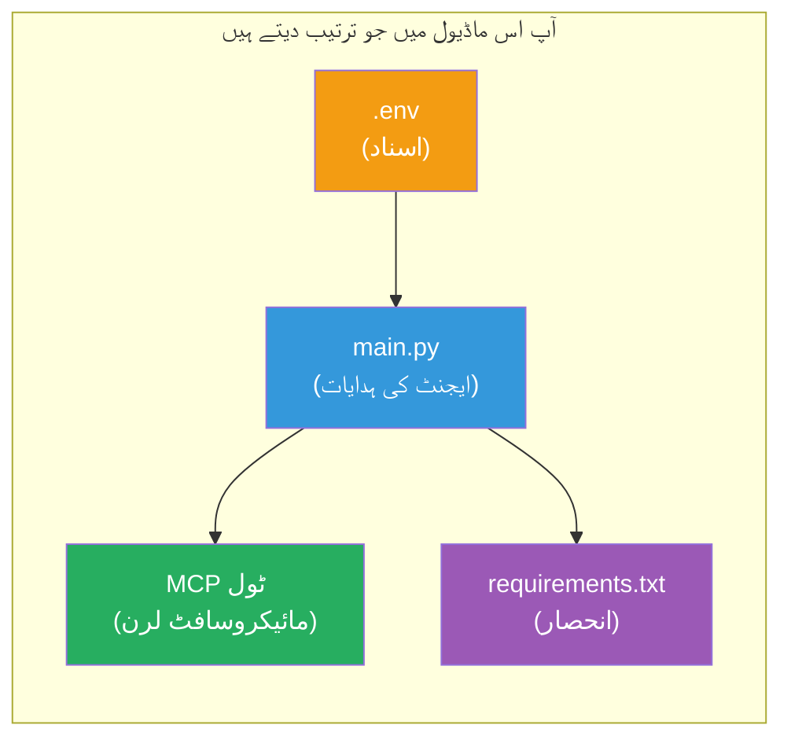

# ماڈیول 3 - ایجنٹس، MCP ٹول اور ماحول کی ترتیب

اس ماڈیول میں، آپ سکافولڈ کیے گئے ملٹی ایجنٹ پروجیکٹ کو حسب ضرورت بنائیں گے۔ آپ چاروں ایجنٹس کے لیے ہدایات لکھیں گے، Microsoft Learn کے لیے MCP ٹول سیٹ اپ کریں گے، ماحول کے متغیرات کی ترتیب دیں گے، اور انحصاریاں انسٹال کریں گے۔


> **حوالہ:** مکمل کام کرنے والا کوڈ [`PersonalCareerCopilot/main.py`](../../../../../workshop/lab02-multi-agent/PersonalCareerCopilot/main.py) میں موجود ہے۔ اسے اپنے پروجیکٹ کی تعمیر کے دوران بطور حوالہ استعمال کریں۔

---

## مرحلہ 1: ماحول کے متغیرات کی ترتیب دیں

1. اپنے پروجیکٹ کے روٹ میں **`.env`** فائل کھولیں۔
2. اپنی Foundry پروجیکٹ کی تفصیلات درج کریں:

   ```env
   PROJECT_ENDPOINT=https://<your-account>.services.ai.azure.com/api/projects/<your-project>
   MODEL_DEPLOYMENT_NAME=gpt-4.1-mini
   ```

3. فائل محفوظ کریں۔

### یہ قدریں کہاں سے حاصل کریں

| قدر | کہاں سے ملے گی |
|-------|---------------|
| **پروجیکٹ اینڈ پوائنٹ** | Microsoft Foundry سائیڈبار → اپنے پروجیکٹ پر کلک کریں → تفصیل کے منظر میں اینڈ پوائنٹ URL |
| **ماڈل تعیناتی کا نام** | Foundry سائیڈبار → پروجیکٹ کو بڑھائیں → **Models + endpoints** → تعینات شدہ ماڈل کے ساتھ نام |

> **سلامتی:** `.env` کو ورژن کنٹرول میں کبھی بھی شامل نہ کریں۔ اگر پہلے سے نہیں ہے تو اسے `.gitignore` میں شامل کریں۔

### ماحول کے متغیرات کا میپنگ

ملٹی-ایجنٹ `main.py` دونوں معیار اور ورکشاپ مخصوص env var نام پڑھتا ہے:

```python
PROJECT_ENDPOINT = os.getenv("AZURE_AI_PROJECT_ENDPOINT") or os.getenv("PROJECT_ENDPOINT")
MODEL_DEPLOYMENT_NAME = os.getenv(
    "AZURE_AI_MODEL_DEPLOYMENT_NAME",
    os.getenv("MODEL_DEPLOYMENT_NAME", "gpt-4.1-mini"),
)
MICROSOFT_LEARN_MCP_ENDPOINT = os.getenv(
    "MICROSOFT_LEARN_MCP_ENDPOINT", "https://learn.microsoft.com/api/mcp"
)
```

MCP اینڈ پوائنٹ کا ایک معقول ڈیفالٹ ہے - آپ کو اسے `.env` میں ترتیب دینے کی ضرورت نہیں جب تک کہ آپ اسے اووررائیڈ نہ کرنا چاہیں۔

---

## مرحلہ 2: ایجنٹ ہدایات لکھیں

یہ سب سے اہم مرحلہ ہے۔ ہر ایجنٹ کے لیے احتیاط سے تیار کردہ ہدایات ضروری ہیں جو اس کے کردار، نتیجہ کی شکل، اور قواعد کی وضاحت کریں۔ `main.py` کھولیں اور ہدایتی مستحکم متغیرات بنائیں (یا ترمیم کریں)۔

### 2.1 ریزیومے پارسر ایجنٹ

```python
RESUME_PARSER_INSTRUCTIONS = """\
You are the Resume Parser.
Extract resume text into a compact, structured profile for downstream matching.

Output exactly these sections:
1) Candidate Profile
2) Technical Skills (grouped categories)
3) Soft Skills
4) Certifications & Awards
5) Domain Experience
6) Notable Achievements

Rules:
- Use only explicit or strongly implied evidence.
- Do not invent skills, titles, or experience.
- Keep concise bullets; no long paragraphs.
- If input is not a resume, return a short warning and request resume text.
"""
```

**یہ سیکشنز کیوں؟** MatchingAgent کو اسکور کرنے کے لیے ساختہ ڈیٹا چاہیے ہوتا ہے۔ مستقل سیکشنز کراس-ایجنٹ ہینڈ آف کو قابلِ اعتماد بناتے ہیں۔

### 2.2 جاب ڈسکرپشن ایجنٹ

```python
JOB_DESCRIPTION_INSTRUCTIONS = """\
You are the Job Description Analyst.
Extract a structured requirement profile from a JD.

Output exactly these sections:
1) Role Overview
2) Required Skills
3) Preferred Skills
4) Experience Required
5) Certifications Required
6) Education
7) Domain / Industry
8) Key Responsibilities

Rules:
- Keep required vs preferred clearly separated.
- Only use what the JD states; do not invent hidden requirements.
- Flag vague requirements briefly.
- If input is not a JD, return a short warning and request JD text.
"""
```

**ضروری بمقابلہ ترجیحی کیوں الگ؟** MatchingAgent ہر ایک کے لیے مختلف وزن استعمال کرتا ہے (ضروری مہارتیں = 40 پوائنٹس، ترجیحی مہارتیں = 10 پوائنٹس)۔

### 2.3 میچنگ ایجنٹ

```python
MATCHING_AGENT_INSTRUCTIONS = """\
You are the Matching Agent.
Compare parsed resume output vs JD output and produce an evidence-based fit report.

Scoring (100 total):
- Required Skills 40
- Experience 25
- Certifications 15
- Preferred Skills 10
- Domain Alignment 10

Output exactly these sections:
1) Fit Score (with breakdown math)
2) Matched Skills
3) Missing Skills
4) Partially Matched
5) Experience Alignment
6) Certification Gaps
7) Overall Assessment

Rules:
- Be objective and evidence-only.
- Keep partial vs missing separate.
- Keep Missing Skills precise; it feeds roadmap planning.
"""
```

**واضح اسکورنگ کیوں؟** دوبارہ قابل عمل اسکورنگ رنز کا موازنہ اور مسائل کی جانچ ممکن بناتی ہے۔ 100 پوائنٹس کا نظام اختتامی صارفین کے لیے سمجھنا آسان بناتا ہے۔

### 2.4 گیپ اینالائزر ایجنٹ

```python
GAP_ANALYZER_INSTRUCTIONS = """\
You are the Gap Analyzer and Roadmap Planner.
Create a practical upskilling plan from the matching report.

Microsoft Learn MCP usage (required):
- For EVERY High and Medium priority gap, call tool `search_microsoft_learn_for_plan`.
- Use returned Learn links in Suggested Resources.
- Prefer Microsoft Learn for free resources.

CRITICAL: You MUST produce a SEPARATE detailed gap card for EVERY skill listed in
the Missing Skills and Certification Gaps sections of the matching report. Do NOT
skip or combine gaps. Do NOT summarize multiple gaps into one card.

Output format:
1) Personalized Learning Roadmap for [Role Title]
2) One DETAILED card per gap (produce ALL cards, not just the first):
   - Skill
   - Priority (High/Medium/Low)
   - Current Level
   - Target Level
   - Suggested Resources (include Learn URL from tool results)
   - Estimated Time
   - Quick Win Project
3) Recommended Learning Order (numbered list)
4) Timeline Summary (week-by-week)
5) Motivational Note

Rules:
- Produce every gap card before writing the summary sections.
- Keep it specific, realistic, and actionable.
- Tailor to candidate's existing stack.
- If fit >= 80, focus on polish/interview readiness.
- If fit < 40, be honest and provide a staged path.
"""
```

**"CRITICAL" زور کیوں؟** ہمہ گیر گیپ کارڈز تیار کرنے کی واضح ہدایات کے بغیر، ماڈل عام طور پر صرف 1-2 کارڈز پیدا کرتا ہے اور باقی کو خلاصہ کرتا ہے۔ "CRITICAL" بلاک اس روک تھام کو روکتا ہے۔

---

## مرحلہ 3: MCP ٹول کی تعریف کریں

GapAnalyzer ایک ایسا ٹول استعمال کرتا ہے جو [Microsoft Learn MCP سرور](https://learn.microsoft.com/azure/foundry/agents/how-to/tools/model-context-protocol) کو کال کرتا ہے۔ اسے `main.py` میں شامل کریں:

```python
import json
from agent_framework import tool
from mcp.client.session import ClientSession
from mcp.client.streamable_http import streamable_http_client

@tool
async def search_microsoft_learn_for_plan(
    skill: str, role: str = "", max_results: int = 5
) -> str:
    """Search Microsoft Learn MCP and return curated official links for roadmap planning."""
    query = " ".join(part for part in [skill, role, "learning path module"] if part).strip()
    query = query or "job skills learning path"

    try:
        async with streamable_http_client(MICROSOFT_LEARN_MCP_ENDPOINT) as (
            read_stream, write_stream, _,
        ):
            async with ClientSession(read_stream, write_stream) as session:
                await session.initialize()
                result = await session.call_tool(
                    "microsoft_docs_search", {"query": query}
                )

        if not result.content:
            return (
                "No results returned from Microsoft Learn MCP. "
                "Fallback: https://learn.microsoft.com/training/support/catalog-api"
            )

        payload_text = getattr(result.content[0], "text", "")
        data = json.loads(payload_text) if payload_text else {}
        items = data.get("results", [])[:max(1, min(max_results, 10))]

        if not items:
            return f"No direct Microsoft Learn results found for '{skill}'."

        lines = [f"Microsoft Learn resources for '{skill}':"]
        for i, item in enumerate(items, start=1):
            title = item.get("title") or item.get("url") or "Microsoft Learn Resource"
            url = item.get("url") or item.get("link") or ""
            lines.append(f"{i}. {title} - {url}".rstrip(" -"))
        return "\n".join(lines)
    except Exception as ex:
        return (
            f"Microsoft Learn MCP lookup unavailable. Reason: {ex}. "
            "Fallbacks: https://learn.microsoft.com/api/mcp"
        )
```

### ٹول کیسے کام کرتا ہے

| مرحلہ | کیا ہوتا ہے |
|------|-------------|
| 1 | GapAnalyzer فیصلہ کرتا ہے کہ کسی مہارت کے لیے وسائل چاہیے (مثلاً "Kubernetes") |
| 2 | فریم ورک کال کرتا ہے `search_microsoft_learn_for_plan(skill="Kubernetes")` |
| 3 | فنکشن کھولتا ہے [Streamable HTTP](https://learn.microsoft.com/agent-framework/agents/tools/hosted-mcp-tools) کنکشن `https://learn.microsoft.com/api/mcp` پر |
| 4 | MCP سرور پر `microsoft_docs_search` کال کرتا ہے |
| 5 | MCP سرور تلاش کے نتائج واپس کرتا ہے (عنوان + URL) |
| 6 | فنکشن نتائج کو نمبر شدہ فہرست میں فارمیٹ کرتا ہے |
| 7 | GapAnalyzer URLs کو گیپ کارڈ میں شامل کرتا ہے |

### MCP انحصار

MCP کلائنٹ لائبریریاں [`agent-framework-core`](https://learn.microsoft.com/agent-framework/overview/) کے ذریعے عبوری طور پر شامل کی گئی ہیں۔ آپ کو انہیں الگ سے `requirements.txt` میں شامل کرنے کی ضرورت نہیں۔ اگر آپ کو امپورٹ کی غلطیاں ملیں، تو تصدیق کریں:

```powershell
pip list | Select-String "mcp"
```

متوقع: `mcp` پیکیج انسٹال ہے (ورژن 1.x یا بعد کا)۔

---

## مرحلہ 4: ایجنٹس اور ورک فلو کو وائر کریں

### 4.1 کانٹیکسٹ مینیجرز کے ساتھ ایجنٹس بنائیں

```python
from contextlib import asynccontextmanager

@asynccontextmanager
async def create_agents():
    async with (
        get_credential() as credential,
        AzureAIAgentClient(
            project_endpoint=PROJECT_ENDPOINT,
            model_deployment_name=MODEL_DEPLOYMENT_NAME,
            credential=credential,
        ).as_agent(
            name="ResumeParser",
            instructions=RESUME_PARSER_INSTRUCTIONS,
        ) as resume_parser,
        AzureAIAgentClient(
            project_endpoint=PROJECT_ENDPOINT,
            model_deployment_name=MODEL_DEPLOYMENT_NAME,
            credential=credential,
        ).as_agent(
            name="JobDescriptionAgent",
            instructions=JOB_DESCRIPTION_INSTRUCTIONS,
        ) as jd_agent,
        AzureAIAgentClient(
            project_endpoint=PROJECT_ENDPOINT,
            model_deployment_name=MODEL_DEPLOYMENT_NAME,
            credential=credential,
        ).as_agent(
            name="MatchingAgent",
            instructions=MATCHING_AGENT_INSTRUCTIONS,
        ) as matching_agent,
        AzureAIAgentClient(
            project_endpoint=PROJECT_ENDPOINT,
            model_deployment_name=MODEL_DEPLOYMENT_NAME,
            credential=credential,
        ).as_agent(
            name="GapAnalyzer",
            instructions=GAP_ANALYZER_INSTRUCTIONS,
            tools=[search_microsoft_learn_for_plan],
        ) as gap_analyzer,
    ):
        yield resume_parser, jd_agent, matching_agent, gap_analyzer
```

**اہم نکات:**
- ہر ایجنٹ کا اپنا `AzureAIAgentClient` انسٹنس ہوتا ہے
- صرف GapAnalyzer کو ملتا ہے `tools=[search_microsoft_learn_for_plan]`
- `get_credential()` Azure میں [`ManagedIdentityCredential`](https://learn.microsoft.com/python/api/overview/azure/identity-readme#managed-identity-support) واپس کرتا ہے، اور لوکل طور پر [`DefaultAzureCredential`](https://learn.microsoft.com/azure/developer/python/sdk/authentication/credential-chains#defaultazurecredential-overview)

### 4.2 ورک فلو گراف بنائیں

```python
def create_workflow(resume_parser, jd_agent, matching_agent, gap_analyzer):
    workflow = (
        WorkflowBuilder(
            name="ResumeJobFitEvaluator",
            start_executor=resume_parser,
            output_executors=[gap_analyzer],
        )
        .add_edge(resume_parser, jd_agent)
        .add_edge(resume_parser, matching_agent)
        .add_edge(jd_agent, matching_agent)
        .add_edge(matching_agent, gap_analyzer)
        .build()
    )
    return workflow.as_agent()
```

> دیکھیں [Workflows as Agents](https://learn.microsoft.com/agent-framework/workflows/as-agents) تاکہ `.as_agent()` پیٹرن کو سمجھ سکیں۔

### 4.3 سرور شروع کریں

```python
async def main() -> None:
    validate_configuration()
    async with create_agents() as (resume_parser, jd_agent, matching_agent, gap_analyzer):
        agent = create_workflow(resume_parser, jd_agent, matching_agent, gap_analyzer)
        from azure.ai.agentserver.agentframework import from_agent_framework
        await from_agent_framework(agent).run_async()

if __name__ == "__main__":
    asyncio.run(main())
```

---

## مرحلہ 5: ورچوئل ماحول بنا کر ایکٹیویٹ کریں

### 5.1 ماحول بنائیں

```powershell
cd workshop\lab02-multi-agent\PersonalCareerCopilot
python -m venv .venv
```

### 5.2 ایکٹیویٹ کریں

**PowerShell (Windows):**
```powershell
.\.venv\Scripts\Activate.ps1
```

**macOS/Linux:**
```bash
source .venv/bin/activate
```

### 5.3 انحصاریاں انسٹال کریں

```powershell
pip install -r requirements.txt
```

> **نوٹ:** `agent-dev-cli --pre` لائن `requirements.txt` میں یقینی بناتی ہے کہ تازہ ترین پری ویو ورژن انسٹال ہو۔ یہ `agent-framework-core==1.0.0rc3` کے ساتھ مطابقت کے لیے ضروری ہے۔

### 5.4 انسٹالیشن کی تصدیق کریں

```powershell
pip list | Select-String "agent-framework|agentserver|agent-dev"
```

متوقع نتیجہ:
```
agent-dev-cli                  0.0.1b260316
agent-framework-azure-ai       1.0.0rc3
agent-framework-core            1.0.0rc3
azure-ai-agentserver-agentframework 1.0.0b16
azure-ai-agentserver-core      1.0.0b16
```

> **اگر `agent-dev-cli` پرانا ورژن دکھائے** (جیسے `0.0.1b260119`)، تو Agent Inspector 403/404 کی غلطیوں کے ساتھ ناکام ہوگا۔ اپ گریڈ کریں: `pip install agent-dev-cli --pre --upgrade`

---

## مرحلہ 6: توثیق کی جانچ کریں

Lab 01 سے وہی auth چیک چلائیں:

```powershell
az account show --query "{name:name, id:id}" --output table
```

اگر یہ ناکام ہو، تو [`az login`](https://learn.microsoft.com/cli/azure/authenticate-azure-cli-interactively) چلائیں۔

ملٹی ایجنٹ ورک فلو میں، چاروں ایجنٹس ایک ہی کریڈینشل شیئر کرتے ہیں۔ اگر ایک کے لیے توثیق کام کرے، تو تمام کے لیے کام کرے گی۔

---

### چیک پوائنٹ

- [ ] `.env` میں درست `PROJECT_ENDPOINT` اور `MODEL_DEPLOYMENT_NAME` کی قدریں موجود ہیں
- [ ] تمام 4 ایجنٹ ہدایتی مستحکم متغیرات `main.py` میں تعریف شدہ ہیں (ResumeParser, JD Agent, MatchingAgent, GapAnalyzer)
- [ ] `search_microsoft_learn_for_plan` MCP ٹول تعریف شدہ اور GapAnalyzer کے ساتھ رجسٹرڈ ہے
- [ ] `create_agents()` چاروں ایجنٹس کو انفرادی `AzureAIAgentClient` انسٹنسز کے ساتھ بناتا ہے
- [ ] `create_workflow()` صحیح گراف `WorkflowBuilder` کے ساتھ بناتا ہے
- [ ] ورچوئل ماحول بنایا اور ایکٹیویٹ کیا گیا (`(.venv)` ظاہر ہو)
- [ ] `pip install -r requirements.txt` بغیر غلطی کے مکمل ہوا
- [ ] `pip list` تمام متوقع پیکجز درست ورژنز (rc3 / b16) پر دکھاتا ہے
- [ ] `az account show` آپ کی سبسکرپشن دکھاتا ہے

---

**پچھلا:** [02 - Scaffold Multi-Agent Project](02-scaffold-multi-agent.md) · **اگلا:** [04 - Orchestration Patterns →](04-orchestration-patterns.md)

---

<!-- CO-OP TRANSLATOR DISCLAIMER START -->
**ڈس کلیمر**:  
یہ دستاویز AI ترجمہ سروس [Co-op Translator](https://github.com/Azure/co-op-translator) کے ذریعہ ترجمہ کی گئی ہے۔ اگرچہ ہم درستگی کے لیے کوشاں ہیں، براہ کرم آگاہ رہیں کہ خودکار تراجم میں غلطیاں یا عدم درستیاں ہو سکتی ہیں۔ اصل دستاویز اپنی مادری زبان میں ہی مستند ماخذ سمجھی جانی چاہیے۔ اہم معلومات کے لیے پیشہ ور انسانی ترجمہ تجویز کیا جاتا ہے۔ ہم اس ترجمہ کے استعمال سے پیدا ہونے والی کسی بھی غلط فہمی یا غلط تشریح کے ذمہ دار نہیں ہیں۔
<!-- CO-OP TRANSLATOR DISCLAIMER END -->