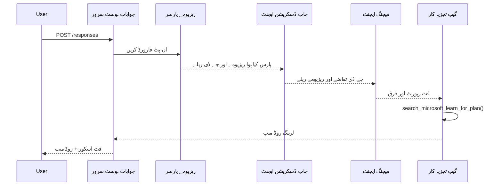

# ماڈیول 3 - ہدایات، ماحول کی ترتیب اور انحصارات کی تنصیب

⏱️ ~15 منٹ

اس ماڈیول میں، آپ سکیفولڈڈ اسٹب کو **اپنے** ملٹی ایجنٹ ورک فلو میں تبدیل کرتے ہیں - ماحولیاتی متغیرات سیٹ کر کے، ایجنٹ ہدایات لکھ کر، MCP ٹول شامل کر کے، ورک فلو گراف کو وائر کر کے، اور انحصارات انسٹال کر کے۔

> **حوالہ:** مکمل کام کرنے والا کوڈ [`PersonalCareerCopilot/main.py`](../../../../../workshop/lab02-multi-agent/PersonalCareerCopilot/main.py) میں ہے۔ اسے اپنے ورک فلو گراف اور پرامپٹ بلاکس بنانے کے دوران بطور حوالہ استعمال کریں۔

---

## چار ایجنٹس کا ایک ساتھ فٹ ہونا


```mermaid
sequenceDiagram
    participant User
    participant Server as جوابات ہوسٹ سرور
    participant RP as ریزیومے پارسر
    participant JD as جاب ڈسکرپشن ایجنٹ
    participant MA as میچنگ ایجنٹ
    participant GA as گیپ تجزیہ کار

    User->>Server: POST /responses
    Server->>RP: ان پٹ فارورڈ کریں
    RP-->>JD: پارس کیا ہوا ریزیومے اور جے ڈی ریلے
    JD-->>MA: جے ڈی تقاضے اور ریزیومے ریلے
    MA-->>GA: فٹ رپورٹ اور فرق
    GA->>GA: search_microsoft_learn_for_plan()
    GA-->>Server: لرننگ روڈ میپ
    Server-->>User: فٹ اسکور + روڈ میپ
```

---

## قدم 1: ماحولیاتی متغیرات کی ترتیب

1. اپنے پروجیکٹ کے روٹ میں موجود **`.env`** فائل کھولیں (جو سکیفولڈ وزرڈ کے ذریعے بنی ہے)۔
2. جگہ دار اقدار کو لیب 01 سے حقیقی اقدار سے بدلیں۔

<details open>
<summary><strong>🅰️ راستہ A - فاؤنڈری سبسکرپشن</strong></summary>

```env
FOUNDRY_PROJECT_ENDPOINT=https://<your-account>.services.ai.azure.com/api/projects/<your-project>
AZURE_AI_MODEL_DEPLOYMENT_NAME=gpt-4.1-mini
```

> **قدریں کہاں ملیں:** دیکھیں [Lab 01, Module 1](../../lab01-single-agent/docs/01-setup.md#deploy-a-model--assign-rbac)۔

</details>

<details open>
<summary><strong>🅱️ راستہ B - فاؤنڈری لوکل</strong></summary>

```env
FOUNDRY_PROJECT_ENDPOINT=http://localhost:5273/v1
AZURE_AI_MODEL_DEPLOYMENT_NAME=phi-4-mini
```

> تمام انفرنس آپ کی مشین پر چلتا ہے - کوئی ڈیٹا آپ کے آلے سے باہر نہیں جاتا۔ صحیح ماڈل عرفی نام کی تصدیق کے لئے `foundry model list` چلائیں۔ واحد خارج ہونے والی درخواست MCP ٹول کی کال ہے جو `https://learn.microsoft.com/api/mcp` کو جاتی ہے۔

> **قدریں کہاں ملیں:** دیکھیں [Lab 01, Module 1 - local path](../../lab01-single-agent/docs/01-setup.md#step-2-set-up-based-on-your-access)۔

</details>

> **سیکیورٹی:** `.env` کو ورژن کنٹرول میں کبھی نہ شامل کریں۔ اسے پہلے ہی `.gitignore` میں ہونا چاہیے۔

---

## قدم 2: ایجنٹ ہدایات لکھیں

ہدایات ہر ایجنٹ کے کردار، آؤٹ پٹ فارمیٹ، اور قواعد کی وضاحت کرتی ہیں۔ `main.py` کھولیں اور چار ہدایت کونسٹنٹس کو تعریف یا تبدیل کریں - مکمل اسٹرنگز [`PersonalCareerCopilot/main.py`](../../../../../workshop/lab02-multi-agent/PersonalCareerCopilot/main.py) میں ہیں۔

### 2.1 `RESUME_PARSER_INSTRUCTIONS`
ریزیومے کو ایک منظم امیدوار پروفائل میں پارس کرتا ہے **اور** جاب ڈسکرپشن کو لفظ بہ لفظ `[JOB DESCRIPTION PASS-THROUGH]` میں کاپی کرتا ہے۔ دونوں لیبل والے حصے آؤٹ پٹ میں ظاہر ہونا ضروری ہیں۔

> **پاس تھرو کیوں؟** `context_mode="last_agent"` کے ساتھ، ResumeParser واحد ایجنٹ ہے جو اصل صارف کا پیغام دیکھتا ہے۔ اگر یہ JD کو آگے نہ بھیجے، تو نیچے والے ایجنٹس کبھی اسے نہیں دیکھیں گے۔

### 2.2 `JOB_DESCRIPTION_INSTRUCTIONS`
`[PARSED RESUME]` اور `[JOB DESCRIPTION PASS-THROUGH]` کو ResumeParser کے آؤٹ پٹ سے پڑھتا ہے۔ `[JD REQUIREMENTS]` (منظم تقاضے) اور `[PARSED RESUME PASS-THROUGH]` (نگل ریزیومے کی کاپی MatchingAgent کے لیے) آؤٹ پٹ کرتا ہے۔

### 2.3 `MATCHING_AGENT_INSTRUCTIONS`
`[JD REQUIREMENTS]` اور `[PARSED RESUME PASS-THROUGH]` پڑھتا ہے۔ ایک اسکور شدہ فٹ رپورٹ (0–100) بناتا ہے جس میں تفصیلی حساب، میچ کئے گئے ہنر، گم شدہ ہنر، اور تجربے کی مطابقت شامل ہے۔

### 2.4 `GAP_ANALYZER_INSTRUCTIONS`
فٹ رپورٹ پڑھتا ہے۔ **ہر** گم شدہ ہنر کے لئے `search_microsoft_learn_for_plan` کال کرتا ہے تاکہ مائیکروسافٹ لرن کے وسائل حاصل کرے۔ ہر ہنر کے لئے ایک تفصیلی گپ کارڈ اور ہفتہ بہ ہفتہ سیکھنے کا روڈ میپ بناتا ہے۔

---

## قدم 3: MCP ٹول شامل کریں

GapAnalyzer ہر ہنر کی کمی کے لئے حقیقی سیکھنے کے وسائل حاصل کرنے کے لئے [Microsoft Learn MCP سرور](https://learn.microsoft.com/azure/foundry/agents/how-to/tools/model-context-protocol) کو کال کرتا ہے۔ مکمل `search_microsoft_learn_for_plan` فنکشن [`PersonalCareerCopilot/main.py`](../../../../../workshop/lab02-multi-agent/PersonalCareerCopilot/main.py) میں ہے۔

ایجنٹ بناتے وقت GapAnalyzer پر ٹول رجسٹر کریں:

```python
gap_analyzer = Agent(
    client=client,
    instructions=GAP_ANALYZER_INSTRUCTIONS,
    name="GapAnalyzer",
    tools=[search_microsoft_learn_for_plan],
)
```

> مکمل `WorkflowBuilder` گراف، جس میں `FoundryChatClient`, `AgentExecutor`, اور تمام `add_edge()` کالز شامل ہیں، کے لیے [`PersonalCareerCopilot/main.py`](../../../../../workshop/lab02-multi-agent/PersonalCareerCopilot/main.py) دیکھیں۔

---

## قدم 4: ورچوئل ماحول بنائیں اور انحصارات انسٹال کریں

> ⚠️ **یہ قدم نہ چھوڑیں۔** بغیر انحصارات کے انسٹال ہوئے، F5 ڈی بگنگ ناکام ہو جائے گی۔

### 4.1 ورچوئل ماحول بنائیں

```powershell
python -m venv .venv
```

### 4.2 اسے فعال کریں

| OS | کمانڈ |
|----|---------|
| **ونڈوز (پاور شیل)** | `.\.venv\Scripts\Activate.ps1` |
| **ونڈوز (CMD)** | `.venv\Scripts\activate.bat` |
| **macOS / لینکس** | `source .venv/bin/activate` |

آپ کو اپنے ٹرمینل پرامپٹ میں `(.venv)` نظر آنا چاہیے۔

### 4.3 انحصارات انسٹال کریں

```powershell
pip install -r requirements.txt
```

### 4.4 تصدیق کریں

```powershell
pip list | Select-String "agent-framework|mcp|debugpy"
```

متوقع: `agent-framework-foundry`, `agent-framework-foundry-hosting`, `mcp`, اور `debugpy` لسٹ میں ہونے چاہئیں۔

---

## قدم 5: توثیق کی تصدیق کریں

<details open>
<summary><strong>🅰️ راستہ A - Azure کریڈینشل</strong></summary>

```powershell
az account show --query "{name:name, id:id}" --output table
```

اگر یہ ناکام ہو جائے، تو [`az login`](https://learn.microsoft.com/cli/azure/authenticate-azure-cli-interactively) چلائیں۔

چاروں ایجنٹس ایک `FoundryChatClient` اور ایک `DefaultAzureCredential` شیئر کرتے ہیں۔ اگر ایک کے لیے توثیق کام کرے تو سب کے لیے کام کرتی ہے۔

</details>

<details open>
<summary><strong>🅱️ راستہ B - فاؤنڈری لوکل</strong></summary>

لوکل ٹیسٹنگ کے لیے کوئی توثیق ضروری نہیں۔

</details>

---

### ✅ چیکپوائنٹ

> ماڈیول 04 کی طرف بڑھنے سے پہلے: **(1)** `(.venv)` پرامپٹ میں نظر آ رہا ہو اور **(2)** `pip install -r requirements.txt` کامیابی سے مکمل ہو چکا ہو۔

- [ ] `.env` میں درست اینڈ پوائنٹ اور ماڈل ڈپلائمنٹ کا نام ہو (جگہ دار نہیں)
- [ ] تمام 4 ایجنٹ ہدایت کونسٹنٹس `main.py` میں تعریف شدہ ہوں (ResumeParser، JD Agent، MatchingAgent، GapAnalyzer)
- [ ] `search_microsoft_learn_for_plan` MCP ٹول تعریف شدہ اور GapAnalyzer پر رجسٹرڈ ہو
- [ ] `FoundryChatClient` + 4 `Agent` + 4 `AgentExecutor` آبجیکٹس `main()` میں بن چکے ہوں
- [ ] `WorkflowBuilder` تمام 3 `add_edge()` کالز کے ساتھ صحیح ترتیب وار گراف بناتا ہو
- [ ] ورچوئل ماحول بنایا اور فعال کیا گیا ہو (`(.venv)` پرامپٹ میں نظر آ رہا ہو)
- [ ] `pip install -r requirements.txt` بغیر غلطی کے مکمل ہوا ہو
- [ ] **راستہ A:** `az account show` کامیاب ہو یا VS کوڈ کے اکاؤنٹس آئیکون میں سائن ان اکاؤنٹ دکھائی دے

---

**پچھلا:** [02 - اسکافولڈ ملٹی ایجنٹ پروجیکٹ](02-scaffold-multi-agent.md) · **اگلا:** [04 - آرکسٹریشن پیٹرنز →](04-orchestration-patterns.md)

---

<!-- CO-OP TRANSLATOR DISCLAIMER START -->
**ڈس کلیمر**:
یہ دستاویز AI ترجمہ سروس [Co-op Translator](https://github.com/Azure/co-op-translator) کے ذریعے ترجمہ کی گئی ہے۔ جبکہ ہم درستگی کے لیے کوشاں ہیں، براہ کرم اس بات سے آگاہ رہیں کہ خودکار ترجمے میں غلطیاں یا عدم درستیاں ہو سکتی ہیں۔ اصل دستاویز اپنے مادری زبان میں مستند ماخذ سمجھی جائے گی۔ حساس معلومات کے لیے پیشہ ور انسانی ترجمہ کی سفارش کی جاتی ہے۔ اس ترجمے کے استعمال سے پیدا ہونے والی کسی بھی غلط فہمی یا غلط تشریح کی ذمہ داری ہم قبول نہیں کرتے۔
<!-- CO-OP TRANSLATOR DISCLAIMER END -->