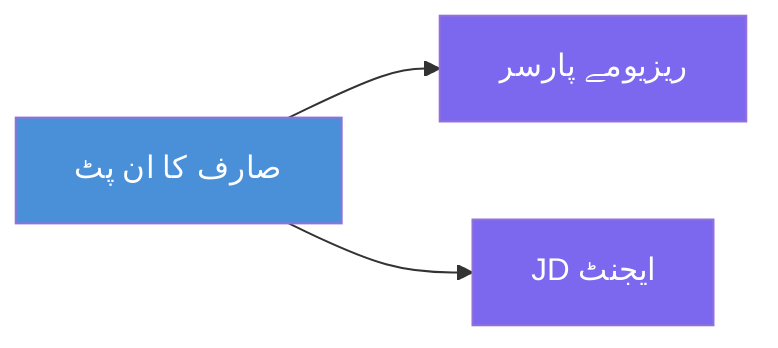
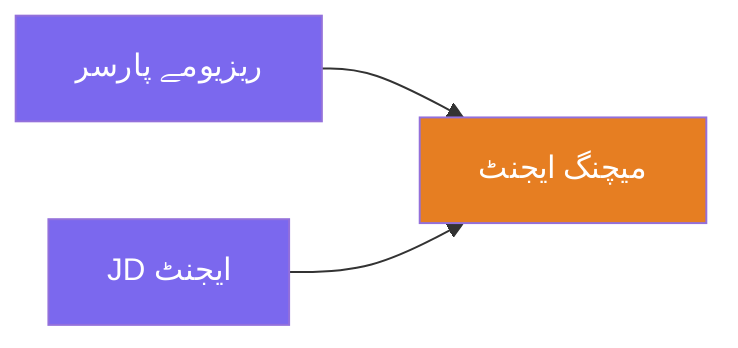
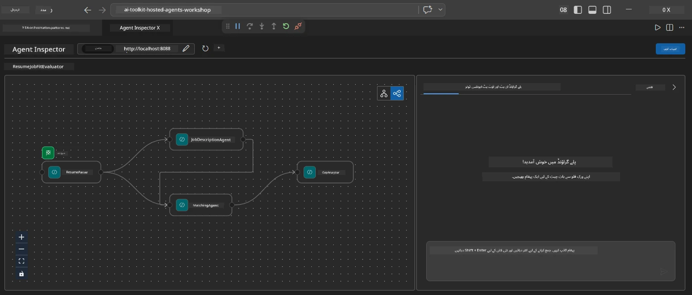
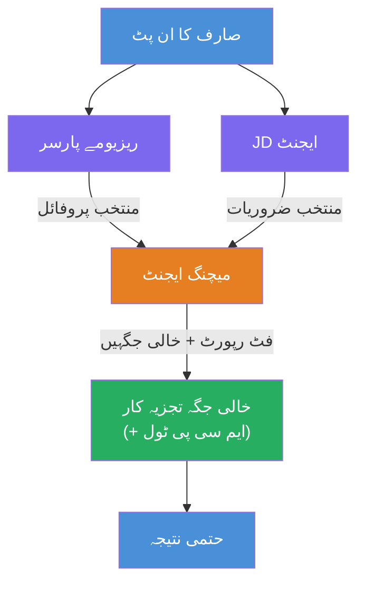
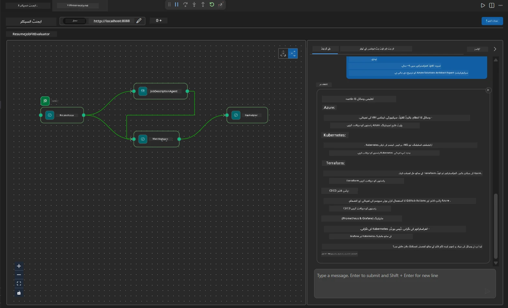

# ماڈیول 4 - آرکسٹریشن پیٹرنز

اس ماڈیول میں، آپ Resume Job Fit Evaluator میں استعمال ہونے والے آرکسٹریشن پیٹرنز کا جائزہ لیں گے اور سیکھیں گے کہ ورک فلو گراف کو کیسے پڑھا، ترمیم اور بڑھایا جائے۔ ان پیٹرنز کو سمجھنا ڈیٹا فلو مسائل کو ڈیبگ کرنے اور اپنے [ملٹی ایجنٹ ورک فلو](https://learn.microsoft.com/agent-framework/workflows/) بنانے کے لیے بہت ضروری ہے۔

---

## پیٹرن 1: فین آؤٹ (متوازی تقسیم)

ورک فلو میں پہلا پیٹرن **فین آؤٹ** ہے - ایک ہی ان پٹ کو بیک وقت متعدد ایجنٹس کو بھیجا جاتا ہے۔


کوڈ میں، یہ اس لیے ہوتا ہے کیونکہ `resume_parser` `start_executor` ہے - یہ صارف کا پیغام سب سے پہلے وصول کرتا ہے۔ پھر، چونکہ `jd_agent` اور `matching_agent` دونوں کے پاس `resume_parser` سے ایجز ہیں، فریم ورک `resume_parser` کے آؤٹ پٹ کو دونوں ایجنٹس کو روٹ کرتا ہے:

```python
.add_edge(resume_parser, jd_agent)         # ریزیومے پارسر آؤٹ پٹ → جے ڈی ایجنٹ
.add_edge(resume_parser, matching_agent)   # ریزیومے پارسر آؤٹ پٹ → میچنگ ایجنٹ
```

**یہ کیوں کام کرتا ہے:** ResumeParser اور JD Agent ایک ہی ان پٹ کے مختلف پہلوؤں کو پروسیس کرتے ہیں۔ انہیں متوازی چلانے سے کل تاخیر کم ہو جاتی ہے بنسبت ان کے متوالی چلانے کے۔

### فین آؤٹ کب استعمال کریں

| استعمال کا کیس | مثال |
|---------------|-------|
| آزاد ذیلی کام | ریزیومے پارسنگ بمقابلہ JD پارسنگ |
| اضافی انداز / ووٹنگ | دو ایجنٹس ایک ہی ڈیٹا کا تجزیہ کرتے ہیں، تیسرا بہترین جواب منتخب کرتا ہے |
| کثیر فارمیٹ آؤٹ پٹ | ایک ایجنٹ متن پیدا کرتا ہے، دوسرا منظم JSON پیدا کرتا ہے |

---

## پیٹرن 2: فین ان (تجمع)

دوسرا پیٹرن **فین ان** ہے - متعدد ایجنٹ آؤٹ پٹس کو جمع کر کے ایک نیچے واقع ایجنٹ کو بھیجا جاتا ہے۔


کوڈ میں:

```python
.add_edge(resume_parser, matching_agent)   # ریزیومے پارسر آؤٹ پٹ → میچنگ ایجنٹ
.add_edge(jd_agent, matching_agent)        # جے ڈی ایجنٹ آؤٹ پٹ → میچنگ ایجنٹ
```

**اہم رویہ:** جب کسی ایجنٹ کے پاس **دو یا زیادہ آنے والے ایجز** ہوتے ہیں، فریم ورک خود بخود تمام اوپر والے ایجنٹس کے مکمل ہونے کا انتظار کرتا ہے اس سے پہلے کہ نیچے والے ایجنٹ کو چلایا جائے۔ MatchingAgent اس وقت تک شروع نہیں ہوتا جب تک کہ ResumeParser اور JD Agent دونوں ختم نہ ہو جائیں۔

### جو MatchingAgent کو ملتا ہے

فریم ورک تمام اوپر والے ایجنٹوں کے آؤٹ پٹ کو یکجا کر دیتا ہے۔ MatchingAgent کا ان پٹ اس طرح دکھائی دیتا ہے:

```
[ResumeParser output]
---
Candidate Profile:
  Name: Jane Doe
  Technical Skills: Python, Azure, Kubernetes, ...
  ...

[JobDescriptionAgent output]
---
Role Overview: Senior Cloud Engineer
Required Skills: Python, Azure, Terraform, ...
...
```

> **نوٹ:** درست یکجائی کی شکل فریم ورک کے ورژن پر منحصر ہوتی ہے۔ ایجنٹ کی ہدایات کو ایسا لکھنا چاہیے کہ وہ منظم اور غیر منظم دونوں اوپر والے آؤٹ پٹ کو ہینڈل کر سکیں۔



---

## پیٹرن 3: متوالی چین

تیسرا پیٹرن **متوالی چیننگ** ہے - ایک ایجنٹ کا آؤٹ پٹ براہ راست اگلے ایجنٹ کو جاتا ہے۔


کوڈ میں:

```python
.add_edge(matching_agent, gap_analyzer)    # مماثل ایجنٹ نتیجہ → گیپ اینالاائزر
```

یہ سب سے آسان پیٹرن ہے۔ GapAnalyzer، MatchingAgent کے فٹ اسکور، مماثل/غائب مہارتیں، اور خلیجیں وصول کرتا ہے۔ پھر یہ ہر خلیج کے لیے Microsoft Learn وسائل حاصل کرنے کے لیے [MCP ٹول](https://learn.microsoft.com/azure/foundry/agents/how-to/tools/model-context-protocol) کو کال کرتا ہے۔

---

## مکمل گراف

تمام تین پیٹرنز کو ملانے سے مکمل ورک فلو بنتا ہے:


### عملدرآمد کا وقت

```mermaid
gantt
    title ایجنٹ عمل درآمد کا ٹائم لائن
    dateFormat X
    axisFormat %s

    section Parallel
    Resume Parser       :rp, 0, 3
    JD Agent            :jd, 0, 2

    section Sequential
    Matching Agent      :ma, 3, 5
    Gap Analyzer        :ga, 5, 9
```


> کل وقت تقریباً `max(ResumeParser, JD Agent) + MatchingAgent + GapAnalyzer` ہوتا ہے۔ GapAnalyzer عام طور پر سب سے سست ہوتا ہے کیونکہ وہ متعدد MCP ٹول کالز کرتا ہے (ہر خلیج کے لیے ایک)۔

---

## WorkflowBuilder کوڈ پڑھنا

یہ `main.py` سے مکمل `create_workflow()` فنکشن ہے، تشریحات کے ساتھ:

```python
def create_workflow(resume_parser, jd_agent, matching_agent, gap_analyzer):
    workflow = (
        WorkflowBuilder(
            name="ResumeJobFitEvaluator",

            # صارف کی ان پٹ وصول کرنے والا پہلا ایجنٹ
            start_executor=resume_parser,

            # وہ ایجنٹ(ز) جن کی آؤٹ پٹ آخری جواب بن جاتی ہے
            output_executors=[gap_analyzer],
        )
        # تقسیم: ResumeParser کی آؤٹ پٹ دونوں JD Agent اور MatchingAgent کو جاتی ہے
        .add_edge(resume_parser, jd_agent)
        .add_edge(resume_parser, matching_agent)

        # اجتماع: MatchingAgent دونوں ResumeParser اور JD Agent کا انتظار کرتا ہے
        .add_edge(jd_agent, matching_agent)

        # تسلسل: MatchingAgent کی آؤٹ پٹ GapAnalyzer کو فراہم کی جاتی ہے
        .add_edge(matching_agent, gap_analyzer)

        .build()
    )
    return workflow.as_agent()
```

### ایج کا خلاصہ جدول

| # | ایج | پیٹرن | اثر |
|---|------|---------|--------|
| 1 | `resume_parser → jd_agent` | فین آؤٹ | JD Agent کو ResumeParser کا آؤٹ پٹ ملتا ہے (اور اصل صارف ان پٹ) |
| 2 | `resume_parser → matching_agent` | فین آؤٹ | MatchingAgent کو ResumeParser کا آؤٹ پٹ ملتا ہے |
| 3 | `jd_agent → matching_agent` | فین ان | MatchingAgent کو JD Agent کا آؤٹ پٹ بھی ملتا ہے (دونوں کا انتظار کرتا ہے) |
| 4 | `matching_agent → gap_analyzer` | متوالی | GapAnalyzer کو فٹ رپورٹ اور خلا کی فہرست ملتی ہے |

---

## گراف میں ترمیم کرنا

### نیا ایجنٹ شامل کرنا

پانچواں ایجنٹ شامل کرنے کے لیے (مثلاً **InterviewPrepAgent** جو خلا کے تجزیے کی بنیاد پر انٹرویو سوالات تیار کرتا ہے):

```python
# 1۔ ہدایات کی وضاحت کریں
INTERVIEW_PREP_INSTRUCTIONS = """\
You are the Interview Prep Agent.
Given a gap analysis and fit report, generate 10 targeted interview questions
the candidate should prepare for.
"""

# 2۔ ایجنٹ بنائیں (async with بلاک کے اندر)
AzureAIAgentClient(
    project_endpoint=PROJECT_ENDPOINT,
    model_deployment_name=MODEL_DEPLOYMENT_NAME,
    credential=credential,
).as_agent(
    name="InterviewPrepAgent",
    instructions=INTERVIEW_PREP_INSTRUCTIONS,
) as interview_prep,

# 3۔ create_workflow() میں کنارے شامل کریں
.add_edge(matching_agent, interview_prep)   # فٹ رپورٹ وصول کرتا ہے
.add_edge(gap_analyzer, interview_prep)     # گیپ کارڈز بھی وصول کرتا ہے

# 4۔ output_executors کو اپ ڈیٹ کریں
output_executors=[interview_prep],  # اب فائنل ایجنٹ
```

### عملدرآمد کی ترتیب بدلنا

اگر JD Agent کو ResumeParser کے **بعد** چلانا ہو (متوازی کی بجائے متوالی):

```python
# ہٹائیں: .add_edge(resume_parser, jd_agent)  ← پہلے سے موجود ہے، اسے رکھیں
# ضمنی متوازی کو ہٹائیں، jd_agent کو براہ راست صارف کا ان پٹ وصول نہ کرنے دے کر
# start_executor پہلے resume_parser کو بھیجتا ہے، اور jd_agent صرف
# resume_parser کی آؤٹ پٹ ایج کے ذریعے حاصل کرتا ہے۔ یہ انہیں ترتیب وار بناتا ہے۔
```

> **اہم:** `start_executor` واحد ایجنٹ ہے جو خام صارف ان پٹ وصول کرتا ہے۔ باقی تمام ایجنٹس اپنے اوپر والے ایجز سے آؤٹ پٹ وصول کرتے ہیں۔ اگر آپ چاہتے ہیں کہ کوئی ایجنٹ بھی خام صارف ان پٹ وصول کرے، اسے `start_executor` سے ایج حاصل ہونا چاہیے۔

---

## عام گراف غلطیاں

| غلطی | علامت | حل |
|-------|-------|-----|
| `output_executors` کو ایج غائب ہے | ایجنٹ چلتا ہے مگر آؤٹ پٹ خالی ہے | یقینی بنائیں کہ `start_executor` سے ہر ایجنٹ تک راستہ ہو جو `output_executors` میں ہو |
| دائروی انحصار | لامتناہی لوپ یا ٹائم آؤٹ | چیک کریں کہ کوئی ایجنٹ اپنے اوپر والے ایجنٹ کو واپس ڈیٹا نہ دے رہا ہو |
| `output_executors` میں ایجنٹ کے پاس آنے والی ایج نہ ہونا | خالی آؤٹ پٹ | کم از کم ایک `add_edge(source, that_agent)` شامل کریں |
| متعدد `output_executors` بغیر فین ان کے | آؤٹ پٹ میں صرف ایک ایجنٹ کا جواب ہوتا ہے | واحد آؤٹ پٹ ایجنٹ استعمال کریں جو جمع کرے، یا متعدد آؤٹ پٹس قبول کریں |
| `start_executor` غائب ہے | تعمیر کے وقت `ValueError` | ہمیشہ `WorkflowBuilder()` میں `start_executor` مشخص کریں |

---

## گراف کو ڈیبگ کرنا

### ایجنٹ انسپکٹر استعمال کرنا

1. ایجنٹ کو لوکل شروع کریں (F5 یا ٹرمینل - دیکھیں [ماڈیول 5](05-test-locally.md))۔
2. ایجنٹ انسپکٹر کھولیں (`Ctrl+Shift+P` → **Foundry Toolkit: Open Agent Inspector**)۔
3. ایک ٹیسٹ پیغام بھیجیں۔
4. انسپکٹر کی ریسپانس پینل میں **اسٹریمنگ آؤٹ پٹ** دیکھیں - یہ ہر ایجنٹ کی شراکت کو ترتیب وار دکھاتا ہے۔



### لاگنگ استعمال کرنا

ڈاٹا فلو ٹریس کرنے کے لیے `main.py` میں لاگنگ شامل کریں:

```python
import logging
logger = logging.getLogger("resume-job-fit")

# create_workflow() میں، بنانے کے بعد:
logger.info("Workflow graph built with edges: RP→JD, RP→MA, JD→MA, MA→GA")
```

سرور کے لاگز ایجنٹ کے عملدرآمد اور MCP ٹول کالز دکھاتے ہیں:

```
INFO:resume-job-fit:Starting Resume -> Job Fit Evaluator HTTP server...
INFO:resume-job-fit:Server running on http://localhost:8088
INFO:agent_framework:Executing agent: ResumeParser
INFO:agent_framework:Executing agent: JobDescriptionAgent
INFO:agent_framework:Waiting for upstream agents: ResumeParser, JobDescriptionAgent
INFO:agent_framework:Executing agent: MatchingAgent
INFO:agent_framework:Executing agent: GapAnalyzer
INFO:agent_framework:Tool call: search_microsoft_learn_for_plan(skill="Kubernetes")
POST https://learn.microsoft.com/api/mcp → 200
INFO:agent_framework:Tool call: search_microsoft_learn_for_plan(skill="Terraform")
POST https://learn.microsoft.com/api/mcp → 200
```

---

### چیکپوائنٹ

- [ ] آپ ورک فلو میں تین آرکسٹریشن پیٹرنز کی شناخت کر سکتے ہیں: فین آؤٹ، فین ان، اور متوالی چین  
- [ ] آپ سمجھتے ہیں کہ جن ایجنٹس کے متعدد آنے والی ایجز ہوتی ہیں وہ تمام اوپر والے ایجنٹس کے مکمل ہونے کا انتظار کرتے ہیں  
- [ ] آپ `WorkflowBuilder` کوڈ کو پڑھ سکتے ہیں اور ہر `add_edge()` کال کو بصری گراف سے میپ کر سکتے ہیں  
- [ ] آپ عملدرآمد کے وقت کو سمجھتے ہیں: پہلے متوازی ایجنٹس چلتے ہیں، پھر اجتماع، پھر متوالی  
- [ ] آپ جانتے ہیں کہ کیسے گراف میں نیا ایجنٹ شامل کیا جائے (ہدایات وضع کریں، ایجنٹ بنائیں، ایجز شامل کریں، آؤٹ پٹ اپڈیٹ کریں)  
- [ ] آپ عام گراف غلطیاں اور ان کی علامات کی شناخت کر سکتے ہیں  

---

**پچھلا:** [03 - Configure Agents & Environment](03-configure-agents.md) · **اگلا:** [05 - Test Locally →](05-test-locally.md)

---

<!-- CO-OP TRANSLATOR DISCLAIMER START -->
**دفع الزام**:
اس دستاویز کا ترجمہ AI ترجمہ سروس [Co-op Translator](https://github.com/Azure/co-op-translator) کے ذریعے کیا گیا ہے۔ اگرچہ ہم درستگی کے لیے کوشاں ہیں، براہ کرم آگاہ رہیں کہ خودکار ترجمے میں غلطیاں یا بے دقتیاں ہو سکتی ہیں۔ اصل دستاویز اپنی مادری زبان میں معتبر ماخذ سمجھا جانا چاہیے۔ اہم معلومات کے لیے پیشہ ور انسانی ترجمہ سفارش کی جاتی ہے۔ اس ترجمے کے استعمال سے پیدا ہونے والی کسی بھی غلط فہمی یا غلط تشریح کی ذمہ داری ہماری نہیں ہوگی۔
<!-- CO-OP TRANSLATOR DISCLAIMER END -->