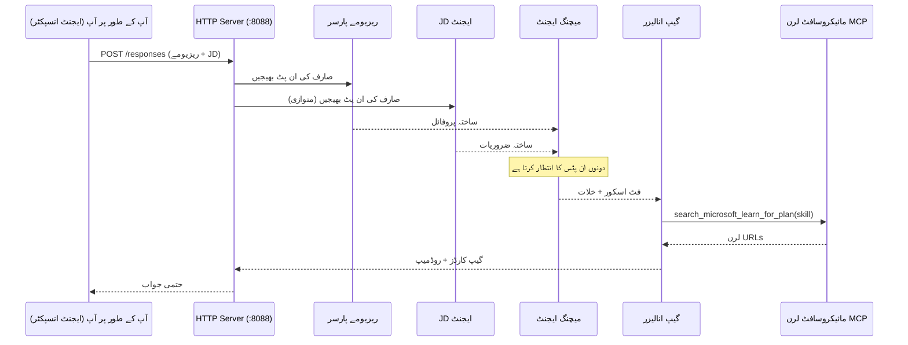
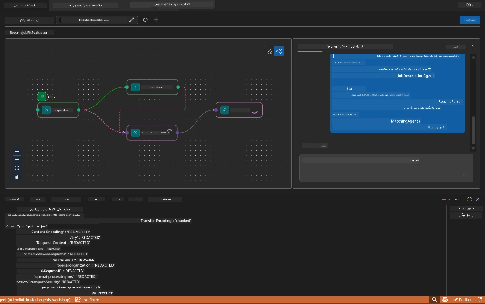

# ماڈیول 5 - مقامی طور پر ٹیسٹ کریں (کثیر ایجنٹ)

اس ماڈیول میں، آپ کثیر ایجنٹ ورک فلو کو مقامی طور پر چلائیں گے، Agent Inspector کے ساتھ اس کی جانچ کریں گے، اور یقین دہانی کریں گے کہ تمام چار ایجنٹس اور MCP ٹول صحیح کام کر رہے ہیں اس سے پہلے کہ آپ اسے Foundry پر تعینات کریں۔

### مقامی ٹیسٹ رن کے دوران کیا ہوتا ہے


---

## مرحلہ 1: ایجنٹ سرور شروع کریں

### آپشن A: VS کوڈ ٹاسک استعمال کرتے ہوئے (تجویز کردہ)

1. `Ctrl+Shift+P` دبائیں → **Tasks: Run Task** ٹائپ کریں → **Run Lab02 HTTP Server** منتخب کریں۔
2. یہ ٹاسک سرور کو debugpy کے ساتھ پورٹ `5679` پر اور ایجنٹ کو پورٹ `8088` پر شروع کرتا ہے۔
3. آؤٹ پٹ کا انتظار کریں کہ یہ ظاہر ہو:

```
INFO:resume-job-fit:Starting Resume -> Job Fit Evaluator HTTP server...
INFO:resume-job-fit:Server running on http://localhost:8088
```

### آپشن B: دستی طور پر ٹرمینل استعمال کریں

```powershell
cd workshop\lab02-multi-agent\PersonalCareerCopilot
```

ورچوئل ماحول کو فعال کریں:

**PowerShell (ونڈوز):**
```powershell
.\.venv\Scripts\Activate.ps1
```

**macOS/Linux:**
```bash
source .venv/bin/activate
```

سرور شروع کریں:

```powershell
python -m debugpy --listen 127.0.0.1:5679 -m agentdev run main.py --verbose --port 8088
```

### آپشن C: F5 (ڈی بگ موڈ) استعمال کریں

1. `F5` دبائیں یا **Run and Debug** (`Ctrl+Shift+D`) پر جائیں۔
2. ڈراپ ڈاؤن سے **Lab02 - Multi-Agent** لانچ کنفیگریشن منتخب کریں۔
3. سرور مکمل بریک پوائنٹ سپورٹ کے ساتھ شروع ہو جائے گا۔

> **ٹپ:** ڈی بگ موڈ میں آپ `search_microsoft_learn_for_plan()` کے اندر بریک پوائنٹس لگا سکتے ہیں تاکہ MCP کے جوابات کو معائنہ کریں، یا ایجنٹ کے ہدایتی سٹرنگز کے اندر تاکہ دیکھیں ہر ایجنٹ کیا وصول کرتا ہے۔

---

## مرحلہ 2: Agent Inspector کھولیں

1. `Ctrl+Shift+P` دبائیں → **Foundry Toolkit: Open Agent Inspector** ٹائپ کریں۔
2. Agent Inspector ایک براؤزر ٹیب میں کھل جائے گا `http://localhost:5679` پر۔
3. آپ کو ایجنٹ انٹرفیس پیغامات قبول کرنے کے لیے تیار نظر آنا چاہیے۔

> **اگر Agent Inspector نہیں کھل رہا:** یقینی بنائیں کہ سرور مکمل طور پر شروع ہو چکا ہے (آپ کو "Server running" لاگ نظر آ رہا ہے)۔ اگر پورٹ 5679 مصروف ہے، تو [ماڈیول 8 - مسئلہ حل](08-troubleshooting.md) دیکھیں۔

---

## مرحلہ 3: سموک ٹیسٹ چلائیں

ان تینوں ٹیسٹس کو ترتیب سے چلائیں۔ ہر ایک ورک فلو کا مزید حصہ ٹیسٹ کرتا ہے۔

### ٹیسٹ 1: بنیادی ریزومے + نوکری کی تفصیل

مندرجہ ذیل کو Agent Inspector میں پیسٹ کریں:

```
Resume:
Jane Doe
Senior Software Engineer with 5 years of experience in Python, Django, and AWS.
Built microservices handling 10K+ requests/second. Led a team of 4 developers.
Certifications: AWS Solutions Architect Associate.
Education: B.S. Computer Science, State University.

Job Description:
Senior Cloud Engineer at Contoso Ltd.
Required: Python, Azure, Kubernetes, Terraform, CI/CD pipelines.
Preferred: Go, monitoring (Prometheus/Grafana), cost optimization.
Experience: 5+ years in cloud infrastructure.
Certifications: Azure Solutions Architect Expert preferred.
```

**متوقع آؤٹ پٹ کی ساخت:**

جواب میں تمام چار ایجنٹس کا تسلسل کے ساتھ آؤٹ پٹ ہونا چاہیے:

1. **Resume Parser آؤٹ پٹ** - ہنر کی کیٹاگری کے حساب سے منظم امیدوار کی پروفائل
2. **JD Agent آؤٹ پٹ** - منظم ضروریات، مطلوبہ اور ترجیحی ہنر الگ کئے ہوئے
3. **Matching Agent آؤٹ پٹ** - فٹ اسکور (0-100) کے ساتھ تفصیل، مماثل ہنر، غائب ہنر، خلیجیں
4. **Gap Analyzer آؤٹ پٹ** - ہر غائب ہنر کے لئے انفرادی خلیج کارڈز، ہر ایک کے ساتھ Microsoft Learn URLs



### ٹیسٹ 1 میں کیا جانچنا ہے

| جانچ | متوقع | کامیاب؟ |
|-------|---------|---------|
| جواب میں فٹ اسکور شامل ہے | 0-100 کے درمیان نمبر اور تفصیل کے ساتھ | |
| مماثل ہنر درج ہیں | Python, CI/CD (جزوی)، وغیرہ | |
| غائب ہنر درج ہیں | Azure, Kubernetes, Terraform، وغیرہ | |
| ہر غائب ہنر کے لئے خلیج کارڈز موجود ہیں | ہر ہنر کے لیے ایک کارڈ | |
| Microsoft Learn URLs موجود ہیں | حقیقی `learn.microsoft.com` کے روابط | |
| جواب میں کوئی ایرر میسجز نہیں | صاف ستھرا منظم آؤٹ پٹ | |

### ٹیسٹ 2: MCP ٹول کی عمل آوری کی تصدیق کریں

جب ٹیسٹ 1 چل رہا ہو، تو سرور ٹرمینل میں MCP لاگ اندراجات دیکھیں:

```
GET https://learn.microsoft.com/api/mcp → 405 (Method Not Allowed)
POST https://learn.microsoft.com/api/mcp → 200
DELETE https://learn.microsoft.com/api/mcp → 405 (Method Not Allowed)
```

| لاگ اندراج | مطلب | متوقع؟ |
|------------|-------|---------|
| `GET ... → 405` | MCP کلائنٹ ابتدائیہ میں GET کے ذریعے پرابز کر رہا ہے | ہاں - معمول کی بات |
| `POST ... → 200` | Microsoft Learn MCP سرور کو حقیقی ٹول کال | ہاں - یہ اصلی کال ہے |
| `DELETE ... → 405` | صفائی کے دوران MCP کلائنٹ DELETE کے ذریعے پرابز کر رہا ہے | ہاں - معمول کی بات |
| `POST ... → 4xx/5xx` | ٹول کال فیل ہو گئی | نہیں - دیکھیں [مسئلہ حل](08-troubleshooting.md) |

> **کلیدی نکتہ:** `GET 405` اور `DELETE 405` لائنیں **متوقع رویہ** ہیں۔ صرف اس وقت فکر کریں اگر `POST` کالز غیر 200 اسٹیٹس کوڈز واپس کریں۔

### ٹیسٹ 3: ایج کیس - ہائی فٹ امیدوار

ایک ایسا ریزومے پیسٹ کریں جو JD کے قریب قریب میل کھاتا ہو تاکہ تصدیق ہو کہ GapAnalyzer ہائی فٹ صورتوں کو کیسے سنبھالتا ہے:

```
Resume:
Alex Chen
Senior Cloud Engineer with 7 years of experience.
Skills: Python, Azure (AKS, Functions, DevOps), Kubernetes, Terraform, CI/CD (GitHub Actions, Azure Pipelines), Go, Prometheus, Grafana, cost optimization.
Certifications: Azure Solutions Architect Expert, Azure DevOps Engineer Expert.
Led infrastructure migration to Azure for 3 enterprise clients.
Education: M.S. Computer Science, Tech University.

Job Description:
Senior Cloud Engineer at Contoso Ltd.
Required: Python, Azure, Kubernetes, Terraform, CI/CD pipelines.
Preferred: Go, monitoring (Prometheus/Grafana), cost optimization.
Experience: 5+ years in cloud infrastructure.
Certifications: Azure Solutions Architect Expert preferred.
```

**متوقع رویہ:**
- فٹ اسکور **80+** ہونا چاہیے (زیادہ تر ہنر میل کھاتے ہیں)
- خلیج کارڈز زیادہ تر پولش/انٹرویو تیاری پر توجہ دیں، بنیادی تعلیم پر نہیں
- GapAnalyzer کی ہدایات کہتی ہیں: "اگر fit >= 80، تو پولش/انٹرویو تیاری پر توجہ دیں"

---

## مرحلہ 4: آؤٹ پٹ کی مکملیت کی تصدیق کریں

ٹیسٹس کے چلنے کے بعد، تصدیق کریں کہ آؤٹ پٹ مندرجہ ذیل معیارات پر پورا اترتا ہے:

### آؤٹ پٹ ساخت چیک لسٹ

| سیکشن | ایجنٹ | موجود؟ |
|--------|--------|---------|
| امیدوار کی پروفائل | Resume Parser | |
| تکنیکی ہنر (منظم) | Resume Parser | |
| کردار کا جائزہ | JD Agent | |
| مطلوبہ بمقابلہ ترجیحی ہنر | JD Agent | |
| فٹ اسکور کے ساتھ تفصیل | Matching Agent | |
| مماثل / غائب / جزوی ہنر | Matching Agent | |
| ہر غائب ہنر کے لیے خلیج کارڈ | Gap Analyzer | |
| خلیج کارڈز میں Microsoft Learn URLs | Gap Analyzer (MCP) | |
| تعلیمی ترتیب (نمبر دار) | Gap Analyzer | |
| ٹائم لائن سمری | Gap Analyzer | |

### اس مرحلے پر عام مسائل

| مسئلہ | وجہ | حل |
|--------|--------|-----|
| صرف 1 خلیج کارڈ (باقی کٹا ہوا) | GapAnalyzer ہدایات میں CRITICAL بلاک غائب ہے | `GAP_ANALYZER_INSTRUCTIONS` میں `CRITICAL:` پیراگراف شامل کریں - دیکھیں [ماڈیول 3](03-configure-agents.md) |
| Microsoft Learn URLs نہیں ہیں | MCP اینڈ پوائنٹ سے رسائی نہیں | انٹرنیٹ کنیکٹیویٹی چیک کریں۔ `.env` میں `MICROSOFT_LEARN_MCP_ENDPOINT` کی قدر `https://learn.microsoft.com/api/mcp` ہونی چاہیے |
| خالی جواب | `PROJECT_ENDPOINT` یا `MODEL_DEPLOYMENT_NAME` سیٹ نہیں | `.env` فائل کی قدریں چیک کریں۔ ٹرمینل میں `echo $env:PROJECT_ENDPOINT` چلائیں |
| فٹ اسکور 0 یا غائب | MatchingAgent کو اپ اسٹریم ڈیٹا نہیں ملا | `create_workflow()` میں `add_edge(resume_parser, matching_agent)` اور `add_edge(jd_agent, matching_agent)` موجود ہوں |
| ایجنٹ شروع ہوتا ہے لیکن فوراً بند ہو جاتا ہے | امپورٹ ایرر یا گرفته ہوئی ڈیپنڈنسی | `pip install -r requirements.txt` دوبارہ چلائیں۔ ٹرمینل میں سٹیک ٹریس چیک کریں |
| `validate_configuration` ایرر | env ویریبلز غائب ہیں | `.env` بنائیں جس میں `PROJECT_ENDPOINT=<your-endpoint>` اور `MODEL_DEPLOYMENT_NAME=<your-model>` شامل ہوں |

---

## مرحلہ 5: اپنی ڈیٹا کے ساتھ ٹیسٹ کریں (اختیاری)

اپنا ریزومے اور حقیقی نوکری کی تفصیل پیسٹ کرنے کی کوشش کریں۔ اس سے تصدیق کرنے میں مدد ملتی ہے کہ:

- ایجنٹس مختلف ریزومے فارمیٹس (chronological, functional, hybrid) کو ہینڈل کرتے ہیں
- JD Agent مختلف JD اسٹائلز (بلٹ پوائنٹس، پیراگراف، منظم) کو ہینڈل کرتا ہے
- MCP ٹول حقیقی ہنروں کے لیے متعلقہ وسائل واپس کرتا ہے
- خلیج کارڈز آپ کے مخصوص پس منظر کے مطابق ذاتی نوعیت رکھتے ہیں

> **رازداری کا نوٹ:** مقامی ٹیسٹنگ کے دوران، آپ کا ڈیٹا آپ کے کمپیوٹر پر رہتا ہے اور صرف آپ کی Azure OpenAI تعیناتی کو بھیجا جاتا ہے۔ اسے ورکشاپ کے انفراسٹرکچر میں لاگ یا ذخیرہ نہیں کیا جاتا۔ اگر چاہیں تو پلاسی ہولڈر نام استعمال کریں (مثلاً "Jane Doe" اصل نام کی جگہ)۔

---

### چیک پوائنٹ

- [ ] سرور پورٹ `8088` پر کامیابی سے شروع ہو گیا (لاگ میں "Server running" دکھائی دے)
- [ ] Agent Inspector کھلا اور ایجنٹ سے منسلک ہو گیا
- [ ] ٹیسٹ 1: مکمل جواب فٹ اسکور، مماثل/غائب ہنر، خلیج کارڈز، اور Microsoft Learn URLs کے ساتھ
- [ ] ٹیسٹ 2: MCP لوگ میں `POST ... → 200` دکھائی دے (ٹول کالز کامیاب)
- [ ] ٹیسٹ 3: ہائی فٹ امیدوار کو 80+ اسکور ملے پولش پر توجہ کے ساتھ
- [ ] تمام خلیج کارڈز موجود ہوں (ہر غائب ہنر کے لیے ایک، کوئی کٹے ہوئے نہیں)
- [ ] سرور ٹرمینل میں کوئی ایرر یا سٹیک ٹریس نہ ہو

---

**پچھلا:** [04 - Orchestration Patterns](04-orchestration-patterns.md) · **اگلا:** [06 - Deploy to Foundry →](06-deploy-to-foundry.md)

---

<!-- CO-OP TRANSLATOR DISCLAIMER START -->
**ڈس کلیمر**:
یہ دستاویز AI ترجمہ سروس [Co-op Translator](https://github.com/Azure/co-op-translator) کے ذریعے ترجمہ کی گئی ہے۔ اگرچہ ہم درستگی کے لیے کوشش کرتے ہیں، براہ کرم یاد رکھیں کہ خودکار ترجموں میں غلطیاں یا نقائص ہو سکتے ہیں۔ اصل دستاویز اپنی مادری زبان میں معتبر ماخذ سمجھی جانی چاہیے۔ اہم معلومات کے لیے ماہر انسانی ترجمہ تجویز کیا جاتا ہے۔ ہم اس ترجمے کے استعمال سے پیدا ہونے والی کسی بھی غلط فہمی یا غلط تشریح کے ذمہ دار نہیں ہیں۔
<!-- CO-OP TRANSLATOR DISCLAIMER END -->