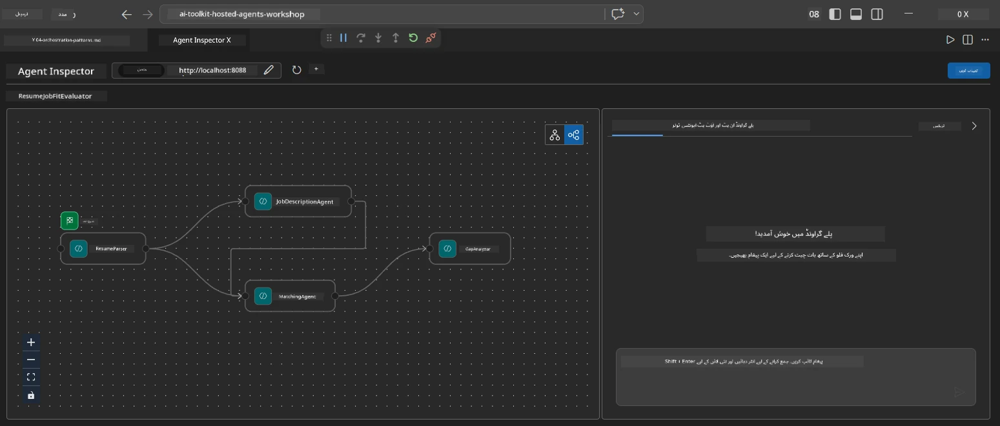
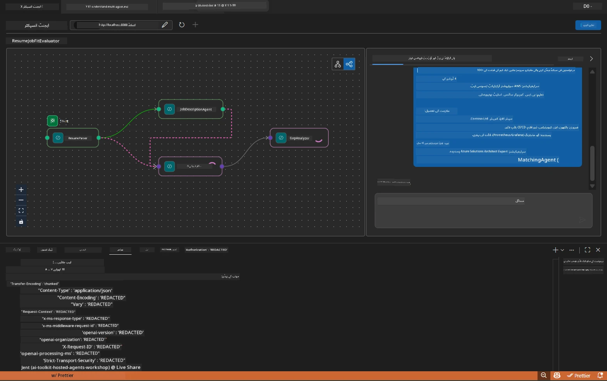
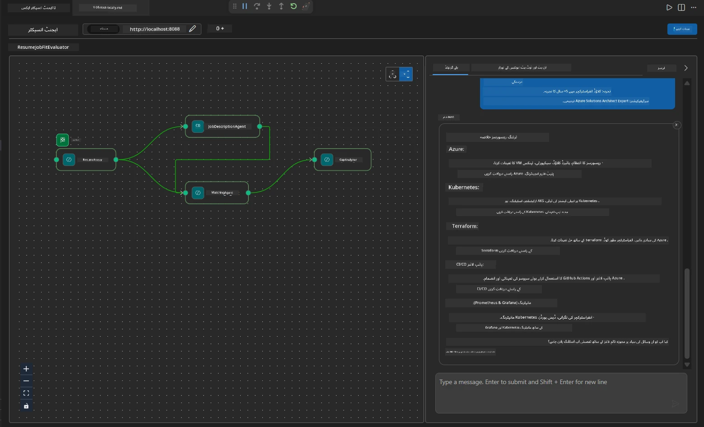

# ماڈیول 5 - مقامی طور پر ٹیسٹ کریں

⏱️ ~15 منٹ

اس ماڈیول میں، آپ ملٹی ایجنٹ ورک فلو کو مقامی طور پر چلاتے ہیں، ایجنٹ انسپیکٹر کے ساتھ ٹیسٹ کرتے ہیں، اور تعیناتی سے پہلے چاروں ایجنٹس اور MCP ٹول کے صحیح کام کرنے کی تصدیق کرتے ہیں۔

---

## مرحلہ 1: ایجنٹ سرور شروع کریں

### آپشن A: VS کوڈ ٹاسک استعمال کرتے ہوئے (تجویز کردہ)

1. `workshop/lab02-multi-agent/PersonalCareerCopilot/` کو اپنے VS کوڈ فولڈر کے طور پر کھولیں۔
2. `Ctrl+Shift+P` دبائیں → **Tasks: Run Task** ٹائپ کریں → **Run Agent HTTP Server** منتخب کریں۔
3. ٹاسک سرور کو debugpy کے ساتھ پورٹ `5679` پر اور ایجنٹ کو پورٹ `8088` پر شروع کرتا ہے۔
4. آؤٹ پٹ کے ظاہر ہونے کا انتظار کریں:

```
INFO:resume-job-fit:Starting Resume -> Job Fit Evaluator HTTP server...
INFO:resume-job-fit:Server running on http://localhost:8088
```

### آپشن B: F5 استعمال کریں (ڈیبگ موڈ)

1. `F5` دبائیں → **Debug Local Agent HTTP Server** منتخب کریں۔
2. سرور پوری بریکپوائنٹ سپورٹ کے ساتھ شروع ہوتا ہے - MCP جوابات یا ایجنٹ آؤٹ پٹ معائنہ کرنے کے لیے مفید۔

---

## مرحلہ 2: ایجنٹ انسپیکٹر کھولیں

1. `Ctrl+Shift+P` دبائیں → **Foundry Toolkit: Open Agent Inspector** ٹائپ کریں۔
2. ایجنٹ انسپیکٹر VS کوڈ پینل کے طور پر کھلتا ہے جو `http://localhost:8088` سے جڑا ہوتا ہے۔
3. آپ کو ایجنٹ انٹرفیس میسجز قبول کرنے کے لیے تیار نظر آنا چاہیے۔



> **اگر ایجنٹ انسپیکٹر نہیں کھلتا:** یقینی بنائیں کہ سرور مکمل طور پر شروع ہو چکا ہے (آپ "Server running" لاگ دیکھ رہے ہیں)۔ اگر پورٹ 5679 مصروف ہے، تو [ماڈیول 8 - ٹربل شوٹنگ](08-troubleshooting.md) دیکھیں۔

---

## مرحلہ 2ب: (اختیاری) ورک فلو ویزیولائزر کھولیں

Foundry Toolkit میں ایک حقیقی وقت کا **Workflow Visualizer** شامل ہے جو دکھاتا ہے کہ ایجنٹس گراف کے چلنے کے دوران کیسے بات چیت کرتے ہیں۔ یہ خاص طور پر ملٹی ایجنٹ ڈیبگنگ کے لیے مفید ہے۔

1. `Ctrl+Shift+P` دبائیں → **Foundry Toolkit: Open Visualizer for Hosted Agents** ٹائپ کریں۔
2. ایک نیا VS کوڈ ٹیب کھلتا ہے جو زندہ چلنے والے گراف کو دکھاتا ہے۔
3. جب آپ ایجنٹ انسپیکٹر میں میسجز بھیجتے ہیں، ویزیولائزر خود بخود اپ ڈیٹ ہو جاتا ہے - سبز نوڈز مکمل شدہ ایجنٹس کی نشاندہی کرتے ہیں، اور متحرک کنارے ان کے درمیان ڈیٹا کے بہاؤ کو ظاہر کرتے ہیں۔

> **پورٹ تنازعہ:** اگر ویزیولائزر پورٹ پہلے سے استعمال میں ہے، تو اسے VS کوڈ سیٹنگز → **Extensions** → **Microsoft Foundry Configuration** → **Hosted Agents: Visualizer Port** میں تبدیل کریں۔

---

## مرحلہ 3: اسموک ٹیسٹ چلائیں

یہ تین ٹیسٹ ترتیب سے چلائیں۔ ہر ایک ورک فلو کی مزید جانچ کرتا ہے۔

### ٹیسٹ 1: بنیادی ریزیومے + نوکری کی وضاحت

درج ذیل ایجنٹ انسپیکٹر میں پیسٹ کریں:

```
Resume:
Jane Doe
Senior Software Engineer with 5 years of experience in Python, Django, and AWS.
Built microservices handling 10K+ requests/second. Led a team of 4 developers.
Certifications: AWS Solutions Architect Associate.
Education: B.S. Computer Science, State University.

Job Description:
Senior Cloud Engineer at Contoso Ltd.
Required: Python, Azure, Kubernetes, Terraform, CI/CD pipelines.
Preferred: Go, monitoring (Prometheus/Grafana), cost optimization.
Experience: 5+ years in cloud infrastructure.
Certifications: Azure Solutions Architect Expert preferred.
```

**متوقع آؤٹ پٹ کی ساخت:**

جواب میں چاروں ایجنٹس کا آؤٹ پٹ ترتیب وار ہونا چاہیے:

1. **ریزیومے پارسر آؤٹ پٹ** - دو لیبل شدہ سیکشنز: `[PARSED RESUME]` (امیدوار کا پروفائل گروپ کی گئی مہارتوں کے ساتھ) اور `[JOB DESCRIPTION PASS-THROUGH]` (بالکل ویسا ہی JD متن جو JD ایجنٹ کو دیتا ہے)
2. **JD ایجنٹ آؤٹ پٹ** - ساخت شدہ ضروریات، علٰیحدہ ضروری اور ترجیحی مہارتوں کے ساتھ
3. **میچنگ ایجنٹ آؤٹ پٹ** - فٹ اسکور (0-100) بریک ڈاؤن کے ساتھ، مماثل مہارتیں، غائب مہارتیں، خلاء
4. **گیپ انیلیزر آؤٹ پٹ** - ہر غائب مہارت کے لیے الگ الگ خلاء کارڈز، ہر ایک کے ساتھ Microsoft Learn یو آر ایل





### ٹیسٹ 1 میں کیا تصدیق کریں

| چیک کریں | متوقع | پاس؟ |
|-------|----------|-------|
| جواب میں فٹ اسکور شامل ہے | 0-100 کے درمیان نمبر بریک ڈاؤن کے ساتھ | |
| ملنے والی مہارتیں درج ہیں | Python, CI/CD (جزوی), وغیرہ | |
| غائب مہارتیں درج ہیں | Azure, Kubernetes, Terraform, وغیرہ | |
| ہر غائب مہارت کے لیے خلاء کارڈ موجود ہیں | ہر مہارت کے لیے ایک کارڈ | |
| Microsoft Learn URL موجود ہیں | حقیقی `learn.microsoft.com` لنکس | |
| جواب میں کوئی ایرر پیغام نہیں | صاف ساختہ آؤٹ پٹ | |

### ٹیسٹ 2: ایج کیس - اعلی فٹ امیدوار

ایسا ریزیومے پیسٹ کریں جو JD سے بہت قریب مماثلت رکھتا ہو تاکہ یہ تصدیق ہو کہ GapAnalyzer اعلی فٹ حالات کو صحیح طریقے سے ہینڈل کرتا ہے:

```
Resume:
Alex Chen
Senior Cloud Engineer with 7 years of experience.
Skills: Python, Azure (AKS, Functions, DevOps), Kubernetes, Terraform, CI/CD (GitHub Actions, Azure Pipelines), Go, Prometheus, Grafana, cost optimization.
Certifications: Azure Solutions Architect Expert, Azure DevOps Engineer Expert.
Led infrastructure migration to Azure for 3 enterprise clients.
Education: M.S. Computer Science, Tech University.

Job Description:
Senior Cloud Engineer at Contoso Ltd.
Required: Python, Azure, Kubernetes, Terraform, CI/CD pipelines.
Preferred: Go, monitoring (Prometheus/Grafana), cost optimization.
Experience: 5+ years in cloud infrastructure.
Certifications: Azure Solutions Architect Expert preferred.
```

**متوقع رویہ:**
- فٹ اسکور **80+** ہونا چاہیے (زیادہ تر مہارتیں مماثل)
- خلاء کارڈ نمایاں طور پر بنیاد ساز تعلیم کی بجائے تیاری/انٹرویو پر توجہ دیں
- GapAnalyzer کی ہدایات کہتی ہیں: "اگر فٹ >= 80 ہو، تو تیاری/انٹرویو پر توجہ دیں"

---

## مرحلہ 4: اپنے ڈیٹا کے ساتھ ٹیسٹ کریں (اختیاری)

اپنے ریزیومے اور حقیقی نوکری کی وضاحت پیسٹ کرنے کی کوشش کریں۔ یہ تصدیق میں مدد دیتا ہے:

- ایجنٹس مختلف ریزیومے فارمیٹس کو ہینڈل کرتے ہیں (کرونولوجیکل، فنکشنل، ہائبرڈ)
- JD ایجنٹ مختلف JD طرزیں ہینڈل کرتا ہے (بلٹ پوائنٹس، پیراگرافز، ساختہ)
- MCP ٹول حقیقی مہارتوں کے لیے متعلقہ وسائل واپس کرتا ہے
- خلاء کارڈز آپ کے مخصوص پس منظر کے مطابق ذاتی نوعیت کے ہیں

> **پرائیویسی - راستہ A (Foundry کلاؤڈ):** ریزیومے اور JD متن آپ کے Azure OpenAI تعیناتی کو انفرنس کے لیے بھیجا جاتا ہے۔ ورکشاپ انفراسٹرکچر اسے لاگ یا محفوظ نہیں کرتا۔ اگر چاہیں تو جعلی نام استعمال کریں (مثلاً "Jane Doe")۔
>
> **پرائیویسی - راستہ B (Foundry لوکل):** چاروں ایجنٹ انفرنس مکمل طور پر آپ کے آلے پر چلتے ہیں۔ آپ کا ریزیومے اور نوکری کی وضاحت کا متن **کبھی آپ کے آلے سے باہر نہیں جاتا**۔ واحد آؤٹ باؤنڈ کال MCP ٹول کی `https://learn.microsoft.com/api/mcp` سے وسائل حاصل کرنا ہے؛ اس سوال میں صرف مہارت کا نام ہوتا ہے، آپ کی ذاتی معلومات نہیں۔

---

### چیک پوائنٹ

- [ ] سرور کامیابی سے پورٹ `8088` پر شروع ہوا (لاگ میں "Server running" دکھائی دے رہا ہے)
- [ ] ایجنٹ انسپیکٹر کھلا اور ایجنٹ سے منسلک
- [ ] ٹیسٹ 1: مکمل جواب جس میں فٹ اسکور، ملنے والی/غائب مہارتیں، خلاء کارڈز، اور Microsoft Learn یو آر ایل شامل ہیں
- [ ] ٹیسٹ 2: اعلی فٹ امیدوار کو 80+ اسکور ملتا ہے جس میں تیاری پر مبنی سفارشات ہیں
- [ ] تمام خلاء کارڈز موجود ہیں (ہر غائب مہارت کے لیے ایک، کوئی کٹاؤ نہیں)
- [ ] سرور ٹرمینل میں کوئی ایرر یا اسٹیک ٹریس نہیں

---

**پچھلا:** [04 - Orchestration Patterns](04-orchestration-patterns.md) · **اگلا:** [06 - Deploy to Foundry →](06-deploy-to-foundry.md)

---

<!-- CO-OP TRANSLATOR DISCLAIMER START -->
**ڈس کلیمر**:
یہ دستاویز AI ترجمہ سروس [Co-op Translator](https://github.com/Azure/co-op-translator) کے ذریعے ترجمہ کی گئی ہے۔ جبکہ ہم درستگی کے لیے کوشاں ہیں، براہ کرم اس بات سے آگاہ رہیں کہ خودکار ترجمے میں غلطیاں یا عدم درستیاں ہو سکتی ہیں۔ اصل دستاویز اپنے مادری زبان میں مستند ماخذ سمجھی جائے گی۔ حساس معلومات کے لیے پیشہ ور انسانی ترجمہ کی سفارش کی جاتی ہے۔ اس ترجمے کے استعمال سے پیدا ہونے والی کسی بھی غلط فہمی یا غلط تشریح کی ذمہ داری ہم قبول نہیں کرتے۔
<!-- CO-OP TRANSLATOR DISCLAIMER END -->