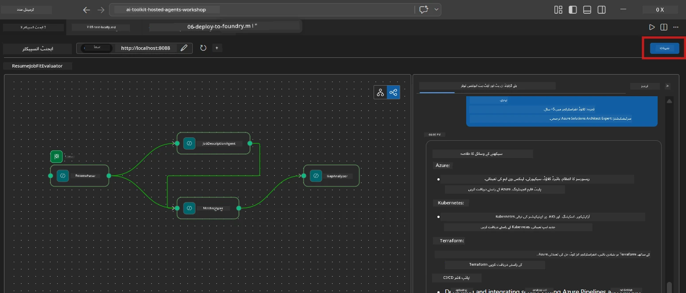
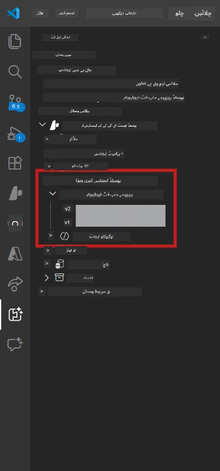

# ماڈیول 6 - فاؤنڈری ایجنٹ سروس پر تعیناتی

اس ماڈیول میں، آپ اپنے مقامی سطح پر ٹیسٹ کیے گئے ملٹی ایجنٹ ورک فلو کو [Microsoft Foundry](https://learn.microsoft.com/azure/foundry/agents/concepts/hosted-agents) پر ایک **ہوسٹڈ ایجنٹ** کے طور پر تعینات کرتے ہیں۔ تعیناتی کا عمل ایک ڈوکر کنٹینر امیج تعمیر کرتا ہے، اسے [Azure Container Registry (ACR)](https://learn.microsoft.com/azure/container-registry/container-registry-intro) پر دھکیلتا ہے، اور [Foundry Agent Service](https://learn.microsoft.com/azure/foundry/agents/how-to/publish-agent) میں ایک ہوسٹڈ ایجنٹ ورژن بناتا ہے۔

> **لیب 01 سے اہم فرق:** تعیناتی کا عمل ایک جیسا ہے۔ فاؤنڈری آپ کے ملٹی ایجنٹ ورک فلو کو ایک واحد ہوسٹڈ ایجنٹ کے طور پر دیکھتا ہے - پیچیدگی کنٹینر کے اندر ہے، لیکن تعیناتی کا انٹرفیس وہی `/responses` اینڈپوائنٹ ہے۔

---

## ضروریات کی جانچ

تعیناتی سے پہلے، نیچے دیے گئے تمام نکات کی تصدیق کریں:

1. **ایجنٹ لوکل سموک ٹیسٹ پاس کرچکا ہے:**
   - آپ نے [ماڈیول 5](05-test-locally.md) میں تینوں ٹیسٹ مکمل کیے اور ورک فلو مکمل آئوٹ پٹ فراہم کیا جس میں گیپ کارڈز اور Microsoft Learn یو آر ایلز شامل تھے۔

2. **آپ کے پاس [Azure AI User](https://learn.microsoft.com/azure/foundry/concepts/rbac-foundry) کا کردار ہے:**
   - [Lab 01، ماڈیول 2](../../lab01-single-agent/docs/02-create-foundry-project.md) میں تفویض کیا گیا۔ تصدیق کریں:
   - [Azure پورٹل](https://portal.azure.com) → اپنے فاؤنڈری **پروجیکٹ** ریسورس → **Access control (IAM)** → **Role assignments** → تصدیق کریں کہ **[Azure AI User](https://aka.ms/foundry-ext-project-role)** آپ کے اکاؤنٹ کے لیے لسٹ میں ہے۔

3. **آپ VS Code میں Azure میں سائن ان ہیں:**
   - VS Code کے نیچے بائیں جانب اکاؤنٹس آئیکون چیک کریں۔ آپ کا اکاؤنٹ نام نظر آنا چاہیے۔

4. **`agent.yaml` میں درست اقدار ہیں:**
   - `PersonalCareerCopilot/agent.yaml` کھولیں اور تصدیق کریں:
     ```yaml
     environment_variables:
       - name: PROJECT_ENDPOINT
         value: ${PROJECT_ENDPOINT}
       - name: MODEL_DEPLOYMENT_NAME
         value: ${MODEL_DEPLOYMENT_NAME}
     ```
   - یہ آپ کے `main.py` کے env vars سے میل کھانا چاہیے۔

5. **`requirements.txt` میں درست ورژنز ہیں:**
   ```
   agent-framework-azure-ai==1.0.0rc3
   agent-framework-core==1.0.0rc3
   azure-ai-agentserver-agentframework==1.0.0b16
   azure-ai-agentserver-core==1.0.0b16
   debugpy
   agent-dev-cli --pre
   ```

---

## مرحلہ 1: تعیناتی شروع کریں

### اختیار A: ایجنٹ انسپکٹر سے تعیناتی (تجویز کردہ)

اگر ایجنٹ F5 کے ذریعے چل رہا ہے اور ایجنٹ انسپکٹر کھلا ہے:

1. ایجنٹ انسپکٹر پینل کے **اوپر دائیں کونے** پر نظر ڈالیں۔
2. **Deploy** بٹن (بادل کا آئیکون جس پر اوپر تیر ↑ ہے) پر کلک کریں۔
3. تعیناتی وزرڈ کھل جائے گا۔



### اختیار B: کمانڈ پیلیٹ سے تعیناتی

1. `Ctrl+Shift+P` دبائیں تاکہ **کمانڈ پیلیٹ** کھل جائے۔
2. ٹائپ کریں: **Microsoft Foundry: Deploy Hosted Agent** اور اسے منتخب کریں۔
3. تعیناتی وزرڈ کھل جائے گا۔

---

## مرحلہ 2: تعیناتی کی تشکیل کریں

### 2.1 ہدف پروجیکٹ منتخب کریں

1. ایک ڈراپ ڈاؤن آپ کے فاؤنڈری پروجیکٹس دکھائے گا۔
2. وہ پروجیکٹ منتخب کریں جو ورکشاپ میں استعمال کیا تھا (مثلاً، `workshop-agents`)۔

### 2.2 کنٹینر ایجنٹ فائل منتخب کریں

1. آپ سے ایجنٹ انٹری پوائنٹ منتخب کرنے کو کہا جائے گا۔
2. `workshop/lab02-multi-agent/PersonalCareerCopilot/` پر جائیں اور **`main.py`** منتخب کریں۔

### 2.3 وسائل کی ترتیب

| سیٹنگ | تجویز کردہ قدر | نوٹس |
|---------|------------------|-------|
| **CPU** | `0.25` | ڈیفالٹ۔ ملٹی ایجنٹ ورک فلو کے لیے زیادہ CPU کی ضرورت نہیں کیونکہ ماڈل کالز I/O-باؤنڈ ہوتی ہیں |
| **میموری** | `0.5Gi` | ڈیفالٹ۔ اگر آپ بڑے ڈیٹا پراسیسنگ ٹولز شامل کرتے ہیں تو `1Gi` تک بڑھائیں |

---

## مرحلہ 3: تصدیق اور تعیناتی

1. وزرڈ تعیناتی کا خلاصہ دکھاتا ہے۔
2. جائزہ لیں اور **Confirm and Deploy** پر کلک کریں۔
3. VS Code میں پیش رفت کو دیکھیں۔

### تعیناتی کے دوران کیا ہوتا ہے

VS Code کے **Output** پینل (Microsoft Foundry ڈراپ ڈاؤن منتخب کریں) کو دیکھیں:


1. **Docker build** - آپ کے `Dockerfile` سے کنٹینر تیار کرتا ہے:
   ```
   Step 1/6 : FROM python:3.14-slim
   Step 2/6 : WORKDIR /app
   ...
   Successfully built abc123def456
   ```

2. **Docker push** - امیج کو ACR پر دھکیلتا ہے (پہلی تعیناتی پر 1-3 منٹ لگتے ہیں)۔

3. **ایجنٹ رجسٹریشن** - فاؤنڈری `agent.yaml` میٹا ڈیٹا کی بنیاد پر ایک ہوسٹڈ ایجنٹ بناتا ہے۔ ایجنٹ کا نام `resume-job-fit-evaluator` ہے۔

4. **کنٹینر کا آغاز** - کنٹینر فاؤنڈری کے مینجڈ انفراسٹرکچر میں سسٹم-مینجڈ شناخت کے ساتھ شروع ہوتا ہے۔

> **پہلی تعیناتی سست ہوتی ہے** (ڈوکر تمام لیئرز کو دھکیلتا ہے)۔ بعد کی تعیناتیاں کیشڈ لیئرز کو دوبارہ استعمال کرتی ہیں اور تیز ہوتی ہیں۔

### ملٹی ایجنٹ سے متعلق نوٹس

- **چاروں ایجنٹس ایک کنٹینر کے اندر ہیں۔** فاؤنڈری اسے ایک واحد ہوسٹڈ ایجنٹ کے طور پر دیکھتا ہے۔ WorkflowBuilder گراف اندرونی طور پر چلتا ہے۔
- **MCP کالز آؤٹ باؤنڈ ہوتی ہیں۔** کنٹینر کو `https://learn.microsoft.com/api/mcp` تک رسائی کے لیے انٹرنیٹ کی ضرورت ہے۔ فاؤنڈری کا مینجڈ انفراسٹرکچر اسے ڈیفالٹ طور پر فراہم کرتا ہے۔
- **[Managed Identity](https://learn.microsoft.com/python/api/overview/azure/identity-readme#managed-identity-support)**۔ ہوسٹڈ ماحول میں، `main.py` میں `get_credential()` `ManagedIdentityCredential()` واپس کرتا ہے (کیونکہ `MSI_ENDPOINT` سیٹ ہے)۔ یہ خودکار ہے۔

---

## مرحلہ 4: تعیناتی کی حالت کی تصدیق کریں

1. **Microsoft Foundry** سائیڈبار کھولیں (Activity Bar میں فاؤنڈری آئیکون پر کلک کریں)۔
2. اپنے پروجیکٹ کے تحت **Hosted Agents (Preview)** کو بڑھائیں۔
3. **resume-job-fit-evaluator** (یا آپ کے ایجنٹ کا نام) تلاش کریں۔
4. ایجنٹ کے نام پر کلک کریں → ورژنز کو بڑھائیں (مثلاً، `v1`)۔
5. ورژن پر کلک کریں → **Container Details** → **Status** چیک کریں:



| حالت | مطلب |
|--------|---------|
| **Started** / **Running** | کنٹینر چل رہا ہے، ایجنٹ تیار ہے |
| **Pending** | کنٹینر شروع ہو رہا ہے (30-60 سیکنڈ انتظار کریں) |
| **Failed** | کنٹینر شروع نہیں ہوسکا (لاگز چیک کریں - نیچے دیکھیں) |

> **ملٹی ایجنٹ کا آغاز سنگل ایجنٹ کی نسبت زیادہ وقت لیتا ہے** کیونکہ کنٹینر اسٹارٹ اپ پر 4 ایجنٹ انسٹنسز بناتا ہے۔ "Pending" 2 منٹ تک معمول ہے۔

---

## عام تعیناتی کی غلطیاں اور ان کے حل

### غلطی 1: اجازت نہیں - `agents/write`

```
Error: lacks the required data action 
Microsoft.CognitiveServices/accounts/AIServices/agents/write
```

**حل:** **[Azure AI User](https://learn.microsoft.com/azure/foundry/concepts/rbac-foundry)** کا کردار **پروجیکٹ** کی سطح پر تفویض کریں۔ مرحلہ وار ہدایات کے لیے [ماڈیول 8 - مسئلے کا حل](08-troubleshooting.md) دیکھیں۔

### غلطی 2: Docker نہیں چل رہا

```
Error: Docker build failed / Cannot connect to Docker daemon
```

**حل:**
1. Docker Desktop شروع کریں۔
2. "Docker Desktop is running" کا انتظار کریں۔
3. تصدیق کریں: `docker info`
4. **ونڈوز:** Docker Desktop کی سیٹنگز میں WSL 2 بیک اینڈ فعال کریں۔
5. دوبارہ کوشش کریں۔

### غلطی 3: Docker build کے دوران pip install ناکام

```
Error: Could not find a version that satisfies the requirement agent-dev-cli
```

**حل:** `requirements.txt` میں `--pre` فلیگ Docker میں مختلف طریقے سے ہینڈل ہوتا ہے۔ یقینی بنائیں کہ آپ کی `requirements.txt` اس طرح ہے:
```
agent-dev-cli --pre
```

اگر Docker پھر بھی ناکام ہو رہا ہے تو `pip.conf` بنائیں یا build argument کے طور پر `--pre` پاس کریں۔ مزید معلومات کے لیے [ماڈیول 8](08-troubleshooting.md) دیکھیں۔

### غلطی 4: ہوسٹڈ ایجنٹ میں MCP ٹول ناکام

اگر گیپ اینالائزر تعیناتی کے بعد Microsoft Learn یو آر ایلز بنانا بند کردے:

**بنیادی وجہ:** نیٹ ورک پالیسی کنٹینر سے باہر HTTPS بلاک کر سکتی ہے۔

**حل:**
1. عام طور پر یہ فاؤنڈری کی ڈیفالٹ کنفیگریشن میں مسئلہ نہیں ہوتا۔
2. اگر پیش آئے تو چیک کریں کہ کیا فاؤنڈری پروجیکٹ کے ورچوئل نیٹ ورک میں کوئی NSG آؤٹ باؤنڈ HTTPS کو بلاک کر رہا ہے۔
3. MCP ٹول میں بلٹ ان فال بیک یو آر ایلز ہیں، اس لیے ایجنٹ پھر بھی آئوٹ پٹ دے گا (بغیر لائیو یو آر ایلز کے)۔

---

### چیک پوائنٹ

- [ ] تعیناتی کمانڈ VS Code میں بغیر غلطی کے مکمل ہوئی
- [ ] ایجنٹ فاؤنڈری سائیڈبار میں **Hosted Agents (Preview)** کے نیچے ظاہر ہو رہا ہے
- [ ] ایجنٹ کا نام `resume-job-fit-evaluator` (یا آپ کا منتخب کردہ نام) ہے
- [ ] کنٹینر کی حالت **Started** یا **Running** دکھا رہی ہے
- [ ] (اگر غلطیاں آئیں) آپ نے غلطی کی نشاندہی کی، اصلاح کی، اور کامیابی سے دوبارہ تعینات کیا

---

**پچھلا:** [05 - لوکل ٹیسٹ](05-test-locally.md) · **اگلا:** [07 - پلیگراونڈ میں تصدیق کریں →](07-verify-in-playground.md)

---

<!-- CO-OP TRANSLATOR DISCLAIMER START -->
**وضاحت**:
اس دستاویز کا ترجمہ AI ترجمہ سروس [Co-op Translator](https://github.com/Azure/co-op-translator) کے ذریعے کیا گیا ہے۔ اگرچہ ہم درستگی کی کوشش کرتے ہیں، براہ کرم آگاہ رہیں کہ خودکار تراجم میں غلطیاں یا بے دقتیاں ہو سکتی ہیں۔ اصل دستاویز اپنی مادری زبان میں معتبر ذریعہ سمجھی جانی چاہیے۔ اہم معلومات کے لیے پیشہ ورانہ انسانی ترجمہ کی سفارش کی جاتی ہے۔ اس ترجمے کے استعمال سے ہونے والی کسی بھی غلط فہمی یا غلط تفسیر کی ذمہ داری ہم پر نہیں ہوگی۔
<!-- CO-OP TRANSLATOR DISCLAIMER END -->