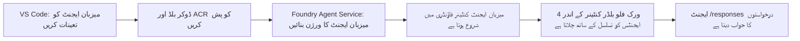
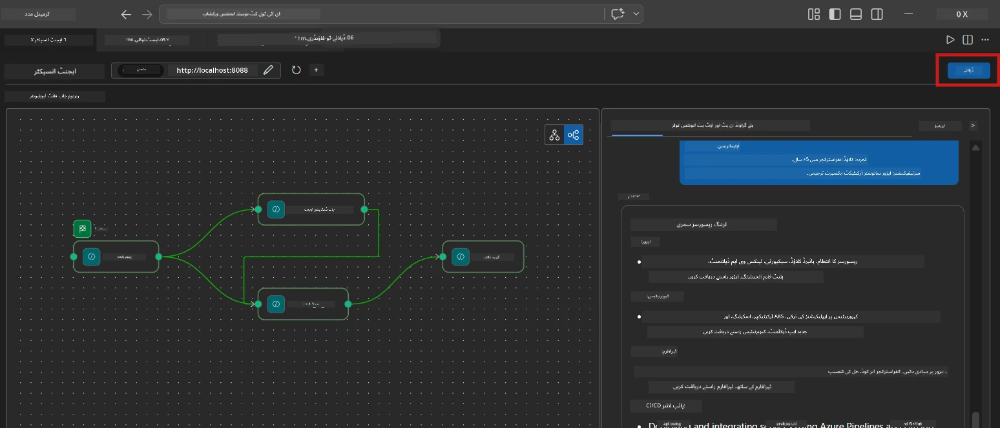

# ماڈیول 6 - فاؤنڈری ایجنٹ سروس پر تعیناتی

⏱️ ~10 منٹ

اس ماڈیول میں، آپ اپنے مقامی طور پر آزمایا ہوا ملٹی ایجنٹ ورک فلو کو [Microsoft Foundry](https://learn.microsoft.com/azure/foundry/agents/concepts/hosted-agents) میں بطور **Hosted Agent** تعینات کرتے ہیں۔ تعیناتی کا عمل ایک ڈوکر کنٹینر امیج بناتا ہے، اسے [Azure Container Registry (ACR)](https://learn.microsoft.com/azure/container-registry/container-registry-intro) پر دھکیلتا ہے، اور [Foundry Agent Service](https://learn.microsoft.com/azure/foundry/agents/how-to/publish-agent) میں ایک ہوسٹڈ ایجنٹ ورژن تخلیق کرتا ہے۔

> **لیب 01 سے اہم فرق:** تعیناتی کا عمل بالکل ایک جیسا ہے۔ فاؤنڈری آپ کے ملٹی ایجنٹ ورک فلو کو ایک واحد ہوسٹڈ ایجنٹ کے طور پر دیکھتا ہے - پیچیدگی کنٹینر کے اندر ہے، لیکن تعیناتی کا انٹرفیس وہی `/responses` اینڈپوائنٹ ہے۔

### تعیناتی کا پائپ لائن


```mermaid
flowchart LR
    A[VS Code: میزبان ایجنٹ کو تعینات کریں] --> B[ڈوکر بلڈ اور ACR کو پش کریں]
    B --> C[Foundry Agent Service: میزبان ایجنٹ کا ورژن بنائیں]
    C --> D[میزبان ایجنٹ کنٹینر فاؤنڈری میں شروع ہوتا ہے]
    D --> E[ورک فلو بلڈر کنٹینر کے اندر 4 ایجنٹس کو تسلسل کے ساتھ چلاتا ہے]
    E --> F[ایجنٹ /responses درخواستوں کا جواب دیتا ہے]
```

---

## ضروریات کی جانچ

تعیناتی سے قبل، درج ذیل تمام اشیاء کی تصدیق کریں:

1. **ایجنٹ مقامی سموک ٹیسٹ پاس کرتا ہے:**
   - آپ نے [Module 5](05-test-locally.md) میں تمام 3 ٹیسٹ مکمل کیے ہیں اور ورک فلو نے مکمل آؤٹ پٹ پیدا کیا ہے جس میں گیپ کارڈز اور Microsoft Learn کے URLs شامل ہیں۔

2. **آپ کے پاس [Foundry User](https://learn.microsoft.com/azure/foundry/concepts/rbac-foundry) کا کردار ہے** (تعیناتی کے لیے، آپ کو کم از کم پروجیکٹ سکوپ پر **Foundry Project Manager** درکار ہے):

   > **نوٹ:** فاؤنڈری RBAC کرداروں کے نام حال ہی میں تبدیل کیے گئے ہیں - **Foundry User**، **Foundry Owner**، اور **Foundry Project Manager** پہلے Azure AI User، Azure AI Owner، اور Azure AI Project Manager کہلاتے تھے۔ کردار کی شناخت اور اجازتیں بے تبدیل ہیں۔

   - [Azure Portal](https://portal.azure.com) میں تصدیق کریں → آپ کے Foundry **پروجیکٹ** ریسورس → **Access control (IAM)** → **Role assignments** → تصدیق کریں کہ آپ کے اکاؤنٹ کے لیے **Foundry User** (یا اس سے اوپر) موجود ہے۔

3. **آپ VS Code میں Azure میں سائن ان ہیں:**
   - VS Code کے نیچے بائیں کونے میں اکاؤنٹس آئیکون چیک کریں۔ آپ کے اکاؤنٹ کا نام دکھائی دینا چاہیے۔

4. **`agent.yaml` میں درست اقدار ہیں:**
   - `PersonalCareerCopilot/agent.yaml` کھولیں اور تصدیق کریں:
     ```yaml
     environment_variables:
       - name: AZURE_AI_MODEL_DEPLOYMENT_NAME
         value: ${AZURE_AI_MODEL_DEPLOYMENT_NAME}
     ```
   - `FOUNDRY_PROJECT_ENDPOINT` یہاں فہرست میں شامل نہیں ہے - فاؤنڈری اسے رن ٹائم پر داخل کرتا ہے۔ صرف `AZURE_AI_MODEL_DEPLOYMENT_NAME` کا اعلان کرنا ضروری ہے۔

5. **`requirements.txt` میں درست ورژنز ہیں:**
   ```
   agent-framework-foundry
   agent-framework-foundry-hosting
   mcp<2,>=1.24.0
   debugpy
   ```

---

## مرحلہ 1: تعیناتی شروع کریں

### آپشن A: ایجنٹ انسپیکٹر سے تعیناتی (تجویز کردہ)

اگر ایجنٹ F5 کے ذریعے ایجنٹ انسپیکٹر کے کھلے ہونے پر چل رہا ہے:

1. ایجنٹ انسپیکٹر پینل کے **اوپر دائیں کونے** کو دیکھیں۔
2. **Deploy** بٹن (بادل کا آئیکون جس پر اوپر کی طرف تیر ↑ ہے) پر کلک کریں۔
3. تعیناتی وزرڈ کھل جائے گا۔



### آپشن B: کمانڈ پیلیٹ سے تعیناتی

1. کمانڈ پیلیٹ کھولنے کے لیے `Ctrl+Shift+P` دبائیں۔
2. لکھیں: **Foundry Toolkit: Deploy Hosted Agent** اور اسے منتخب کریں۔
3. تعیناتی وزرڈ کھل جائے گا۔

---

## مرحلہ 2: تعیناتی کی ترتیب

### 2.1 ہدف پروجیکٹ منتخب کریں

1. ایک ڈراپ ڈاؤن آپ کے Foundry پروجیکٹس دکھاتا ہے۔
2. وہ پروجیکٹ منتخب کریں جو آپ نے ورکشاپ کے دوران استعمال کیا ہے (مثلاً `workshop-agents`)۔

### 2.2 کنٹینر ایجنٹ فائل منتخب کریں

1. آپ سے ایجنٹ کا داخلہ نقطہ منتخب کرنے کو کہا جائے گا۔
2. `workshop/lab02-multi-agent/PersonalCareerCopilot/` پر جائیں اور **`main.py`** منتخب کریں۔

### 2.3 وسائل کی ترتیب

| سیٹنگ | تجویز کردہ قیمت | نوٹس |
|---------|------------------|-------|
| **تعیناتی کا طریقہ** | **کنٹینر** (تجویز کردہ) یا **کوڈ** | کنٹینر ڈوکر امیج بناتا ہے؛ کوڈ سورس کو ZIP کے طور پر اپ لوڈ کرتا ہے (پریویو) |
| **کنٹینر رجسٹری** | **پہلا ACR** | فاؤنڈری آپ کے لیے ایک بناتا اور منظم کرتا ہے |
| **CPU** | `0.25` | ڈیفالٹ۔ ملٹی ایجنٹ ورک فلو کو زیادہ CPU کی ضرورت نہیں کیونکہ ماڈل کالز I/O پر منحصر ہوتی ہیں |
| **میموری** | `0.5Gi` | ڈیفالٹ۔ اگر آپ بڑے ڈیٹا پراسیسنگ ٹولز شامل کرتے ہیں تو `1Gi` کریں |

---

## مرحلہ 3: تصدیق کریں اور تعینات کریں

1. وزرڈ تعیناتی کا خلاصہ دکھاتا ہے۔
2. جائزہ لیں اور **Confirm and Deploy** پر کلک کریں۔
3. VS Code میں پیش رفت دیکھیں۔

### تعیناتی کے دوران کیا ہوتا ہے

VS Code کی **Output** پینل دیکھیں (ڈراپ ڈاؤن سے "Microsoft Foundry" منتخب کریں):

1. **ڈوکر تعمیر** - آپ کے `Dockerfile` سے کنٹینر بناتا ہے
   ```
   Step 1/6 : FROM python:3.12-slim
   Step 2/6 : WORKDIR /app
   ...
   Successfully built abc123def456
   ```

2. **ڈوکر دھکیلنا** - امیج کو ACR پر دھکیلتا ہے (پہلی بار تعیناتی میں 1-3 منٹ لگ سکتے ہیں)۔

3. **ایجنٹ رجسٹریشن** - فاؤنڈری `agent.yaml` میٹا ڈیٹا کا استعمال کرتے ہوئے ایک ہوسٹڈ ایجنٹ بناتا ہے۔ ایجنٹ کا نام `resume-job-fit-evaluator` ہے۔

4. **کنٹینر شروع** - کنٹینر فاؤنڈری کی منظم انفراسٹرکچر میں سسٹم مینیجڈ شناخت کے ساتھ شروع ہوتا ہے۔

> **پہلی تعیناتی آہستہ ہوتی ہے** (ڈوکر تمام پرتیں دھکیلتا ہے)۔ بعد کی تعیناتیاں کیشڈ پرتیں دوبارہ استعمال کرتی ہیں اور تیز ہوتی ہیں۔

### ملٹی ایجنٹ کے لیے مخصوص نوٹس

- **تمام چار ایجنٹ ایک کنٹینر کے اندر ہیں۔** فاؤنڈری ایک واحد ہوسٹڈ ایجنٹ دیکھتا ہے۔ WorkflowBuilder گراف اندرونی طور پر چلتا ہے۔
- **MCP کالز اوٹ باؤنڈ جاتی ہیں۔** کنٹینر کو `https://learn.microsoft.com/api/mcp` تک انٹرنیٹ رسائی درکار ہے۔ فاؤنڈری کی منظم انفراسٹرکچر یہ بطور ڈیفالٹ مہیا کرتی ہے۔
- **[Managed Identity](https://learn.microsoft.com/azure/foundry/agents/concepts/agent-identity).** فاؤنڈری خودکار طور پر ہر Hosted ایجنٹ کے لیے ایک **مخصوص per-agent Entra شناخت** تعیناتی کے وقت بناتا ہے۔ ہوسٹڈ ماحول میں، `DefaultAzureCredential` خود بخود اس ایجنٹ کی شناخت کو حل کرتا ہے - کسی دستی managed identity ترتیب کی ضرورت نہیں۔

---

## مرحلہ 4: تعیناتی کی حالت کی تصدیق کریں

1. **Microsoft Foundry** سائیڈبار کھولیں (Activity Bar میں Foundry آئیکون پر کلک کریں)۔
2. اپنے پروجیکٹ کے تحت **Hosted Agents (Preview)** کو پھیلائیں۔
3. **resume-job-fit-evaluator** (یا آپ کے ایجنٹ کا نام) تلاش کریں۔
4. ایجنٹ کے نام پر کلک کریں → ورژنز پھیلائیں (مثلاً `v1`)۔
5. ورژن پر کلک کریں → **Container Details** → **Status** چیک کریں:


| حالت | مطلب |
|--------|---------|
| **active** | ایجنٹ چل رہا ہے اور درخواستیں قبول کرنے کے لیے تیار ہے |
| **creating** | کنٹینر شروع ہو رہا ہے (30–60 سیکنڈ انتظار کریں) |
| **failed** | کنٹینر شروع نہیں ہو سکا (لاگز چیک کریں - نیچے دیکھیں) |

> **نوٹ:** VS Code سائیڈبار "Running" یا "Started" جیسا لیبل دکھا سکتا ہے جب کہ API کی حالت `active`/`creating` استعمال کرتی ہے۔ دونوں کا مطلب ایک جیسا ہوتا ہے۔

> **ملٹی ایجنٹ اسٹارٹ اپ زیادہ وقت لیتا ہے** کیونکہ کنٹینر شروع ہوتے وقت 4 ایجنٹ انسٹانسز بناتا ہے۔ `creating` کا 2 منٹ تک رہنا معمول ہے۔

---

## عام تعیناتی کی غلطیاں اور درستیاں

### غلطی 1: اجازت نہیں دی گئی - `agents/write`

```
Error: lacks the required data action 
Microsoft.CognitiveServices/accounts/AIServices/agents/write
```

**درستگی:** **[Foundry User](https://learn.microsoft.com/azure/foundry/concepts/rbac-foundry)** کا کردار (جو پہلے **Azure AI User** تھا) **پروجیکٹ** سطح پر تفویض کریں۔ مرحلہ وار ہدایات کے لیے [Module 8 - Troubleshooting](08-troubleshooting.md) دیکھیں۔

### غلطی 2: ڈوکر چل نہیں رہا

```
Error: Docker build failed / Cannot connect to Docker daemon
```

**درستگی:**
1. Docker Desktop شروع کریں۔
2. انتظار کریں جب تک "Docker Desktop is running" ظاہر نہ ہو۔
3. تصدیق کریں: `docker info`
4. **ونڈوز:** یقینی بنائیں کہ Docker Desktop کی ترتیبات میں WSL 2 بیک اینڈ فعال ہے۔
5. دوبارہ کوشش کریں۔

### غلطی 3: Docker build کے دوران pip install ناکام ہو گیا

```
Error: Could not find a version that satisfies the requirement agent-framework-foundry
```

**درستگی:** تصدیق کریں کہ `requirements.txt` درج ذیل سے میل کھاتا ہے:
```
agent-framework-foundry
agent-framework-foundry-hosting
mcp<2,>=1.24.0
debugpy
```

اگر تعمیر پھر بھی ناکام ہو رہی ہے، تو ممکنہ طور پر آپ کے ڈوکر نیٹ ورک میں PyPI بلاک ہے۔ پراکسی سیٹنگز کے لیے `docker info` چیک کریں۔

### غلطی 4: MCP ٹول ہوسٹڈ ایجنٹ میں ناکام

اگر تعیناتی کے بعد Gap Analyzer Microsoft Learn URLs پیدا کرنا بند کر دیتا ہے:

**بنیادی وجہ:** نیٹ ورک پالیسی کنٹینر سے اوٹ باؤنڈ HTTPS بلاک کر رہی ہے۔

**درستگی:**
1. عام طور پر یہ فاؤنڈری کی ڈیفالٹ ترتیب میں مسئلہ نہیں ہوتا۔
2. اگر ہوتا ہے تو چیک کریں کہ کیا فاؤنڈری پروجیکٹ کے ورچوئل نیٹ ورک میں کوئی NSG اوٹ باؤنڈ HTTPS بلاک کر رہا ہے۔
3. MCP ٹول میں فیل بیک URLs شامل ہیں، اس لیے ایجنٹ پھر بھی آؤٹ پٹ دے گا (بغیر لائیو URLs کے)۔

---

### چیک پوائنٹ

- [ ] VS Code میں بغیر غلطیوں کے تعیناتی کمانڈ مکمل ہوا
- [ ] ایجنٹ فاؤنڈری سائیڈبار میں **Hosted Agents (Preview)** کے تحت ظاہر ہو رہا ہے
- [ ] ایجنٹ کا نام `resume-job-fit-evaluator` (یا آپ کا منتخب کردہ نام) ہے
- [ ] کنٹینر کی حالت **Started** یا **Running** دکھا رہی ہے
- [ ] (اگر غلطیاں ہیں) آپ نے غلطی کو پہچانا، درستگی لگائیں، اور کامیابی سے دوبارہ تعینات کیا

---

**پچھلا:** [05 - Test Locally](05-test-locally.md) · **اگلا:** [07 - Verify in Playground →](07-verify-in-playground.md)

---

<!-- CO-OP TRANSLATOR DISCLAIMER START -->
**ڈس کلیمر**:
یہ دستاویز AI ترجمہ سروس [Co-op Translator](https://github.com/Azure/co-op-translator) کے ذریعے ترجمہ کی گئی ہے۔ جبکہ ہم درستگی کے لیے کوشاں ہیں، براہ کرم اس بات سے آگاہ رہیں کہ خودکار ترجمے میں غلطیاں یا عدم درستیاں ہو سکتی ہیں۔ اصل دستاویز اپنے مادری زبان میں مستند ماخذ سمجھی جائے گی۔ حساس معلومات کے لیے پیشہ ور انسانی ترجمہ کی سفارش کی جاتی ہے۔ اس ترجمے کے استعمال سے پیدا ہونے والی کسی بھی غلط فہمی یا غلط تشریح کی ذمہ داری ہم قبول نہیں کرتے۔
<!-- CO-OP TRANSLATOR DISCLAIMER END -->