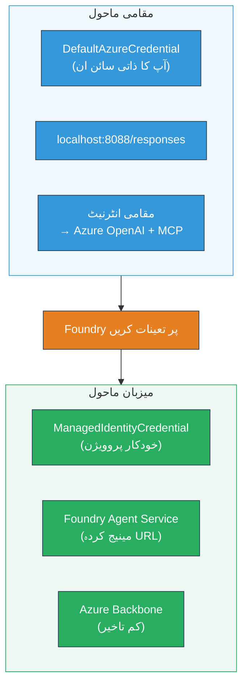

# ماڈیول 7 - پلے گراؤنڈ میں تصدیق کریں

اس ماڈیول میں، آپ اپنے تعینات کردہ ملٹی ایجنٹ ورک فلو کو **VS Code** اور **[Foundry Portal](https://ai.azure.com)** دونوں میں ٹیسٹ کرتے ہیں، یہ تصدیق کرتے ہوئے کہ ایجنٹ مقامی ٹیسٹنگ کے مماثل ہی کام کر رہا ہے۔

---

## تعیناتی کے بعد کیوں تصدیق کریں؟

آپ کا ملٹی ایجنٹ ورک فلو مقامی طور پر بہترین چل رہا تھا، تو دوبارہ کیوں ٹیسٹ کریں؟ ہوسٹڈ ماحول کئی حوالوں سے مختلف ہوتا ہے:


| فرق | لوکل | ہوسٹڈ |
|-----------|-------|--------|
| **شناخت** | [`DefaultAzureCredential`](https://learn.microsoft.com/azure/developer/python/sdk/authentication/credential-chains#defaultazurecredential-overview) (آپ کا ذاتی سائن ان) | [`ManagedIdentityCredential`](https://learn.microsoft.com/python/api/overview/azure/identity-readme#managed-identity-support) (خودکار فراہم کردہ) |
| **اینڈ پوائنٹ** | `http://localhost:8088/responses` | [Foundry Agent Service](https://learn.microsoft.com/azure/foundry/agents/concepts/hosted-agents) اینڈ پوائنٹ (انتظام شدہ URL) |
| **نیٹ ورک** | مقامی مشین → Azure OpenAI + MCP آؤٹ باؤنڈ | Azure بیک بون (خدمات کے درمیان کم لیٹنسی) |
| **MCP کنیکٹیویٹی** | مقامی انٹرنیٹ → `learn.microsoft.com/api/mcp` | کنٹینر آؤٹ باؤنڈ → `learn.microsoft.com/api/mcp` |

اگر کوئی ماحول کا متغیر غلط ترتیب دیا گیا ہو، RBAC مختلف ہو، یا MCP آؤٹ باؤنڈ بلاک ہو، تو آپ یہاں اسے پکڑ لیں گے۔

---

## آپشن A: VS Code پلے گراؤنڈ میں ٹیسٹ کریں (پہلے مرحلہ کے طور پر سفارش کی گئی)

[Foundry ایکسٹینشن](https://marketplace.visualstudio.com/items?itemName=TeamsDevApp.vscode-ai-foundry) میں ایک مربوط پلے گراؤنڈ شامل ہے جو آپ کو بغیر VS Code چھوڑے اپنے تعینات کردہ ایجنٹ سے بات چیت کرنے دیتا ہے۔

### مرحلہ 1: اپنے ہوسٹڈ ایجنٹ پر جائیں

1. VS Code کے **Activity Bar** (بائیں سائڈ بار) میں **Microsoft Foundry** آئکن پر کلک کریں تاکہ Foundry پینل کھل جائے۔
2. اپنے متصل منصوبے کو وسعت دیں (مثلاً `workshop-agents`)۔
3. **Hosted Agents (Preview)** کو کھولیں۔
4. آپ کو اپنا ایجنٹ نام یہاں دکھائی دے گا (مثلاً `resume-job-fit-evaluator`)۔

### مرحلہ 2: ورژن منتخب کریں

1. ایجنٹ کے نام پر کلک کریں تاکہ اس کے ورژنز ظاہر ہوں۔
2. اس ورژن پر کلک کریں جو آپ نے تعینات کیا ہے (مثلاً `v1`)۔
3. ایک **تفصیلی پینل** کھلتا ہے جو کنٹینر کی تفصیلات دکھاتا ہے۔
4. تصدیق کریں کہ اسٹیٹس **Started** یا **Running** ہے۔

### مرحلہ 3: پلے گراؤنڈ کھولیں

1. تفصیلی پینل میں، **Playground** بٹن پر کلک کریں (یا ورژن پر رائٹ کلک کر کے **Open in Playground** منتخب کریں)۔
2. VS Code کے ایک ٹیب میں چیٹ انٹرفیس کھل جائے گا۔

### مرحلہ 4: اپنے سمولیشن ٹیسٹ چلائیں

[ماڈیول 5](05-test-locally.md) سے وہی 3 ٹیسٹ استعمال کریں۔ ہر پیغام کو پلے گراؤنڈ کے ان پٹ باکس میں ٹائپ کریں اور **Send** (یا **Enter**) دبائیں۔

#### ٹیسٹ 1 - مکمل ریزیومے + JD (معیاری فلو)

Module 5، ٹیسٹ 1 سے مکمل ریزیومے + JD پرامپٹ چسپاں کریں (Jane Doe + Senior Cloud Engineer at Contoso Ltd)۔

**متوقع:**
- فٹ اسکور کے ساتھ تفصیلی ریاضی (100 پوائنٹ اسکیل)
- ملنے والی مہارتوں کا سیکشن
- غائب مہارتوں کا سیکشن
- **ہر غائب مہارت کے لیے ایک گپ کارڈ** مائیکروسافٹ لرن URLs کے ساتھ
- لرننگ روڈمیپ اور ٹائم لائن

#### ٹیسٹ 2 - فوری مختصر ٹیسٹ (کم از کم ان پٹ)

```
RESUME: 3 years Python developer, knows Django and PostgreSQL, no cloud experience.

JOB: Cloud DevOps Engineer requiring AWS, Kubernetes, Terraform, CI/CD. 5 years needed.
```

**متوقع:**
- کم فٹ اسکور (< 40)
- ایماندار جائزہ مرحلہ وار سیکھنے کے راستے کے ساتھ
- متعدد گپ کارڈز (AWS، Kubernetes، Terraform، CI/CD، تجربے کا فرق)

#### ٹیسٹ 3 - اعلیٰ فٹ امیدوار

```
RESUME:
10 years Azure Cloud Architect. AZ-305 certified. Expert in AKS, Terraform, Azure DevOps, 
Azure Functions, Helm, Prometheus, Grafana, Python, Go. Led platform team of 8.

JOB:
Senior Cloud Engineer. Required: AKS, Terraform, Azure DevOps, Python. Preferred: Helm, Go.
5+ years experience. AZ-305 preferred.
```

**متوقع:**
- اعلیٰ فٹ اسکور (≥ 80)
- انٹرویو کی تیاری اور پالش پر توجہ
- چند یا کوئی گپ کارڈز نہیں
- مختصر ٹائم لائن، تیاری پر مرکوز

### مرحلہ 5: مقامی نتائج سے موازنہ کریں

ماڈیول 5 سے اپنی نوٹس یا براؤزر ٹیب کھولیں جہاں آپ نے مقامی جوابات محفوظ کیے تھے۔ ہر ٹیسٹ کے لیے:

- کیا جواب میں **ساخت بھی وہی ہے** (فٹ اسکور، گپ کارڈز، روڈمیپ)؟
- کیا یہ **وہی اسکورنگ ربریک** استعمال کرتا ہے (100 پوائنٹ تفصیل)?
- کیا گپ کارڈز میں **مائیکروسافٹ لرن URLs** شامل ہیں؟
- کیا ہر غائب مہارت کے لیے **ایک گپ کارڈ** موجود ہے (کٹا ہوا نہیں)؟

> **چھوٹے الفاظ کے فرق معمول ہیں** - ماڈل غیر یقینی ہے۔ ساخت، اسکورنگ کی مستقل مزاجی، اور MCP ٹول کے استعمال پر توجہ دیں۔

---

## آپشن B: Foundry پورٹل میں ٹیسٹ کریں

[Foundry پورٹل](https://ai.azure.com) ایک ویب بیسڈ پلے گراؤنڈ فراہم کرتا ہے جو ٹیم کے ارکان یا اسٹیک ہولڈرز کے ساتھ شیئر کرنے کے لیے مفید ہے۔

### مرحلہ 1: Foundry پورٹل کھولیں

1. اپنا براؤزر کھولیں اور [https://ai.azure.com](https://ai.azure.com) پر جائیں۔
2. اسی Azure اکاؤنٹ سے سائن ان کریں جسے آپ ورکشاپ کے دوران استعمال کر رہے تھے۔

### مرحلہ 2: اپنے پروجیکٹ پر جائیں

1. ہوم پیج پر، بائیں سائڈ بار میں **Recent projects** دیکھیں۔
2. اپنے پروجیکٹ کے نام پر کلک کریں (مثلاً`workshop-agents`)۔
3. اگر آپ کو نظر نہ آئے تو **All projects** پر کلک کریں اور تلاش کریں۔

### مرحلہ 3: اپنے تعینات کردہ ایجنٹ کو تلاش کریں

1. پروجیکٹ کے بائیں نیویگیشن میں **Build** → **Agents** پر کلک کریں (یا **Agents** سیکشن دیکھیں)۔
2. آپ کو ایجنٹس کی فہرست ملے گی۔ اپنے تعینات کردہ ایجنٹ کو تلاش کریں (مثلاً `resume-job-fit-evaluator`)۔
3. ایجنٹ کے نام پر کلک کریں تاکہ اس کی تفصیلی صفحہ کھلے۔

### مرحلہ 4: پلے گراؤنڈ کھولیں

1. ایجنٹ کی تفصیلی صفحہ پر، اوپر والے ٹول بار پر دیکھیں۔
2. **Open in playground** (یا **Try in playground**) پر کلک کریں۔
3. چیٹ انٹرفیس کھل جائے گا۔

### مرحلہ 5: وہی سمولیشن ٹیسٹ چلائیں

VS Code پلے گراؤنڈ کے سیکشن میں دیے گئے تینوں ٹیسٹ دہرائیں۔ ہر جواب کا موازنہ مقامی نتایج (ماڈیول 5) اور VS Code پلے گراؤنڈ کے نتائج (اوپر آپشن A) سے کریں۔

---

## ملٹی ایجنٹ مخصوص تصدیق

بنیادی درستگی کے علاوہ، ان ملٹی ایجنٹ مخصوص رویوں کی تصدیق کریں:

### MCP ٹول کا نفاذ

| جانچ | کیسے تصدیق کریں | کامیاب ہونے کی شرط |
|-------|---------------|----------------|
| MCP کالز کامیاب | گپ کارڈز میں `learn.microsoft.com` URLs موجود ہیں | اصلی URLs، فال بیک پیغامات نہیں |
| متعدد MCP کالز | ہر اعلی/درمیانی ترجیح کے گپ میں وسائل موجود ہیں | صرف پہلا گپ کارڈ نہیں |
| MCP فال بیک کام کرتا ہے | اگر URLs غائب ہوں، فال بیک متن چیک کریں | ایجنٹ پھر بھی گپ کارڈز بناتا ہے (URLs کے ساتھ یا بغیر) |

### ایجنٹ کوآرڈینیشن

| جانچ | کیسے تصدیق کریں | کامیاب ہونے کی شرط |
|-------|---------------|----------------|
| تمام 4 ایجنٹس نے کام کیا | آؤٹ پٹ میں فٹ اسکور اور گپ کارڈز شامل ہیں | اسکور MatchingAgent سے، کارڈز GapAnalyzer سے |
| متوازی فن آؤٹ | جواب کا وقت معقول ہے (< 2 منٹ) | اگر > 3 منٹ، تو متوازی عمل شاید نہیں ہو رہا |
| ڈیٹا فلو کی سالمیت | گپ کارڈز میں مہارتیں میچنگ رپورٹ سے حوالہ دی گئی ہیں | کوئی فرضی مہارتیں جو JD میں نہیں ہیں نہیں |

---

## توثیقی ربریک

اپنے ملٹی ایجنٹ ورک فلو کے ہوسٹڈ رویے کی جانچ کے لیے اس ربریک کا استعمال کریں:

| # | معیار | کامیاب شرط | کامیاب؟ |
|---|----------|---------------|-------|
| 1 | **کارکردگی کی درستگی** | ایجنٹ ریزیومے + JD پر فٹ اسکور اور گپ تجزیہ کے ساتھ جواب دیتا ہے | |
| 2 | **اسکورنگ کی مطابقت** | فٹ اسکور 100 پوائنٹ اسکیل اور تفصیلی ریاضی استعمال کرتا ہے | |
| 3 | **گپ کارڈ کی مکملیت** | ہر غائب مہارت کے لیے ایک کارڈ (کٹا ہوا یا ملایا ہوا نہیں) | |
| 4 | **MCP ٹول انٹیگریشن** | گپ کارڈز میں اصلی Microsoft Learn URLs موجود ہیں | |
| 5 | **ساخت کی مطابقت** | آؤٹ پٹ کی ساخت مقامی اور ہوسٹڈ چلانے میں مماثل ہے | |
| 6 | **جواب کا وقت** | ہوسٹڈ ایجنٹ مکمل جائزہ کے لیے 2 منٹ کے اندر جواب دیتا ہے | |
| 7 | **کوئی غلطیاں نہیں** | کوئی HTTP 500 غلطیاں، ٹائم آؤٹ یا خالی جوابات نہیں | |

> "پاس" کا مطلب ہے کہ تمام 7 معیار تینوں سمولیشن ٹیسٹوں کے لیے کم از کم ایک پلے گراؤنڈ (VS Code یا پورٹل) میں پورے ہوں۔

---

## پلے گراؤنڈ مسائل حل کریں

| علامت | ممکنہ وجہ | حل |
|---------|-------------|-----|
| پلے گراؤنڈ لوڈ نہیں ہوتا | کنٹینر کی حالت "Started" نہیں ہے | [ماڈیول 6](06-deploy-to-foundry.md) پر واپس جائیں، تعیناتی کی حیثیت چیک کریں۔ اگر "Pending" ہے تو انتظار کریں |
| ایجنٹ خالی جواب دیتا ہے | ماڈل کی تعیناتی کا نام میل نہیں کھاتا | `agent.yaml` → `environment_variables` → `MODEL_DEPLOYMENT_NAME` چیک کریں کہ آپ کے تعینات کردہ ماڈل سے میل کھاتا ہے |
| ایجنٹ غلطی کا پیغام دیتا ہے | [RBAC](https://learn.microsoft.com/azure/foundry/concepts/rbac-foundry) اجازت نہیں ملی | پراجیکٹ اسکوپ پہ **[Azure AI User](https://aka.ms/foundry-ext-project-role)** تفویض کریں |
| گپ کارڈز میں Microsoft Learn URLs نہیں ہیں | MCP آؤٹ باؤنڈ بلاک یا MCP سرور دستیاب نہیں | چیک کریں کہ کنٹینر `learn.microsoft.com` تک پہنچ سکتا ہے۔ دیکھیں [ماڈیول 8](08-troubleshooting.md) |
| صرف 1 گپ کارڈ (کٹا ہوا) ہے | GapAnalyzer کی ہدایات میں "CRITICAL" بلاک غائب ہے | [ماڈیول 3, مرحلہ 2.4](03-configure-agents.md) دوبارہ دیکھیں |
| فٹ اسکور مقامی سے بہت مختلف ہے | مختلف ماڈل یا ہدایات تعینات کی گئی ہیں | `agent.yaml` کے env vars کو مقامی `.env` سے موازنہ کریں۔ ضرورت ہو تو دوبارہ تعینات کریں |
| پورٹل میں "Agent not found" | تعیناتی ابھی جاری ہے یا ناکام ہو گئی ہے | 2 منٹ انتظار کریں، ریفریش کریں۔ اگر پھر بھی نہیں ملا تو [ماڈیول 6](06-deploy-to-foundry.md) سے دوبارہ تعینات کریں |

---

### چیک پوائنٹ

- [ ] VS Code پلے گراؤنڈ میں ایجنٹ کا ٹیسٹ کیا - تمام 3 سمولیشن ٹیسٹ پاس ہوئے   
- [ ] [Foundry پورٹل](https://ai.azure.com) پلے گراؤنڈ میں ایجنٹ کا ٹیسٹ کیا - تمام 3 سمولیشن ٹیسٹ پاس ہوئے  
- [ ] جوابات مقامی ٹیسٹنگ (فٹ اسکور، گپ کارڈز، روڈمیپ) کے ساتھ ساختی لحاظ سے مطابقت رکھتے ہیں  
- [ ] Microsoft Learn URLs گپ کارڈز میں موجود ہیں (میزبان ماحول میں MCP ٹول کام کر رہا ہے)  
- [ ] ہر غائب مہارت کے لیے ایک گپ کارڈ (کوئی کٹاؤ نہیں)  
- [ ] ٹیسٹنگ کے دوران کوئی غلطیاں یا ٹائم آؤٹس نہیں ہوئے  
- [ ] توثیقی ربریک مکمل کی (تمام 7 معیار پاس ہوئے)  

---

**پچھلا:** [06 - Deploy to Foundry](06-deploy-to-foundry.md) · **اگلا:** [08 - Troubleshooting →](08-troubleshooting.md)

---

<!-- CO-OP TRANSLATOR DISCLAIMER START -->
**ڈسکلیمر**:  
اس دستاویز کا ترجمہ AI ترجمہ سروس [Co-op Translator](https://github.com/Azure/co-op-translator) استعمال کرتے ہوئے کیا گیا ہے۔ اگرچہ ہم درستگی کی کوشش کرتے ہیں، براہ کرم آگاہ رہیں کہ خودکار تراجم میں غلطیاں یا بے دقتیاں ہو سکتی ہیں۔ اصل دستاویز اپنی مادری زبان میں معتبر ماخذ سمجھی جائے گی۔ اہم معلومات کے لیے پیشہ ور انسانی ترجمہ کی سفارش کی جاتی ہے۔ ہم اس ترجمے کے استعمال سے پیدا ہونے والی کسی بھی غلط فہمی یا غلط تعبیر کے ذمہ دار نہیں ہیں۔
<!-- CO-OP TRANSLATOR DISCLAIMER END -->