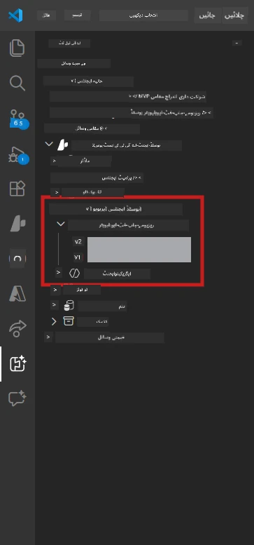

# ماڈیول 7 - پلے گراؤنڈ میں تصدیق کریں

⏱️ ~10 منٹ

اس ماڈیول میں، آپ VS کوڈ اور Foundry پورٹل میں اپنے تعینات کردہ کثیر ایجنٹ ورک فلو کا ٹیسٹ کرتے ہیں، اس بات کی تصدیق کرتے ہوئے کہ ایجنٹ مقامی ٹیسٹنگ کی طرح ہی کام کرتا ہے۔

---

## تعیناتی کے بعد دوبارہ ٹیسٹ کیوں کریں؟

ہوسٹ شدہ ماحول مقامی ماحول سے چند اہم طریقوں سے مختلف ہوتا ہے:

| | مقامی | ہوسٹ شدہ |
|--|-------|--------|
| **شناخت** | آپ کا ذاتی سائن ان (`DefaultAzureCredential`) | ہر ایجنٹ کے لیے وقف شدہ Entra شناخت (تعیناتی کے وقت خودکار فراہم کی گئی) |
| **اینڈپوائنٹ** | `http://localhost:8088/responses` | Foundry ایجنٹ سروس کا منظم کردہ یو آر ایل |
| **نیٹ ورک** | آپ کا کمپیوٹر → Azure OpenAI + MCP | Azure بیک بون (کم لیٹنسی) |

ایک غلط کنفیگرڈ env var، RBAC مسئلہ، یا بند MCP آؤٹ باؤنڈ کال یہاں پہلے ظاہر ہوگا۔

---

## آپشن A: VS کوڈ پلے گراؤنڈ میں ٹیسٹ کریں (پہلے منتخب کریں)

### مرحلہ 1: اپنے ہوسٹ شدہ ایجنٹ پر جائیں

1. Activity Bar میں **Foundry Toolkit** آئیکن پر کلک کریں۔
2. اپنے پروجیکٹ کو وسعت دیں → **Hosted Agents (Preview)** → اپنے ایجنٹ کو تلاش کریں۔



### مرحلہ 2: ایک ورژن منتخب کریں

1. ایجنٹ پر کلک کریں تاکہ اس کے ورژنز کھل جائیں۔
2. `v1` پر کلک کریں → اس بات کی تصدیق کریں کہ اس کی حالت **active** ہے (سائڈبار "Running" یا "Started" دکھا سکتا ہے - دونوں ایک ہی تیار حالت کی نشاندہی کرتے ہیں)۔

### مرحلہ 3: پلے گراؤنڈ کھولیں

1. **Playground** پر کلک کریں (یا ورژن پر رائٹ کلک کریں → **Open in Playground**)۔
2. ایک چیٹ ونڈو VS کوڈ کے ٹیب میں کھلتی ہے۔

### مرحلہ 4: اپنے سموک ٹیسٹ چلائیں

[Module 5](05-test-locally.md) سے وہی 3 ٹیسٹ استعمال کریں۔ ہر میسج کو پلے گراؤنڈ ان پٹ باکس میں ٹائپ کریں اور **Send** (یا **Enter**) دبائیں۔

#### ٹیسٹ 1 - مکمل ریزیومے + JD (معمول کا بہاؤ)

مکمل ریزیومے + JD پرامپٹ Module 5، ٹیسٹ 1 (جین ڈو + سینئر کلاؤڈ انجینئر، Contoso Ltd) سے پیسٹ کریں۔

**متوقع:**
- فٹ اسکور کے ساتھ تقسیم (100 پوائنٹ سکور)
- مطابقت پذیر مہارتیں سیکشن
- غائب مہارتیں سیکشن
- **ہر غائب مہارت کے لئے ایک گیپ کارڈ** مائیکروسافٹ لرن یو آر ایل کے ساتھ
- سیکھنے کا روڈ میپ اور ٹائم لائن

#### ٹیسٹ 2 - تیز مختصر ٹیسٹ (کم سے کم ان پٹ)

```
RESUME: 3 years Python developer, knows Django and PostgreSQL, no cloud experience.

JOB: Cloud DevOps Engineer requiring AWS, Kubernetes, Terraform, CI/CD. 5 years needed.
```

**متوقع:**
- کم فٹ اسکور (< 40)
- ایماندار جائزہ اور مرحلہ وار سیکھنے کا راستہ
- متعدد گیپ کارڈز (AWS، Kubernetes، Terraform، CI/CD، تجربے کا خلا)

#### ٹیسٹ 3 - ہائی فٹ امیدوار

```
RESUME:
10 years Azure Cloud Architect. AZ-305 certified. Expert in AKS, Terraform, Azure DevOps, 
Azure Functions, Helm, Prometheus, Grafana, Python, Go. Led platform team of 8.

JOB:
Senior Cloud Engineer. Required: AKS, Terraform, Azure DevOps, Python. Preferred: Helm, Go.
5+ years experience. AZ-305 preferred.
```

**متوقع:**
- اعلی فٹ اسکور (≥ 80)
- انٹرویو کی تیاری اور پالش پر توجہ
- چند یا کوئی گیپ کارڈز نہیں
- تیاری پر مرکوز مختصر ٹائم لائن

### مرحلہ 5: مقامی نتائج سے موازنہ کریں

آپ کے نوٹس یا براؤزر ٹیب کو کھولیں جہاں آپ نے Module 5 میں مقامی جوابات محفوظ کیے ہیں۔ ہر ٹیسٹ کے لیے:

- کیا جواب کی **ساخت** وہی ہے (فٹ اسکور، گیپ کارڈز، روڈ میپ)؟
- کیا یہ **وہی اسکورنگ ربریک** استعمال کرتا ہے (100 پوائنٹ تقسیم)؟
- کیا **مائیکروسافٹ لرن یو آر ایل** ابھی بھی گیپ کارڈز میں ہیں؟
- کیا ہر غائب مہارت کے لئے **ایک گیپ کارڈ** ہے (کٹا ہوا نہیں)؟

> **چھوٹے الفاظ کے فرق معمول ہیں** - ماڈل غیر متعین ہے۔ ساخت، اسکورنگ کی مستقل مزاجی، اور MCP ٹول کے استعمال پر توجہ دیں۔

---

## آپشن B: Foundry پورٹل میں ٹیسٹ کریں

[Foundry پورٹل](https://ai.azure.com) ایک ویب بیسڈ پلے گراؤنڈ فراہم کرتا ہے جو ٹیم ممبرز یا شراکت داروں کے ساتھ شیئرنگ کے لیے مفید ہے۔

### مرحلہ 1: Foundry پورٹل کھولیں

1. اپنا براؤزر کھولیں اور جائیں [https://ai.azure.com](https://ai.azure.com)۔
2. اسی Azure اکاؤنٹ سے سائن ان کریں جو آپ نے ورکشاپ میں استعمال کیا ہے۔

### مرحلہ 2: اپنے پروجیکٹ پر جائیں

1. ہوم پیج پر، بائیں سائڈبار میں **Recent projects** تلاش کریں۔
2. اپنے پروجیکٹ کے نام پر کلک کریں (مثلاً `workshop-agents`)۔
3. اگر نہیں ملتا، تو **All projects** پر کلک کریں اور تلاش کریں۔

### مرحلہ 3: اپنا تعینات شدہ ایجنٹ تلاش کریں

1. پروجیکٹ کے بائیں نیویگیشن میں، **Build** → **Agents** پر کلک کریں (یا **Agents** سیکشن تلاش کریں)۔
2. آپ کو ایجنٹس کی فہرست نظر آئے گی۔ اپنا تعینات شدہ ایجنٹ تلاش کریں (مثلاً `resume-job-fit-evaluator`)۔
3. ایجنٹ کے نام پر کلک کریں تاکہ اس کا تفصیلی صفحہ کھلے۔

### مرحلہ 4: پلے گراؤنڈ کھولیں

1. ایجنٹ کے تفصیلی صفحے پر، اوپر ٹول بار دیکھیں۔
2. **Open in playground** (یا **Try in playground**) پر کلک کریں۔
3. چیٹ انٹرفیس کھلتا ہے۔

### مرحلہ 5: وہی سموک ٹیسٹ چلائیں

VS کوڈ پلے گراؤنڈ سیکشن سے تمام 3 ٹیسٹ دہرائیں۔ ہر جواب کا موازنہ مقامی نتائج (Module 5) اور VS کوڈ پلے گراؤنڈ نتائج (اوپر آپشن A) سے کریں۔

---

## کثیر-ایجنٹ مخصوص تصدیق

بنیادی درستگی سے آگے، ان مخصوص کثیر-ایجنٹ رویوں کی تصدیق کریں:

### MCP ٹول کا نفاذ

| چیک کریں | تصدیق کا طریقہ | پاس شرط |
|-------|---------------|----------------|
| MCP کالز کامیاب | گیپ کارڈز میں `learn.microsoft.com` یو آر ایل موجود ہیں | اصلی یو آر ایل، فیل بیک میسجز نہیں |
| متعدد MCP کالز | ہر اعلیٰ/درمیانی ترجیح کے گیپ میں وسائل ہیں | صرف پہلا گیپ کارڈ نہیں |
| MCP فیل بیک کام کرتا ہے | اگر یو آر ایل غائب ہیں تو فیل بیک ٹیکسٹ چیک کریں | ایجنٹ پھر بھی گیپ کارڈز تیار کرتا ہے (یو آر ایل کے ساتھ یا بغیر) |

### ایجنٹ کوآرڈینیشن

| چیک کریں | تصدیق کا طریقہ | پاس شرط |
|-------|---------------|----------------|
| تمام 4 ایجنٹس چل چکے ہیں | آوٹ پٹ میں فٹ اسکور اور گیپ کارڈز دونوں شامل ہیں | اسکور MatchingAgent سے، کارڈز GapAnalyzer سے |
| ترتیب وار نفاذ | جواب کا وقت معقول ہے (< 2 منٹ) | اگر > 3 منٹ، تو ٹرمینل لاگ میں غلطیاں چیک کریں |
| ڈیٹا فلو کی سالمیت | گیپ کارڈز میں اسکلز کی حوالہ جات میچنگ رپورٹ سے ہیں | کوئی فرضی مہارت نہیں جو JD میں نہ ہو |

---

## تصدیقی ربریک

اپنے کثیر-ایجنٹ ورک فلو کے ہوسٹ شدہ رویے کا جائزہ لینے کے لیے اس ربریک کا استعمال کریں:

| # | معیار | پاس شرط | پاس؟ |
|---|----------|---------------|-------|
| 1 | **فنکشنل درستگی** | ایجنٹ ریزیومے + JD کا جواب فٹ اسکور اور گیپ تجزیے کے ساتھ دیتا ہے | |
| 2 | **اسکورنگ کی مستقل مزاجی** | فٹ اسکور 100 پوائنٹ اسکیل اور تقسیم کے ساتھ استعمال کرتا ہے | |
| 3 | **گیپ کارڈ کی مکملتا** | ہر غائب مہارت کے لیے ایک کارڈ (کٹا ہوا یا ملایا ہوا نہیں) | |
| 4 | **MCP ٹول انٹیگریشن** | گیپ کارڈز میں حقیقی Microsoft Learn URL شامل ہیں | |
| 5 | **ساختی مستقل مزاجی** | آؤٹ پٹ کی ساخت مقامی اور ہوسٹ شدہ رنز کے درمیان مماثل ہے | |
| 6 | **جواب دینے کا وقت** | ہوسٹ شدہ ایجنٹ مکمل جائزے کے لیے 2 منٹ کے اندر جواب دیتا ہے | |
| 7 | **کوئی غلطی نہیں** | کوئی HTTP 500 ایرر، ٹائم آؤٹ، یا خالی جواب نہیں | |

> "پاس" کا مطلب ہے کہ تمام 7 معیار کم از کم ایک پلے گراؤنڈ (VS کوڈ یا پورٹل) پر تمام 3 سموک ٹیسٹ کے لیے پورے ہوتے ہیں۔

---

## پلے گراؤنڈ مسائل کی خرابی نجامی

| علامات | ممکنہ وجہ | حل |
|---------|-------------|-----|
| پلے گراؤنڈ لوڈ نہیں ہوتا | کنٹینر `active` حالت میں نہیں | واپس جائیں [Module 6](06-deploy-to-foundry.md)، تعیناتی کی حالت کی تصدیق کریں۔ اگر `creating` ہے تو انتظار کریں |
| ایجنٹ خالی جواب دیتا ہے | ماڈل تعیناتی کا نام میل نہیں کھاتا | چیک کریں `agent.yaml` → `environment_variables` → `AZURE_AI_MODEL_DEPLOYMENT_NAME` آپ کے تعینات شدہ ماڈل سے میل کھاتا ہے |
| ایجنٹ خرابی کا پیغام دیتا ہے | [RBAC](https://learn.microsoft.com/azure/foundry/concepts/rbac-foundry) پرمیشن غائب | پروجیکٹ دائرہ کار پر **[Foundry User](https://aka.ms/foundry-ext-project-role)** (پہلے Azure AI User) تفویض کریں |
| گیپ کارڈز میں Microsoft Learn URL نہیں | MCP آؤٹ باؤنڈ بلاک یا MCP سرور دستیاب نہیں | چیک کریں کہ کنٹینر `learn.microsoft.com` تک پہنچ سکتا ہے۔ دیکھیں [Module 8](08-troubleshooting.md) |
| صرف 1 گیپ کارڈ (کٹا ہوا) | GapAnalyzer کی ہدایات میں "CRITICAL" بلاک غائب ہے | ازسر نو ملاحظہ کریں [Module 3, Step 2.4](03-configure-agents.md) |
| فٹ اسکور مقامی سے بہت مختلف ہے | مختلف ماڈل یا ہدایات تعینات کی گئی ہیں | `agent.yaml` env vars کا موازنہ مقامی `.env` کے ساتھ کریں۔ ضرورت ہو تو دوبارہ تعینات کریں |
| پورٹل میں "Agent not found" | تعیناتی ابھی تک مکمل نہیں ہوئی یا ناکام ہوئی | 2 منٹ انتظار کریں، ریفریش کریں۔ اگر پھر بھی نہیں ملا تو [Module 6](06-deploy-to-foundry.md) سے دوبارہ تعینات کریں |

---

### چیک پوائنٹ

- [ ] VS کوڈ پلے گراؤنڈ میں ایجنٹ کا ٹیسٹ کیا - تمام 3 سموک ٹیسٹ پاس ہوئے
- [ ] [Foundry پورٹل](https://ai.azure.com) پلے گراؤنڈ میں ایجنٹ کا ٹیسٹ کیا - تمام 3 سموک ٹیسٹ پاس ہوئے
- [ ] جوابات ساختی طور پر مقامی ٹیسٹنگ کے ساتھ مطابقت رکھتے ہیں (فٹ اسکور، گیپ کارڈز، روڈ میپ)
- [ ] گیپ کارڈز میں Microsoft Learn URL موجود ہیں (MCP ٹول ہوسٹ شدہ ماحول میں کام کر رہا ہے)
- [ ] ہر غائب مہارت کے لیے ایک گیپ کارڈ (کوئی کٹوتی نہیں)
- [ ] ٹیسٹنگ کے دوران کوئی غلطی یا ٹائم آؤٹ نہیں ہوئے
- [ ] تصدیقی ربریک مکمل کی (تمام 7 معیار پاس)

---

**پچھلا:** [06 - Deploy to Foundry](06-deploy-to-foundry.md) · **اگلا:** [08 - Troubleshooting →](08-troubleshooting.md)

---

<!-- CO-OP TRANSLATOR DISCLAIMER START -->
**ڈس کلیمر**:
یہ دستاویز AI ترجمہ سروس [Co-op Translator](https://github.com/Azure/co-op-translator) کے ذریعے ترجمہ کی گئی ہے۔ جبکہ ہم درستگی کے لیے کوشاں ہیں، براہ کرم اس بات سے آگاہ رہیں کہ خودکار ترجمے میں غلطیاں یا عدم درستیاں ہو سکتی ہیں۔ اصل دستاویز اپنے مادری زبان میں مستند ماخذ سمجھی جائے گی۔ حساس معلومات کے لیے پیشہ ور انسانی ترجمہ کی سفارش کی جاتی ہے۔ اس ترجمے کے استعمال سے پیدا ہونے والی کسی بھی غلط فہمی یا غلط تشریح کی ذمہ داری ہم قبول نہیں کرتے۔
<!-- CO-OP TRANSLATOR DISCLAIMER END -->