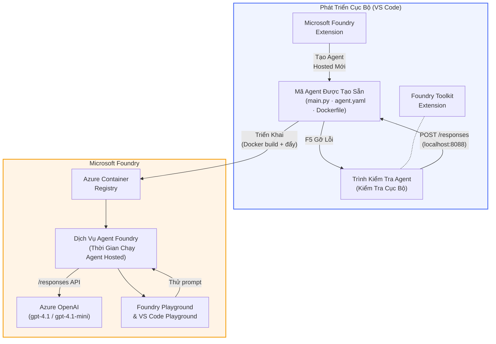

# Foundry Toolkit + Hội thảo Tác vụ Hosted Agents của Foundry

[](https://www.python.org/)
[](https://github.com/microsoft/agents)
[](https://learn.microsoft.com/azure/ai-foundry/agents/concepts/hosted-agents/)
[](https://ai.azure.com/)
[](https://learn.microsoft.com/azure/ai-services/openai/)
[](https://learn.microsoft.com/cli/azure/install-azure-cli)
[](https://learn.microsoft.com/azure/developer/azure-developer-cli/install-azd)
[](https://www.docker.com/)
[](https://marketplace.visualstudio.com/items?itemName=ms-windows-ai-studio.windows-ai-studio)
[](LICENSE)

Xây dựng, kiểm thử và triển khai các đại lý AI lên **Microsoft Foundry Agent Service** như các **Hosted Agents** - hoàn toàn từ VS Code sử dụng **phần mở rộng Microsoft Foundry** và **Foundry Toolkit**.

> **Hosted Agents hiện đang ở bản xem trước.** Các vùng hỗ trợ còn hạn chế - xem [khu vực khả dụng](https://learn.microsoft.com/azure/foundry/agents/concepts/hosted-agents#region-availability).

> Thư mục `agent/` bên trong mỗi bài thực hành được **tự động tạo cấu trúc** bởi phần mở rộng Foundry - bạn sau đó tùy chỉnh mã, kiểm thử cục bộ và triển khai.

<!-- CO-OP TRANSLATOR LANGUAGES TABLE START -->
[Arabic](../ar/README.md) | [Bengali](../bn/README.md) | [Bulgarian](../bg/README.md) | [Burmese (Myanmar)](../my/README.md) | [Chinese (Simplified)](../zh-CN/README.md) | [Chinese (Traditional, Hong Kong)](../zh-HK/README.md) | [Chinese (Traditional, Macau)](../zh-MO/README.md) | [Chinese (Traditional, Taiwan)](../zh-TW/README.md) | [Croatian](../hr/README.md) | [Czech](../cs/README.md) | [Danish](../da/README.md) | [Dutch](../nl/README.md) | [Estonian](../et/README.md) | [Finnish](../fi/README.md) | [French](../fr/README.md) | [German](../de/README.md) | [Greek](../el/README.md) | [Hebrew](../he/README.md) | [Hindi](../hi/README.md) | [Hungarian](../hu/README.md) | [Indonesian](../id/README.md) | [Italian](../it/README.md) | [Japanese](../ja/README.md) | [Kannada](../kn/README.md) | [Khmer](../km/README.md) | [Korean](../ko/README.md) | [Lithuanian](../lt/README.md) | [Malay](../ms/README.md) | [Malayalam](../ml/README.md) | [Marathi](../mr/README.md) | [Nepali](../ne/README.md) | [Nigerian Pidgin](../pcm/README.md) | [Norwegian](../no/README.md) | [Persian (Farsi)](../fa/README.md) | [Polish](../pl/README.md) | [Portuguese (Brazil)](../pt-BR/README.md) | [Portuguese (Portugal)](../pt-PT/README.md) | [Punjabi (Gurmukhi)](../pa/README.md) | [Romanian](../ro/README.md) | [Russian](../ru/README.md) | [Serbian (Cyrillic)](../sr/README.md) | [Slovak](../sk/README.md) | [Slovenian](../sl/README.md) | [Spanish](../es/README.md) | [Swahili](../sw/README.md) | [Swedish](../sv/README.md) | [Tagalog (Filipino)](../tl/README.md) | [Tamil](../ta/README.md) | [Telugu](../te/README.md) | [Thai](../th/README.md) | [Turkish](../tr/README.md) | [Ukrainian](../uk/README.md) | [Urdu](../ur/README.md) | [Vietnamese](./README.md)

> **Ưu tiên clone về máy?**
>
> Kho lưu trữ này bao gồm hơn 50 bản dịch ngôn ngữ làm tăng đáng kể dung lượng tải về. Để clone mà không có bản dịch, hãy dùng sparse checkout:
>
> **Bash / macOS / Linux:**
> ```bash
> git clone --filter=blob:none --sparse https://github.com/microsoft-foundry/Foundry_Toolkit_for_VSCode_Lab.git
> cd Foundry_Toolkit_for_VSCode_Lab
> git sparse-checkout set --no-cone '/*' '!translations' '!translated_images'
> ```
>
> **CMD (Windows):**
> ```cmd
> git clone --filter=blob:none --sparse https://github.com/microsoft-foundry/Foundry_Toolkit_for_VSCode_Lab.git
> cd Foundry_Toolkit_for_VSCode_Lab
> git sparse-checkout set --no-cone "/*" "!translations" "!translated_images"
> ```
>
> Điều này cung cấp cho bạn mọi thứ cần thiết để hoàn thành khóa học với tốc độ tải xuống nhanh hơn nhiều.
<!-- CO-OP TRANSLATOR LANGUAGES TABLE END -->

---

## Kiến trúc


**Luồng:** Phần mở rộng Foundry tạo khung đại lý → bạn tùy chỉnh mã & chỉ dẫn → kiểm tra cục bộ với Agent Inspector → triển khai lên Foundry (ảnh Docker được đẩy lên ACR) → xác minh trong Playground.

---

## Bạn sẽ xây dựng gì

| Bài thực hành | Mô tả | Trạng thái |
|-----|-------------|--------|
| **Bài thực hành 01 - Đại lý đơn** | Xây dựng đại lý **"Giải thích như tôi là một Giám đốc điều hành"**, thử nghiệm cục bộ và triển khai lên Foundry | ✅ Có sẵn |
| **Bài thực hành 02 - Quy trình đa đại lý** | Xây dựng **"Đánh giá hồ sơ ứng viên → Phù hợp công việc"** - 4 đại lý phối hợp chấm điểm phù hợp và tạo lộ trình học tập | ✅ Có sẵn |

---

## Gặp gỡ Đại lý Giám đốc điều hành

Trong hội thảo này bạn sẽ xây dựng đại lý **"Giải thích như tôi là một Giám đốc điều hành"** - một đại lý AI nhận các thuật ngữ kỹ thuật phức tạp và chuyển thành tóm tắt dễ hiểu, phù hợp cho hội đồng quản trị. Vì phải thành thật là, không ai trong ban giám đốc muốn nghe về "cạn kiệt thread pool do các cuộc gọi đồng bộ được giới thiệu trong v3.2."

Tôi xây dựng đại lý này sau quá nhiều lần sự cố khi báo cáo của tôi được đáp lại bằng câu: *"Vậy... có phải website bị sập không?"*

### Cách nó hoạt động

Bạn cung cấp cho nó bản cập nhật kỹ thuật. Nó trả về bản tóm tắt giám đốc - ba gạch đầu dòng, không có thuật ngữ, không có dấu vết ngăn xếp, không gây sợ hãi. Chỉ là **việc gì đã xảy ra**, **tác động kinh doanh**, và **bước tiếp theo**.

### Xem nó hoạt động

**Bạn nói:**
> "Độ trễ API tăng do cạn kiệt thread pool gây ra bởi các lần gọi đồng bộ được giới thiệu trong v3.2."

**Đại lý trả lời:**

> **Tóm tắt cho Giám đốc:**
> - **Việc gì đã xảy ra:** Sau lần phát hành mới nhất, hệ thống bị chậm lại.
> - **Tác động kinh doanh:** Một số người dùng gặp phải độ trễ khi sử dụng dịch vụ.
> - **Bước tiếp theo:** Thay đổi đã được hoàn tác và bản sửa lỗi đang được chuẩn bị trước khi triển khai lại.

### Tại sao đại lý này?

Nó là một đại lý rất đơn giản, chuyên một chức năng duy nhất - hoàn hảo để học quy trình đại lý hosted từ đầu đến cuối mà không bị rối trong chuỗi công cụ phức tạp. Và thật lòng mà nói? Mỗi đội kỹ thuật đều có thể dùng một đại lý như thế này.

---

## Cấu trúc hội thảo

```
📂 Foundry_Toolkit_for_VSCode_Lab/
├── 📄 README.md                      ← You are here
├── 📂 ExecutiveAgent/                ← Standalone hosted agent project
│   ├── agent.yaml
│   ├── Dockerfile
│   ├── main.py
│   └── requirements.txt
└── 📂 workshop/
    ├── 📂 lab01-single-agent/        ← Full lab: docs + agent code
    │   ├── README.md                 ← Hands-on lab instructions
    │   ├── 📂 docs/                  ← Step-by-step tutorial modules
    │   │   ├── 00-prerequisites.md
    │   │   ├── 01-install-foundry-toolkit.md
    │   │   ├── 02-create-foundry-project.md
    │   │   ├── 03-create-hosted-agent.md
    │   │   ├── 04-configure-and-code.md
    │   │   ├── 05-test-locally.md
    │   │   ├── 06-deploy-to-foundry.md
    │   │   ├── 07-verify-in-playground.md
    │   │   └── 08-troubleshooting.md
    │   └── 📂 agent/                 ← Reference solution (auto-scaffolded by Foundry extension)
    │       ├── agent.yaml
    │       ├── Dockerfile
    │       ├── main.py
    │       └── requirements.txt
    └── 📂 lab02-multi-agent/         ← Resume → Job Fit Evaluator
        ├── README.md                 ← Hands-on lab instructions (end-to-end)
        ├── 📂 docs/                  ← Step-by-step tutorial modules
        │   ├── 00-prerequisites.md
        │   ├── 01-understand-multi-agent.md
        │   ├── 02-scaffold-multi-agent.md
        │   ├── 03-configure-agents.md
        │   ├── 04-orchestration-patterns.md
        │   ├── 05-test-locally.md
        │   ├── 06-deploy-to-foundry.md
        │   ├── 07-verify-in-playground.md
        │   └── 08-troubleshooting.md
        └── 📂 PersonalCareerCopilot/ ← Reference solution (multi-agent workflow)
            ├── agent.yaml
            ├── Dockerfile
            ├── main.py
            └── requirements.txt
```

> **Lưu ý:** Thư mục `agent/` bên trong mỗi bài là thứ phần **mở rộng Microsoft Foundry** tạo ra khi bạn chạy lệnh `Microsoft Foundry: Create a New Hosted Agent` từ Command Palette. Các tập tin sau đó được tùy chỉnh với hướng dẫn, công cụ và cấu hình đại lý của bạn. Bài 01 sẽ hướng dẫn bạn tạo lại từ đầu.

---

## Bắt đầu

### 1. Clone kho lưu trữ

```bash
git clone https://github.com/microsoft-foundry/Foundry_Toolkit_for_VSCode_Lab.git
cd Foundry_Toolkit_for_VSCode_Lab
```

### 2. Thiết lập môi trường ảo Python

```bash
python -m venv venv
```

Kích hoạt nó:

- **Windows (PowerShell):**
  ```powershell
  .\venv\Scripts\Activate.ps1
  ```
- **macOS / Linux:**
  ```bash
  source venv/bin/activate
  ```

### 3. Cài đặt các phụ thuộc

```bash
pip install -r workshop/lab01-single-agent/agent/requirements.txt
```

### 4. Cấu hình biến môi trường

Sao chép file `.env` mẫu trong thư mục agent và điền giá trị của bạn:

```bash
cp workshop/lab01-single-agent/agent/.env.example workshop/lab01-single-agent/agent/.env
```

Chỉnh sửa `workshop/lab01-single-agent/agent/.env`:

```env
AZURE_AI_PROJECT_ENDPOINT=https://<your-account>.services.ai.azure.com/api/projects/<your-project>
MODEL_DEPLOYMENT_NAME=<your-model-deployment-name>
```

### 5. Theo dõi các bài thực hành

Mỗi bài có nội dung tự chứa với các module riêng. Bắt đầu với **Bài thực hành 01** để học cơ bản, sau đó chuyển sang **Bài thực hành 02** cho quy trình đa đại lý.

#### Bài 01 - Đại lý đơn ([hướng dẫn đầy đủ](workshop/lab01-single-agent/README.md))

| # | Module | Liên kết |
|---|--------|------|
| 1 | Đọc các yêu cầu tiên quyết | [00-prerequisites.md](workshop/lab01-single-agent/docs/00-prerequisites.md) |
| 2 | Cài Foundry Toolkit & phần mở rộng Foundry | [01-install-foundry-toolkit.md](workshop/lab01-single-agent/docs/01-install-foundry-toolkit.md) |
| 3 | Tạo dự án Foundry | [02-create-foundry-project.md](workshop/lab01-single-agent/docs/02-create-foundry-project.md) |
| 4 | Tạo đại lý hosted | [03-create-hosted-agent.md](workshop/lab01-single-agent/docs/03-create-hosted-agent.md) |
| 5 | Cấu hình hướng dẫn & môi trường | [04-configure-and-code.md](workshop/lab01-single-agent/docs/04-configure-and-code.md) |
| 6 | Kiểm thử cục bộ | [05-test-locally.md](workshop/lab01-single-agent/docs/05-test-locally.md) |
| 7 | Triển khai lên Foundry | [06-deploy-to-foundry.md](workshop/lab01-single-agent/docs/06-deploy-to-foundry.md) |
| 8 | Xác minh trong sân chơi | [07-verify-in-playground.md](workshop/lab01-single-agent/docs/07-verify-in-playground.md) |
| 9 | Khắc phục sự cố | [08-troubleshooting.md](workshop/lab01-single-agent/docs/08-troubleshooting.md) |

#### Bài 02 - Quy trình đa đại lý ([hướng dẫn đầy đủ](workshop/lab02-multi-agent/README.md))

| # | Module | Liên kết |
|---|--------|------|
| 1 | Yêu cầu tiên quyết (Bài 02) | [00-prerequisites.md](workshop/lab02-multi-agent/docs/00-prerequisites.md) |
| 2 | Hiểu kiến trúc đa đại lý | [01-understand-multi-agent.md](workshop/lab02-multi-agent/docs/01-understand-multi-agent.md) |
| 3 | Tạo khung dự án đa đại lý | [02-scaffold-multi-agent.md](workshop/lab02-multi-agent/docs/02-scaffold-multi-agent.md) |
| 4 | Cấu hình đại lý & môi trường | [03-configure-agents.md](workshop/lab02-multi-agent/docs/03-configure-agents.md) |
| 5 | Mô hình điều phối | [04-orchestration-patterns.md](workshop/lab02-multi-agent/docs/04-orchestration-patterns.md) |
| 6 | Kiểm thử cục bộ (đa đại lý) | [05-test-locally.md](workshop/lab02-multi-agent/docs/05-test-locally.md) |
| 7 | Triển khai lên Foundry | [06-deploy-to-foundry.md](workshop/lab02-multi-agent/docs/06-deploy-to-foundry.md) |
| 8 | Xác minh trong sân chơi | [07-verify-in-playground.md](workshop/lab02-multi-agent/docs/07-verify-in-playground.md) |
| 9 | Khắc phục sự cố (đa tác nhân) | [08-troubleshooting.md](workshop/lab02-multi-agent/docs/08-troubleshooting.md) |

---

## Người duy trì

<table>
<tr>
    <td align="center"><a href="https://github.com/ShivamGoyal03">
        <br />
        <sub><b>Shivam Goyal</b></sub>
    </a><br />
    </td>
</tr>
</table>

---

## Quyền cần thiết (tham khảo nhanh)

| Kịch bản | Vai trò cần thiết |
|----------|------------------|
| Tạo dự án Foundry mới | **Azure AI Owner** trên tài nguyên Foundry |
| Triển khai lên dự án hiện tại (tài nguyên mới) | **Azure AI Owner** + **Contributor** trên đăng ký |
| Triển khai lên dự án đã cấu hình đầy đủ | **Reader** trên tài khoản + **Azure AI User** trên dự án |

> **Quan trọng:** Các vai trò Azure `Owner` và `Contributor` chỉ bao gồm quyền *quản lý*, không bao gồm quyền *phát triển* (hành động dữ liệu). Bạn cần **Azure AI User** hoặc **Azure AI Owner** để xây dựng và triển khai các tác nhân.

---

## Tham khảo

- [Bắt đầu nhanh: Triển khai tác nhân lưu trữ đầu tiên của bạn (VS Code)](https://learn.microsoft.com/azure/foundry/agents/quickstarts/quickstart-hosted-agent)
- [Tác nhân lưu trữ là gì?](https://learn.microsoft.com/azure/foundry/agents/concepts/hosted-agents)
- [Tạo quy trình tác nhân lưu trữ trong VS Code](https://learn.microsoft.com/azure/foundry/agents/how-to/vs-code-agents-workflow-pro-code)
- [Triển khai tác nhân lưu trữ](https://learn.microsoft.com/azure/foundry/agents/how-to/deploy-hosted-agent)
- [RBAC cho Microsoft Foundry](https://learn.microsoft.com/azure/foundry/concepts/rbac-foundry)
- [Mẫu Tác nhân Đánh giá Kiến trúc](https://github.com/Azure-Samples/agent-architecture-review-sample) - Tác nhân lưu trữ thực tế với công cụ MCP, sơ đồ Excalidraw và triển khai kép

---

## Giấy phép

[MIT](../../LICENSE)

---

<!-- CO-OP TRANSLATOR DISCLAIMER START -->
**Tuyên bố từ chối trách nhiệm**:  
Tài liệu này đã được dịch bằng dịch vụ dịch thuật AI [Co-op Translator](https://github.com/Azure/co-op-translator). Mặc dù chúng tôi cố gắng đảm bảo độ chính xác, xin lưu ý rằng các bản dịch tự động có thể chứa lỗi hoặc sự không chính xác. Tài liệu gốc bằng ngôn ngữ mẹ đẻ nên được coi là nguồn tham khảo chính xác nhất. Đối với các thông tin quan trọng, nên sử dụng dịch vụ dịch thuật chuyên nghiệp do con người thực hiện. Chúng tôi không chịu trách nhiệm về bất kỳ sự hiểu lầm hoặc giải thích sai nào phát sinh từ việc sử dụng bản dịch này.
<!-- CO-OP TRANSLATOR DISCLAIMER END -->