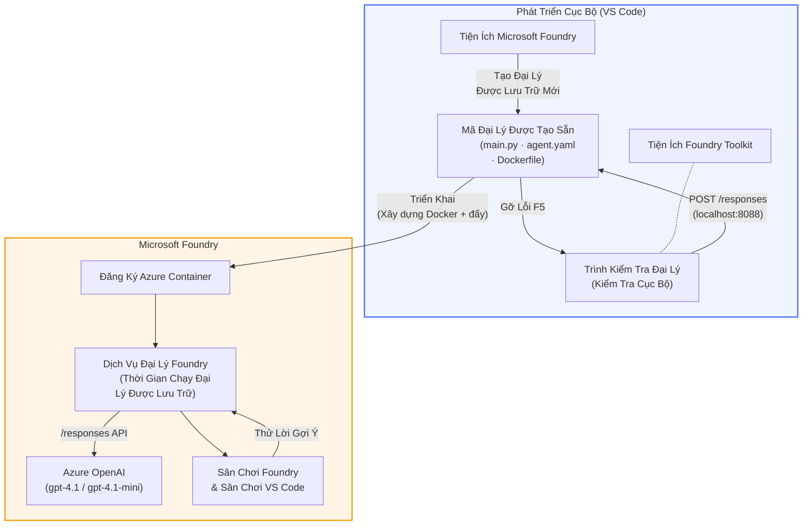

# Bộ công cụ Foundry + Hội thảo Tác nhân Lưu trữ Foundry

[](https://www.python.org/)
[](https://github.com/microsoft/agents)
[](https://learn.microsoft.com/azure/ai-foundry/agents/concepts/hosted-agents/)
[](https://ai.azure.com/)
[](https://learn.microsoft.com/azure/ai-services/openai/)
[](https://learn.microsoft.com/cli/azure/install-azure-cli)
[](https://learn.microsoft.com/azure/developer/azure-developer-cli/install-azd)
[](https://www.docker.com/)
[](https://marketplace.visualstudio.com/items?itemName=ms-windows-ai-studio.windows-ai-studio)
[](LICENSE)

Xây dựng, kiểm tra và triển khai các tác nhân AI tới **Dịch vụ Tác nhân Microsoft Foundry** như **Các Tác nhân Lưu trữ** - hoàn toàn từ VS Code sử dụng **tiện ích mở rộng Microsoft Foundry** và **Bộ công cụ Foundry**.

> **Các Tác nhân Lưu trữ hiện đang trong giai đoạn xem trước.** Các khu vực hỗ trợ còn hạn chế - xem [khả năng sẵn có theo khu vực](https://learn.microsoft.com/azure/foundry/agents/concepts/hosted-agents#region-availability).

> Thư mục `agent/` bên trong mỗi bài lab được **tự động tạo khung** bởi tiện ích mở rộng Foundry - bạn sau đó tùy chỉnh mã, kiểm tra cục bộ và triển khai.

### 🌐 Hỗ trợ đa ngôn ngữ

#### Hỗ trợ qua GitHub Action (Tự động & Luôn Cập nhật)

<!-- CO-OP TRANSLATOR LANGUAGES TABLE START -->
[Tiếng Ả Rập](../ar/README.md) | [Tiếng Bengali](../bn/README.md) | [Tiếng Bulgaria](../bg/README.md) | [Tiếng Miến Điện (Myanmar)](../my/README.md) | [Tiếng Trung (Giản thể)](../zh-CN/README.md) | [Tiếng Trung (Phồn thể, Hồng Kông)](../zh-HK/README.md) | [Tiếng Trung (Phồn thể, Ma Cao)](../zh-MO/README.md) | [Tiếng Trung (Phồn thể, Đài Loan)](../zh-TW/README.md) | [Tiếng Croatia](../hr/README.md) | [Tiếng Séc](../cs/README.md) | [Tiếng Đan Mạch](../da/README.md) | [Tiếng Hà Lan](../nl/README.md) | [Tiếng Estonia](../et/README.md) | [Tiếng Phần Lan](../fi/README.md) | [Tiếng Pháp](../fr/README.md) | [Tiếng Đức](../de/README.md) | [Tiếng Hy Lạp](../el/README.md) | [Tiếng Hebrew](../he/README.md) | [Tiếng Hindi](../hi/README.md) | [Tiếng Hungary](../hu/README.md) | [Tiếng Indonesia](../id/README.md) | [Tiếng Ý](../it/README.md) | [Tiếng Nhật](../ja/README.md) | [Tiếng Kannada](../kn/README.md) | [Tiếng Khmer](../km/README.md) | [Tiếng Hàn](../ko/README.md) | [Tiếng Litva](../lt/README.md) | [Tiếng Malay](../ms/README.md) | [Tiếng Malayalam](../ml/README.md) | [Tiếng Marathi](../mr/README.md) | [Tiếng Nepal](../ne/README.md) | [Tiếng Pidgin Nigeria](../pcm/README.md) | [Tiếng Na Uy](../no/README.md) | [Tiếng Ba Tư (Farsi)](../fa/README.md) | [Tiếng Ba Lan](../pl/README.md) | [Tiếng Bồ Đào Nha (Brazil)](../pt-BR/README.md) | [Tiếng Bồ Đào Nha (Bồ Đào Nha)](../pt-PT/README.md) | [Tiếng Punjabi (Gurmukhi)](../pa/README.md) | [Tiếng Romania](../ro/README.md) | [Tiếng Nga](../ru/README.md) | [Tiếng Serbia (Chữ Kirin)](../sr/README.md) | [Tiếng Slovakia](../sk/README.md) | [Tiếng Slovenia](../sl/README.md) | [Tiếng Tây Ban Nha](../es/README.md) | [Tiếng Swahili](../sw/README.md) | [Tiếng Thụy Điển](../sv/README.md) | [Tiếng Tagalog (Filipino)](../tl/README.md) | [Tiếng Tamil](../ta/README.md) | [Tiếng Telugu](../te/README.md) | [Tiếng Thái](../th/README.md) | [Tiếng Thổ Nhĩ Kỳ](../tr/README.md) | [Tiếng Ukraina](../uk/README.md) | [Tiếng Urdu](../ur/README.md) | [Tiếng Việt](./README.md)

> **Ưu tiên sao chép về máy?**
>
> Kho lưu trữ này bao gồm hơn 50 bản dịch ngôn ngữ, làm tăng đáng kể kích thước tải xuống. Để sao chép mà không có bản dịch, hãy dùng sparse checkout:
>
> **Bash / macOS / Linux:**
> ```bash
> git clone --filter=blob:none --sparse https://github.com/microsoft-foundry/Foundry_Toolkit_for_VSCode_Lab.git
> cd Foundry_Toolkit_for_VSCode_Lab
> git sparse-checkout set --no-cone '/*' '!translations' '!translated_images'
> ```
>
> **CMD (Windows):**
> ```cmd
> git clone --filter=blob:none --sparse https://github.com/microsoft-foundry/Foundry_Toolkit_for_VSCode_Lab.git
> cd Foundry_Toolkit_for_VSCode_Lab
> git sparse-checkout set --no-cone "/*" "!translations" "!translated_images"
> ```
>
> Điều này cung cấp cho bạn tất cả những gì cần để hoàn thành khóa học với tốc độ tải về nhanh hơn nhiều.
<!-- CO-OP TRANSLATOR LANGUAGES TABLE END -->

---

## Kiến trúc


**Luồng:** Tiện ích mở rộng Foundry tạo khung tác nhân → bạn tùy chỉnh mã & hướng dẫn → kiểm tra cục bộ với Agent Inspector → triển khai lên Foundry (hình ảnh Docker được đẩy lên ACR) → xác minh trong Playground.

---

## Bạn sẽ xây dựng gì

| Lab | Mô tả | Trạng thái |
|-----|-------------|--------|
| **Lab 01 - Tác nhân đơn** | Xây dựng **Tác nhân "Giải thích như tôi là một Giám đốc điều hành"**, kiểm tra cục bộ và triển khai lên Foundry | ✅ Có sẵn |
| **Lab 02 - Quy trình làm việc đa tác nhân** | Xây dựng **"Đánh giá Sơ yếu lý lịch → phù hợp công việc"** - 4 tác nhân phối hợp để đánh giá độ phù hợp của sơ yếu lý lịch và tạo lộ trình học tập | ✅ Có sẵn |

---

## Gặp gỡ Tác nhân Giám đốc điều hành

Trong hội thảo này bạn sẽ xây dựng **Tác nhân "Giải thích như tôi là một Giám đốc điều hành"** - một tác nhân AI giúp dịch những thuật ngữ kỹ thuật rắc rối thành các bản tóm tắt bình tĩnh, sẵn sàng trình bày ở phòng họp. Bởi vì thành thật mà nói, không ai trong ban giám đốc muốn nghe về "cạn kiệt thread pool do các cuộc gọi đồng bộ được giới thiệu trong bản v3.2."

Tôi xây dựng tác nhân này sau quá nhiều lần sự cố mà bài viết hậu sự hoàn hảo của tôi nhận được phản hồi: *"Vậy... website có bị lỗi hay không?"*

### Cách thức hoạt động

Bạn cung cấp một bản cập nhật kỹ thuật. Tác nhân sẽ trả lại một bản tóm tắt dành cho giám đốc - ba điểm chính, không biệt ngữ, không tracing, không gây lo lắng. Chỉ có **điều gì đã xảy ra**, **ảnh hưởng kinh doanh**, và **bước tiếp theo**.

### Xem nó hoạt động

**Bạn nói:**
> "Độ trễ API tăng do cạn kiệt thread pool gây ra bởi các cuộc gọi đồng bộ được giới thiệu trong v3.2."

**Tác nhân trả lời:**

> **Tóm tắt Giám đốc:**
> - **Điều gì đã xảy ra:** Sau bản phát hành mới nhất, hệ thống bị chậm lại.
> - **Ảnh hưởng kinh doanh:** Một số người dùng gặp trễ khi sử dụng dịch vụ.
> - **Bước tiếp theo:** Thay đổi đã được hoàn tác và một bản sửa đang được chuẩn bị trước khi triển khai lại.

### Tại sao chọn tác nhân này?

Nó là một tác nhân đơn giản, mục đích duy nhất - hoàn hảo để học quy trình tác nhân lưu trữ từ đầu đến cuối mà không bị vướng mắc vào các chuỗi công cụ phức tạp. Và thật lòng mà nói? Mỗi nhóm kỹ thuật đều có thể sử dụng một con như thế này.

---

## Cấu trúc hội thảo

```
📂 Foundry_Toolkit_for_VSCode_Lab/
├── 📄 README.md                      ← You are here
├── 📂 ExecutiveAgent/                ← Standalone hosted agent project
│   ├── agent.yaml
│   ├── Dockerfile
│   ├── main.py
│   └── requirements.txt
└── 📂 workshop/
    ├── 📂 lab01-single-agent/        ← Full lab: docs + agent code
    │   ├── README.md                 ← Hands-on lab instructions
    │   ├── 📂 docs/                  ← Step-by-step tutorial modules
    │   │   ├── 00-prerequisites.md
    │   │   ├── 01-install-foundry-toolkit.md
    │   │   ├── 02-create-foundry-project.md
    │   │   ├── 03-create-hosted-agent.md
    │   │   ├── 04-configure-and-code.md
    │   │   ├── 05-test-locally.md
    │   │   ├── 06-deploy-to-foundry.md
    │   │   ├── 07-verify-in-playground.md
    │   │   └── 08-troubleshooting.md
    │   └── 📂 agent/                 ← Reference solution (auto-scaffolded by Foundry extension)
    │       ├── agent.yaml
    │       ├── Dockerfile
    │       ├── main.py
    │       └── requirements.txt
    └── 📂 lab02-multi-agent/         ← Resume → Job Fit Evaluator
        ├── README.md                 ← Hands-on lab instructions (end-to-end)
        ├── 📂 docs/                  ← Step-by-step tutorial modules
        │   ├── 00-prerequisites.md
        │   ├── 01-understand-multi-agent.md
        │   ├── 02-scaffold-multi-agent.md
        │   ├── 03-configure-agents.md
        │   ├── 04-orchestration-patterns.md
        │   ├── 05-test-locally.md
        │   ├── 06-deploy-to-foundry.md
        │   ├── 07-verify-in-playground.md
        │   └── 08-troubleshooting.md
        └── 📂 PersonalCareerCopilot/ ← Reference solution (multi-agent workflow)
            ├── agent.yaml
            ├── Dockerfile
            ├── main.py
            └── requirements.txt
```

> **Lưu ý:** Thư mục `agent/` bên trong mỗi bài lab là những gì **tiện ích mở rộng Microsoft Foundry** tạo ra khi bạn chạy `Microsoft Foundry: Create a New Hosted Agent` từ Command Palette. Các tệp sau đó được tùy chỉnh với hướng dẫn, công cụ và cấu hình của tác nhân bạn. Lab 01 hướng dẫn bạn tạo lại điều này từ đầu.

---

## Bắt đầu

### 1. Sao chép kho lưu trữ

```bash
git clone https://github.com/microsoft-foundry/Foundry_Toolkit_for_VSCode_Lab.git
cd Foundry_Toolkit_for_VSCode_Lab
```

### 2. Thiết lập môi trường ảo Python

```bash
python -m venv venv
```

Kích hoạt nó:

- **Windows (PowerShell):**
  ```powershell
  .\venv\Scripts\Activate.ps1
  ```
- **macOS / Linux:**
  ```bash
  source venv/bin/activate
  ```

### 3. Cài đặt các phụ thuộc

```bash
pip install -r workshop/lab01-single-agent/agent/requirements.txt
```

### 4. Cấu hình biến môi trường

Sao chép file mẫu `.env` bên trong thư mục agent và điền giá trị của bạn:

```bash
cp workshop/lab01-single-agent/agent/.env.example workshop/lab01-single-agent/agent/.env
```

Chỉnh sửa `workshop/lab01-single-agent/agent/.env`:

```env
AZURE_AI_PROJECT_ENDPOINT=https://<your-account>.services.ai.azure.com/api/projects/<your-project>
MODEL_DEPLOYMENT_NAME=<your-model-deployment-name>
```

### 5. Theo dõi các bài lab

Mỗi bài lab tự chứa với các module riêng. Bắt đầu với **Lab 01** để học các kiến thức cơ bản, rồi chuyển sang **Lab 02** cho quy trình đa tác nhân.

#### Lab 01 - Tác nhân đơn ([hướng dẫn đầy đủ](workshop/lab01-single-agent/README.md))

| # | Module | Liên kết |
|---|--------|------|
| 1 | Đọc các yêu cầu cần thiết | [00-prerequisites.md](workshop/lab01-single-agent/docs/00-prerequisites.md) |
| 2 | Cài đặt Foundry Toolkit & tiện ích mở rộng Foundry | [01-install-foundry-toolkit.md](workshop/lab01-single-agent/docs/01-install-foundry-toolkit.md) |
| 3 | Tạo dự án Foundry | [02-create-foundry-project.md](workshop/lab01-single-agent/docs/02-create-foundry-project.md) |
| 4 | Tạo một tác nhân lưu trữ | [03-create-hosted-agent.md](workshop/lab01-single-agent/docs/03-create-hosted-agent.md) |
| 5 | Cấu hình hướng dẫn & môi trường | [04-configure-and-code.md](workshop/lab01-single-agent/docs/04-configure-and-code.md) |
| 6 | Kiểm tra cục bộ | [05-test-locally.md](workshop/lab01-single-agent/docs/05-test-locally.md) |
| 7 | Triển khai lên Foundry | [06-deploy-to-foundry.md](workshop/lab01-single-agent/docs/06-deploy-to-foundry.md) |
| 8 | Xác minh trong playground | [07-verify-in-playground.md](workshop/lab01-single-agent/docs/07-verify-in-playground.md) |
| 9 | Xử lý sự cố | [08-troubleshooting.md](workshop/lab01-single-agent/docs/08-troubleshooting.md) |

#### Lab 02 - Quy trình làm việc đa tác nhân ([hướng dẫn đầy đủ](workshop/lab02-multi-agent/README.md))

| # | Module | Liên kết |
|---|--------|------|
| 1 | Yêu cầu cần thiết (Lab 02) | [00-prerequisites.md](workshop/lab02-multi-agent/docs/00-prerequisites.md) |
| 2 | Hiểu kiến trúc đa tác nhân | [01-understand-multi-agent.md](workshop/lab02-multi-agent/docs/01-understand-multi-agent.md) |
| 3 | Tạo khung dự án đa tác nhân | [02-scaffold-multi-agent.md](workshop/lab02-multi-agent/docs/02-scaffold-multi-agent.md) |
| 4 | Cấu hình các tác nhân & môi trường | [03-configure-agents.md](workshop/lab02-multi-agent/docs/03-configure-agents.md) |
| 5 | Mẫu điều phối | [04-orchestration-patterns.md](workshop/lab02-multi-agent/docs/04-orchestration-patterns.md) |
| 6 | Kiểm tra cục bộ (đa tác nhân) | [05-test-locally.md](workshop/lab02-multi-agent/docs/05-test-locally.md) |
| 7 | Triển khai lên Foundry | [06-deploy-to-foundry.md](workshop/lab02-multi-agent/docs/06-deploy-to-foundry.md) |
| 8 | Xác minh trong playground | [07-verify-in-playground.md](workshop/lab02-multi-agent/docs/07-verify-in-playground.md) |
| 9 | Khắc phục sự cố (đa tác nhân) | [08-troubleshooting.md](workshop/lab02-multi-agent/docs/08-troubleshooting.md) |

---

## Người bảo trì

<table>
<tr>
    <td align="center"><a href="https://github.com/ShivamGoyal03">
        <br />
        <sub><b>Shivam Goyal</b></sub>
    </a><br />
    </td>
</tr>
</table>

---

## Quyền cần thiết (tham khảo nhanh)

| Kịch bản | Vai trò cần thiết |
|----------|-------------------|
| Tạo dự án Foundry mới | **Azure AI Owner** trên tài nguyên Foundry |
| Triển khai dự án hiện có (tài nguyên mới) | **Azure AI Owner** + **Contributor** trên subscription |
| Triển khai dự án đã cấu hình đầy đủ | **Reader** trên tài khoản + **Azure AI User** trên dự án |

> **Quan trọng:** Vai trò `Owner` và `Contributor` của Azure chỉ bao gồm quyền *quản lý*, không bao gồm quyền *phát triển* (hành động dữ liệu). Bạn cần **Azure AI User** hoặc **Azure AI Owner** để xây dựng và triển khai các tác nhân.

---

## Tham khảo

- [Bắt đầu nhanh: Triển khai tác nhân được lưu trữ đầu tiên của bạn (VS Code)](https://learn.microsoft.com/azure/foundry/agents/quickstarts/quickstart-hosted-agent)
- [Tác nhân được lưu trữ là gì?](https://learn.microsoft.com/azure/foundry/agents/concepts/hosted-agents)
- [Tạo luồng công việc tác nhân được lưu trữ trong VS Code](https://learn.microsoft.com/azure/foundry/agents/how-to/vs-code-agents-workflow-pro-code)
- [Triển khai tác nhân được lưu trữ](https://learn.microsoft.com/azure/foundry/agents/how-to/deploy-hosted-agent)
- [RBAC cho Microsoft Foundry](https://learn.microsoft.com/azure/foundry/concepts/rbac-foundry)
- [Mẫu tác nhân đánh giá kiến trúc](https://github.com/Azure-Samples/agent-architecture-review-sample) - Tác nhân được lưu trữ thực tiễn với các công cụ MCP, sơ đồ Excalidraw và triển khai kép

---

## Giấy phép

[MIT](../../LICENSE)

---

<!-- CO-OP TRANSLATOR DISCLAIMER START -->
**Tuyên bố từ chối trách nhiệm**:  
Tài liệu này đã được dịch bằng dịch vụ dịch thuật AI [Co-op Translator](https://github.com/Azure/co-op-translator). Mặc dù chúng tôi cố gắng đảm bảo độ chính xác, xin lưu ý rằng bản dịch tự động có thể chứa lỗi hoặc sự không chính xác. Tài liệu gốc bằng ngôn ngữ gốc nên được coi là nguồn xác thực nhất. Đối với các thông tin quan trọng, nên sử dụng dịch vụ dịch thuật chuyên nghiệp do con người thực hiện. Chúng tôi không chịu trách nhiệm đối với bất kỳ sự hiểu lầm hoặc giải thích sai nào phát sinh từ việc sử dụng bản dịch này.
<!-- CO-OP TRANSLATOR DISCLAIMER END -->