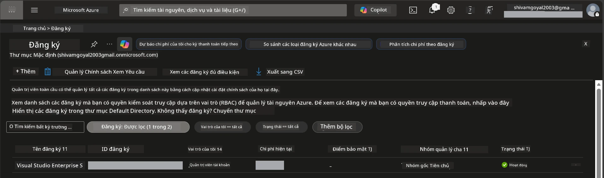

# Module 0 - Yêu cầu tiên quyết

Trước khi bắt đầu hội thảo, hãy xác nhận bạn đã có sẵn các công cụ, quyền truy cập và môi trường sau đây. Thực hiện từng bước dưới đây - không được bỏ qua.

---

## 1. Tài khoản & đăng ký Azure

### 1.1 Tạo hoặc kiểm tra đăng ký Azure của bạn

1. Mở trình duyệt và truy cập [https://azure.microsoft.com/free/](https://azure.microsoft.com/free/).
2. Nếu bạn chưa có tài khoản Azure, nhấp **Bắt đầu dùng thử miễn phí** và làm theo quy trình đăng ký. Bạn sẽ cần một tài khoản Microsoft (hoặc tạo tài khoản mới) và thẻ tín dụng để xác minh danh tính.
3. Nếu bạn đã có tài khoản, đăng nhập tại [https://portal.azure.com](https://portal.azure.com).
4. Trong Portal, nhấp vào phần **Đăng ký** ở thanh điều hướng bên trái (hoặc tìm kiếm "Subscriptions" trong thanh tìm kiếm trên cùng).
5. Xác nhận bạn thấy ít nhất một đăng ký **Đang hoạt động**. Ghi lại **Subscription ID** - bạn sẽ cần sau.



### 1.2 Hiểu các vai trò RBAC cần thiết

Việc triển khai [Hosted Agent](https://learn.microsoft.com/azure/foundry/agents/concepts/hosted-agents) yêu cầu quyền **hành động dữ liệu** mà các vai trò chuẩn Azure `Owner` và `Contributor` không bao gồm. Bạn sẽ cần một trong các [tổ hợp vai trò](https://learn.microsoft.com/azure/foundry/concepts/rbac-foundry#built-in-roles) sau:

| Kịch bản | Vai trò cần thiết | Nơi gán |
|----------|------------------|----------------------|
| Tạo dự án Foundry mới | **Azure AI Owner** trên tài nguyên Foundry | Tài nguyên Foundry trong Azure Portal |
| Triển khai vào dự án hiện có (tài nguyên mới) | **Azure AI Owner** + **Contributor** trên đăng ký | Đăng ký + Tài nguyên Foundry |
| Triển khai vào dự án đã cấu hình đầy đủ | **Reader** trên tài khoản + **Azure AI User** trên dự án | Tài khoản + Dự án trong Azure Portal |

> **Điểm chính:** Các vai trò Azure `Owner` và `Contributor` chỉ bao gồm quyền *quản lý* (các thao tác ARM). Bạn cần [**Azure AI User**](https://learn.microsoft.com/azure/foundry/concepts/rbac-foundry#built-in-roles) (hoặc cao hơn) cho các *hành động dữ liệu* như `agents/write` để tạo và triển khai agents. Bạn sẽ gán các vai trò này trong [Module 2](02-create-foundry-project.md).

---

## 2. Cài đặt công cụ cục bộ

Cài đặt từng công cụ dưới đây. Sau khi cài, hãy kiểm tra hoạt động bằng cách chạy lệnh kiểm tra.

### 2.1 Visual Studio Code

1. Truy cập [https://code.visualstudio.com/](https://code.visualstudio.com/).
2. Tải bộ cài đặt phù hợp cho hệ điều hành của bạn (Windows/macOS/Linux).
3. Chạy bộ cài với cài đặt mặc định.
4. Mở VS Code để xác nhận nó khởi chạy thành công.

### 2.2 Python 3.10+

1. Truy cập [https://www.python.org/downloads/](https://www.python.org/downloads/).
2. Tải Python 3.10 hoặc mới hơn (khuyến nghị 3.12+).
3. **Windows:** Trong quá trình cài đặt, chọn **"Add Python to PATH"** ở màn hình đầu tiên.
4. Mở terminal và kiểm tra:

   ```powershell
   python --version
   ```

   Kết quả mong đợi: `Python 3.10.x` hoặc cao hơn.

### 2.3 Azure CLI

1. Truy cập [https://learn.microsoft.com/cli/azure/install-azure-cli](https://learn.microsoft.com/cli/azure/install-azure-cli).
2. Làm theo hướng dẫn cài đặt cho hệ điều hành của bạn.
3. Kiểm tra:

   ```powershell
   az --version
   ```

   Kết quả mong đợi: `azure-cli 2.80.0` hoặc cao hơn.

4. Đăng nhập:

   ```powershell
   az login
   ```

### 2.4 Azure Developer CLI (azd)

1. Truy cập [https://learn.microsoft.com/azure/developer/azure-developer-cli/install-azd](https://learn.microsoft.com/azure/developer/azure-developer-cli/install-azd).
2. Làm theo hướng dẫn cài đặt cho hệ điều hành của bạn. Trên Windows:

   ```powershell
   winget install microsoft.azd
   ```

3. Kiểm tra:

   ```powershell
   azd version
   ```

   Kết quả mong đợi: `azd version 1.x.x` hoặc cao hơn.

4. Đăng nhập:

   ```powershell
   azd auth login
   ```

### 2.5 Docker Desktop (tùy chọn)

Docker chỉ cần nếu bạn muốn xây dựng và kiểm thử ảnh container cục bộ trước khi triển khai. Phần mở rộng Foundry tự động xử lý xây dựng container khi triển khai.

1. Truy cập [https://docs.docker.com/get-docker/](https://docs.docker.com/get-docker/).
2. Tải và cài Docker Desktop cho hệ điều hành của bạn.
3. **Windows:** Đảm bảo tùy chọn backend WSL 2 được chọn khi cài đặt.
4. Khởi động Docker Desktop và chờ biểu tượng trên khay hệ thống hiện **"Docker Desktop is running"**.
5. Mở terminal và kiểm tra:

   ```powershell
   docker info
   ```

   Dòng lệnh này sẽ in thông tin hệ thống Docker mà không báo lỗi. Nếu thấy lỗi `Cannot connect to the Docker daemon`, hãy đợi thêm vài giây để Docker khởi động hoàn chỉnh.

---

## 3. Cài đặt các tiện ích mở rộng VS Code

Bạn cần ba tiện ích mở rộng. Hãy cài đặt chúng **trước** khi bắt đầu hội thảo.

### 3.1 Microsoft Foundry cho VS Code

1. Mở VS Code.
2. Nhấn `Ctrl+Shift+X` để mở bảng Extensions.
3. Trong ô tìm kiếm, nhập **"Microsoft Foundry"**.
4. Tìm **Microsoft Foundry for Visual Studio Code** (nhà xuất bản: Microsoft, ID: `TeamsDevApp.vscode-ai-foundry`).
5. Nhấp **Cài đặt**.
6. Sau khi cài đặt xong, bạn sẽ thấy biểu tượng **Microsoft Foundry** xuất hiện ở thanh Hoạt động (thanh bên trái).

### 3.2 Foundry Toolkit

1. Trong bảng Extensions (`Ctrl+Shift+X`), tìm **"Foundry Toolkit"**.
2. Tìm **Foundry Toolkit** (nhà xuất bản: Microsoft, ID: `ms-windows-ai-studio.windows-ai-studio`).
3. Nhấp **Cài đặt**.
4. Biểu tượng **Foundry Toolkit** sẽ xuất hiện ở thanh Hoạt động.

### 3.3 Python

1. Trong bảng Extensions, tìm **"Python"**.
2. Tìm **Python** (nhà xuất bản: Microsoft, ID: `ms-python.python`).
3. Nhấp **Cài đặt**.

---

## 4. Đăng nhập Azure từ VS Code

[Microsoft Agent Framework](https://learn.microsoft.com/agent-framework/overview/) dùng [`DefaultAzureCredential`](https://learn.microsoft.com/azure/developer/python/sdk/authentication/credential-chains#defaultazurecredential-overview) để xác thực. Bạn cần đăng nhập Azure trong VS Code.

### 4.1 Đăng nhập qua VS Code

1. Nhìn vào góc dưới bên trái của VS Code và nhấp vào biểu tượng **Tài khoản** (hình người).
2. Nhấp **Đăng nhập để sử dụng Microsoft Foundry** (hoặc **Đăng nhập với Azure**).
3. Cửa sổ trình duyệt sẽ mở ra - đăng nhập bằng tài khoản Azure có quyền truy cập vào đăng ký của bạn.
4. Quay lại VS Code. Tên tài khoản sẽ hiển thị ở góc dưới trái.

### 4.2 (Tùy chọn) Đăng nhập qua Azure CLI

Nếu bạn đã cài Azure CLI và thích xác thực bằng CLI:

```powershell
az login
```

Cửa sổ trình duyệt sẽ mở để bạn đăng nhập. Sau khi đăng nhập, chọn đăng ký phù hợp:

```powershell
az account set --subscription "<your-subscription-id>"
```

Kiểm tra:

```powershell
az account show --query "{name:name, id:id, state:state}" --output table
```

Bạn sẽ thấy tên đăng ký, ID và trạng thái = `Enabled`.

### 4.3 (Phương án khác) Xác thực service principal

Đối với môi trường CI/CD hoặc dùng chung, thay vào đó thiết lập biến môi trường sau:

```powershell
$env:AZURE_TENANT_ID = "<your-tenant-id>"
$env:AZURE_CLIENT_ID = "<your-client-id>"
$env:AZURE_CLIENT_SECRET = "<your-client-secret>"
```

---

## 5. Giới hạn bản xem trước

Trước khi tiếp tục, cần lưu ý các giới hạn hiện tại:

- [**Hosted Agents**](https://learn.microsoft.com/azure/foundry/agents/concepts/hosted-agents) đang ở **bản xem trước công khai** - không khuyến cáo dùng cho khối lượng công việc sản xuất.
- **Khu vực hỗ trợ còn hạn chế** - hãy kiểm tra [vùng hỗ trợ](https://learn.microsoft.com/azure/foundry/agents/concepts/hosted-agents#region-availability) trước khi tạo tài nguyên. Nếu chọn vùng không được hỗ trợ, triển khai sẽ thất bại.
- Gói `azure-ai-agentserver-agentframework` hiện là bản tiền phát hành (`1.0.0b16`) - API có thể thay đổi.
- Giới hạn quy mô: hosted agents hỗ trợ 0-5 bản sao (bao gồm cả scale-to-zero).

---

## 6. Danh sách kiểm tra trước khi bắt đầu

Kiểm tra từng mục dưới đây. Nếu bước nào không thành công, hãy quay lại sửa trước khi tiếp tục.

- [ ] VS Code mở mà không báo lỗi
- [ ] Python 3.10+ đã có trong PATH (`python --version` trả về `3.10.x` hoặc cao hơn)
- [ ] Azure CLI đã cài (`az --version` trả về `2.80.0` hoặc cao hơn)
- [ ] Azure Developer CLI đã cài (`azd version` trả về thông tin phiên bản)
- [ ] Tiện ích mở rộng Microsoft Foundry đã cài (biểu tượng hiển thị trên thanh Hoạt động)
- [ ] Tiện ích mở rộng Foundry Toolkit đã cài (biểu tượng hiển thị trên thanh Hoạt động)
- [ ] Tiện ích mở rộng Python đã cài
- [ ] Bạn đã đăng nhập Azure trong VS Code (kiểm tra biểu tượng Tài khoản, góc dưới bên trái)
- [ ] `az account show` trả về thông tin đăng ký của bạn
- [ ] (Tùy chọn) Docker Desktop đang chạy (`docker info` trả về thông tin hệ thống mà không lỗi)

### Điểm kiểm tra

Mở thanh Hoạt động của VS Code và xác nhận bạn có thể thấy cả hai bảng điều khiển **Foundry Toolkit** và **Microsoft Foundry** trong thanh bên. Nhấp vào từng cái để kiểm tra chúng tải mà không lỗi.

---

**Tiếp theo:** [01 - Cài đặt Foundry Toolkit & Foundry Extension →](01-install-foundry-toolkit.md)

---

<!-- CO-OP TRANSLATOR DISCLAIMER START -->
**Tuyên bố từ chối trách nhiệm**:  
Tài liệu này đã được dịch bằng dịch vụ dịch thuật AI [Co-op Translator](https://github.com/Azure/co-op-translator). Mặc dù chúng tôi cố gắng đảm bảo độ chính xác, xin lưu ý rằng bản dịch tự động có thể chứa lỗi hoặc không chính xác. Tài liệu gốc bằng ngôn ngữ bản địa nên được coi là nguồn chính xác và đáng tin cậy. Đối với các thông tin quan trọng, nên sử dụng dịch vụ dịch thuật chuyên nghiệp do con người thực hiện. Chúng tôi không chịu trách nhiệm về bất kỳ sự hiểu nhầm hoặc diễn giải sai nào phát sinh từ việc sử dụng bản dịch này.
<!-- CO-OP TRANSLATOR DISCLAIMER END -->