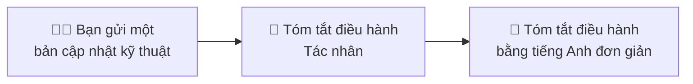

# Mô-đun 0 - Giới thiệu

⏱️ ~10 phút

> [!WARNING]
> **Xem trước & Giới hạn:** [Hosted Agents](https://learn.microsoft.com/azure/foundry/agents/concepts/hosted-agents) hiện đang ở **giai đoạn xem trước công khai** - không khuyến nghị sử dụng cho khối lượng công việc sản xuất. Hãy lưu ý các điểm sau:
> - **Khu vực hỗ trợ có giới hạn** - kiểm tra [khả dụng khu vực](https://learn.microsoft.com/azure/foundry/agents/concepts/hosted-agents#region-availability) trước khi tạo tài nguyên. Nếu chọn khu vực không được hỗ trợ, triển khai sẽ thất bại.
> - Gói `azure-ai-agentserver-agentframework` là bản phát hành trước - APIs có thể thay đổi giữa các phiên bản.
> - Giới hạn quy mô: các hosted agents hỗ trợ từ 0–5 bản sao (bao gồm cả mở rộng về không).
> - Một số tính năng hiển thị trong workshop này có thể thay đổi khi dịch vụ tiến tới GA.

## Bạn sẽ xây dựng gì

Trong workshop này, bạn sẽ xây dựng một agent **"Giải thích như thể tôi là một lãnh đạo"** - một agent AI được lưu trữ giúp chuyển các cập nhật kỹ thuật phức tạp thành các tóm tắt lãnh đạo bằng tiếng Anh đơn giản.

```mermaid
flowchart LR
    A["🧑‍💻 Bạn gửi một\nbản cập nhật kỹ thuật"] --> B["🤖 Tóm tắt điều hành\nTác nhân"]
    B --> C["📝 Tóm tắt điều hành\nbằng tiếng Anh đơn giản"]
```

**Agent sử dụng:**
- **Microsoft Agent Framework** - cho logic và cấu trúc agent
- **Foundry Toolkit cho VS Code** - để tạo khung, kiểm thử cục bộ và triển khai
- **Một mô hình AI** (ví dụ, `gpt-4.1-mini/gpt-5-mini`) - để tạo ra các tóm tắt

Cuối bài lab này, bạn sẽ có một agent hoạt động mà bạn có thể kiểm tra cục bộ qua Agent Inspector, và tùy chọn triển khai lên đám mây.

---

## Hosted agents là gì?

Một **hosted agent** là một agent AI chạy như một dịch vụ được quản lý trong Microsoft Foundry. Thay vì quản lý hạ tầng riêng, bạn đóng gói mã agent của mình trong container và Foundry sẽ xử lý việc mở rộng, lưu trữ, và cung cấp nó qua endpoint HTTP tiêu chuẩn.

| Khái niệm | Ý nghĩa |
|---------|--------------|
| **Agent** | Mã Python của bạn nhận tin nhắn người dùng, gọi mô hình AI và trả về phản hồi có cấu trúc |
| **Hosted** | Foundry chạy container của bạn — không cần máy ảo, Kubernetes, hay quản lý hạ tầng |
| **Giao thức phản hồi** | API HTTP tiêu chuẩn (`POST /responses`) mà mọi client đều có thể gọi để tương tác với agent của bạn |
| **Agent Inspector** | Giao diện thử nghiệm cục bộ (tích hợp trong Foundry Toolkit) cho phép bạn trò chuyện với agent trước khi triển khai |

Trong workshop này, bạn sẽ từ con số 0 đến agent được hosted đầy đủ — hoặc dừng lại ở kiểm thử cục bộ nếu bạn thích.

---

## Chọn hướng đi của bạn

> ⚠️ **Chọn một hướng đi trước khi tiếp tục.** Lựa chọn của bạn quyết định công cụ nào cần cài và mô-đun nào áp dụng. Bạn có thể chuyển từ Hướng B → Hướng A sau nếu có đăng ký.

<strong>🅰️ Hướng A - Đám mây Azure (cần có đăng ký Azure)</strong>

| | Chi tiết |
|---|---|
| **Dành cho ai?** | Bạn có đăng ký Azure hoạt động và có thể tạo tài nguyên Foundry |
| **Mô hình** | Azure OpenAI qua Foundry (ví dụ, `gpt-4.1-mini/gpt-5-mini`) |
| **Mô-đun bao phủ** | Toàn bộ mô-đun (00–07) |
| **Triển khai lên đám mây?** | ✅ Có - triển khai đầy đủ đầu-cuối |

<strong>🅱️ Hướng B - Cục bộ / miễn phí (không cần đăng ký Azure)</strong>

| | Chi tiết |
|---|---|
| **Dành cho ai?** | MVPs, sinh viên hoặc bất kỳ ai không có quyền truy cập Azure |
| **Mô hình** | **Foundry Local** (miễn phí, chạy trên máy của bạn) |
| **Mô-đun bao phủ** | Mô-đun 00–04 (bỏ qua triển khai & xác thực đám mây) |
| **Triển khai lên đám mây?** | ❌ Không - chỉ kiểm thử cục bộ qua Agent Inspector |

---

## Tất cả các hướng đi: Công cụ cần thiết

Cài đặt từng công cụ bên dưới. Sau khi cài, xác minh hoạt động bằng cách chạy lệnh kiểm tra.

| # | Công cụ | Phiên bản | Cài đặt | Xác minh (Kết quả mong đợi) |
|---|------|---------|---------|---------------------------|
| 1 | **Visual Studio Code** | Mới nhất | [code.visualstudio.com](https://code.visualstudio.com/) | Mở lên không lỗi |
| 2 | **Python** | 3.12 hoặc cao hơn | [python.org/downloads](https://www.python.org/downloads/) | `python --version` $\rightarrow$ `Python 3.12.x` |
| 3 | **Foundry Toolkit cho VS Code** | Mới nhất | Extension ID: `ms-windows-ai-studio.windows-ai-studio` | Biểu tượng Foundry ở thanh Activity |
| 4 | **Tiện ích mở rộng Python cho VS Code** | Mới nhất | Extension ID: `ms-python.python` | Đã cài trong tab Tiện ích mở rộng |

> [!TIP]
> **Mẹo chuyên nghiệp cho cài đặt:**
> - **PATH Python (Windows):** Luôn chọn **"Add Python to PATH"** trên màn hình đầu tiên của trình cài Python. Nếu không, `python` sẽ không nhận diện được trong terminal.
> - **Nhiều phiên bản Python:** Nếu cài cả Python 3.10 và 3.12, dùng `python3.12 -m venv .venv` để đảm bảo phiên bản đúng được dùng trong môi trường ảo.
> - **Docker WSL 2 (Windows):** Khi cài Docker Desktop, hãy chắc chắn chọn **WSL 2 backend**. Docker với Hyper-V chạy chậm hơn và có thể gây lỗi khi build container Foundry.
> - **Docker không khởi động?** Chờ 30–60 giây sau khi mở Docker Desktop. Chạy `docker info` - nếu hiện "Cannot connect to the Docker daemon," Docker vẫn đang khởi tạo.
> - **Tiện ích mở rộng VS Code không load?** Sau khi cài tiện ích, nạp lại cửa sổ: `Ctrl+Shift+P` → `Developer: Reload Window`.

> **Người dùng Windows:** Chọn **"Add Python to PATH"** khi cài Python.

**Tiếp theo:** [01 - Thiết lập →](01-setup.md)

---

<!-- CO-OP TRANSLATOR DISCLAIMER START -->
**Tuyên bố miễn trừ trách nhiệm**:
Tài liệu này đã được dịch bằng dịch vụ dịch thuật AI [Co-op Translator](https://github.com/Azure/co-op-translator). Mặc dù chúng tôi cố gắng đảm bảo độ chính xác, xin lưu ý rằng bản dịch tự động có thể chứa lỗi hoặc sai sót. Tài liệu gốc bằng ngôn ngữ gốc nên được coi là nguồn tin chính thức. Đối với thông tin quan trọng, nên sử dụng dịch vụ dịch thuật chuyên nghiệp bởi con người. Chúng tôi không chịu trách nhiệm về bất kỳ hiểu lầm hoặc giải thích sai nào phát sinh từ việc sử dụng bản dịch này.
<!-- CO-OP TRANSLATOR DISCLAIMER END -->