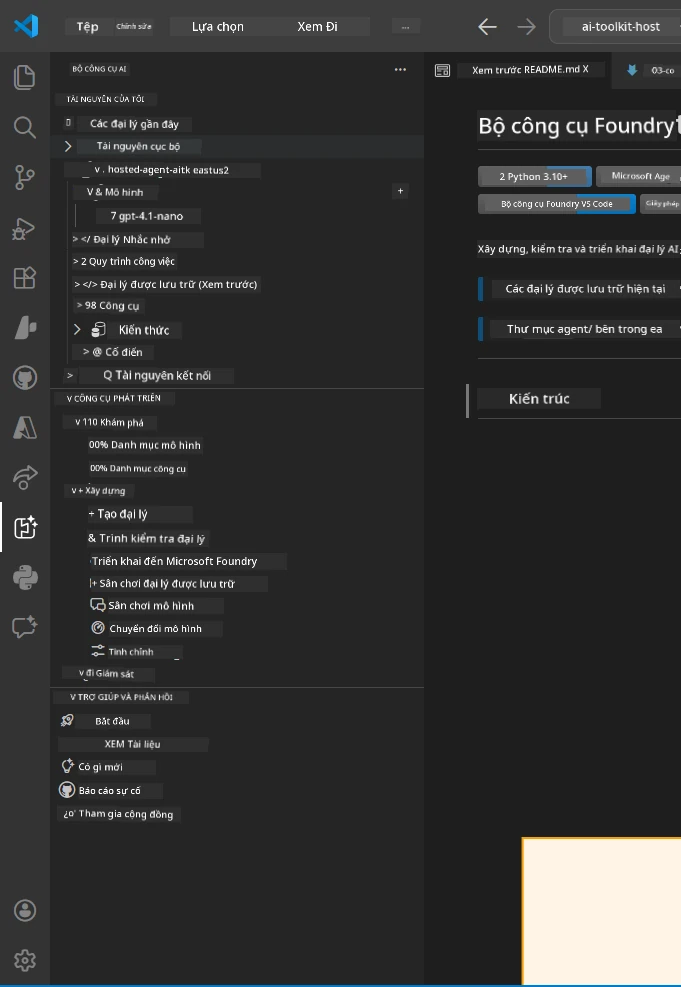
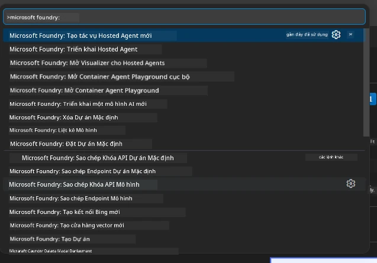

# Module 1 - Cài đặt Foundry Toolkit & Foundry Extension

Module này hướng dẫn bạn cài đặt và xác minh hai phần mở rộng chính của VS Code cho khóa học này. Nếu bạn đã cài đặt chúng trong [Module 0](00-prerequisites.md), hãy dùng module này để kiểm tra chúng hoạt động đúng.

---

## Bước 1: Cài đặt Microsoft Foundry Extension

Phần mở rộng **Microsoft Foundry for VS Code** là công cụ chính để tạo dự án Foundry, triển khai mô hình, tạo sẵn hosted agents và triển khai trực tiếp từ VS Code.

1. Mở VS Code.
2. Nhấn `Ctrl+Shift+X` để mở bảng **Extensions**.
3. Trong hộp tìm kiếm phía trên, gõ: **Microsoft Foundry**
4. Tìm kết quả có tên **Microsoft Foundry for Visual Studio Code**.
   - Nhà xuất bản: **Microsoft**
   - Extension ID: `TeamsDevApp.vscode-ai-foundry`
5. Nhấn nút **Install**.
6. Chờ quá trình cài đặt hoàn tất (bạn sẽ thấy chỉ báo tiến trình nhỏ).
7. Sau khi cài đặt, nhìn vào **Activity Bar** (thanh biểu tượng nghiêng dọc bên trái VS Code). Bạn sẽ thấy biểu tượng **Microsoft Foundry** mới (trông như biểu tượng kim cương/AI).
8. Nhấn biểu tượng **Microsoft Foundry** để mở thanh bên. Bạn sẽ thấy các phần:
   - **Resources** (hoặc Projects)
   - **Agents**
   - **Models**

> **Nếu biểu tượng không xuất hiện:** Hãy thử tải lại VS Code (`Ctrl+Shift+P` → `Developer: Reload Window`).

---

## Bước 2: Cài đặt Foundry Toolkit Extension

Phần mở rộng **Foundry Toolkit** cung cấp [**Agent Inspector**](https://learn.microsoft.com/azure/foundry/agents/how-to/vs-code-agents-workflow-pro-code) - giao diện trực quan để kiểm thử và gỡ lỗi agents cục bộ - cùng công cụ playground, quản lý mô hình và đánh giá.

1. Trong bảng Extensions (`Ctrl+Shift+X`), xóa hộp tìm kiếm và gõ: **Foundry Toolkit**
2. Tìm **Foundry Toolkit** trong kết quả.
   - Nhà xuất bản: **Microsoft**
   - Extension ID: `ms-windows-ai-studio.windows-ai-studio`
3. Nhấn **Install**.
4. Sau khi cài đặt, biểu tượng **Foundry Toolkit** sẽ xuất hiện trong Activity Bar (trông như biểu tượng robot/lấp lánh).
5. Nhấn biểu tượng **Foundry Toolkit** để mở thanh bên. Bạn sẽ thấy màn hình chào mừng với các tùy chọn:
   - **Models**
   - **Playground**
   - **Agents**

---

## Bước 3: Xác minh cả hai phần mở rộng hoạt động

### 3.1 Xác minh Microsoft Foundry Extension

1. Nhấn biểu tượng **Microsoft Foundry** trong Activity Bar.
2. Nếu bạn đã đăng nhập Azure (từ Module 0), bạn sẽ thấy các dự án của mình trong **Resources**.
3. Nếu được yêu cầu đăng nhập, nhấn **Sign in** và làm theo hướng dẫn xác thực.
4. Xác nhận bạn có thể xem thanh bên mà không lỗi.

### 3.2 Xác minh Foundry Toolkit Extension

1. Nhấn biểu tượng **Foundry Toolkit** trong Activity Bar.
2. Xác nhận màn hình chào mừng hoặc bảng chính tải lên mà không lỗi.
3. Bạn chưa cần cấu hình gì ngay - chúng ta sẽ dùng Agent Inspector ở [Module 5](05-test-locally.md).

### 3.3 Xác minh qua Command Palette

1. Nhấn `Ctrl+Shift+P` để mở Command Palette.
2. Gõ **"Microsoft Foundry"** - bạn sẽ thấy các lệnh như:
   - `Microsoft Foundry: Create a New Hosted Agent`
   - `Microsoft Foundry: Deploy Hosted Agent`
   - `Microsoft Foundry: Open Model Catalog`
3. Nhấn `Escape` để đóng Command Palette.
4. Mở lại Command Palette và gõ **"Foundry Toolkit"** - bạn sẽ thấy các lệnh như:
   - `Foundry Toolkit: Open Agent Inspector`

> Nếu bạn không thấy các lệnh này, phần mở rộng có thể chưa được cài đúng. Thử gỡ và cài lại chúng.

---

## Những gì các phần mở rộng này làm trong khóa học

| Phần mở rộng | Tác dụng | Khi nào sử dụng |
|--------------|----------|-----------------|
| **Microsoft Foundry for VS Code** | Tạo dự án Foundry, triển khai mô hình, **tạo sẵn [hosted agents](https://learn.microsoft.com/azure/foundry/agents/concepts/hosted-agents)** (tự động tạo `agent.yaml`, `main.py`, `Dockerfile`, `requirements.txt`), triển khai đến [Foundry Agent Service](https://learn.microsoft.com/azure/foundry/agents/overview) | Modules 2, 3, 6, 7 |
| **Foundry Toolkit** | Agent Inspector để kiểm thử/gỡ lỗi cục bộ, giao diện playground, quản lý mô hình | Modules 5, 7 |

> **Phần mở rộng Foundry là công cụ quan trọng nhất trong khóa học này.** Nó xử lý vòng đời từ đầu đến cuối: scaffold → cấu hình → triển khai → xác minh. Foundry Toolkit hỗ trợ bằng cách cung cấp Agent Inspector trực quan cho kiểm thử cục bộ.

---

### Kiểm tra

- [ ] Biểu tượng Microsoft Foundry hiển thị trên Activity Bar
- [ ] Nhấn vào nó mở thanh bên mà không lỗi
- [ ] Biểu tượng Foundry Toolkit hiển thị trên Activity Bar
- [ ] Nhấn vào nó mở thanh bên mà không lỗi
- [ ] `Ctrl+Shift+P` → gõ "Microsoft Foundry" hiện các lệnh có sẵn
- [ ] `Ctrl+Shift+P` → gõ "Foundry Toolkit" hiện các lệnh có sẵn

---

**Trước:** [00 - Yêu cầu trước](00-prerequisites.md) · **Tiếp:** [02 - Tạo Dự án Foundry →](02-create-foundry-project.md)

---

<!-- CO-OP TRANSLATOR DISCLAIMER START -->
**Từ chối trách nhiệm**:  
Tài liệu này đã được dịch bằng dịch vụ dịch thuật AI [Co-op Translator](https://github.com/Azure/co-op-translator). Mặc dù chúng tôi cố gắng đảm bảo độ chính xác, xin lưu ý rằng bản dịch tự động có thể chứa lỗi hoặc không chính xác. Tài liệu gốc bằng ngôn ngữ ban đầu được xem là nguồn chính xác và đáng tin cậy nhất. Đối với thông tin quan trọng, nên sử dụng dịch vụ dịch thuật chuyên nghiệp bởi con người. Chúng tôi không chịu trách nhiệm đối với bất kỳ sự hiểu nhầm hoặc diễn giải sai nào phát sinh từ việc sử dụng bản dịch này.
<!-- CO-OP TRANSLATOR DISCLAIMER END -->