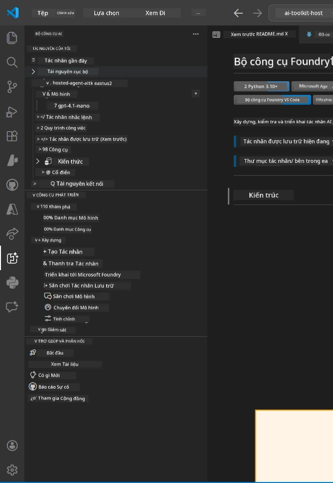
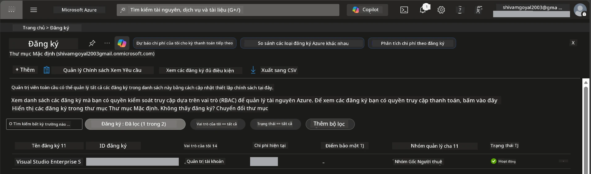
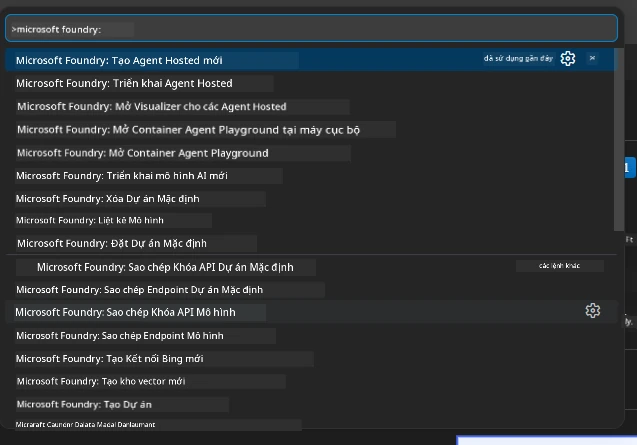
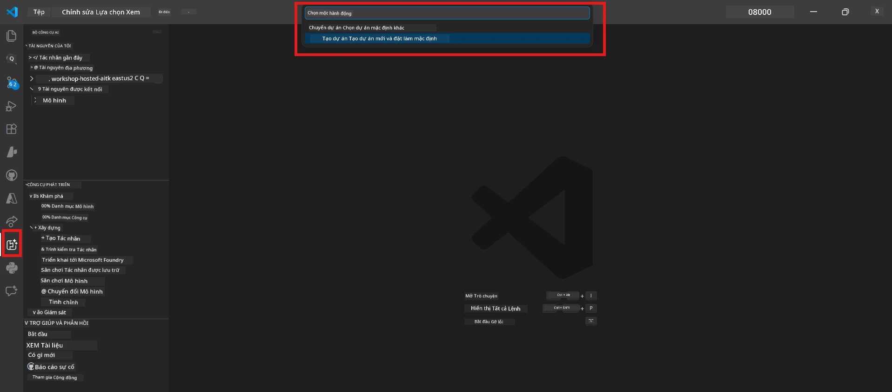
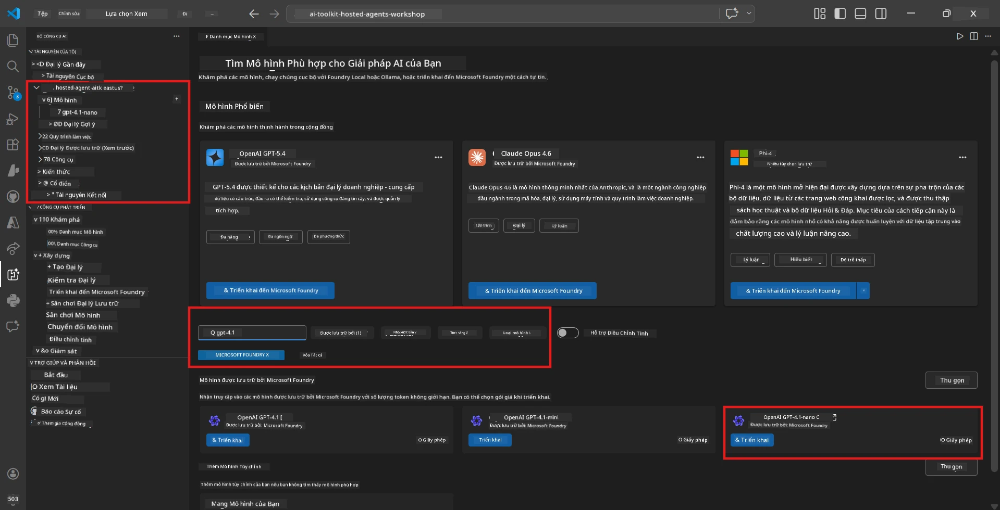
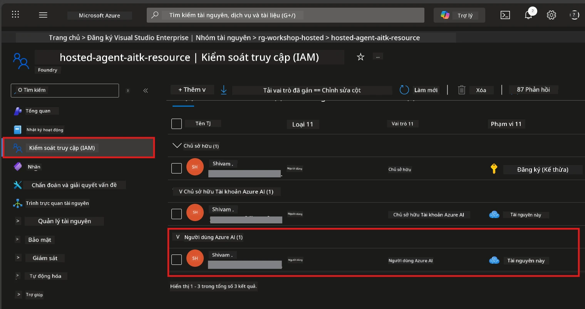

# Thiết lập: Tiện ích mở rộng, Dự án & Mô hình

⏱️ ~15 phút

Trong mô-đun này, bạn sẽ cài đặt và xác minh tiện ích mở rộng Foundry Toolkit, tạo (hoặc kết nối với) một dự án Foundry, và triển khai mô hình mà tác nhân của bạn sẽ sử dụng.

## Bước 1: Cài đặt Foundry Toolkit

**Foundry Toolkit cho VS Code** là tiện ích mở rộng chính cho hội thảo này. Nó cung cấp tạo dự án, triển khai mô hình, dựng khung tác nhân, kiểm thử cục bộ (Agent Inspector), và triển khai trên đám mây - tất cả đều từ VS Code.

1. Mở VS Code rồi nhấn `Ctrl+Shift+X` để mở bảng **Extensions**.
2. Tìm kiếm **Foundry Toolkit**.
3. Cài đặt **Foundry Toolkit for VS Code** (Nhà phát hành: Microsoft, ID: `ms-windows-ai-studio.windows-ai-studio`).
4. Sau khi cài đặt, biểu tượng **Foundry Toolkit** sẽ xuất hiện trên Thanh Hoạt Động (sidebar bên trái).

> *Lưu ý: Thanh Hoạt Động có thể hiển thị "AI TOOLKIT" trong các phiên bản tiện ích mở rộng cũ hơn. Chức năng vẫn giống nhau.*



## Bước 2: Thiết lập dựa trên quyền truy cập của bạn

> **Chọn lộ trình của bạn:** Mở rộng phần bên dưới phù hợp với thiết lập của bạn. Bạn chỉ cần hoàn thành **một** lộ trình.

<details>
<summary><strong>🅰️ Lộ trình A - Đám mây Azure (cần có đăng ký Azure)</strong></summary>

### Azure CLI

1. Cài đặt từ [learn.microsoft.com/cli/azure/install-azure-cli](https://learn.microsoft.com/cli/azure/install-azure-cli).
2. Xác minh: `az --version` (đề nghị 2.80.0+).
3. Đăng nhập: `az login`

### Tùy chọn xác thực

[Khung tác nhân Microsoft](https://learn.microsoft.com/agent-framework/overview/) sử dụng [`DefaultAzureCredential`](https://learn.microsoft.com/azure/developer/python/sdk/authentication/credential-chains#defaultazurecredential-overview) thử tuần tự nhiều cách xác thực khác nhau. Hãy chọn cách phù hợp với môi trường của bạn:

#### Tùy chọn 1: Tài khoản VS Code (được khuyến nghị cho hội thảo)
1. Nhấp vào biểu tượng **Accounts** (hình người) ở góc dưới bên trái của VS Code.
2. Chọn **Sign in to use Microsoft Foundry** (hoặc **Sign in with Azure**).
3. Trình duyệt sẽ mở ra - đăng nhập bằng tài khoản Azure có quyền truy cập đăng ký của bạn.
4. Quay lại VS Code. Bạn sẽ thấy tên tài khoản của mình ở góc dưới bên trái.

#### Tùy chọn 2: Azure CLI
```bash
az login
az account set --subscription "<your-subscription-id>"
```

#### Tùy chọn 3: Service Principal (Doanh nghiệp/CI)
Đối với môi trường bị hạn chế hoặc dây chuyền CI/CD, đặt các biến môi trường này trong tập tin `.env` của bạn:
```env
AZURE_TENANT_ID=<your-tenant-id>
AZURE_CLIENT_ID=<your-client-id>
AZURE_CLIENT_SECRET=<your-client-secret>
```

> **Cách `DefaultAzureCredential` hoạt động:** Nó thử biến môi trường trước, sau đó managed identity, sau đó đăng nhập VS Code, rồi Azure CLI - và sử dụng kết quả thành công đầu tiên. Xem [tài liệu chuỗi chứng thực](https://learn.microsoft.com/azure/developer/python/sdk/authentication/credential-chains#defaultazurecredential-overview).

### Azure Developer CLI (azd)

1. Cài đặt: `winget install microsoft.azd` (Windows) hoặc xem [tài liệu cài đặt](https://learn.microsoft.com/azure/developer/azure-developer-cli/install-azd).
2. Xác minh: `azd version`
3. Đăng nhập: `azd auth login`

### Docker Desktop (tùy chọn)

Docker chỉ cần nếu bạn muốn xây dựng container cục bộ. Tiện ích Foundry quản lý việc xây dựng tự động khi triển khai.

1. Cài đặt từ [docs.docker.com/get-docker](https://docs.docker.com/get-docker/).
2. Xác minh: `docker info`

### Đăng ký Azure & RBAC

1. Đăng nhập tại [portal.azure.com](https://portal.azure.com).
2. Chuyển đến **Subscriptions** và xác nhận ít nhất một mục là **Active**.
3. Ghi chú **Subscription ID** của bạn - bạn sẽ cần trong Module 01.



#### Bảng kịch bản RBAC

Việc triển khai [Hosted Agent](https://learn.microsoft.com/azure/foundry/agents/concepts/hosted-agents) yêu cầu quyền **data action** mà các vai trò Azure `Owner` và `Contributor` tiêu chuẩn **không** bao gồm. Sử dụng bảng dưới đây để xác định vai trò bạn cần:

| Kịch bản | Vai trò yêu cầu | Nơi gán vai trò |
|----------|-----------------|------------------|
| Tạo dự án Foundry mới | **Azure AI Owner** trên tài nguyên Foundry | Tài nguyên Foundry trong Azure Portal |
| Triển khai vào dự án có sẵn (tài nguyên mới) | **Azure AI Owner** + **Contributor** trên đăng ký | Đăng ký + tài nguyên Foundry |
| Triển khai vào dự án đã cấu hình đầy đủ | **Reader** trên tài khoản + **Azure AI User** trên dự án | Tài khoản + Dự án trong Azure Portal |
| Chỉ kiểm thử cục bộ (không triển khai) | **Azure AI User** trên dự án | Dự án trong Azure Portal |

> **Điểm chính:** Các vai trò `Owner` và `Contributor` của Azure chỉ bao gồm quyền *quản lý* (các thao tác ARM). Bạn cần [**Azure AI User**](https://learn.microsoft.com/azure/foundry/concepts/rbac-foundry#built-in-roles) (hoặc cao hơn) cho các *hành động dữ liệu* như `agents/write` cần thiết để tạo và triển khai tác nhân.

## Kết nối hoặc tạo dự án Foundry



1. Nhấn `Ctrl+Shift+P` → gõ **Foundry Toolkit: Create Project** → chọn lệnh.
2. Chọn **đăng ký Azure** của bạn từ menu thả xuống.
3. Chọn hoặc tạo **nhóm tài nguyên** (ví dụ `rg-hosted-agents-workshop`).
4. Chọn **vùng** hỗ trợ tác nhân được lưu trữ: `East US`, `West US 2`, hoặc `Sweden Central`. Xem [khu vực khả dụng](https://learn.microsoft.com/azure/foundry/agents/concepts/hosted-agents#region-availability).
5. Nhập tên dự án (ví dụ `workshop-agents`).
6. Chờ 2–5 phút để khởi tạo. Một thông báo tiến trình sẽ xuất hiện trong VS Code.
7. Khi hoàn tất, dự án của bạn sẽ hiện trong thanh bên **Foundry Toolkit** dưới **MY RESOURCES**.



## Triển khai mô hình & gán RBAC

Tác nhân được lưu trữ của bạn cần một mô hình AI để tạo phản hồi.

#### Ma trận lựa chọn mô hình
Tùy vào nhu cầu, bạn có thể chọn từ các cấp mô hình khác nhau:

| Mô hình | Phù hợp với | Chi phí | Ghi chú |
|--------|-------------|---------|---------|
| `gpt-4.1` | Phản hồi chất lượng cao, nhiều sắc thái | Cao hơn | Kết quả tốt nhất, khuyến nghị cho kiểm thử cuối |
| `gpt-4.1-mini/gpt-5-mini` | Tạo nhanh, chi phí thấp hơn | Thấp hơn | Tốt cho phát triển và kiểm thử nhanh trong hội thảo |
| `gpt-4.1-nano` | Tác vụ nhẹ | Thấp nhất | Hiệu quả chi phí nhất, nhưng phản hồi đơn giản hơn |

1. Nhấn `Ctrl+Shift+P` → **Foundry Toolkit: Open Model Catalog** (hoặc nhấp **Model Catalog** trong thanh bên dưới DEVELOPER TOOLS → Khám phá).
2. Tìm **gpt-4.1** trong danh mục.
3. Tìm **OpenAI GPT-4.1-mini** (hoặc `gpt-5-mini` để chất lượng tốt hơn) và nhấp **Deploy**.



4. Trong cấu hình triển khai:
   - **Tên triển khai:** Giữ mặc định hoặc nhập tên tùy chọn. **Nhớ tên này.**
   - **Đích:** Chọn **Deploy to Foundry Toolkit** → chọn dự án của bạn.
5. Nhấp **Deploy** và chờ 1–3 phút.

> **Khuyến nghị:** Sử dụng `gpt-4.1-mini/gpt-5-mini` cho hội thảo - nhanh, giá cả phải chăng, và cho kết quả tốt.

### Ghi chú các giá trị của bạn

Sau khi triển khai, ghi lại hai giá trị này (bạn sẽ cần trong Module 03):

| Giá trị | Nơi tìm |
|---------|---------|
| **Điểm cuối dự án** | Nhấp dự án trong thanh bên → hiển thị chi tiết URL (ví dụ `https://<account>.services.ai.azure.com/api/projects/<project>`) |
| **Tên triển khai mô hình** | Mở rộng dự án → **Models** → tên bên cạnh mô hình đã triển khai (ví dụ `gpt-4.1-mini/gpt-5-mini`) |

### Gán vai trò RBAC

> ⚠️ **Đây là bước hay bị bỏ sót nhất.** Nếu không có vai trò đúng, việc triển khai trong Module 05 sẽ thất bại.

#### Tôi cần vai trò nào?
Tùy vào kịch bản, bạn cần các kết hợp vai trò sau:

| Kịch bản | Vai trò yêu cầu | Nơi gán vai trò |
|----------|-----------------|------------------|
| Tạo dự án Foundry mới | **Azure AI Owner** trên tài nguyên Foundry | Tài nguyên Foundry trong Azure Portal |
| Triển khai vào dự án có sẵn (tài nguyên mới) | **Azure AI Owner** + **Contributor** trên đăng ký | Đăng ký + tài nguyên Foundry |
| Triển khai vào dự án đã cấu hình đầy đủ | **Reader** trên tài khoản + **Azure AI User** trên dự án | Tài khoản + Dự án trong Azure Portal |

**Điểm chính:** Các vai trò `Owner` và `Contributor` của Azure chỉ bao gồm quyền *quản lý*. Bạn cần **Azure AI User** (hoặc cao hơn) cho các *hành động dữ liệu* như `agents/write` để tạo và triển khai tác nhân.

1. Mở [portal.azure.com](https://portal.azure.com).
2. Tìm tên **dự án Foundry** của bạn → nhấp kết quả loại **"Foundry Toolkit project"** (KHÔNG phải tài khoản cha).
3. Nhấp **Access control (IAM)** ở thanh điều hướng bên trái.
4. Nhấp **+ Add** → **Add role assignment**.
5. **Tab vai trò:** Tìm **Azure AI User**, chọn, nhấp **Next**.
6. **Tab thành viên:** Chọn **User, group, or service principal** → nhấp **+ Select members** → tìm và chọn bản thân bạn → nhấp **Select**.
7. Nhấp **Review + assign** → lại nhấp **Review + assign**.
8. **Chờ 1–2 phút** để cập nhật.

> **Tại sao vai trò này?** Vai trò `Owner`/`Contributor` Azure chỉ cấp quyền quản lý. Vai trò **Azure AI User** cấp hành động dữ liệu `agents/write` cần để tạo và triển khai tác nhân. Xem [tài liệu RBAC Foundry](https://learn.microsoft.com/azure/foundry/concepts/rbac-foundry#built-in-roles).



</details>

<details>
<summary><strong>🅱️ Lộ trình B - Local / miễn phí (không cần đăng ký Azure)</strong></summary>

### Foundry Local

Foundry Local cho phép bạn chạy mô hình AI trên máy của chính bạn - không cần tài khoản đám mây. Bạn có thể truy cập các mô hình Foundry Local sử dụng Foundry Toolkit qua danh mục mô hình như sau:

1. Vào tiện ích mở rộng Foundry Toolkit.
2. Trong điều hướng Foundry Toolkit, đi tới **Developer Tools** > và chọn **Model Catalog**
3. Trong cửa sổ mới, chọn **local** từ thanh điều hướng.
4. Cuộn xuống **Phi 4 Mini,** và nhấn nút **thêm** một hộp thoại sẽ hiện ra báo hiệu mô hình đang được tải xuống.
5. Khi mô hình đã tải xong, bạn có thể tiến hành bước tiếp theo.

</details>

### ✅ Kiểm tra điểm dừng


- [ ] `Ctrl+Shift+P` → "Foundry Toolkit" hiển thị các lệnh có sẵn
- [ ] Tiện ích Foundry Toolkit đã cài và thanh bên tải mà không có lỗi
- [ ] VS Code mở và chạy đúng
- [ ] `python --version` hiển thị 3.10+
- [ ] Biểu tượng Foundry Toolkit thấy rõ trên Thanh Hoạt Động VS Code
- [ ] **Lộ trình A:** `az login` thành công, đăng ký là Active
- [ ] **Lộ trình B:** Foundry Local đang chạy (`foundry local status`)
- [ ] **Lộ trình A:** Dự án Foundry hiện trong thanh bên, mô hình đã triển khai, vai trò Azure AI User đã gán
- [ ] **Lộ trình B:** Foundry Local chạy với một mô hình
- [ ] Bạn đã ghi lại **điểm cuối** và **tên triển khai mô hình**


**Trước đó:** [00 - Điều kiện tiên quyết](00-prerequisites.md) · **Tiếp theo:** [02 - Tạo tác nhân được lưu trữ →](02-create-hosted-agent.md)

---

<!-- CO-OP TRANSLATOR DISCLAIMER START -->
**Tuyên bố miễn trừ trách nhiệm**:
Tài liệu này đã được dịch bằng dịch vụ dịch thuật AI [Co-op Translator](https://github.com/Azure/co-op-translator). Mặc dù chúng tôi cố gắng đảm bảo độ chính xác, xin lưu ý rằng bản dịch tự động có thể chứa lỗi hoặc sai sót. Tài liệu gốc bằng ngôn ngữ gốc nên được coi là nguồn tin chính thức. Đối với thông tin quan trọng, nên sử dụng dịch vụ dịch thuật chuyên nghiệp bởi con người. Chúng tôi không chịu trách nhiệm về bất kỳ hiểu lầm hoặc giải thích sai nào phát sinh từ việc sử dụng bản dịch này.
<!-- CO-OP TRANSLATOR DISCLAIMER END -->