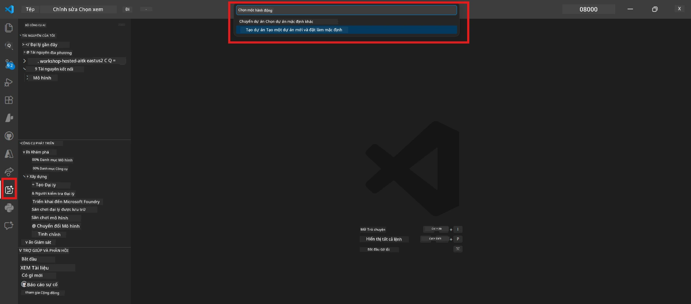
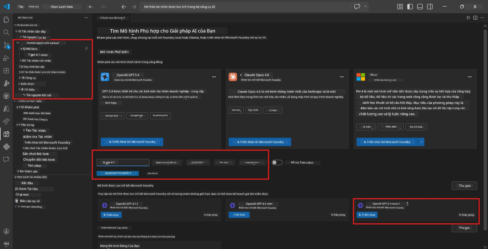
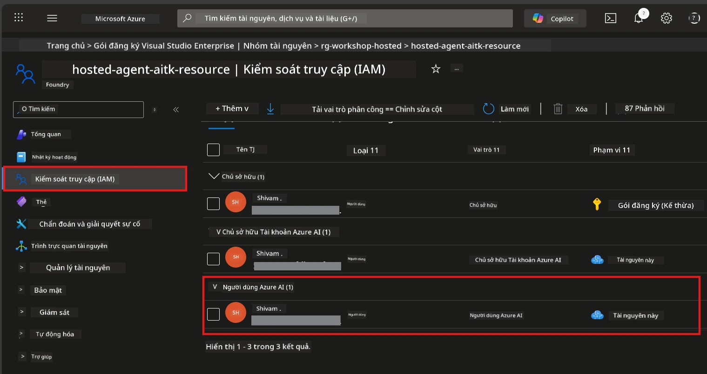

# Module 2 - Tạo Dự Án Foundry & Triển Khai Mô Hình

Trong module này, bạn sẽ tạo (hoặc chọn) một dự án Microsoft Foundry và triển khai một mô hình mà agent của bạn sẽ sử dụng. Mỗi bước được viết ra chi tiết - hãy làm theo thứ tự.

> Nếu bạn đã có dự án Foundry với mô hình đã triển khai, hãy chuyển đến [Module 3](03-create-hosted-agent.md).

---

## Bước 1: Tạo dự án Foundry từ VS Code

Bạn sẽ sử dụng tiện ích mở rộng Microsoft Foundry để tạo dự án mà không rời khỏi VS Code.

1. Nhấn `Ctrl+Shift+P` để mở **Command Palette**.
2. Gõ: **Microsoft Foundry: Create Project** và chọn nó.
3. Một menu xổ xuống xuất hiện - chọn **đăng ký Azure** của bạn từ danh sách.
4. Bạn sẽ được yêu cầu chọn hoặc tạo **nhóm tài nguyên**:
   - Để tạo nhóm mới: gõ tên (ví dụ `rg-hosted-agents-workshop`) và nhấn Enter.
   - Để dùng nhóm có sẵn: chọn nó từ menu xổ xuống.
5. Chọn một **vùng địa lý**. **Quan trọng:** Chọn vùng hỗ trợ host agent. Xem [tình trạng vùng](https://learn.microsoft.com/azure/foundry/agents/concepts/hosted-agents#region-availability) - các lựa chọn phổ biến là `East US`, `West US 2`, hoặc `Sweden Central`.
6. Nhập một **tên** cho dự án Foundry (ví dụ `workshop-agents`).
7. Nhấn Enter và đợi quá trình cấp phát hoàn tất.

> **Quá trình cấp phát mất 2-5 phút.** Bạn sẽ thấy thông báo tiến trình ở góc dưới bên phải của VS Code. Không đóng VS Code trong lúc cấp phát.

8. Khi hoàn tất, thanh bên **Microsoft Foundry** sẽ hiển thị dự án mới dưới mục **Resources**.
9. Nhấn vào tên dự án để mở rộng và xác nhận có các phần như **Models + endpoints** và **Agents**.



### Phương án khác: Tạo qua Cổng Foundry

Nếu bạn muốn dùng trình duyệt:

1. Mở [https://ai.azure.com](https://ai.azure.com) và đăng nhập.
2. Nhấn **Create project** trên trang chính.
3. Nhập tên dự án, chọn đăng ký, nhóm tài nguyên và vùng địa lý của bạn.
4. Nhấn **Create** và đợi cấp phát.
5. Khi tạo xong, quay lại VS Code - dự án sẽ hiện trong thanh bên Foundry sau khi làm mới (nhấn biểu tượng làm mới).

---

## Bước 2: Triển khai mô hình

[Hosted agent](https://learn.microsoft.com/azure/foundry/agents/concepts/hosted-agents) của bạn cần một mô hình Azure OpenAI để tạo câu trả lời. Bạn sẽ [triển khai một mô hình ngay bây giờ](https://learn.microsoft.com/azure/ai-foundry/openai/how-to/create-resource#deploy-a-model).

1. Nhấn `Ctrl+Shift+P` để mở **Command Palette**.
2. Gõ: **Microsoft Foundry: Open [Model Catalog](https://learn.microsoft.com/azure/ai-foundry/openai/concepts/models)** và chọn nó.
3. Giao diện Model Catalog mở trong VS Code. Duyệt hoặc dùng thanh tìm kiếm để tìm **gpt-4.1**.
4. Nhấn vào thẻ mô hình **gpt-4.1** (hoặc `gpt-4.1-mini` nếu bạn muốn giảm chi phí).
5. Nhấn **Deploy**.



6. Trong cấu hình triển khai:
   - **Deployment name**: Giữ mặc định (ví dụ `gpt-4.1`) hoặc nhập tên tùy chỉnh. **Ghi nhớ tên này** - bạn sẽ cần trong Module 4.
   - **Target**: Chọn **Deploy to Microsoft Foundry** và chọn dự án bạn vừa tạo.
7. Nhấn **Deploy** và đợi triển khai hoàn thành (1-3 phút).

### Lựa chọn mô hình

| Mô hình | Phù hợp cho | Chi phí | Ghi chú |
|-------|----------|------|-------|
| `gpt-4.1` | Câu trả lời chất lượng cao, tinh vi | Cao hơn | Kết quả tốt nhất, khuyên dùng cho test cuối cùng |
| `gpt-4.1-mini` | Lặp nhanh, chi phí thấp hơn | Thấp hơn | Tốt cho phát triển workshop và test nhanh |
| `gpt-4.1-nano` | Nhiệm vụ nhẹ  | Thấp nhất | Tiết kiệm chi phí nhất, nhưng câu trả lời đơn giản |

> **Khuyến nghị cho workshop này:** Dùng `gpt-4.1-mini` để phát triển và thử nghiệm. Nhanh, rẻ và cho kết quả tốt với các bài tập.

### Xác nhận triển khai mô hình

1. Trong thanh bên **Microsoft Foundry**, mở rộng dự án của bạn.
2. Xem mục **Models + endpoints** (hoặc phần tương tự).
3. Bạn sẽ thấy mô hình đã triển khai (ví dụ `gpt-4.1-mini`) với trạng thái **Succeeded** hoặc **Active**.
4. Nhấn vào triển khai mô hình để xem chi tiết.
5. **Ghi lại** hai thông tin sau - bạn sẽ cần trong Module 4:

   | Thiết lập | Nơi tìm | Ví dụ |
   |---------|-----------------|---------------|
   | **Project endpoint** | Nhấn vào tên dự án trong thanh bên Foundry. URL endpoint hiển thị trong trang chi tiết. | `https://<account>.services.ai.azure.com/api/projects/<project>` |
   | **Model deployment name** | Tên hiển thị bên cạnh mô hình đã triển khai. | `gpt-4.1-mini` |

---

## Bước 3: Gán vai trò RBAC cần thiết

Đây là bước **thường bị bỏ sót nhất**. Nếu không có vai trò đúng, triển khai trong Module 6 sẽ thất bại với lỗi quyền.

### 3.1 Gán vai trò Azure AI User cho chính bạn

1. Mở trình duyệt và vào [https://portal.azure.com](https://portal.azure.com).
2. Trong thanh tìm kiếm trên cùng, gõ tên **dự án Foundry** của bạn và nhấp vào kết quả.
   - **Quan trọng:** Điều hướng đến tài nguyên **dự án** (loại: "Microsoft Foundry project"), **không phải** tài nguyên tài khoản/hub cha.
3. Trong thanh điều hướng bên trái của dự án, nhấp **Access control (IAM)**.
4. Nhấn nút **+ Add** ở trên cùng → chọn **Add role assignment**.
5. Trong tab **Role**, tìm [**Azure AI User**](https://learn.microsoft.com/azure/foundry/concepts/rbac-foundry#built-in-roles) và chọn. Nhấn **Next**.
6. Trong tab **Members**:
   - Chọn **User, group, or service principal**.
   - Nhấp **+ Select members**.
   - Tìm tên hoặc email của bạn, chọn và nhấn **Select**.
7. Nhấp **Review + assign** → sau đó nhấp lại **Review + assign** để xác nhận.



### 3.2 (Tùy chọn) Gán vai trò Azure AI Developer

Nếu bạn cần tạo thêm tài nguyên trong dự án hoặc quản lý triển khai theo lập trình:

1. Lặp lại các bước trên, nhưng ở bước 5 chọn **Azure AI Developer**.
2. Gán vai trò ở cấp **tài nguyên Foundry (account)**, không chỉ cấp dự án.

### 3.3 Xác minh gán vai trò của bạn

1. Trên trang **Access control (IAM)** của dự án, chọn tab **Role assignments**.
2. Tìm tên bạn.
3. Bạn phải thấy ít nhất vai trò **Azure AI User** được liệt kê cho phạm vi dự án.

> **Tại sao quan trọng:** Vai trò [`Azure AI User`](https://learn.microsoft.com/azure/foundry/concepts/rbac-foundry#built-in-roles) cấp phép hành động dữ liệu `Microsoft.CognitiveServices/accounts/AIServices/agents/write`. Nếu không có, bạn sẽ thấy lỗi này khi triển khai:
>
> ```
> Error: lacks the required data action 
> Microsoft.CognitiveServices/accounts/AIServices/agents/write 
> to perform POST /api/projects/{projectName}/assistants operation.
> ```
>
> Xem [Module 8 - Khắc phục sự cố](08-troubleshooting.md) để biết thêm chi tiết.

---

### Kiểm tra

- [ ] Dự án Foundry đã tồn tại và hiển thị trong thanh bên Microsoft Foundry của VS Code
- [ ] Ít nhất một mô hình được triển khai (ví dụ `gpt-4.1-mini`) với trạng thái **Succeeded**
- [ ] Bạn đã ghi lại URL **project endpoint** và tên **model deployment**
- [ ] Bạn đã được gán vai trò **Azure AI User** ở cấp **dự án** (xác nhận trong Azure Portal → IAM → Role assignments)
- [ ] Dự án ở vùng [hỗ trợ](https://learn.microsoft.com/azure/foundry/agents/concepts/hosted-agents#region-availability) cho hosted agents

---

**Trước:** [01 - Cài đặt Foundry Toolkit](01-install-foundry-toolkit.md) · **Tiếp:** [03 - Tạo Hosted Agent →](03-create-hosted-agent.md)

---

<!-- CO-OP TRANSLATOR DISCLAIMER START -->
**Tuyên bố miễn trừ trách nhiệm**:  
Tài liệu này đã được dịch bằng dịch vụ dịch thuật AI [Co-op Translator](https://github.com/Azure/co-op-translator). Mặc dù chúng tôi cố gắng đảm bảo độ chính xác, xin lưu ý rằng các bản dịch tự động có thể chứa lỗi hoặc không chính xác. Tài liệu gốc bằng ngôn ngữ gốc nên được coi là nguồn thông tin chính thức. Đối với các thông tin quan trọng, chúng tôi khuyến nghị sử dụng dịch thuật chuyên nghiệp bởi con người. Chúng tôi không chịu trách nhiệm đối với bất kỳ sự hiểu lầm hoặc giải thích sai nào phát sinh từ việc sử dụng bản dịch này.
<!-- CO-OP TRANSLATOR DISCLAIMER END -->