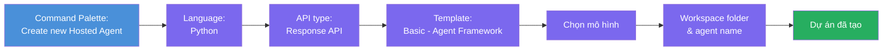
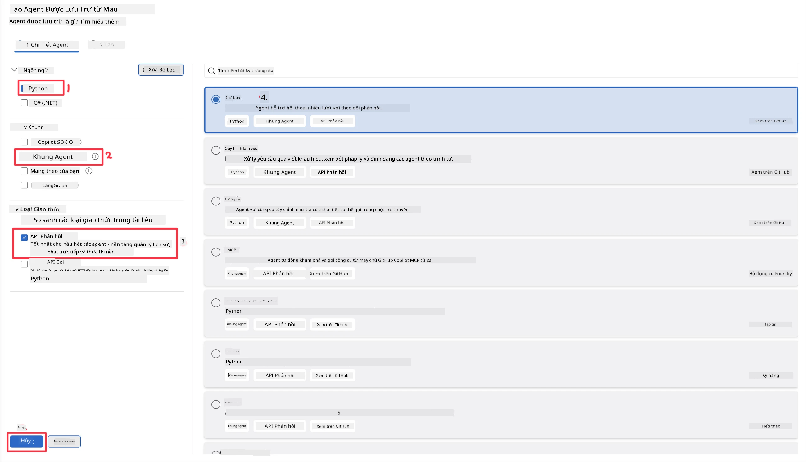
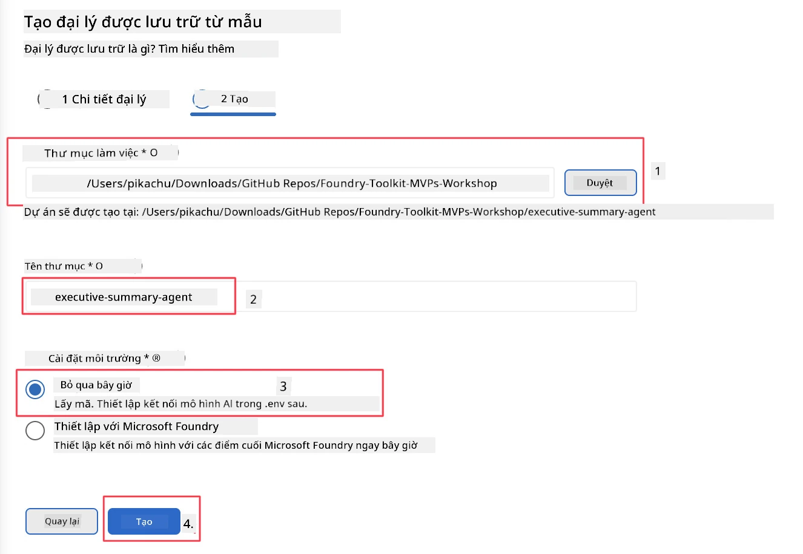

# Mô-đun 2 - Tạo Agent Hosted Mới

⏱️ ~5 phút

Trong mô-đun này, bạn sử dụng Foundry Toolkit để **tạo khung dự án agent hosted**. Khung này tạo ra cấu trúc dự án đầy đủ - `agent.yaml`, `main.py`, `Dockerfile`, `requirements.txt`, và cấu hình gỡ lỗi VS Code - để bạn có thể tập trung tùy chỉnh hành vi của agent.

> **Khái niệm chính:** Thư mục `agent/` trong bài lab này là ví dụ về những gì Foundry Toolkit tạo ra. Bạn không cần viết các file này từ đầu.

### Luồng trình hướng dẫn tạo khung



---

## Bước 1: Mở trình hướng dẫn Tạo Hosted Agent

1. Nhấn `Ctrl+Shift+P` để mở **Command Palette**.
2. Gõ: **Foundry Toolkit: Create new Hosted Agent** và chọn nó.

> **Phương án khác: Tạo qua Foundry Portal**
> Nếu bạn thích dùng trình duyệt, bạn có thể tạo dự án tại [https://ai.azure.com](https://ai.azure.com). Khi dự án đã được cung cấp, quay lại VS Code và dùng thanh bên **Foundry Toolkit** để kết nối với dự án đó.

> **Phương án khác:** Nhấn biểu tượng **+** bên cạnh **Hosted Agents (Preview)** trong thanh bên Foundry Toolkit.

## Bước 2: Chọn các thiết lập



1. Ở phần điều hướng/tùy chọn bên trái, chọn như sau:

| Menu | Lựa chọn | Ghi chú |
|--------|-----------|-------|
| **Ngôn ngữ** | Python | C# cũng được hỗ trợ |
| **Framework** | Agent Framework | Điểm khởi đầu đơn giản dùng Agent Framework SDK |
| **Loại API** | Response API | `POST /responses` - giao tiếp hội thoại, có lịch sử do nền tảng quản lý |
| **Mẫu** | Basic | Điểm khởi đầu đơn giản dùng Agent Framework SDK |

2. Khi đã chọn xong, nhấn **Next**



3. Trong cửa sổ tiếp theo, chọn như sau:

| Menu | Lựa chọn | Ghi chú |
|--------|-----------|-------|
| **Thư mục workspace** | Chọn thư mục đích | ví dụ: `/workspace/Foundry_Toolkit_for_VSCode_Lab/` hoặc thư mục con trong repo này |
| **Tên agent** | Nhập tên | ví dụ: `executive-summary-agent` |
| **Thiết lập môi trường** | bỏ qua thiết lập hiện tại |  |

Nhấn **create** để tạo agent của chúng ta. Một thư mục mới sẽ được tạo với tên agent hosted.

## Bước 3: Kiểm tra dự án được tạo

Sau khi tạo khung xong, xác nhận bạn thấy các file sau trong Explorer (`Ctrl+Shift+E`):

```
📂 my-agent/
├── .env                ← Environment variables (placeholders)
├── .vscode/
│   ├── launch.json     ← Debug config (F5 → run + Agent Inspector)
│   └── tasks.json      ← VS Code task definitions
├── agent.yaml          ← Agent definition (kind: hosted)
├── Dockerfile          ← Container config for deployment
├── main.py             ← Agent entry point (your main code)
└── requirements.txt    ← Python dependencies
```

### Giải thích các file chính

| File | Mục đích |
|------|---------|
| `agent.yaml` | Khai báo agent là `kind: hosted`, ánh xạ biến môi trường, định nghĩa giao thức `/responses` |
| `main.py` | Tạo `FoundryChatClient` → bọc trong `Agent` với chỉ dẫn → phục vụ qua `ResponsesHostServer` trên cổng 8088 |
| `Dockerfile` | Dùng `python:3.12-slim`, cài đặt phụ thuộc, mở cổng 8088, chạy `main.py` |
| `requirements.txt` | `agent-framework-foundry`, `agent-framework-foundry-hosting`, `mcp`, `debugpy` |

> **Quan trọng:** Mở trực tiếp thư mục agent vừa tạo trong VS Code (chính thư mục `agent/`) để `.vscode/launch.json` và `tasks.json` hoạt động đúng khi gỡ lỗi bằng F5.

---

### ✅ Điểm kiểm tra

- [ ] Dự án tạo khung được tạo với đầy đủ file mong đợi
- [ ] `agent.yaml` hiển thị `kind: hosted` và `protocol: responses`
- [ ] `main.py` nhập khẩu `Agent`, `FoundryChatClient`, `ResponsesHostServer`
- [ ] Thư mục agent đang mở trong VS Code làm thư mục gốc workspace

---

**Trước:** [01 - Thiết lập](01-setup.md) · **Tiếp theo:** [03 - Cấu hình & Lập trình →](03-configure-and-code.md)

---

<!-- CO-OP TRANSLATOR DISCLAIMER START -->
**Tuyên bố miễn trừ trách nhiệm**:
Tài liệu này đã được dịch bằng dịch vụ dịch thuật AI [Co-op Translator](https://github.com/Azure/co-op-translator). Mặc dù chúng tôi cố gắng đảm bảo độ chính xác, xin lưu ý rằng bản dịch tự động có thể chứa lỗi hoặc sai sót. Tài liệu gốc bằng ngôn ngữ gốc nên được coi là nguồn tin chính thức. Đối với thông tin quan trọng, nên sử dụng dịch vụ dịch thuật chuyên nghiệp bởi con người. Chúng tôi không chịu trách nhiệm về bất kỳ hiểu lầm hoặc giải thích sai nào phát sinh từ việc sử dụng bản dịch này.
<!-- CO-OP TRANSLATOR DISCLAIMER END -->